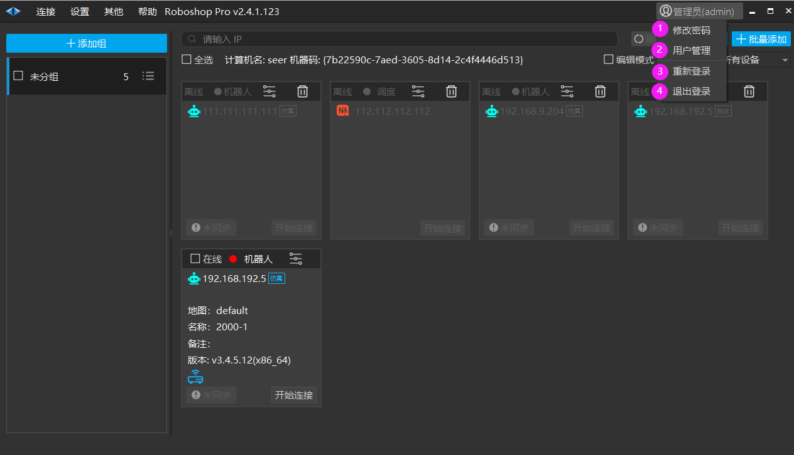
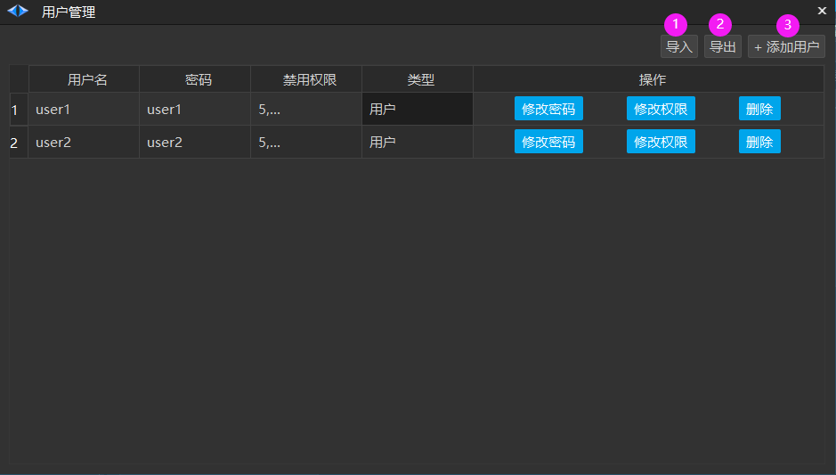
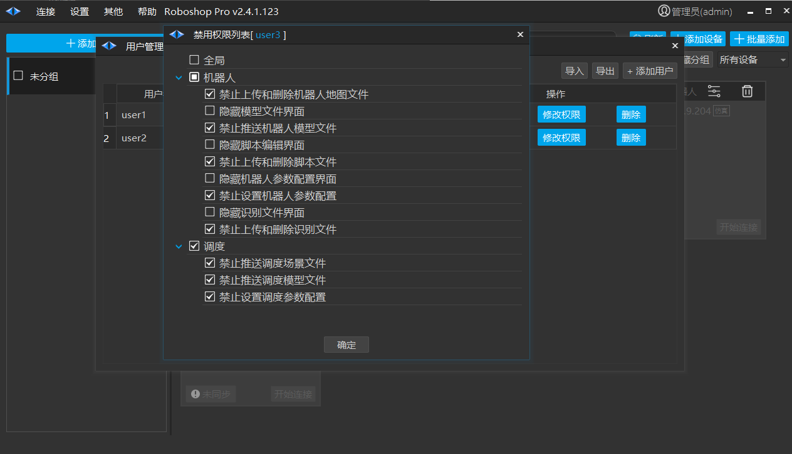
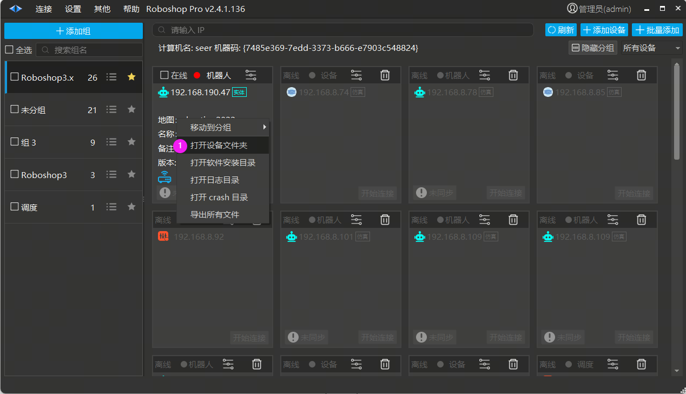
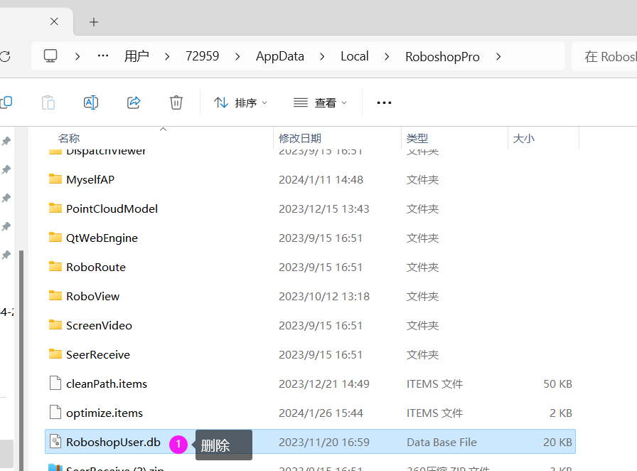
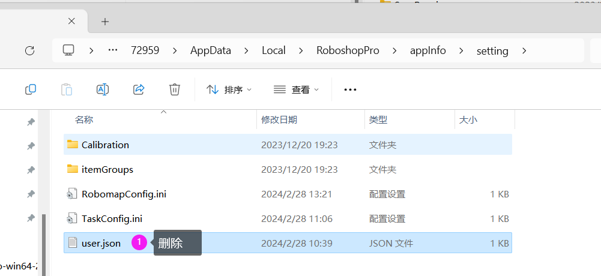

# 账号权限管理
## 账号管理

Roboshop 默认有 2 组账号

| \ | 初始账号 | 密码 |
| --- | --- | --- |
| 用户 | user1 | user1 |
| 管理员 | admin | admin |

注 1：管理员允许创建用户

注 2: 退出登录，Roboshop 不可控制，只能查看状态

**软件在第一次启动后默认登录 admin 的管理员账号**

1. 修改密码

2. 用户管理

3. 重新登录
    - 重新输入账号和密码登录

4. 退出登录
    - 退出登录后，软件处于未登录状态，仅状态端口(19204)允许通信

1. 导入
    - 允许导入配置好的账号，完全覆盖之前的数据

2. 导出
    - 允许导出现有的所有账号

3. 添加用户
    - 添加用户后会默认弹出该用户账号被禁用的权限

## 设置用户权限

管理员可以限制指定用户的权限

## 重置密码

打开设备文件夹会弹出如下目录

鼠标点击 appInfo目录，再切换到 setting 文件夹删除 user.json 文件，重启软件，密码重置为初始账号和密码

