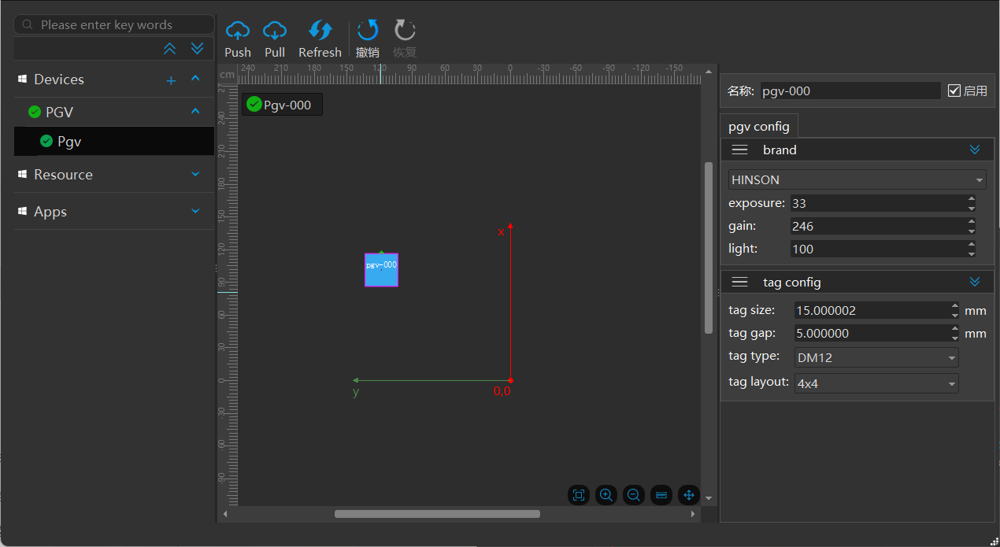
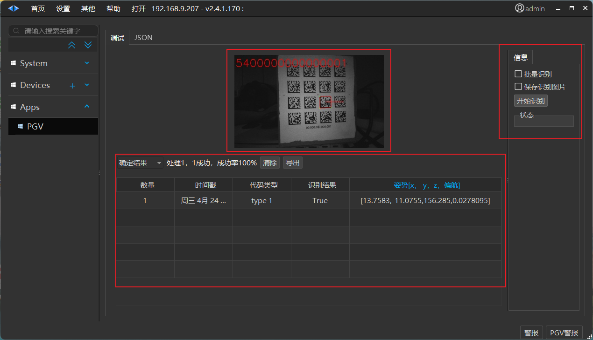
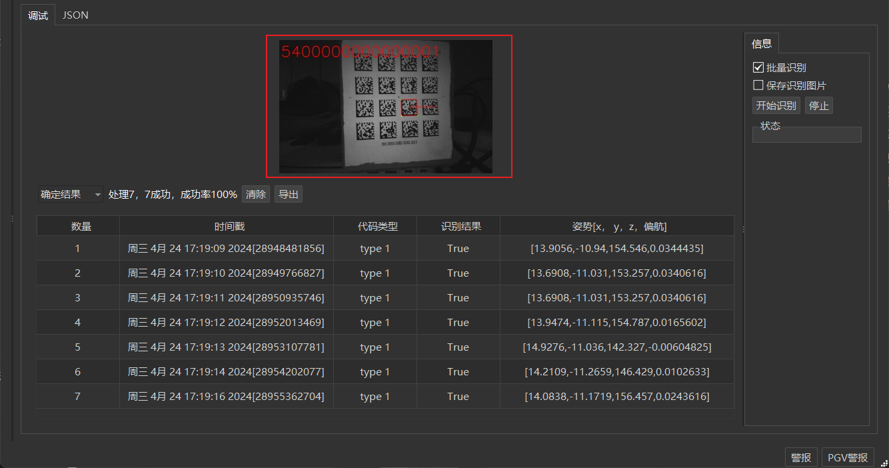
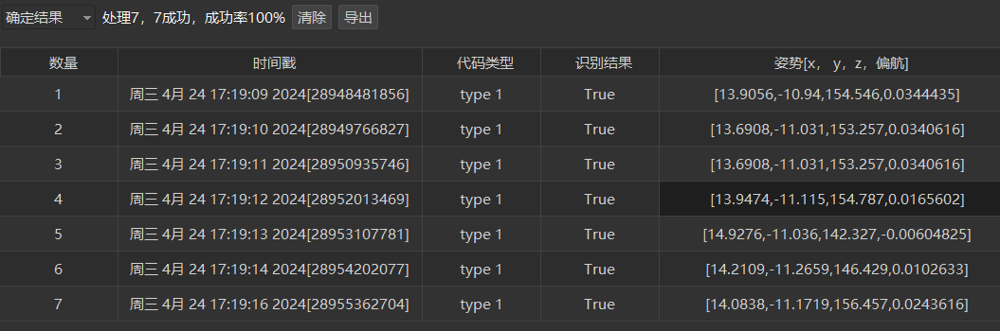
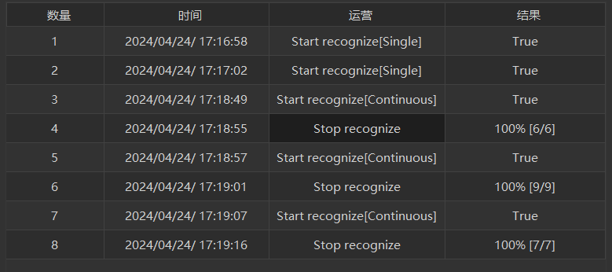
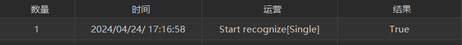
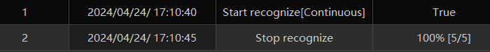
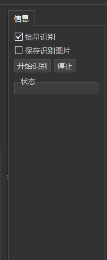
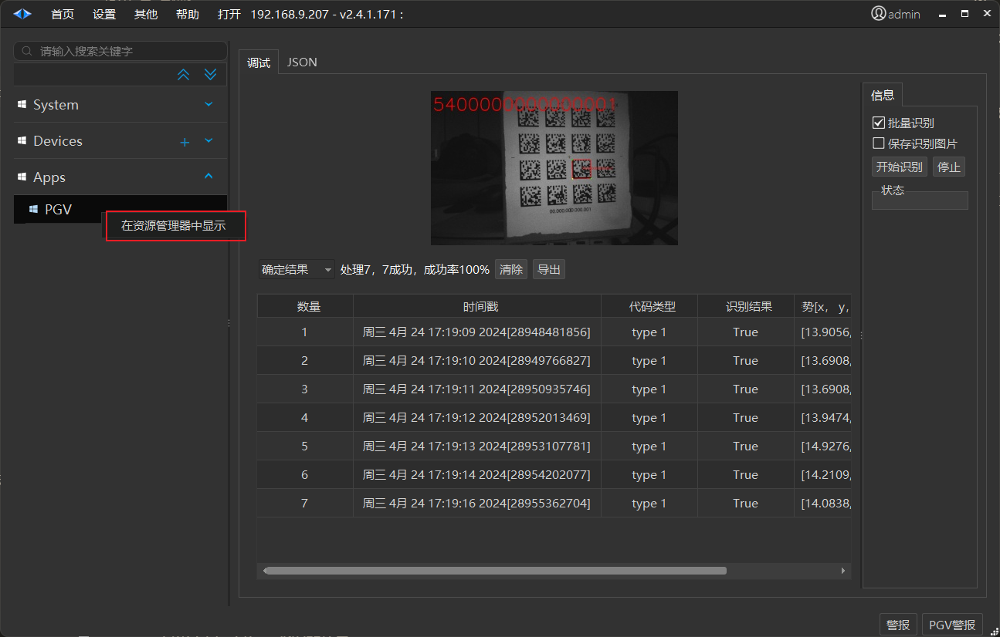
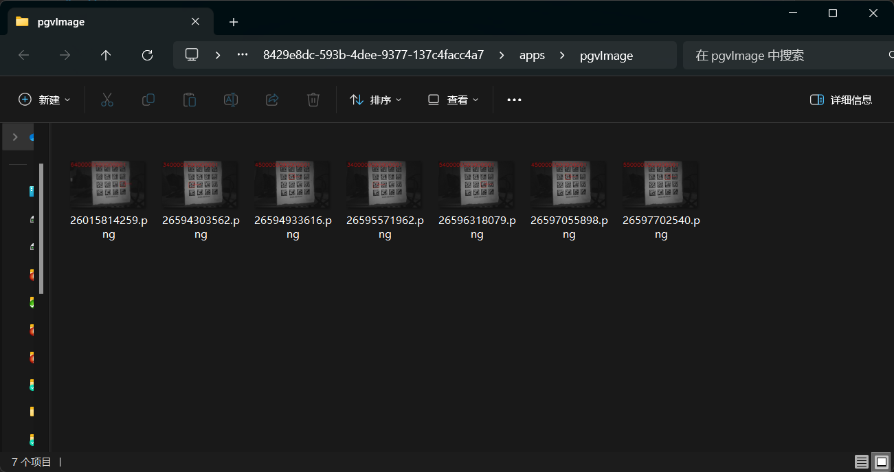

# PGV
> 💡 
> Roboshop v2.4.1.170+

# 连接pgv相机设备

# 首页

## 一、设备 Devices

## 二、资源识别文件 Resource - Identification Files

## 三**、应用 Apps**

#### **(一) 图片查看区**

识别到的图片显示

#### **(二) 识别结果 | 操作日志区**

【清除】 清空表格

【导出 】将表格数据导出为文件保存

1. **识别结果区**

显示：

识别结果总结 （识别成功率。。。）

序号|时间|码型|识别结果|位姿

2. **操作日志区**

序号|时间|操作|结果

已实现操作记录：

- 单次开始识别

- 结果：本次识别结果 True/False

- 批量开始识别 
    - 结果：是否成功启动本次批量识别

- 批量停止识别 
    - 结果：本批次识别结果成功率[成功次数/总识别次数]

#### **(三) 操作|数据显示区**

【开始识别】

- 启动PGV识别程序，开始识别

【停止识别】

- 停止pgv识别操作

且界面显示最后一张图的信息

【批量识别】

- 勾选，单击【开始识别】可连续识别，形成多条识别记录，单击【停止】可停止批量识别操作；

- 不勾选，单击【开始识别】，pgv识别一次，形成一条识别记录，然后停止识别。

【保存识别图片】（目前已暂停该功能使用）

- 勾选，每识别一次，存储本次识别图片。图片名默认为本次识别时间戳。

- 查看识别图片  Apps/PGV  右击-在资源管理器中显示

