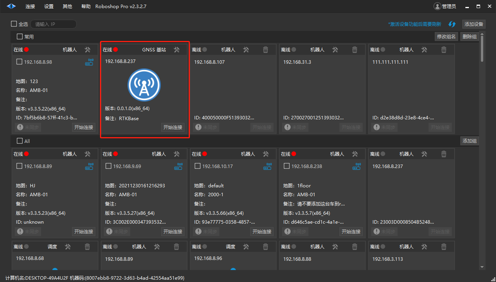
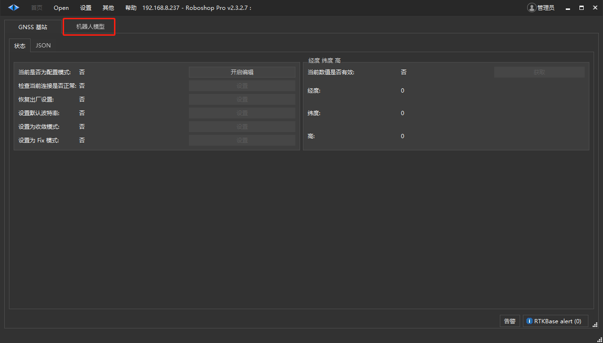
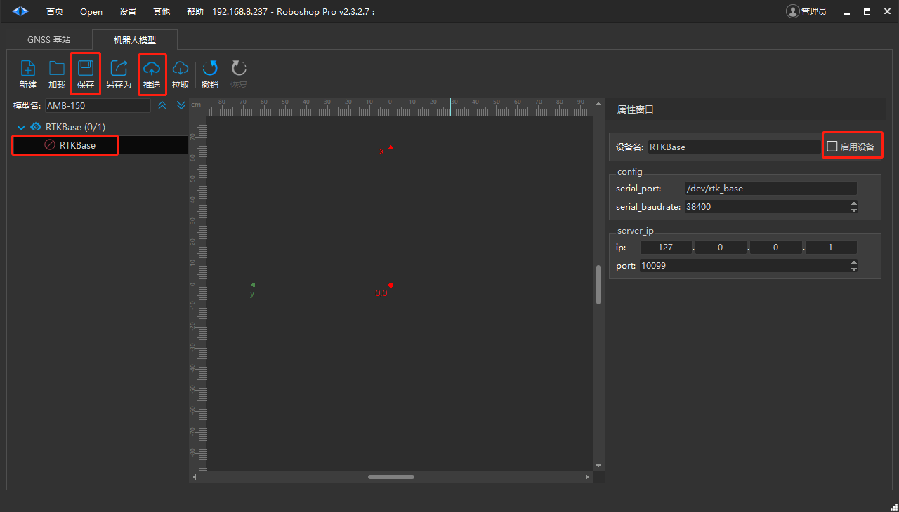
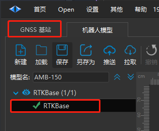
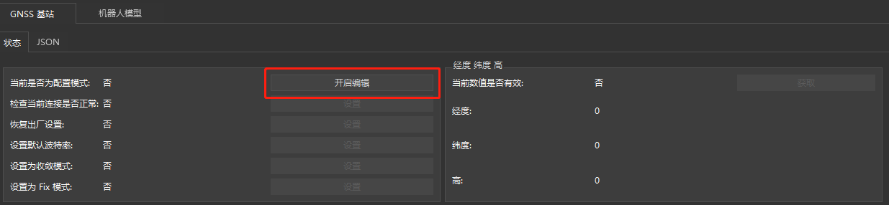
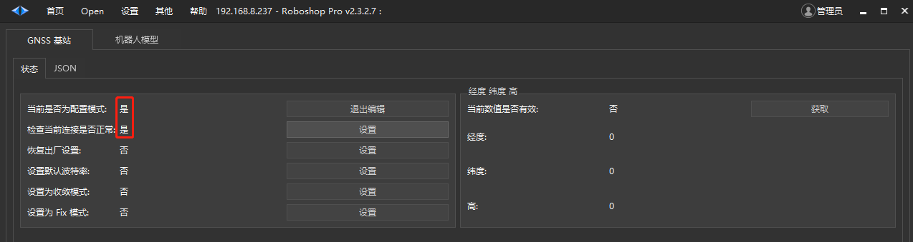
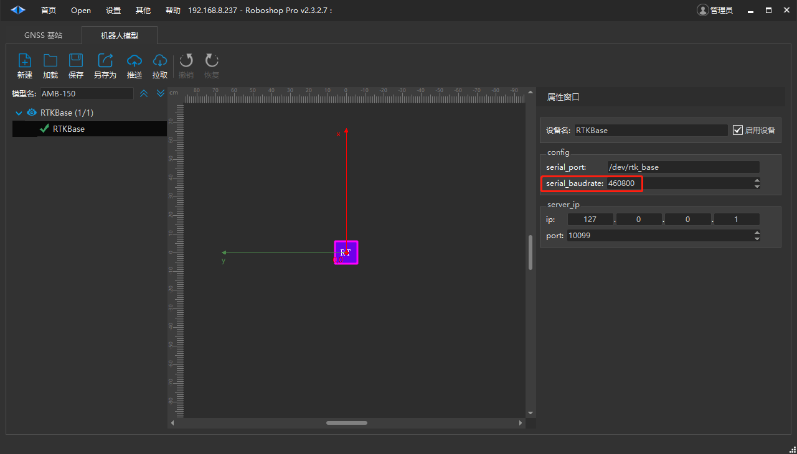
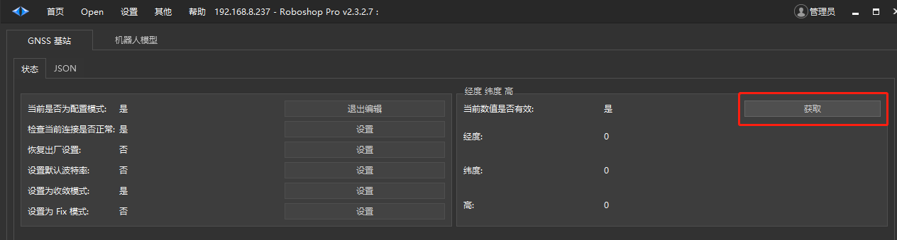
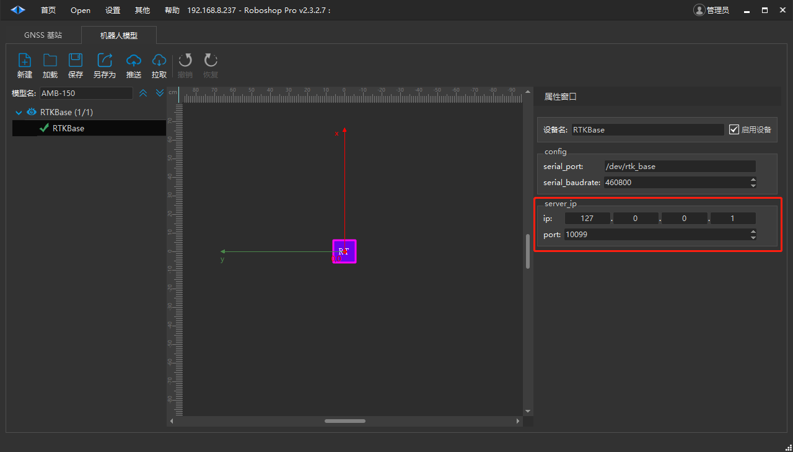

# RTK基站
# 功能说明

RTK基站服务可同时为多台室外车辆提供厘米级（**+-2cm** ）定位服务。1个基站可覆盖20公里范围内的区域。

# 端口配置

RTK基站设备需要刷专用的系统固件，此外还需要对设备串口进行设置。

```bash
# 创建规则文件 
sudo vim /etc/udev/rules.d/rtk_base.rules  
# 复制下面的内容到文件中，保存退出 
KERNEL=="ttyUSB*", ATTRS{idVendor}=="0403", ATTRS{idProduct}=="6015", MODE:="0666", SYMLINK+="rtk_base"  
# 启用规则 
sudo udevadm trigger 
 # 检查是否正常 
ll /dev/rtk_base  
# 如下显示表示正常
 lrwxrwxrwx 1 root root 7 Jan  7 15:52 /dev/rtk_base -> ttyUSB0
```

# 初始化配置

基站服务正常使用前需要执行一些配置操作。首先将基站配套天线安装好，保证天线安装位置附近足够空旷（建议安装在楼顶）并于基站设备可靠连接。打开Roboshop软件。下图中红框设备即为基站设备，这里的名称为 **GNSS基站 ** 。



## 开启插件

双击该区域即可连接并进入设备，如下图所示。首先需要启动RTK插件。点击“机器人模型”页面。



可以看到只有一个名为RTKBase的插件，新设备的串口波特率为38400。勾选右侧“启动设备”复选框，点击保存，并推送模型文件。



此时左边栏的模型状态变为绿色对勾样式的启动状态，点击“GNSS基站”进行配置操作。



## 配置插件

点击“开启编辑”按键，进入配置模式。



点击按钮后，按键前面的状态指示了当前操作是否正常。进入配置模式后，才可能执行配置操作。



首先需要确定当前设备是否连接正常， *只有****连接正常** **才可以正常进行配置操作！ *点击 “检查当前连接是否正常” 所对应的 “设置” 按键，来检查当前连接状态。如果连接不正常，肯定是波特率设置不对。出厂设备的波特率为38400，设备正常工作模式下，需要将波特率设置到460800。点击“设置默认波特率”按键即可设置到460800。

操作步骤：

- 进入配置模式；

- 检测连接状态；

- 在连接正常的前提下，设置默认波特率。

设置波特率后，需要在“机器人模型”中配置波特率为460800。保存并推送模型。



- 再次检测连接状态；

- 设置为收敛模式；

- 多次获取当前的经纬高数据，直到数据不再变化；



- 设置为Fix模式；

- 重启设备；

**记得退出编辑模式才可以正常提供RTCM数据。**

## 恢复出厂设置

通常变更基站位置时需要先执行恢复出厂设置，这里需要注意，恢复后设备的波特率会变为38400，而恢复前的波特率为460800，需要重新设置设备的波特率才能执行配置操作。

# RTCM数据服务设置

基站服务通过http向其他移动端设备提供RTCM数据，这里需要设置好ip地址以及端口号。由于基站设备可能有多个网卡，所以ip必须正确设置。



## 穿透服务

通常情况基站服务器并没有固定的公网IP，移动端设备由于在室外也无法处于同一个局域网内，相互之间无法直接通信，这种情况就需要部署n2n服务来实现数据穿透功能。参见n2n客户端配置说明。