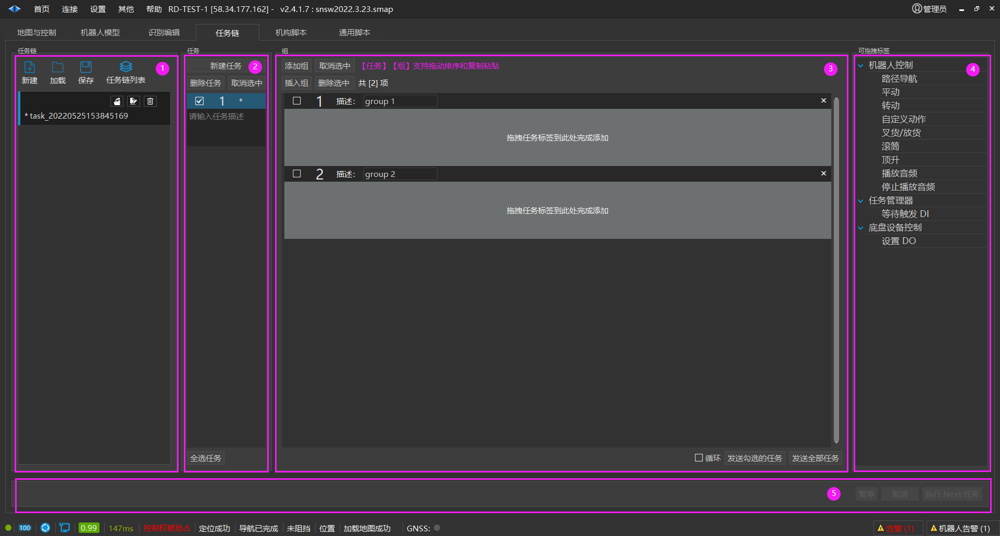
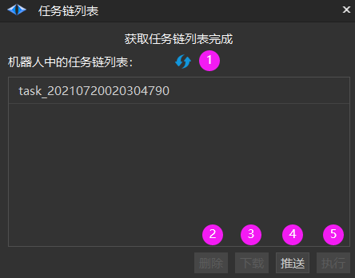
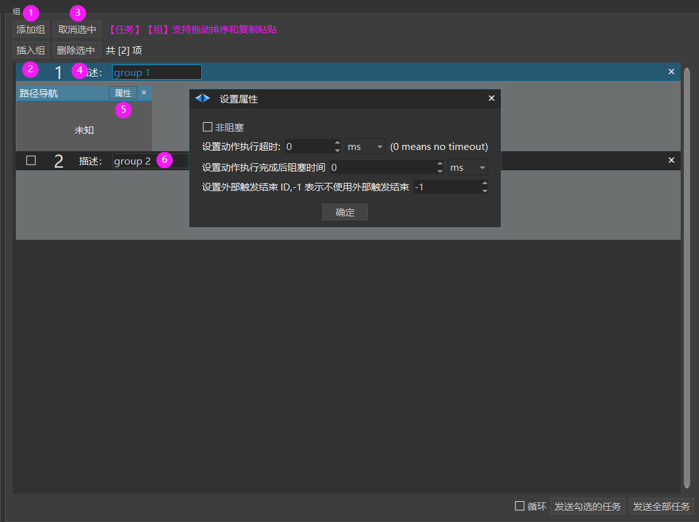

# 新建任务链
## 新建任务链

**任务链**

【新建】：新建任务链。

【加载】：加载之前建好的任务链。

【保存】：保存任务链。

【重命名】：重命名任务链。

【导出】：导出任务链到文件。

【删除】：删除PC中的任务链。

【任务链列表】：用于管理机器人和PC的任务链。默认情况下，任务链存储于PC，需要点击推送才可保存在机器人中。

1. 【刷新】：刷新任务链列表。

2. 【删除】：删除机器人中的任务链。

3. 【下载】：下载机器人中的任务链到PC。

4. 【推送】：推送PC的任务链到机器人。

5. 【执行】：执行选中的任务链。

**任务**

【新建任务】：新建可执行任务。

【删除任务】：删除选中的任务。

【取消选中】：取消选中任务。

**组**

每个组代表一个独立的动作。

1. 【添加组】：添加一个独立的动作组。

2. 【插入组】：在动作组间插入一个组。

3. 【取消选中】：取消选中的组。

4. 【删除选中】：删除选中的组。

5. 【属性】：组的属性窗口。具体属性说明如下：

- 非阻塞  ： 代表异步执行。

- 设置动作执行超时：动作执行超时时间。

- 设置动作完成后阻塞时间：代表动作完成后的停留时间。

- 设置外部触发结束ID：代表外部信号触发让任务提前结束。

6. 【描述】：自定义组描述。

**可拖拽标签**

【机器人控制】：代表触发机器人行走的动作。

- 路径导航：以路径导航的方式去往目标站点。

- 平动：以指定速度开环行走指定距离。

- 转动：以指定角速度开环转动指定角度。

- 自定义动作：更灵活的方式以指令调用机器人行走。

- 叉货/放货：自动叉车的取货和放货。

- 辊筒：需要通过脚本控制，后续版本移除。

- 顶升：控制顶升机构上升和下降。

- 播放音频：播放指定音频。

- 停止播放音频：停止播放音频。

【任务管理器】：外部信号触发的动作。

- 等待DI触发：等待外部信号触发DI。

【底盘设备控制】：控制自身的IO。

- 设置DO：控制自身DO打开或关闭。

**执行任务**

【循环】：循环执行发送任务。

【发送勾选任务】：仅执行勾选的任务。

【发送所有任务】：执行任务链中的所有任务。

【暂停】：暂停任务。

【取消】：取消任务。

【执行NEXT任务】：跳过当前任务。