# 点云模板编辑
## 打开点云

一、打开Roboshop， 进入 "机器人" 界面

二、点击其他，选择 "点云模板"

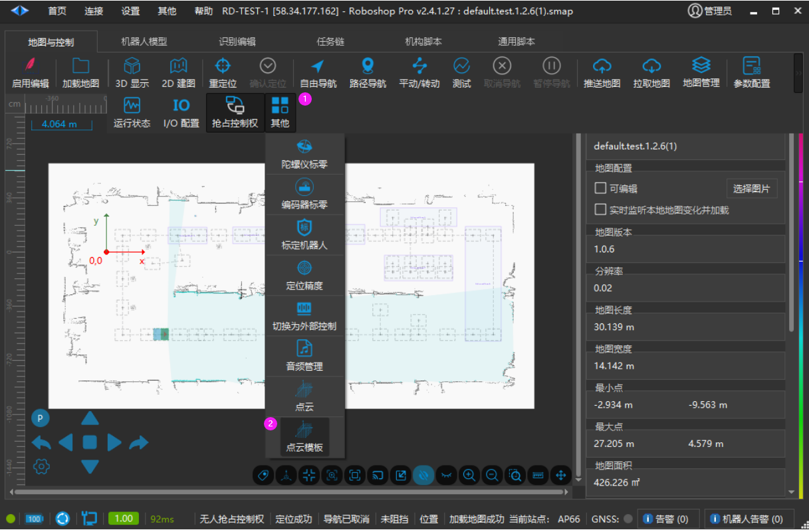

1. 【其他】

2. 【点云模板】

三、点击"打开"，选择需要打开的 ".pcd" 文件

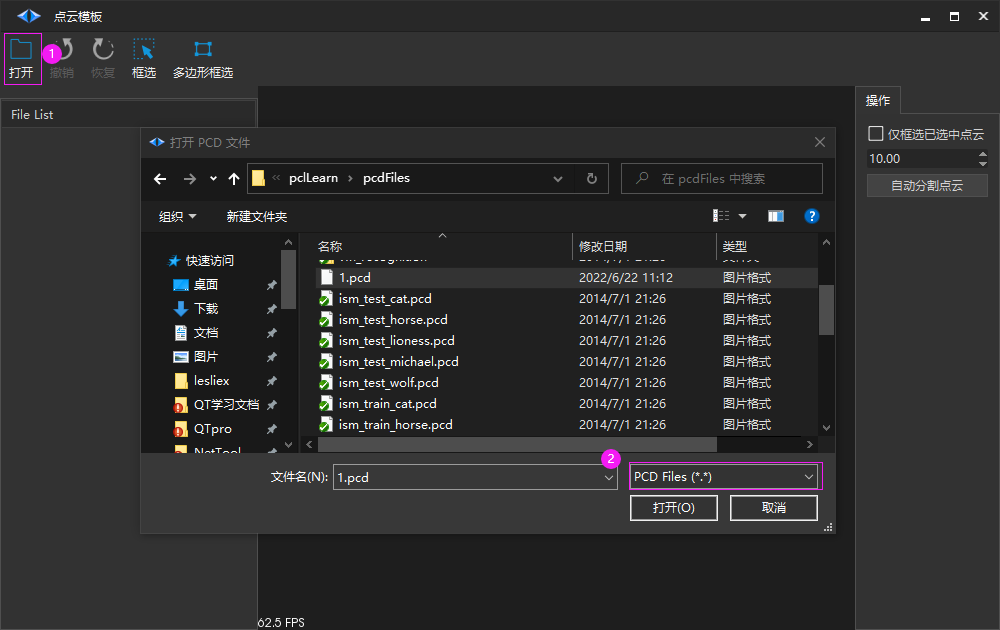

1. 【打开】

2. 选择 PCD文件

## 基础设置

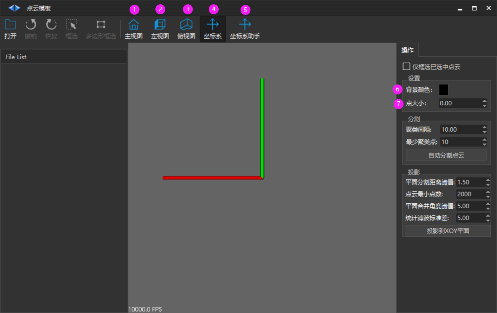

1. 【主视图】：设置视角为主视图

2. 【左视图】：设置视角为左视图

3. 【俯视图】：设置视角为俯视图

4. 【坐标系】：显示/隐藏 世界坐标系

5. 【坐标系助手】：在左下角 显示/隐藏 坐标系助手

6. 【背景颜色】：设置背景颜色

7. 【点大小】：设置当前选择的点云的点的大小

## 框选点云

### 矩形框选

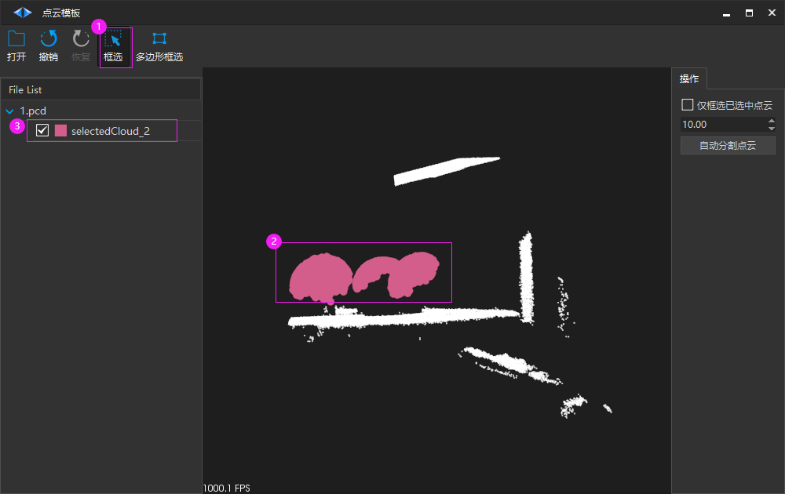

1. 点击【框选】进入矩形框选模式。

2. 在视图中点住拖拽会出现一个矩形框，保证需要的部分在矩形框内。

3. 释放鼠标，则生成一个点云，可点击右键进行保存操作。

4. 点击鼠标右键取消选框模式。

注意 ：框选前先 点击 需要框选的物体，按下 F键 调整视角，然后再框选，以防止框选不精确问题。

### 多边形框选

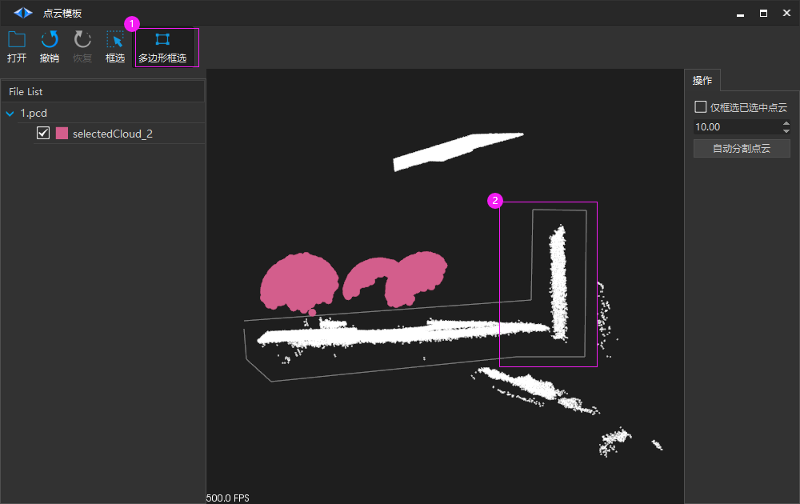

1. 点击【多边形框选】进入多边形框选模式。

2. 在视图中点击一下则为一个多边形顶点，注意最后为一个封闭多边形。

3. 点击鼠标右键 或者 【多边形框选】取消选框模式，或者按下 X 快捷键结束框选。

注意 ：框选前先 点击 需要框选的物体，按下 F键 调整视角，然后再框选，以防止框选不精确问题。

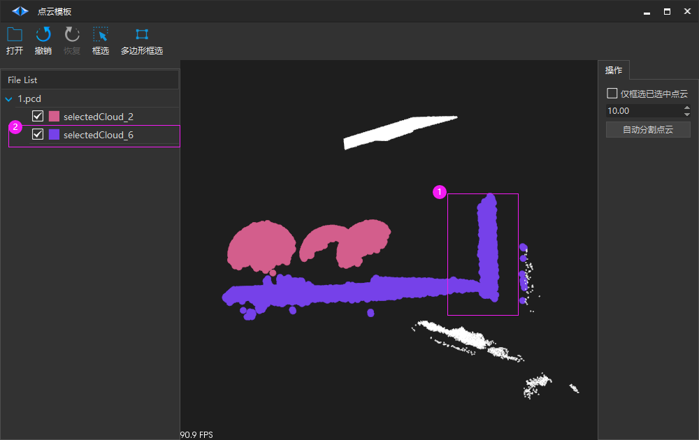

1. 结束框选后，显示该点云。

2. 点云列表中生成一个新点云，对其点击右键可进行保存操作。

## 分割点云

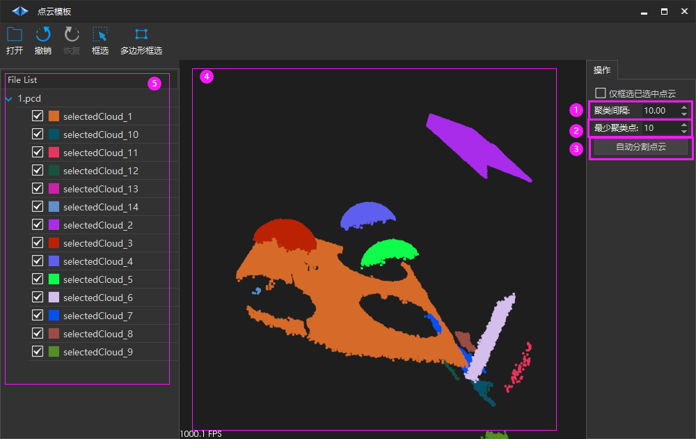

1. 【聚类间隔】：设置分割的近邻搜索的半径

2. 【最少聚类点】：设置点云滤波数值，最少聚类点

3. 【自动分割点云】：点击后根据以上配置自动对点云进行分割

4. 分割结果以不同颜色区分

5. 分割出的点云列表，颜色框颜色与该点云显示颜色对应，点击前面的勾选框可设置显示或不显示该点云

## 投影点云

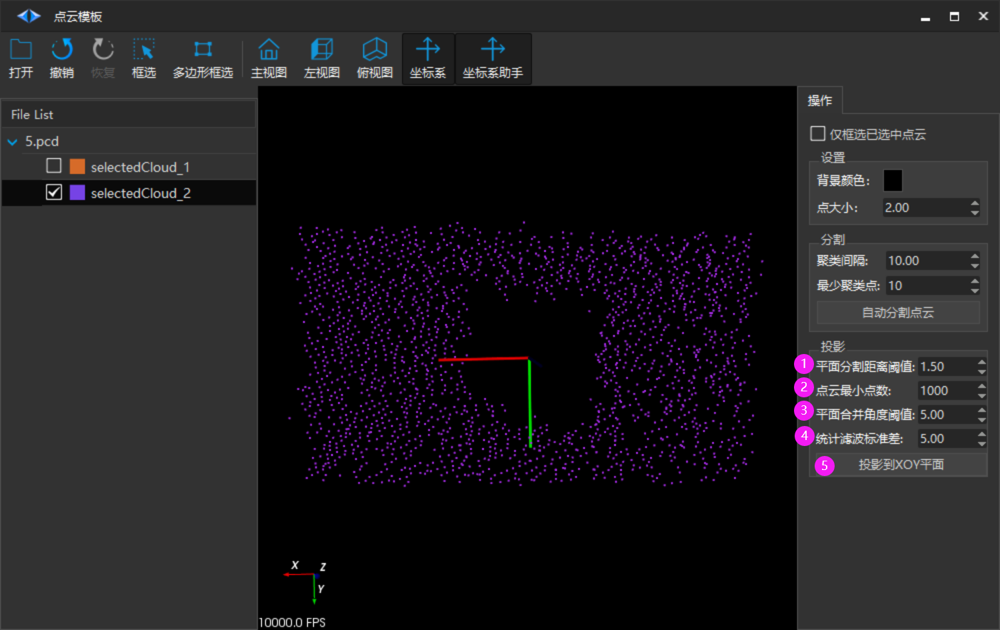

1. 【平面分割距离阈值】：设置 平面分割距离阈值

2. 【点云最小点数】：设置 模板点云最小点数

3. 【平面合并角度阈值】：设置 平面合并角度阈值 范围0~360°

4. 【统计滤波标准差】：设置 统计滤波标准差

5. 【投影到XOY平面】：将选中的点云移动到XOY平面

## 上传和拉取点云

### 上传点云到机器人

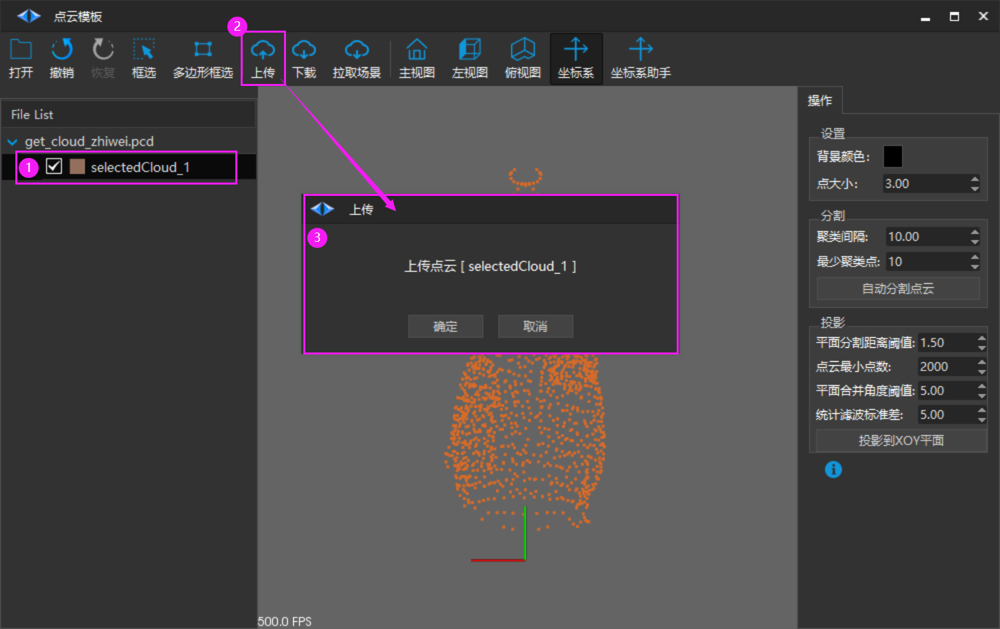

1. 在列表中点击选择需要上传的点云

2. 点击【上传】，跳出上传对话框

3. 确认上传的点云后，点击确定，上传点云到机器人 /asserts/pcd/template 文件夹下

### 拉取场景点云

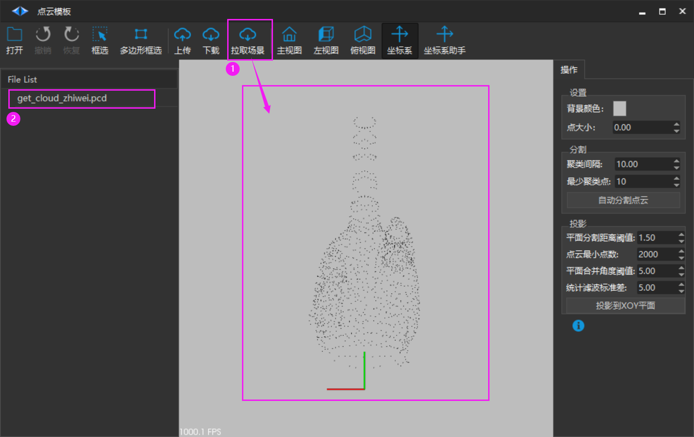

1. 直接拉取机器人扫描的场景点云到本地并显示

2. 默认保存到本地，名称为 pointcloud_scene.pcd

### 下载机器人的点云文件

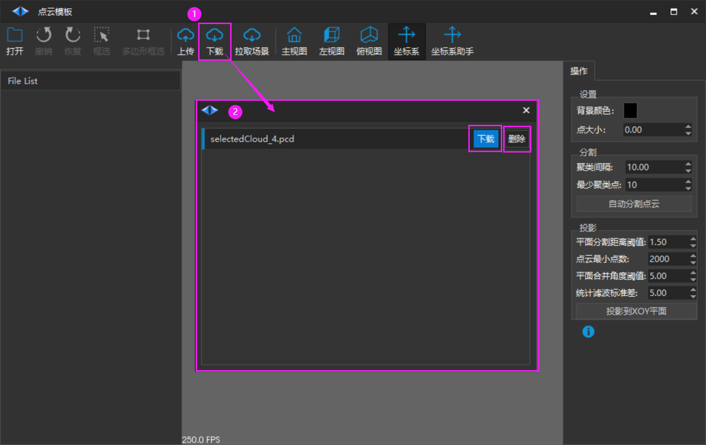

1. 点击【下载】，跳出下载对话框

2. 在对话框中显示机器人文件夹下的点云文件，可以选择需要点击【下载】下载到本地并显示，或者点击【删除】删除机器人文件夹中的该点云文件。

## 保存和删除点云

### 单选点云操作

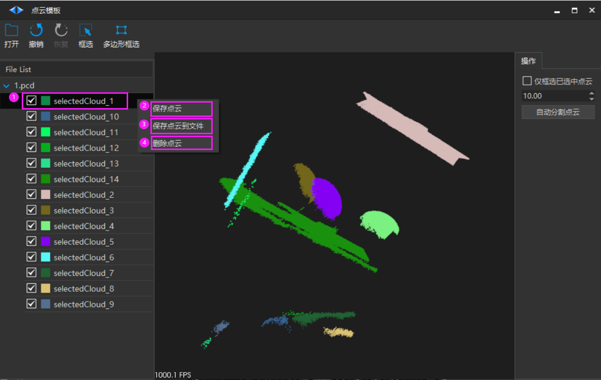

1. 选择要操作的点云，点击右键弹出菜单

2. 【保存点云】：默认保存在本地“RoboshopPro\PointCloudModel”中

3. 【保存点云到文件】：保存到自己选择的文件夹中

4. 【删除点云】：删除该点云。不会删除点云文件。

### 多选点云操作

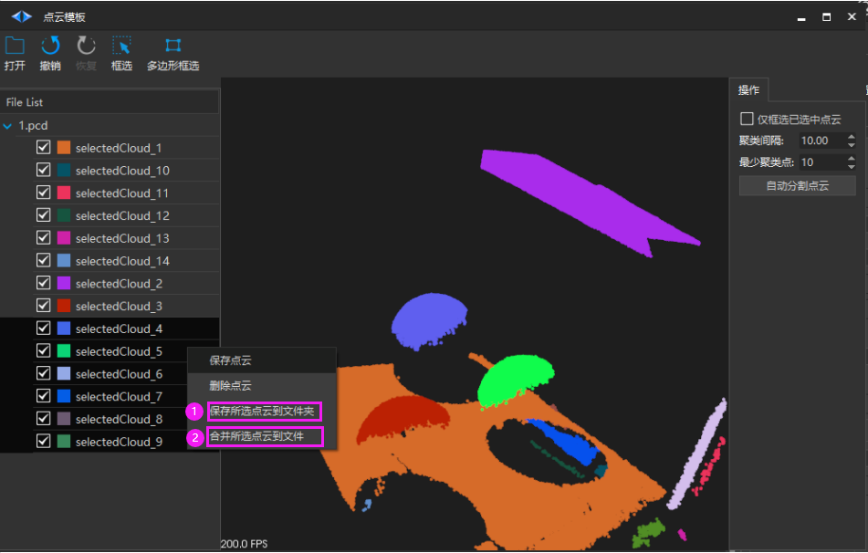

选择要操作的多个点云，点击右键弹出菜单

1. 【保存所选点云到文件夹】：将所选择的多个点云以其默认名称保存到所选文件夹。

2. 【合并所选点云到文件】：合并所选的点云并保存到一个文件

## 窗口操作

### 鼠标操作

| 鼠标操作 | 功能 |
| --- | --- |
| 左键 | 1. 点住拖动可以旋转点云 2. 选框 【选框模式】 |
| 右键 | 1. 点住向上下拖动，调整相机到点云的距离 2. 退出选框 【选框模式】 |
| 滚轮拖动 | 平移点云位置 |
| 滚轮滚动 | 放大缩小点云 |

### 键盘操作

| 快捷键 | 功能 |
| --- | --- |
| +/ - | 放大或缩小当前所有点的尺寸 |
| g, G | 开启标尺 |
| r, R | 重置相机位置 |
| x, X | 进入或退出 矩形框选模式 |
| f, F | 将鼠标点击的点移到中心，并可以以该点为旋转中心旋转查看 |