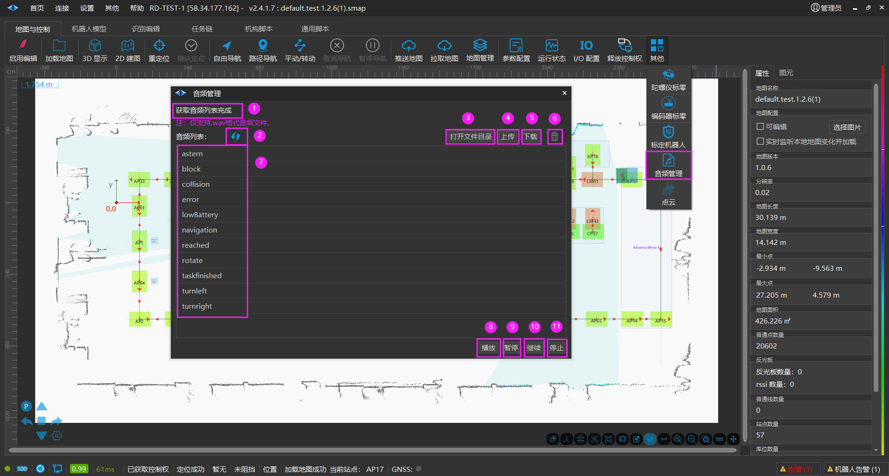
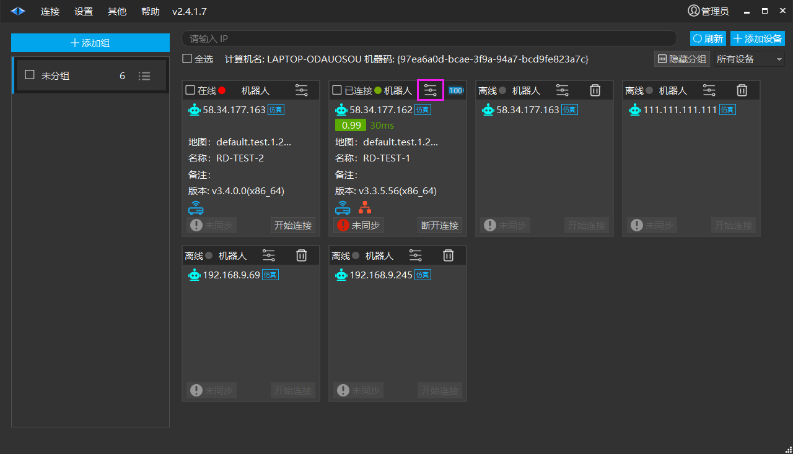
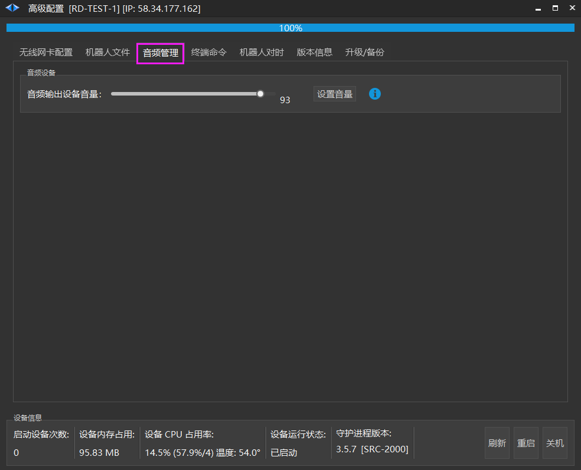
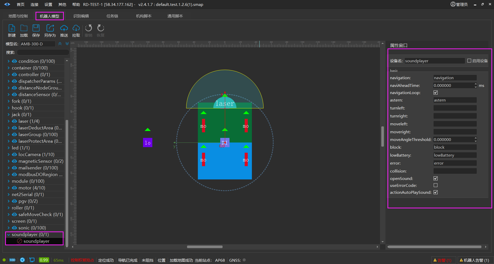

# 音频管理
## 音频管理

用于播放机器人里面的音频文件，只能播放 [wav] 格式的音频文件。

1. 提示文本框。

2. 刷新机器人里面存在的音频文件。

3. 打开用于缓存机器人的音频文件的本地路径。

4. 将本地的音频文件上传到机器人里面。

5. 将机器人里面的音频文件下载到本地对应的路径里面。

6. 删除选中的机器人里面的音频文件。

7. 显示从机器人里面获取的音频文件。

8. 播放选中的机器人里面的音频文件。

9. 暂停播放音频文件。

10. 继续播放音频文件。

11. 停止播放音频文件。

以上功能仅为即时播放音频。当需要机器人在运行中针对实时场景播放音频需要按照以下步骤配置。

一、点击机器人标签页【高级配置】按钮。

二、进入【高级配置】界面，选择【音频管理】。将音量调至60以上。

三、在【机器人模型】中进行配置具体音频。

