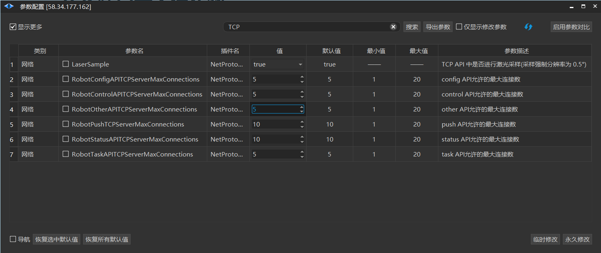

# TCP 端口最大连接数

| 参数名 | 对应端口 |
| --- | --- |
| RobotStatusAPITCPServerMaxConnections | 19204 |
| RobotControlAPITCPServerMaxConnections | 19205 |
| RobotTaskAPITCPServerMaxConnections | 19206 |
| RobotConfigAPITCPServerMaxConnections | 19207 |
| RobotCoreAPITCPServerMaxConnections | 19208 |
| RobotOthterAPITCPServerMaxConnections | 19210 |
| RobotPushAPITCPServerMaxConnections | 19310 |