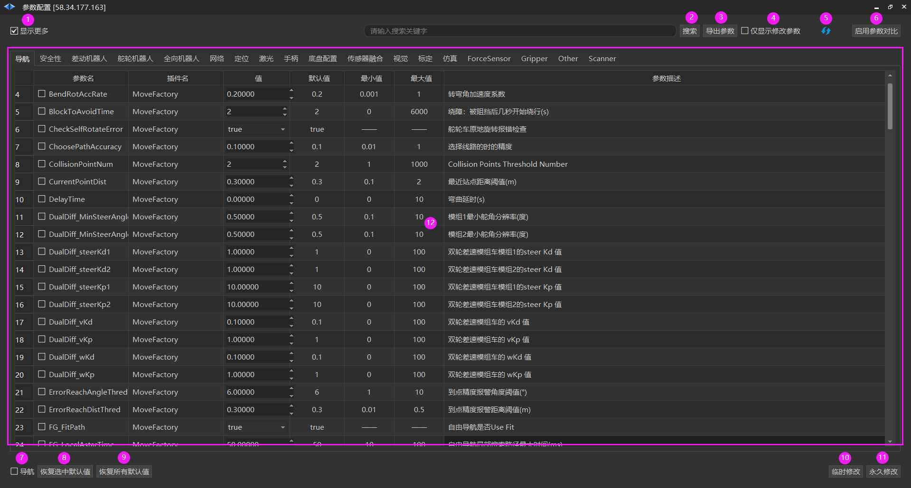

# 参数配置
##

1. 【显示更多】参数列表中的参数。

2. 【搜索】输入的关键字。

3. 【导出参数】将参数文件保存至本地。

4. 【仅显示修改参数】

5. 【刷新】参数列表。

6. 【启用参数对比】对比两个机器人之间参数的差异。

7. 【全选】选择参数列表内所有参数。

8. 【恢复选中默认值】恢复选中参数的默认值。

9. 【恢复所有默认值】恢复所有参数的默认值。

10. 【临时修改】临时修改机器人参数。

11. 【永久修改】永久修改机器人参数

12. 机器人参数列表，显示机器人所有参数。