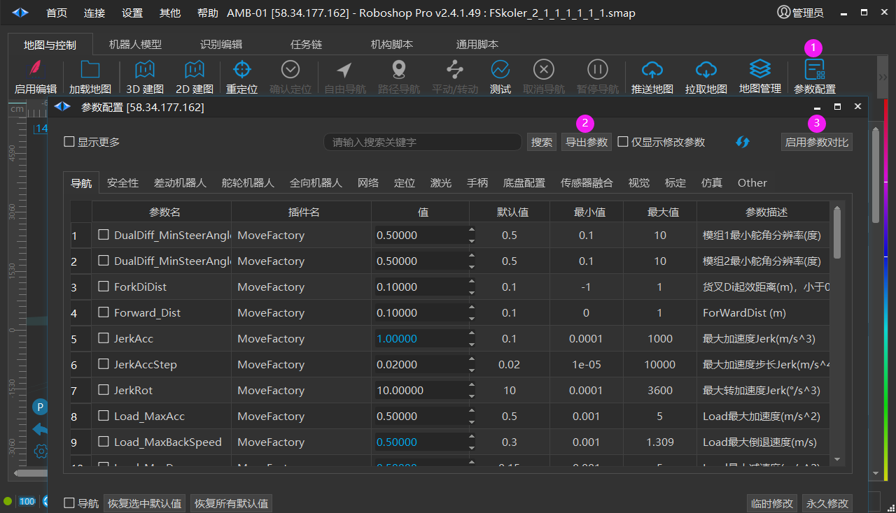
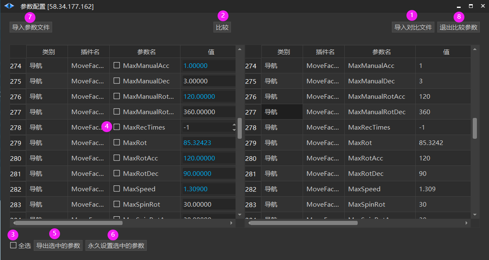

# 启用参数对比
**导入另一台机器人参数**

1. 参数配置

2. 导出参数: 当前机器人所有参数导出保存为文件

3. 启用参数对比弹出如下界面

1. 导入之前保存的文件

2. 比较差异化

3. 全选差异化参数

4. 鼠标可多选设置的参数

5. 导出选中的参数并保存到文件，方便记录,可以不用

6. 永久设置选中的参数

**对比任意 2台机器人参数** **：**

7. 导入另一台机器人参数，点击比较，可查看2台机器人参数值的差异化

8. 退出比较参数界面