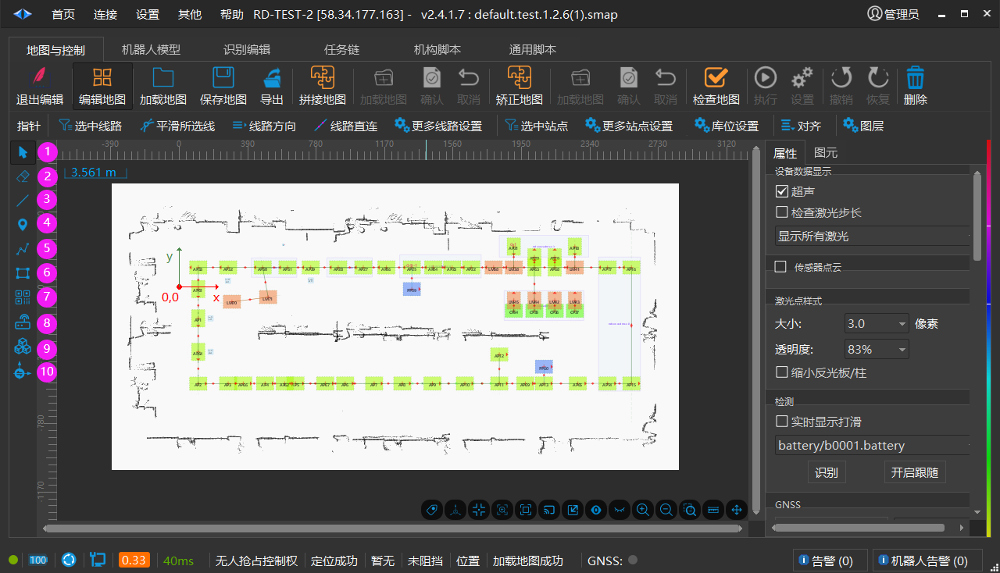
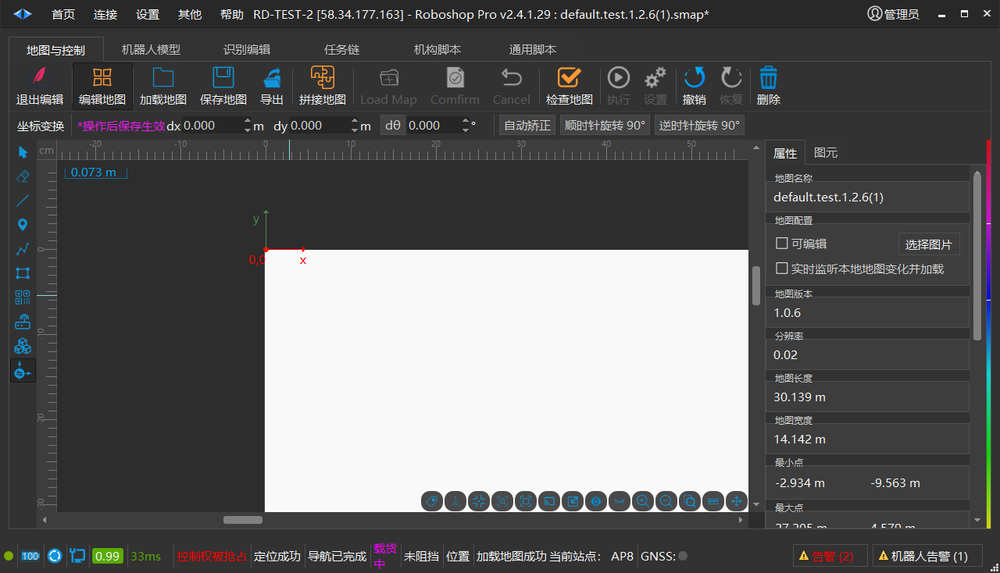
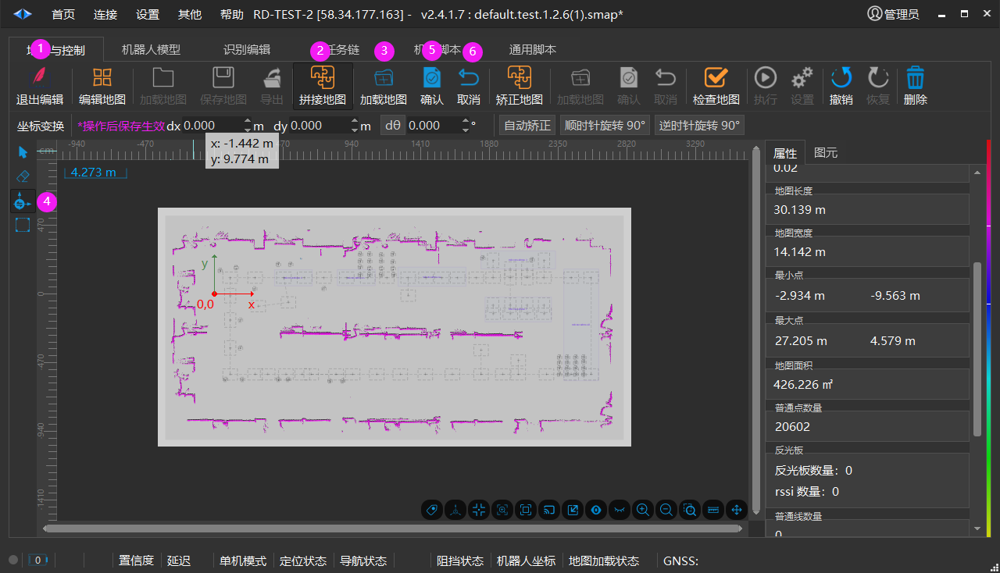
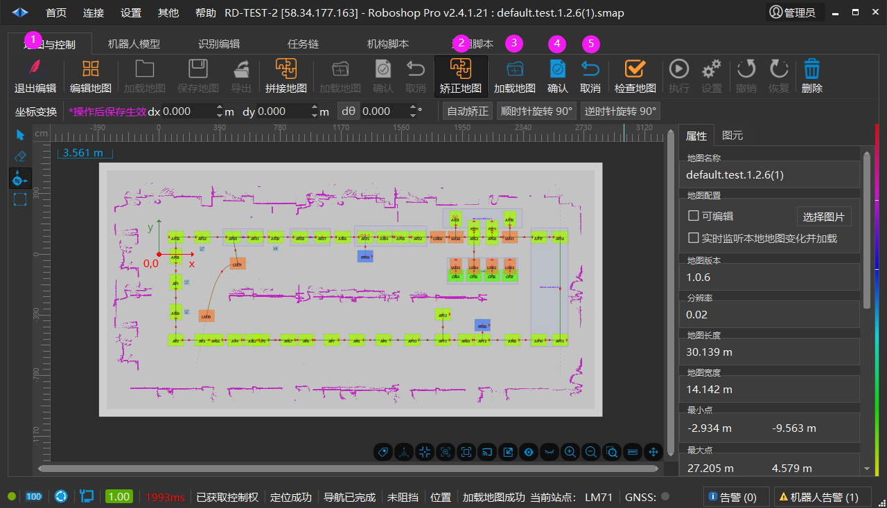
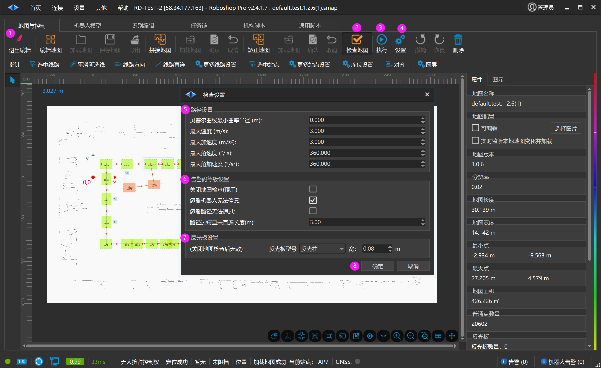
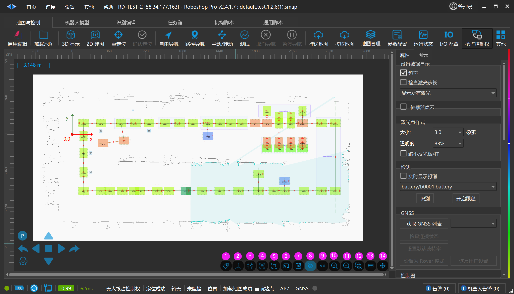
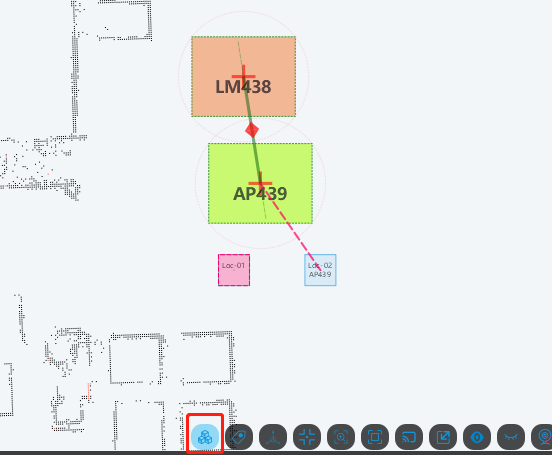
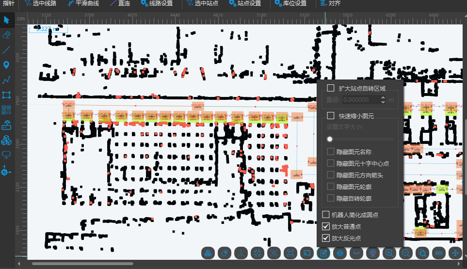

# 启用编辑
## 编辑图元

点击【启用编辑】->【退出编辑】

1. 【 [指针 ](https://seer-group.feishu.cn/wiki/Mi84wjR8Xi6NuUkxtgvcYA4SnAd)】用于选中，框选，移动图元

2. 【 [橡皮擦 ](https://seer-group.feishu.cn/wiki/EwZ6w5G12iDabTk70pMcWQsOnbg)】 用于擦除地图中的普通点

3. 【 [高级线 ](https://seer-group.feishu.cn/wiki/DkaUw6ZOfifYCUk9Y2BcbOhxnob)】用于禁止机器人通过

4. 【 [站点 ](https://seer-group.feishu.cn/wiki/CCaywx7UAisNsFkehXrcPDAZnjb)】 用于机器人停靠或执行任务

5. 【 [路径 ](https://seer-group.feishu.cn/wiki/TjlXwqTpeie6mgkrLHYcDMHknNe)】 用于机器人按设置的路径行走

6. 【 [高级区域 ](https://seer-group.feishu.cn/wiki/FPF1wykiSi6mwDknjnucUjENnWf)】用于机器人在该区域中进行个性化操作

7. 【 [二维码 ](https://seer-group.feishu.cn/wiki/UkhnwAvGYi4rHnk4iLvcNs2Mnxc)】 用于二维码导航

8. 【 [设备 ](https://seer-group.feishu.cn/wiki/G3xhwsKJKihdUqkdSjZcJUsSn5g)】用于视觉，RTKBase

9. 【 [库位 ](https://seer-group.feishu.cn/wiki/T0zXwOWE5ilHO1kmIp6cX8J7nPd)】用于存放货物

10. **【 ** [坐标变换 ](https://seer-group.feishu.cn/wiki/Mg5vw0xKsi39yMkDuJlcz8YCn5d)】用于旋转地图和改变地图原点

### 加载地图

- 默认打开 C:\Users\{账号}\AppData\Local\RoboshopPro\appInfo\robots\{组}\{机器人ID}\maps 目录

- 支持 .smap 和 .map 格式

### 保存地图

- 把地图保存到

C:\Users\{账号}\AppData\Local\RoboshopPro\appInfo\robots\{组}\{机器人ID}\maps

### 导出

1. 另存为：导出.smap、.smap(使用zip打开)、.map

2. 普通点转图片: 仅把普通点导出成图片

3. 图元转图片：仅把图元导出成图片

4. 地图转图片：把整个地图中图元和普通点导出成图片

**注** ：用户导出图片时可以把地图的(0,0)点使用 【坐标变换】把(0,0)移动到左上角，这样就与图片坐标一致。

## 拼接地图

1. 【启用编辑】->【退出编辑】

2. 【拼接地图】

3. 【加载地图】

4. 移动需要拼接的地图

5. 【确认】

6. 【取消】 取消当前所有操作

## 矫正地图

> 💡 
> Roboshop v2.4.0.34+

1. 【启用编辑】->【退出编辑】

2. 【矫正地图】

3. 【加载地图】加载需要矫正的地图

4. 【确认】确认矫正地图的调度和中心点

5. 【取消】取消当前所有操作

## 检查地图

1. 【启用编辑】->【退出编辑】

2. 【检查地图】

3. 【执行】会根据【检查设置界面】中参数对地图进行检查

4. 【设置】弹出检查设置界面

5. 【路径设置】机器人行走在路径是否可以正常转弯

6. 【高级码等级设置】部分地图错误是无法保存数据的，可以关闭地图检查保存地图数据

7. 【反光板设置】（关闭地图检查后无效）选择反光板型号后点击【确定】再点击【执行】，地图中的反光板点生成选择的反光板型号

8. 【确定】保存输入的数据

## 场景辅助操作

1. 显示/隐藏站点标签

2. 显示/隐藏坐标系

3. 视角跟踪：机器人位置保持在视图中心位置

4. 聚焦机器人：快速定位到机器人在当前场景中的位置

5. 适配场景：当前地图超过视口显示范围后，点击把场景居中显示在视图中

6. 仅显示反光板点云

7. 缩放站点：快速缩小站点，方便鼠标选中

8. 显示/隐藏机器人图元

9. 显示/隐藏小视口: 当前地图的鸟瞰图

10. 放大视口

11. 缩小视口

12. 区域放大：使用鼠标框选局部区域进行放大

13. 测量尺：辅助测量场景中的距离，快捷键：Ctrl+Shift

14. 移动场景：移动视口，快捷键：鼠标中键

### Roboshop v2.4.1.99更新：

1. 添加库位和站点连线辅助显示

2. 添加放大反光点

