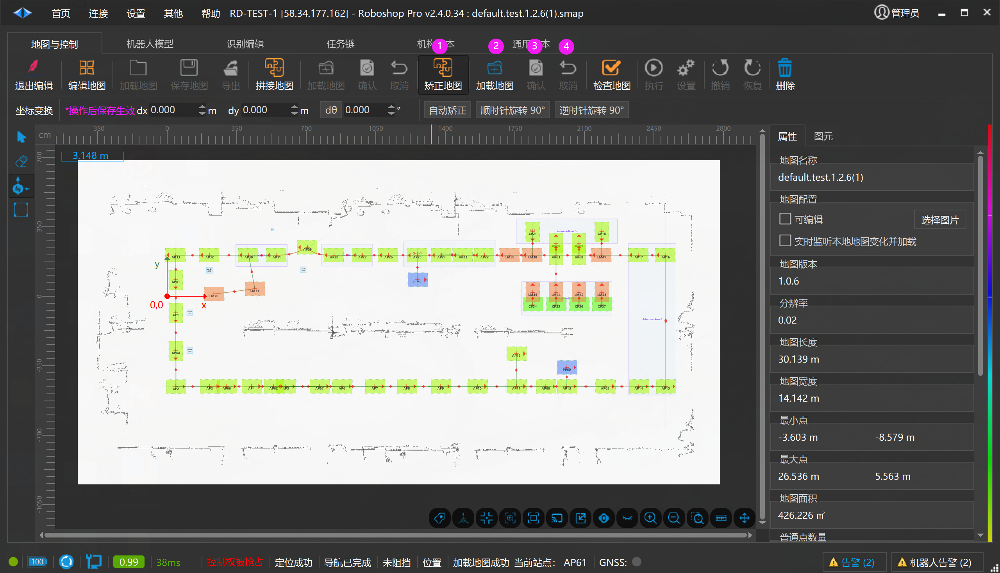
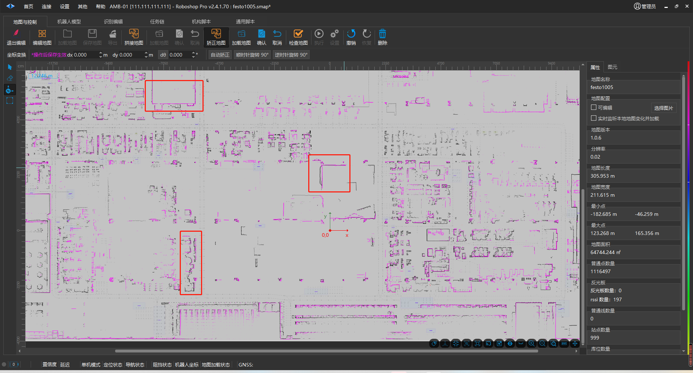

# 矫正地图
> 💡 
> RoboshopPro-2.4.1.34+

启用编辑

1. **矫正地图 ** : 鼠标点击矫正地图

2. **加载地图 ** : 加载需要矫正的地图

3. **确认 ** : 确认矫正地图的调度和中心点

4. **取消 ** : 取消当前所有操作

- 如果地图为 A 地图， 【启用编辑】并选中【矫正地图】加载 B 地图，鼠标移动 B 地图，让 B 地图与 A地图尽量重合，如上图 3 处相对重合度很高。

-  点击【确认】则会把 B 地图另存为矫正后的地图。