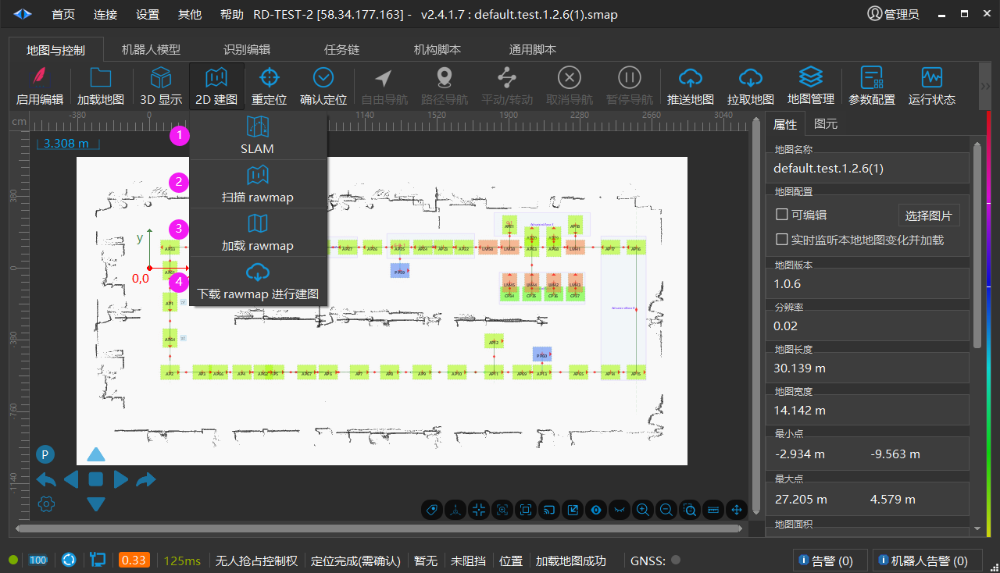
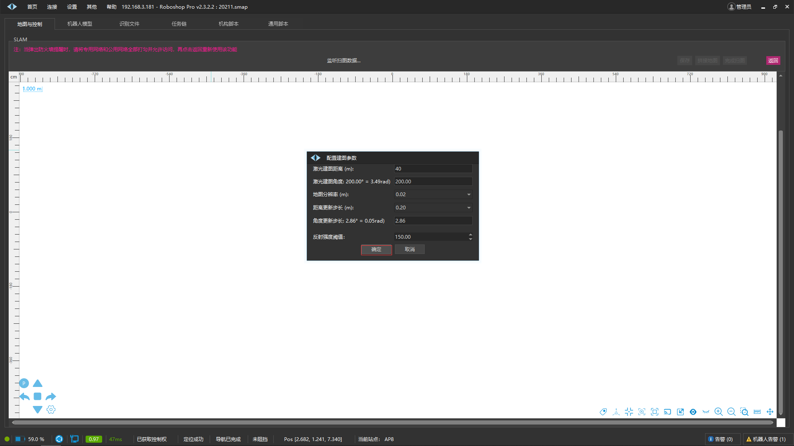
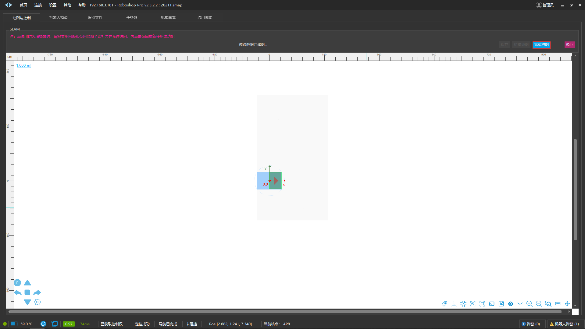
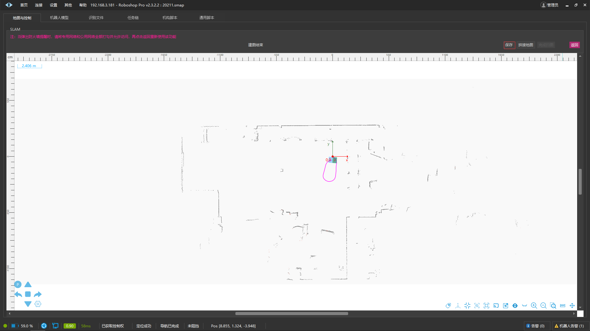
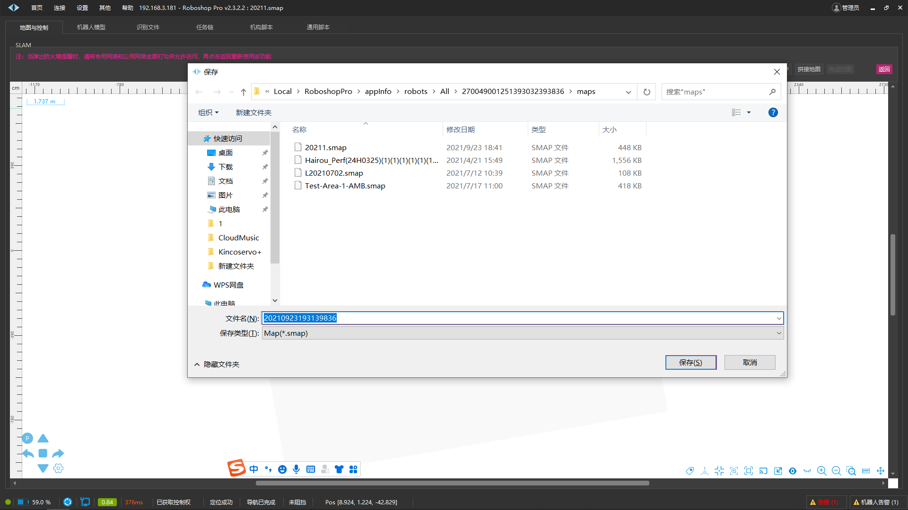
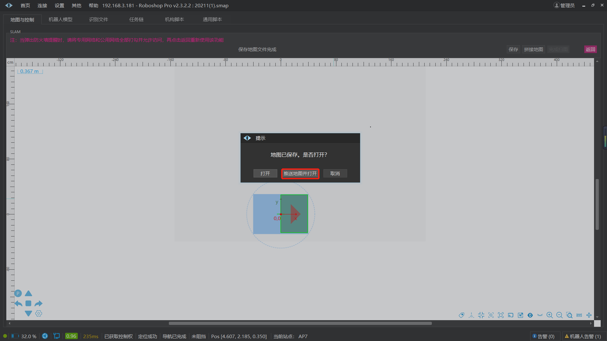
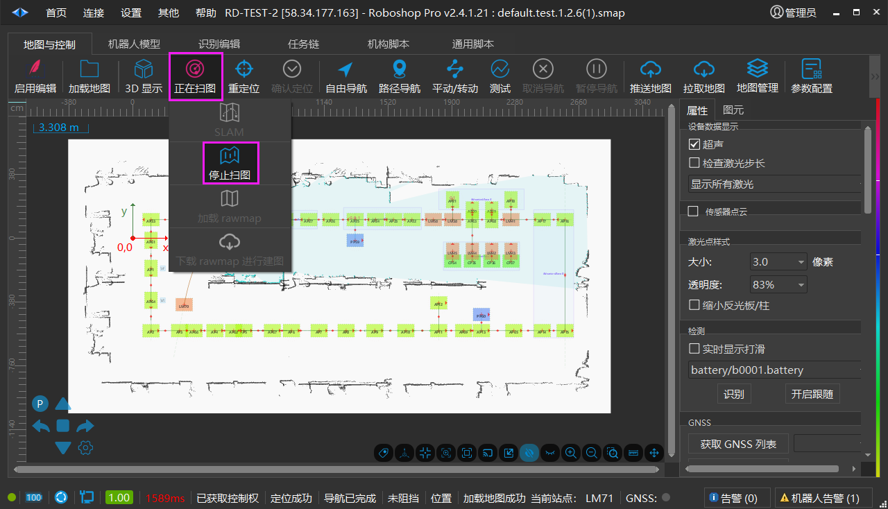
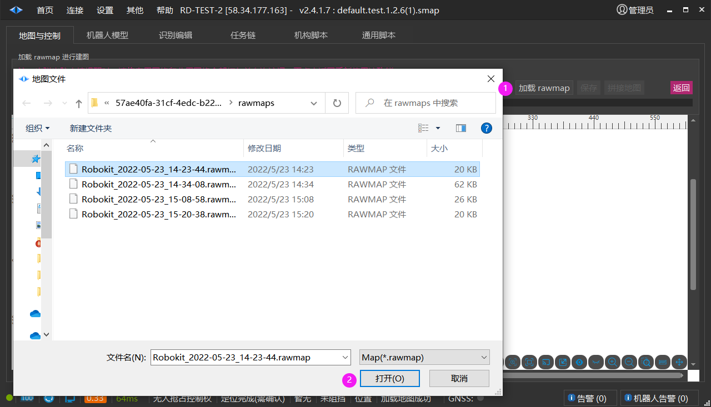

# 2D 建图

## SLAM实时扫图建图

1.  在弹出的界面中（一般情况下不需要修改参数），点击【确定】按钮。

注:如果该界面未弹出，则手动控制机器人行走看是否会弹出，如果依然无法弹出，则关闭 Roboshop 所在计算机防火墙，重启 Roboshop 再试一次。

2. 在完成扫图后点击右上角的【完成扫图】按钮。

3.  等待建图完成，然后点击右上角的【保存】按钮

4.  在所弹出的界面中选择期望路径和输入期望名称进行地图保存

5. 保存成功后会弹出对话框询问是否打开，选择【推送地图并打开】，即可打开刚才所构建的地图且将该地图进行同步，可以直接进行使用。此时地图构建部分已经完成。

6.  若选择【打开】，则打开刚构建的地图，并会弹出地图数据不一致的对话框，根据需求自行选择【推送地图】、【拉取地图】或者【取消】。

## 扫描rawmap离线扫图建图

点击【扫描rawmap】后按钮 【2D建图】改变成 【正在扫图】时可以手动控制机器人行走扫描地图，地图生成后按照上述SLAM 实时扫图建图的 b,c,d 流程完成地图保存上传。

## 加载rawmap文件

【加载 rawmap 】点击后进入【加载 rawmap 进行建图】界面。点击【加载 rawmap】按钮后选择 .rawmap 文件，点击【打开】按钮地图生成后按照上述 SLAM实时扫图建图的 b,c,d 流程完成地图保存上传。

## 下载rawmap文件进行建图

下载机器人中最后一次扫图生成的 rawmap 文件用于创建地图，操作与界面与上述加载rawmap文件一致。