# 3D 建图
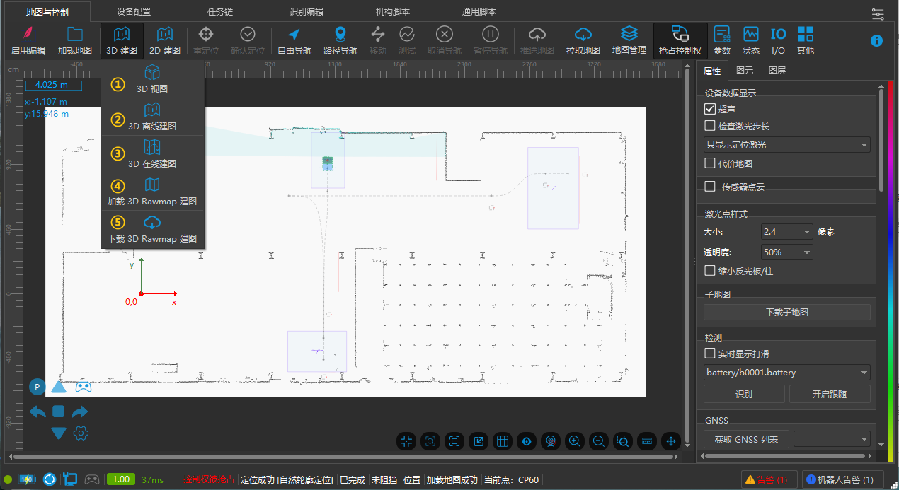

## 3D 视图

查看并编辑当前 3D 地图。

📎 [20250327183957_rec_.mp4](3D 建图/20250327183957_rec_.mp4)

- ctrl+鼠标滚轮：放大缩小视图

- 点击鼠标中键拖动鼠标：移动 3D 视图

### 查看

1. 仅查看 3D 点云

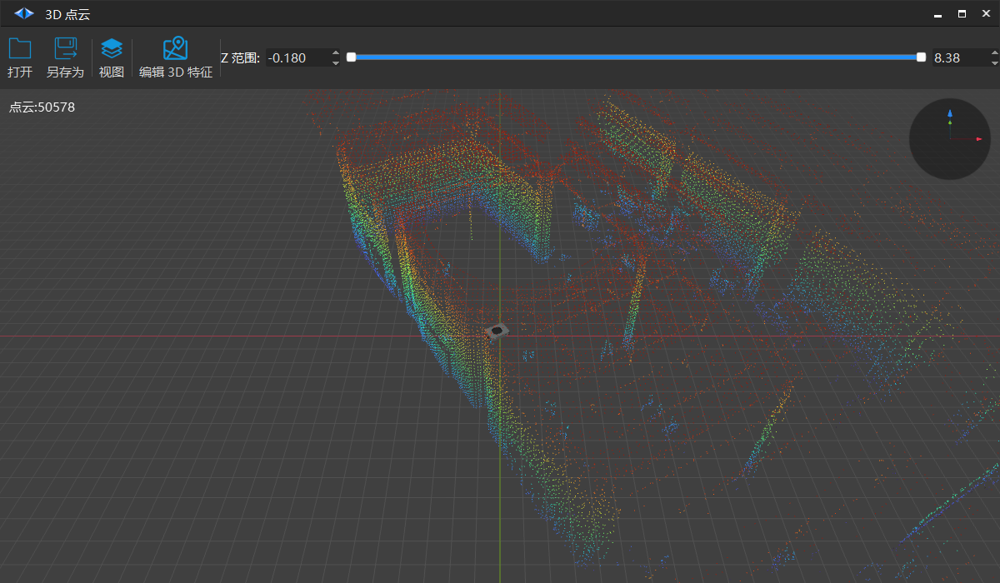

2. 查看3D 点云、3D特征

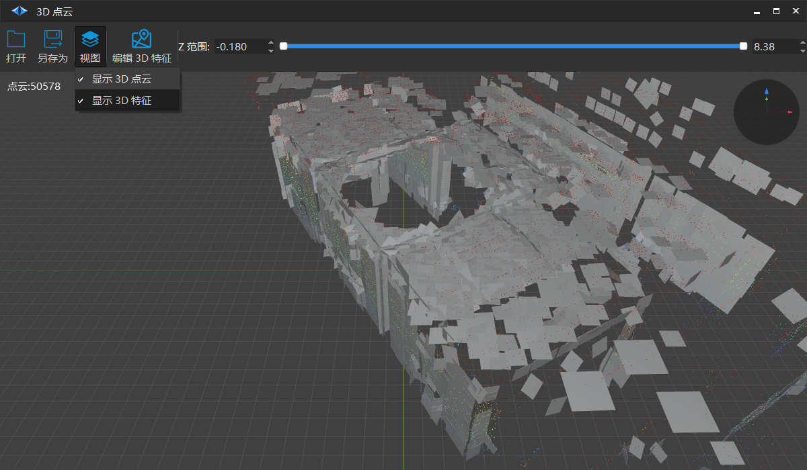

### 编辑

#### 选中单个区域

鼠标左键拖住选中

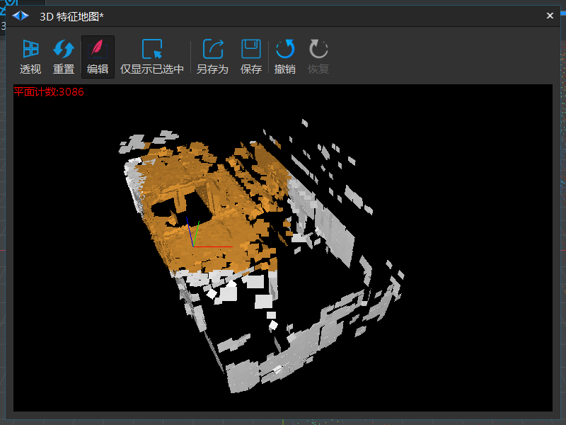

仅显示已选中区域

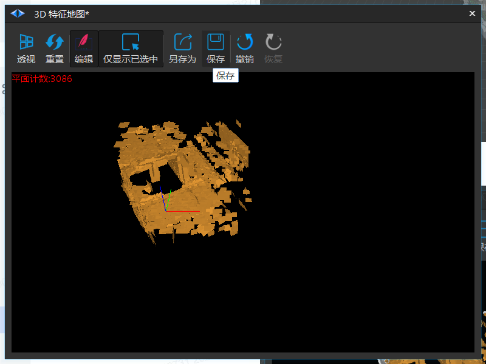

#### 追加选中区域

Shift + 鼠标左键拖住

#### 减选选中区域

Alt + 鼠标左键拖住

#### 选择两个区域交集

键盘 Shift + Alt + 鼠标左键拖住

#### 删除选中平面

选中平面之后，按下键盘 Delete 即可删除

## 3D 离线建图

1. 点击离线建图

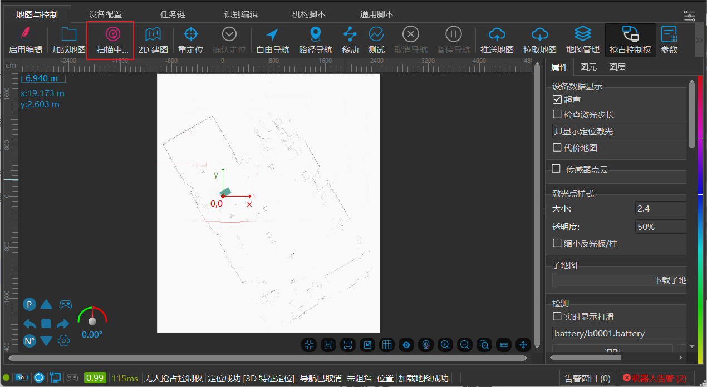

2. 停止扫描

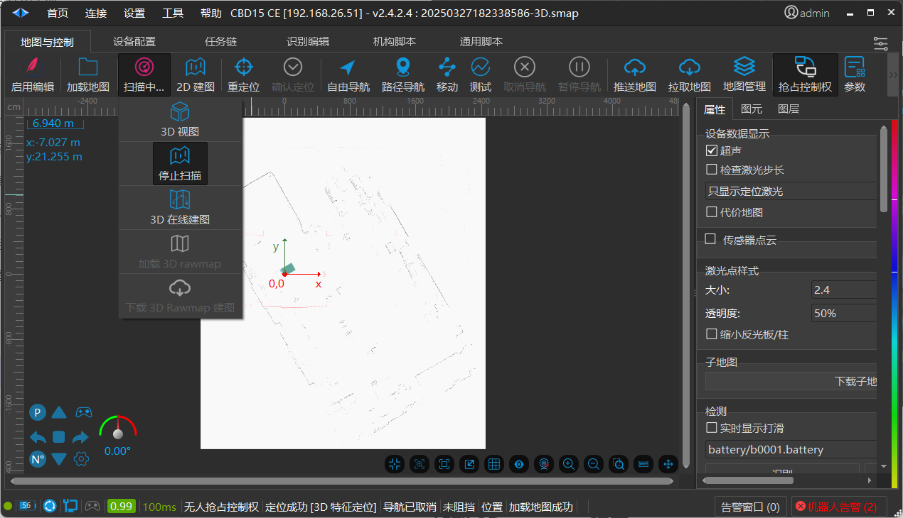

## 3D 在线建图

1. 配置参数

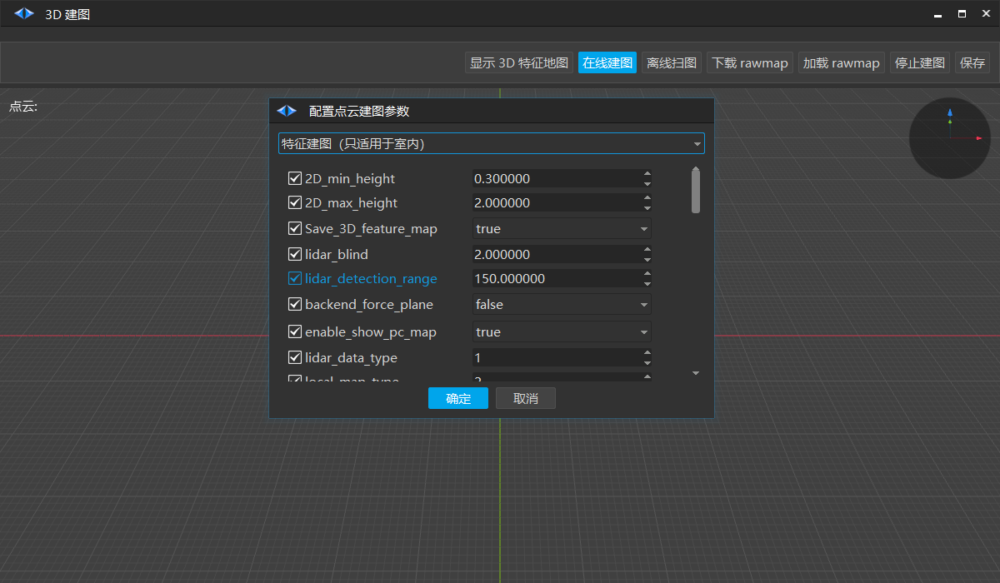

- `2D_min_height` 2D 地图的最小高度

- `2D_max_height` 2D 地图的最大高度 (创建 3D 地图时会同时生成一张 2D 地图，它的 普通点为 3D 地图中截取一段高度合并的点 )

- `2D_max_height` 建图时是否实时显示点云 (大地图时建议关闭，会影响建图的速度)

2. 开始扫图，过程中可以按需控制小车实现需要的扫图效果

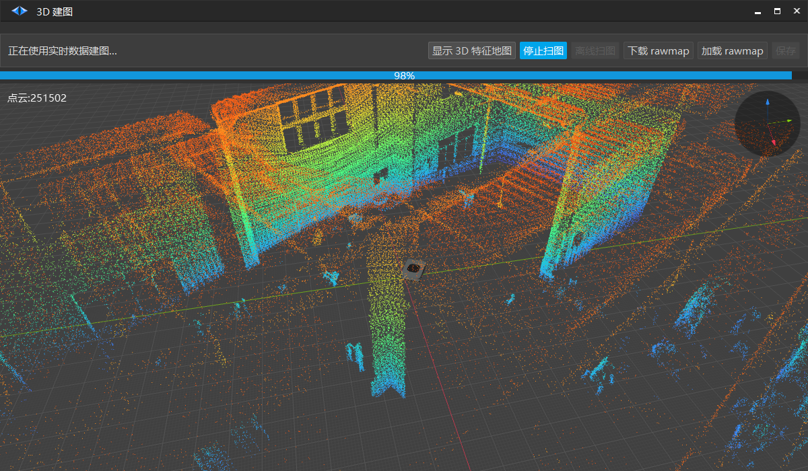

3. 停止扫图，保存地图文件

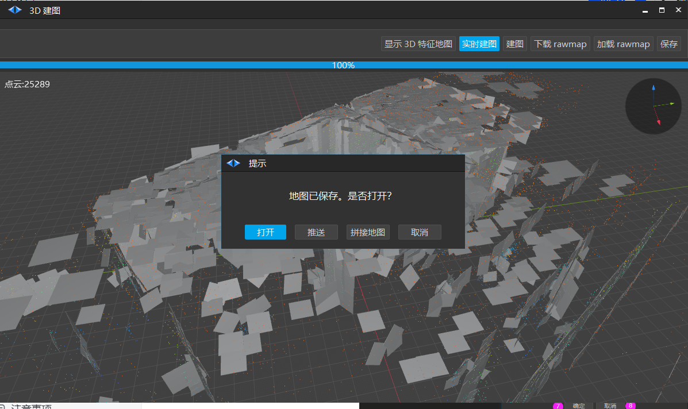

## 加载 3D rawmap 建图

选择本地保存的raawmap地图文件加载

鼠标多选 robokit_20xx-xx-xx_xx-xx-xx.0.zip 进行 3D 建图

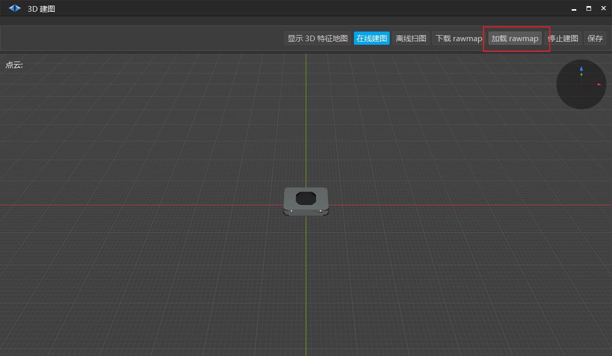

## 下载 3D rawmap 建图

与 【加载 3D rawmap 建图】功能类似

如果选择离线建图则机器人激光扫描的数据会存在机器人中，此时下载 rawmap 可以完成 3D 建图