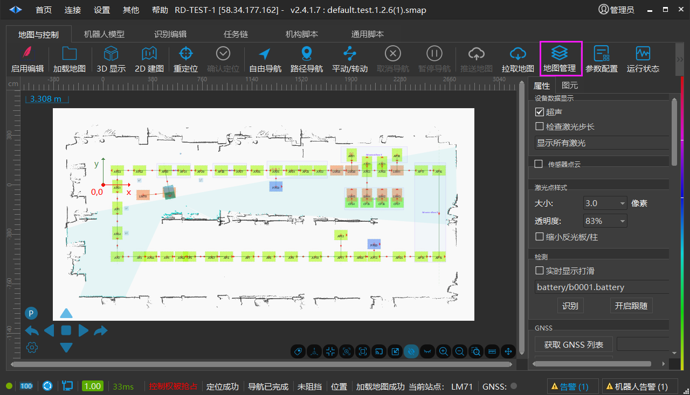
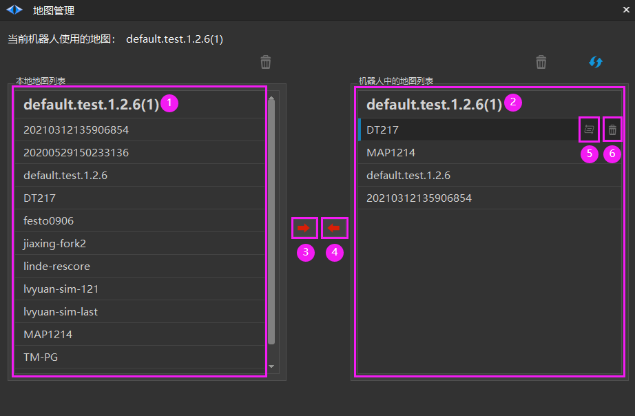

# 地图管理
## 地图管理

【地图管理】：管理【本地地图】以及【机器人中的地图】。

**操作步骤**

点击【地图管理】按钮，弹出【地图管理】界面。

1. 【本地地图列表】其中置顶为正在使用的地图。

2. 【机器人中的地图列表】其中置顶为正在使用的地图。

3. 【上传地图】选中【本地地图列表】某一地图，点击【上传地图】按钮，可上传至【机器人中的地图列表】。

4. 【下载地图】选中【机器人中的地图列表】某一地图，点击【下载地图】按钮，可下载至【本地地图列表】。

5. 【切换地图】可以选中某一地图，点击【切换地图】按钮，快速打开该地图。

6. 【删除地图】可以选中某一地图，点击【删除地图】按钮，快速删除该地图。