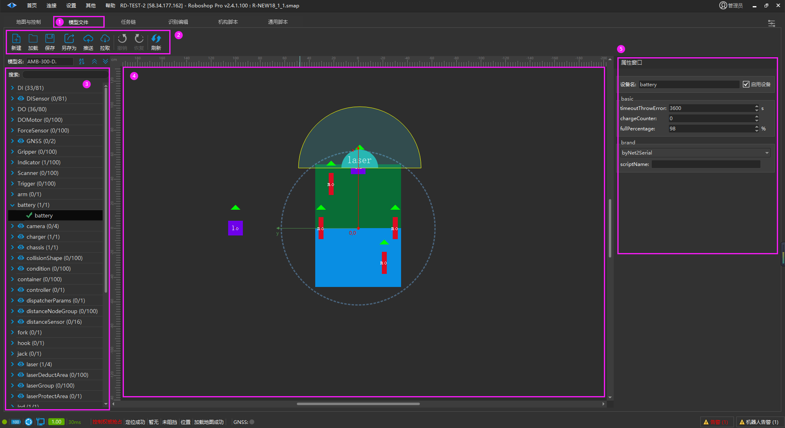

# 模型文件
## 机器人模型文件

在使用Roboshop进行机器人连接时，可以在标题栏中看到模型文件选项，连接成功后可以进行拉取，可以查看到当前所有支持的模型文件，每个不同的模型文件对应着机器人身上不同的部分。

1. 进入机器人界面的【模型文件】页面

2. 对文件的操作：
    1. 【拉取】：从机器人端拉取模型文件到本地
    
    2. 【推送】：从本地推送修改后的模型文件到机器人

3. 机器人模型类型

4. 显示当前机器人模型布局图

5. 【属性窗口】：在属性窗口中点击【启用设备】可以开启使用该模型，并在布局图上显示。可对机器人模型参数进行具体配置

## RDSCore 模型文件

在使用Roboshop进行RDS Core连接时，可以在标题栏中看到模型文件选项，连接成功后可以进行拉取，可以查看到当前所有支持的模型文件，具体配置参数可参考 [RDSCore模型文件配置](https://seer-group.feishu.cn/wiki/OSPbw79eBiJXZlkrwPgce5f2nnd)