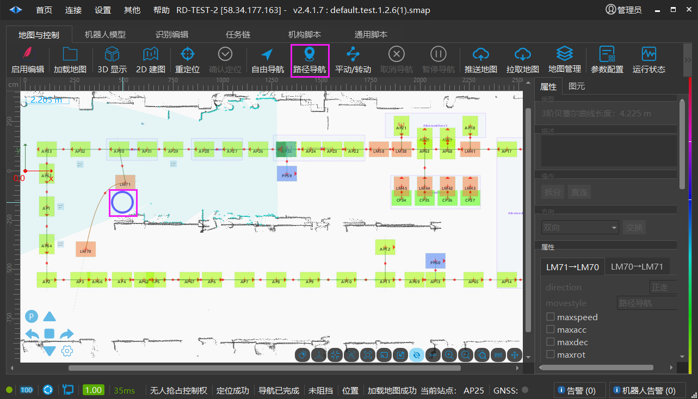
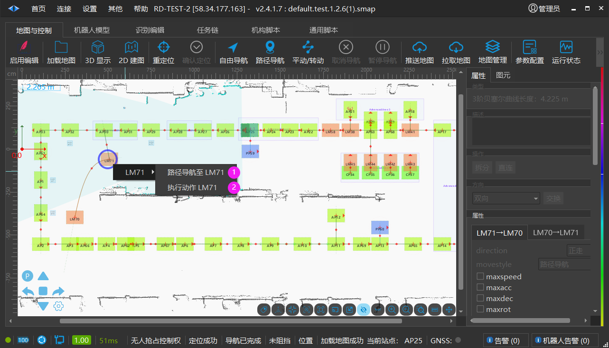
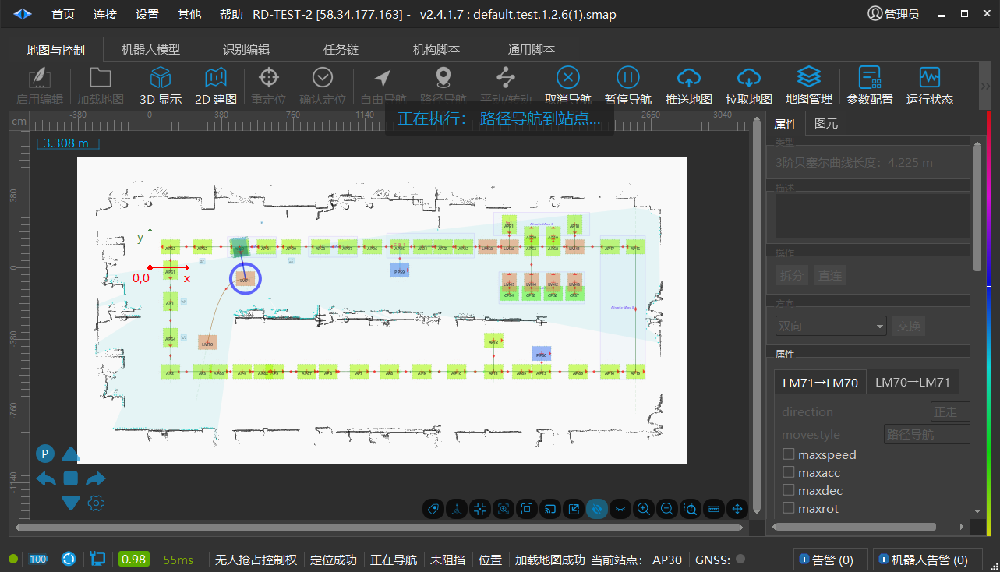
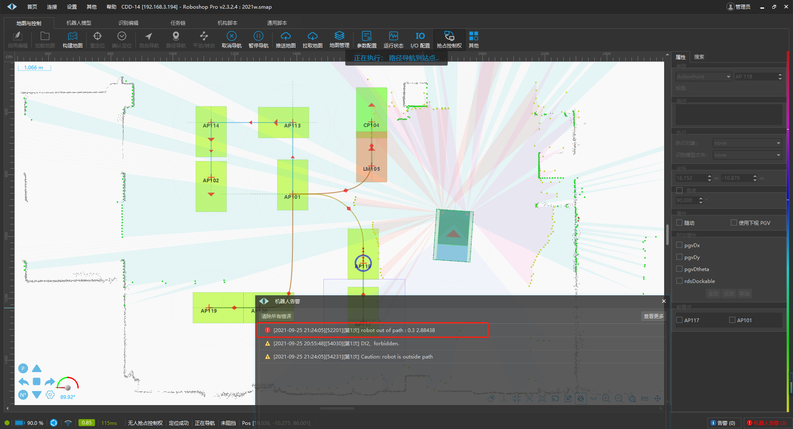
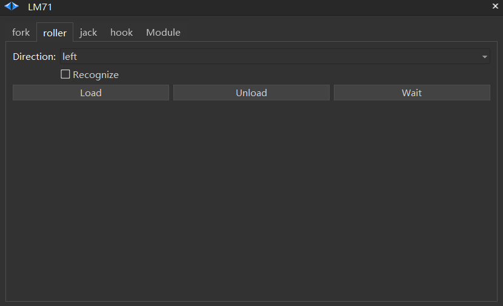
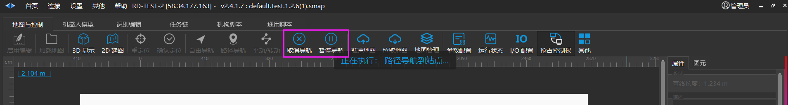

# 路径导航
## 路径导航

【路径导航】：让机器人按照规定的路径移动到目标点。

**一、** **开始路径导航。**

点击【路径导航】，鼠标箭头变成蓝色圆圈，将蓝色圆圈移到目标站点。

**二、** **选择导航任务。**

单击目标站点，展开白色箭头，选择导航任务，分为【导航路径至LM71】、【执行动作LM71】。

1. 【路径导航至LM71】：从机器人当前位置，运行至LM71。 **其中AMR机器人会自主规划出最佳路线，红色路线为规划路线。叉车如果不在站点上会报错。**

2. 【执行动作LM71】：从机器人当前位置，自主规划出最佳路线，运行至LM3并执行相应动作。当点击【执行动作LM71】，跳转出执行界面。（此界面依据【识别文件】执行，以下为滚筒车的执行事项）

**参数说明：**

| 参数 | 描述 |
| --- | --- |
| Roller | 辊筒 |
| Module | 机构脚本 |
| Direction | 动作的方向 |
| Recognize | 识别功能 |
| Load | 上料 |
| Unload | 下料 |
| Wait | 等待 |

**说明：开始【路径导航】后，可以点击【取消导航】或者【暂停导航】来取消或暂停。**

