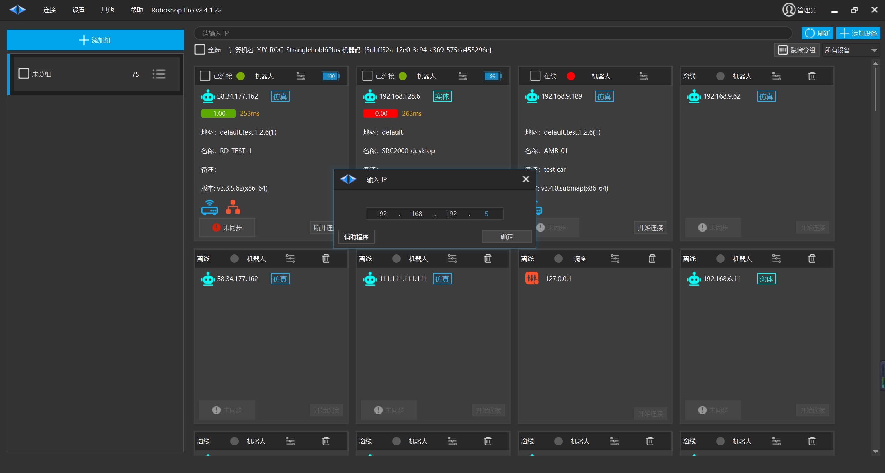
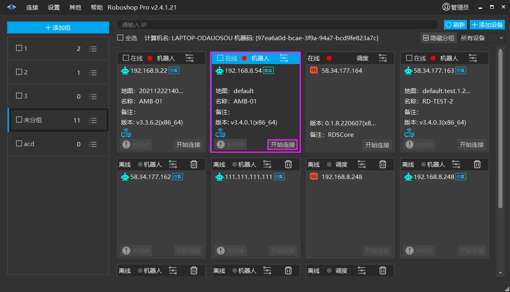
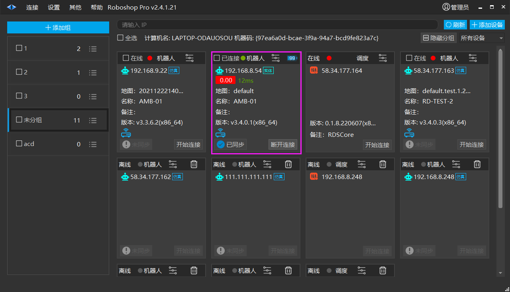

# 网线接入
## 网线接入

**注意：操作机器人需要使用** **最新版 Roboshop Pro** **.**

1. 使用网线将电脑与机器人SRC调试口进行连接。

2.  将电脑的以太网 IP 设置为 192.168.192.xxx( **注：必须为192网段 ** )，子网掩码 255.255.255.0，网关可省略。

3. 打开 Roboshop Pro 在【首页】点击【刷新】按钮或手动【输入 IP】地址为【192.168.192.5】进行机器人添加,如下图所示。

4. 在【首页】的机器人列表中找到 IP 地址为【192.168.192.5】的机器人点击【开始连接】按钮进行连接。

5. 等待机器人标签页中显示机器人的“置信度”、“网络延时”、“地图”、“名称”、“备注（若有）”等信息时，表明连接成功。

