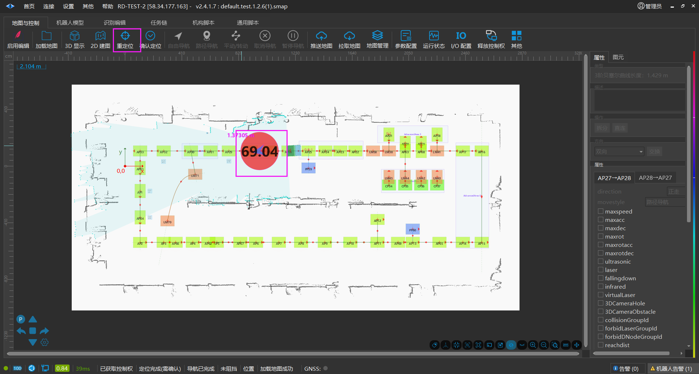
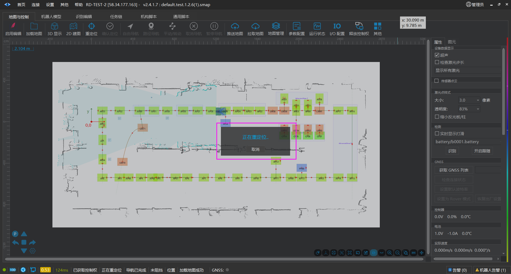
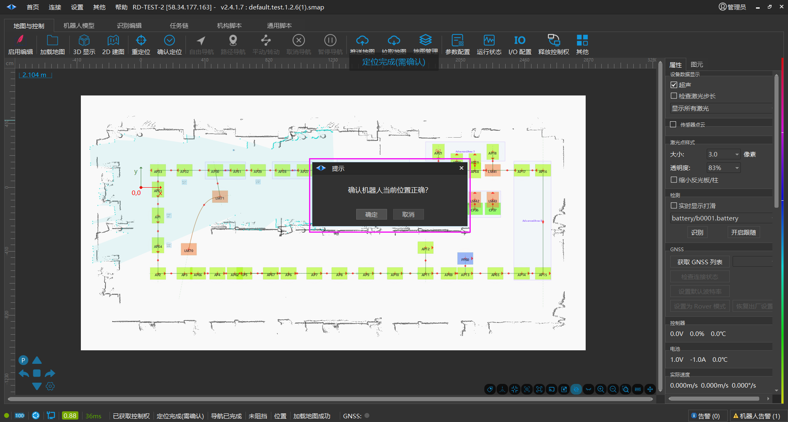

# 重定位步骤
## 重定位步骤

1. 点击【重定位】按钮。使用鼠标将代表车体的蓝色箭头拖到车体大致位置，点击鼠标左键拖拽鼠标箭头，让蓝色箭头指向车体车头的实际方向。

2. 松开箭头后，界面上出现“正在重定位”，等待过程完成，这期间，代表车体的蓝色方块可能会发生跳动，绿色的点云试图与灰色地图重合。

3. 重定位完成后，弹出“确认机器人当前位置正确？”对话框，检查车体位置点云和灰色地图重合，即可点击【确定】。

