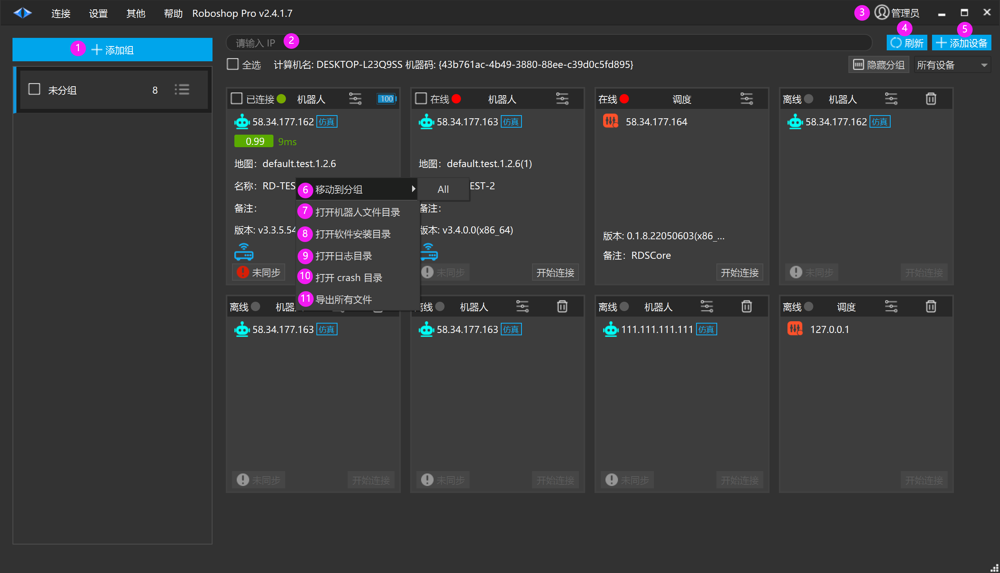
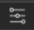
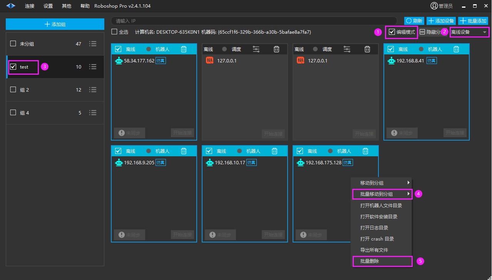
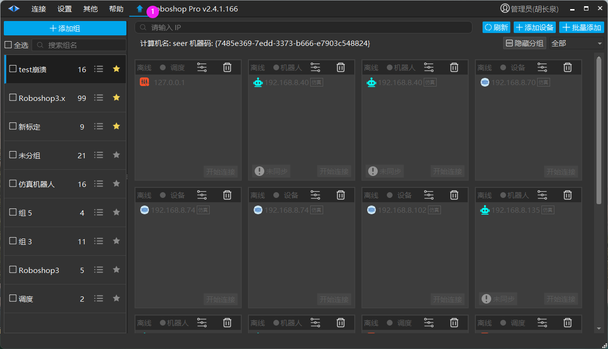
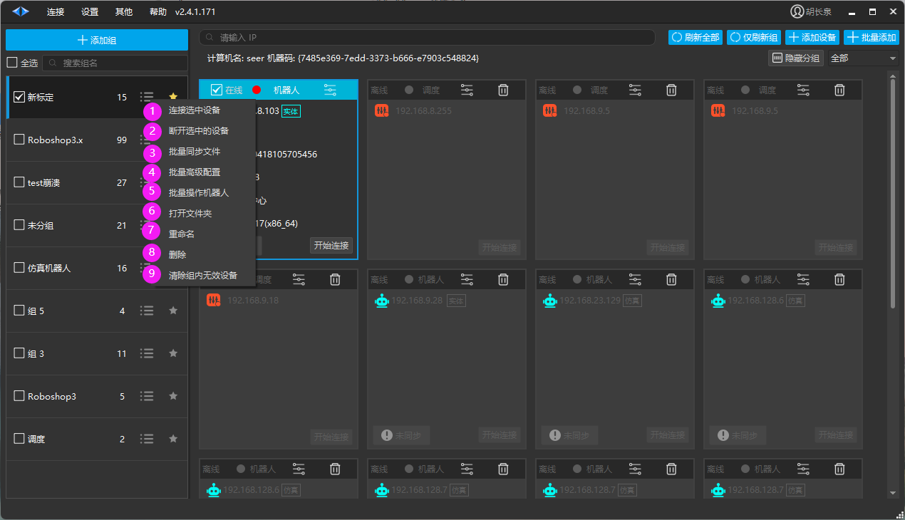
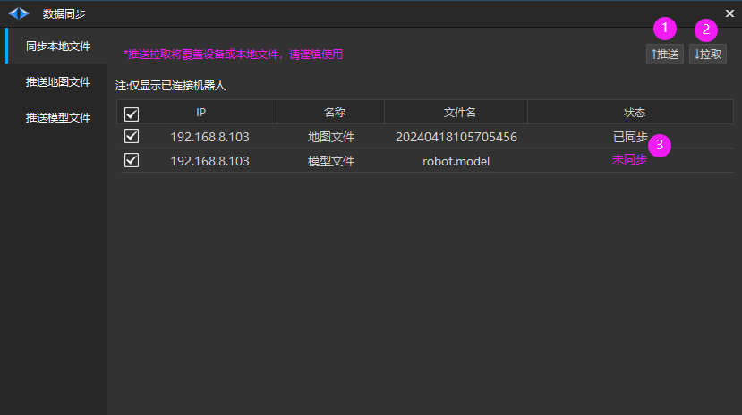
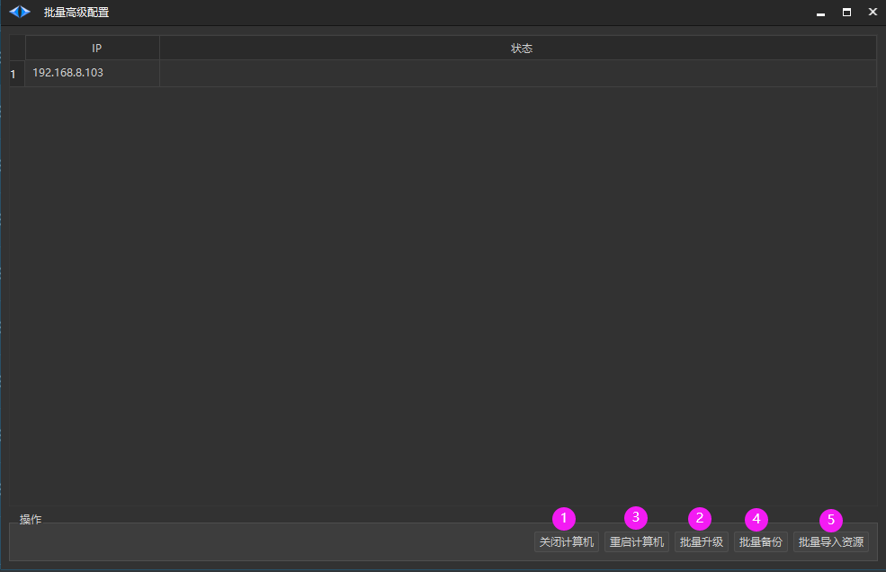
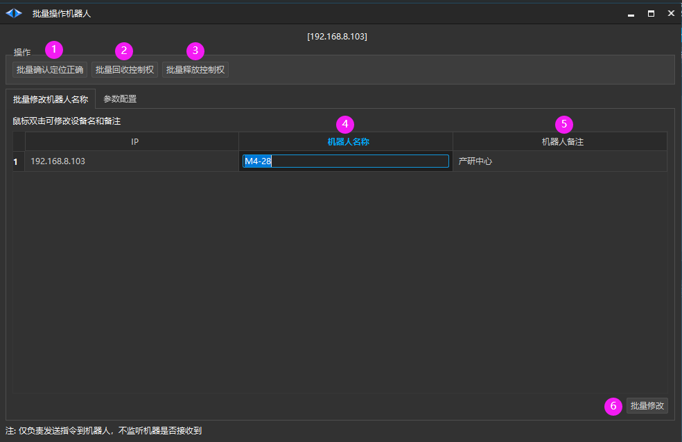

# 第三章：首页

## 基本功能

1. 添加组：新增一个组，把设备归类到组内

2. 根据 IP 搜索当前组内设备

3. 管理员：软件发布时默认未管理员登录，当退出登录后用户只能查看机器人信息，而不能修改机器人数据

4. 刷新列表

5. 添加设备，输入 IP 添加局域网内的设备 (确保设备已运行并与当前计算机在同一局域网内)

6. 把当前设备移动到别的分组

7. 打开机器人文件目录，打开的是存放机器人地图，模型等资源文件的目录

8. 打开软件安装目录，打开 Roboshop 运行程序所在的目录

9. 打开日志目录，打开 Roboshop 保存日志所在的目录

10. 打开 crash 目录，打开 Roboshop 崩溃的目录

11. 导出所有文件，导出该设备所有资源文件数

## 高级配置

[RY3VwkGLOiTMgUkL3hCch5scnFf]

## 批量设置机器人单元

> 💡 
> Roboshop v2.4.1.104+ **仅开发测试用 **

批量删除离线机器人：

1. 首页勾选【编辑模式】，进入首页编辑模式

2. 下拉框筛选设备，选择【离线设备】

3. 若勾选当前组的勾选框，可以全选当前页的机器人

4. 【批量移动到分组】：可以将选择的机器人批量移动到所选分组

5. 【批量删除】：可以批量删除所选择的机器人

## 在线升级

> 💡 
> Roboshop 2.4.1.163+

## 组菜单

1. 连接选中设备

2. 断开选中的设备

3. [批量同步文件](https://ocn3rbr2m923.feishu.cn/docx/LB97dFYQnoHRcmxE6MxcxD3pndd?fromScene=spaceOverview#doxcnCNxYAhrgno6fdSBMkfubCg)

4. [批量高级配置](https://ocn3rbr2m923.feishu.cn/docx/LB97dFYQnoHRcmxE6MxcxD3pndd?fromScene=spaceOverview#doxcnlhNitWTRyuAHqwMbLHUiph)

5. [批量操作机器人](https://ocn3rbr2m923.feishu.cn/docx/LB97dFYQnoHRcmxE6MxcxD3pndd?fromScene=spaceOverview#doxcnggk6XVXVQuohOP4pxegEVc)

6. 打开文件夹：打开组所在的文件夹

7. 重命名：对组进行重命名

8. 删除：删除组（仅删除组，删除组内所有设备）

9. 清空组内无效设备：删除组内无效的设备

### 批量同步文件

1. 推送：把勾选的地图文件和模型文件推送到机器人的控制器中

2. 拉取：从机器人控制器中拉取地图文件和模型文件

3. 已同步：表示本地与机器人控制器数据一致          未同步：表示本地与机器人控制器数据不一致

### 批量高级配置

1. 关闭计算机

2. 重启计算机

3. 批量升级：对连接的 IP 进行批量升级

4. 批量备份

5. 批量导入资源

### 批量操作机器人

1. 批量确认定位正确：批量确定机器人定位正确

2. 批量回收控制权：批量回收机器人控制权

3. 批量释放控制权：释放所有机器人控制权

4. 机器人名称：鼠标双击修改，点击批量修改按钮生效

5. 机器人备注：鼠标双击修改，点击批量修改按钮生效

6. 批量修改：机器人名称和机器人备注使用鼠标双击修改后，点击批量修改生效