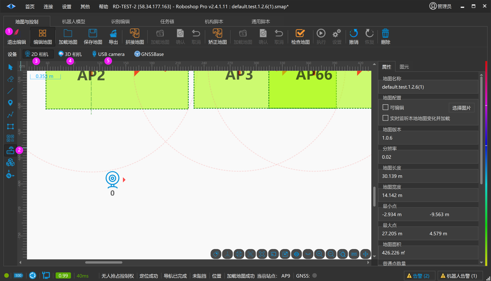
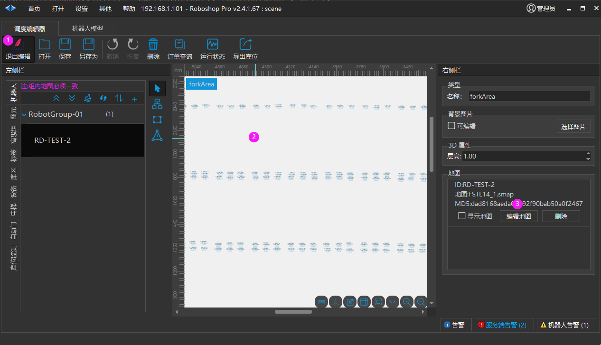
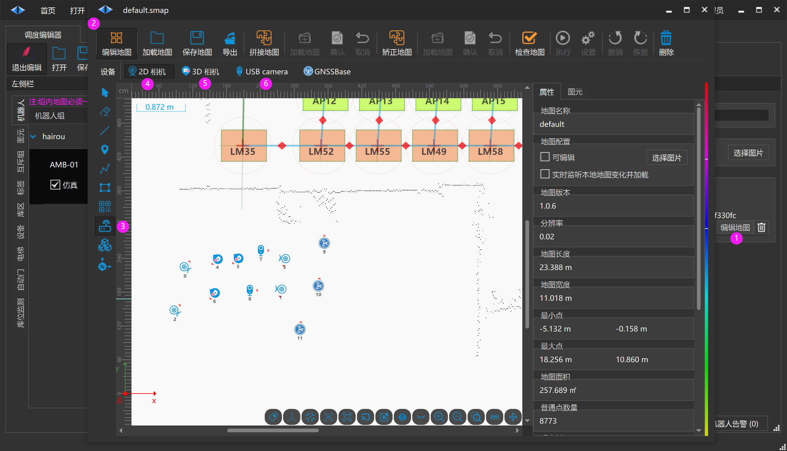
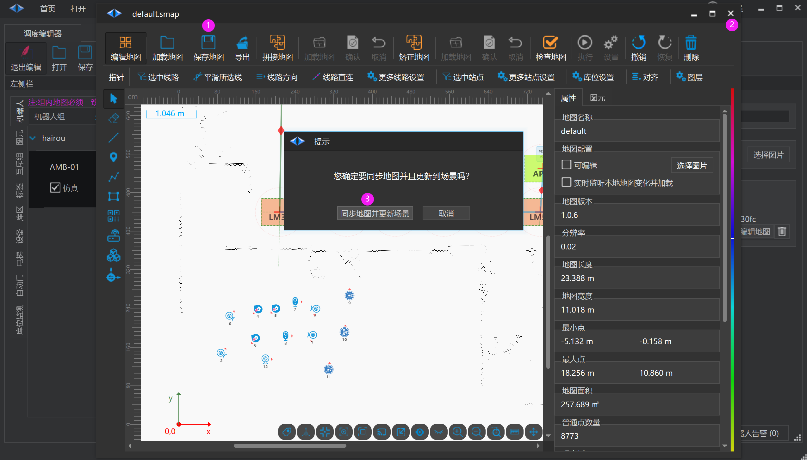
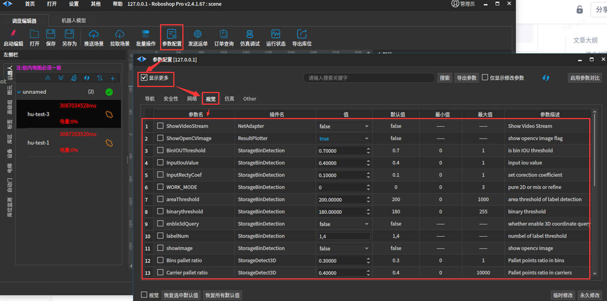

# 配置相机
## 机器人中配置相机

1. 启用编辑

2. 外部设备部

3. 2D 相机

4. 3D 相机

5. USB 相机

## 调度编辑器中配置相机

> 💡 
> Roboshop v2.4.1.11+

1. 启用编辑

2. 鼠标点击空白区域

3. 鼠标点击编辑地图会弹出如下图

1. 编辑地图

2. 编辑地图

3. 外部设备部

4. 2D 相机

5. 3D 相机

6. USB 相机

1. 保存地图

2. 关闭编辑

3. 同步地图并更新场景 ：把这张地图数据融合到场景中

## 配置视觉参数

1. 显示推流视频，在使用RoboShop 部署时候需要为true，这样才能打开视频根据标记点勾画库位。部署结束后，可以关闭，推流消耗电脑性能。

2. 测试时使用的简易视频流

3. IoU值，计算库位占用的重要参数。

(待补充......)

## 绑定相机库位