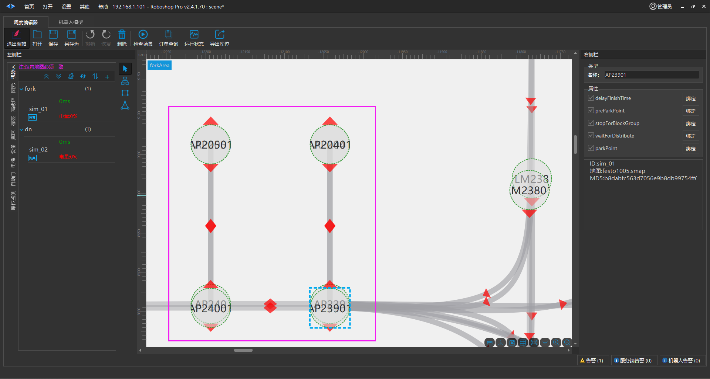
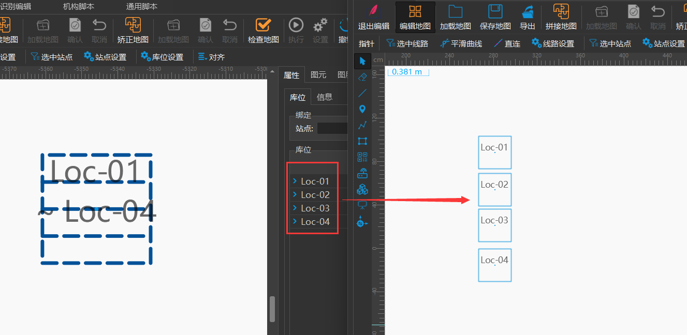
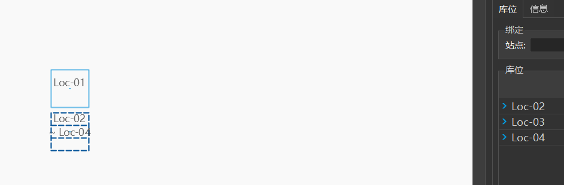

# 不同车型在同一区域实施
## 地图对齐

**描述: 不同类型的机器人，在同一物理空间内实施时需要对它们的地图做原点对齐**

1. 需要把不同机器人使用【矫正地图】功能实现 原点(0,0) 一致，查看地图中共有的参照点作为原点(0,0)

[G05uwGteMihHL5kleuEc0A71nCA]

2. 把矫正的地图重新同步给机器人并添加到场景中 （使用不同地图的机器人，不能在同一个机器人组中）

3. 需要保证物理空间一致的站点命名也要一致， 下图这种操作是 **错误 ** 的

## 多层库位注意事项

如果同一个区域需要地牛叉取库位 Loc-01 的货物， 叉车叉取 Loc-01、Loc-02、Loc-03、Loc-04 货物，在实施时需要使用右边这种方式

或者使用下面这种方式。 原则上多台机器人存在交叉的库位名称的图元需要分离

