# 基本操作介绍
# 添加调度服务器

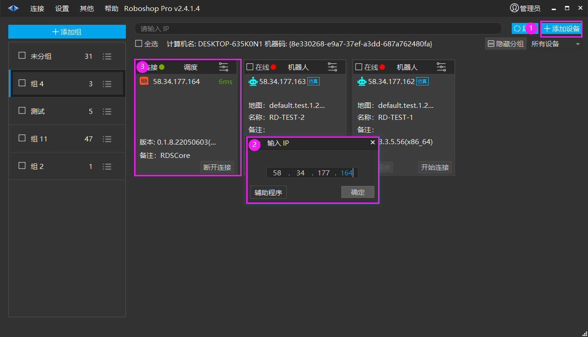

1. 点击 【 **添加设备 ** 】按钮

2. 输入调度服务器 IP 后 【确定】添加 (需要确保服务器与当前软件运行笔记本在同一局域网内)

3. 等待添加成功后，鼠标双击进入  **编辑调度场景**

# 编辑调度场景

- 预览模式

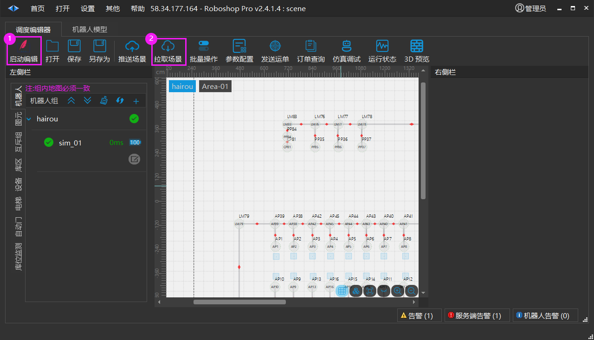

1.  **启用编辑 ** ：点击启动编辑后允许修改场景数据，该按钮会变成 **【退出编辑】**

2. **拉取场景 ** ：下载调度服务器已有的场景数据到本地

- 编辑模式

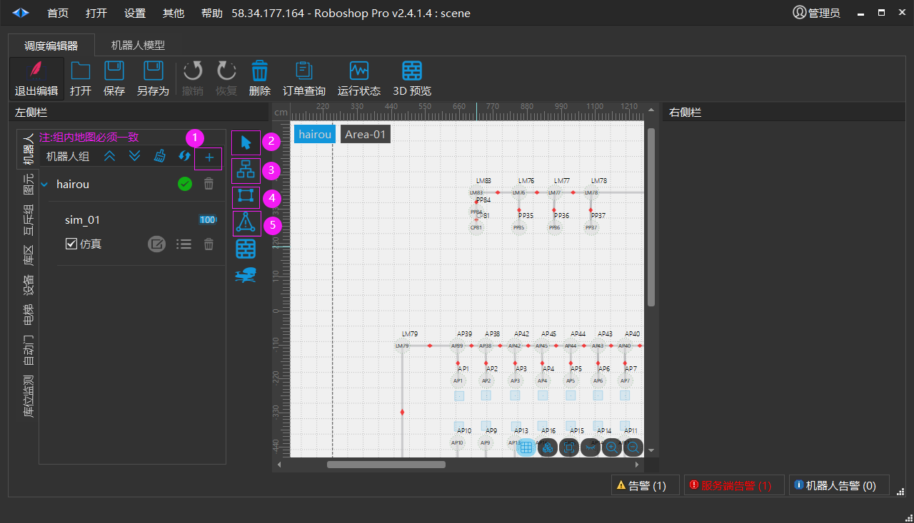

1. **添加机器人** 到场景中

2. **指针 ** ：选中，框选图元

3. **创建区域 ** ：在场景创建一个新区域，一个场景中可以有多个区域，区域中有多个图元(站点，连接线，高级区域等）

4. **高级区域 ** ：
    - AvoidObsRegion (可绕行区域)：机器人在此区域中可绕过障碍物行驶
    
    - MutexRegion (互斥区域)： 该区域中的元素被锁定，仅允许一台机器人占用

5. **动态障碍物 ** ：仅用于调度算法测试

# 添加设备

## 添加机器人

### 添加在线机器人

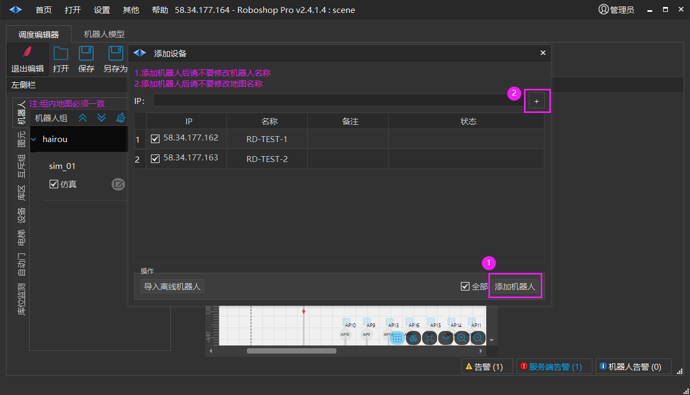

1. **添加机器人 ** ：勾选列表中的机器人添加到场景中

2. **+ ** ：添加指定机器人 IP 到列表中

### 添加离线机器人

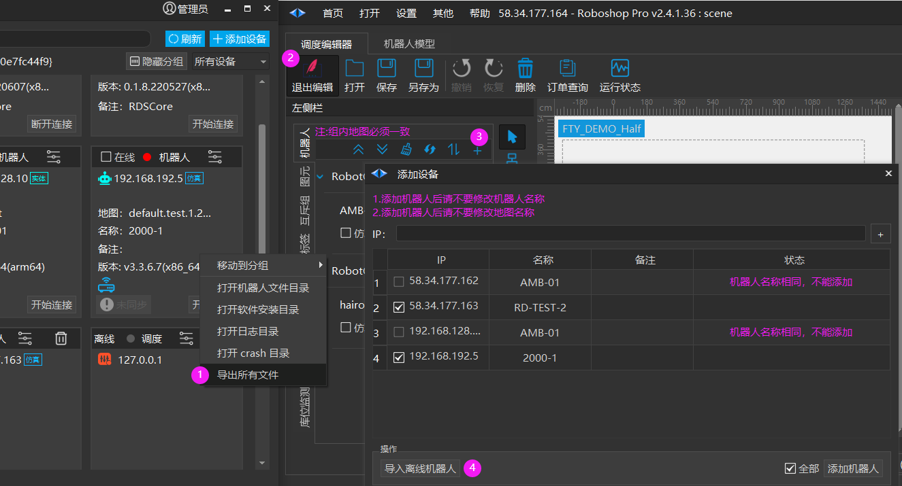

1. **导出所有文件 ** : 导出机器人所有文件

2. **启用编辑 ** : 场景可编辑状态

3. **添加机器人**

4. **导入离线机器人 ** : 导入之前【 **导出所有文件 ** 】的文件

## 添加地图到场景

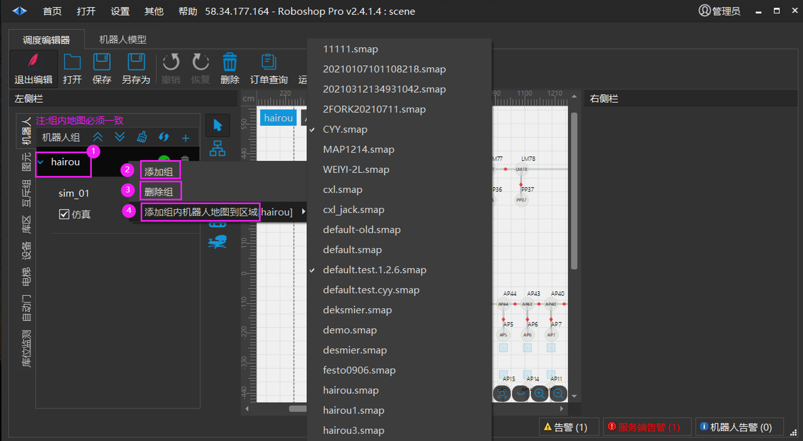

1. 鼠标右击机器人组，出现菜单

2. **添加组 ** ：添加一个新的组，机器人可移动到机器人组中

3. **删除组 ** : 删除整个组及组中机器人的所有数据

4. **添加组内机器人地图到区域 ** ：添加组中的机器人同名的地图到场景中指定区域，[new]为当前的区域 (当地图改变后可以通过再次添加把数据添加到场景)

### 手动更新场景中地图

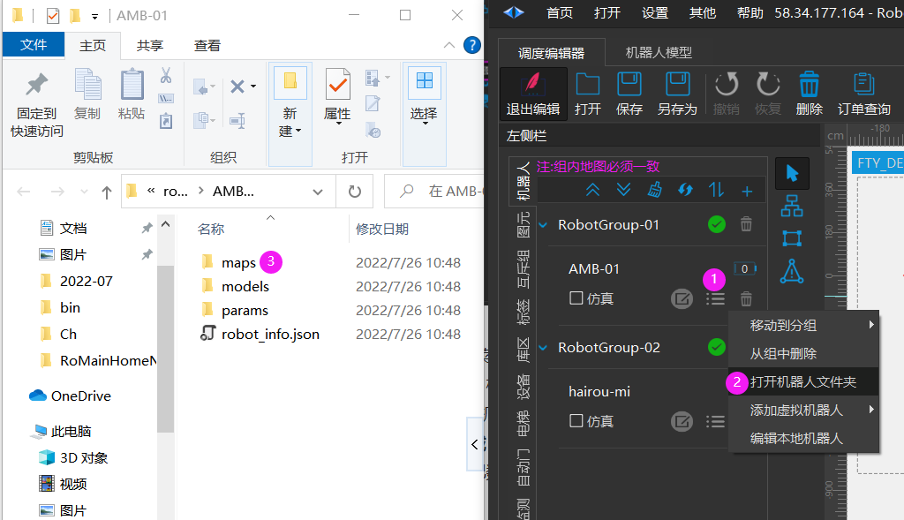

1. 打开菜单

2. 打开机器人文件夹

3. maps 是机器人存放地图的位置

把地图拷贝到 maps 目录内部后【 **添加地图到场景 ** 】

## 添加高级组(互斥组)

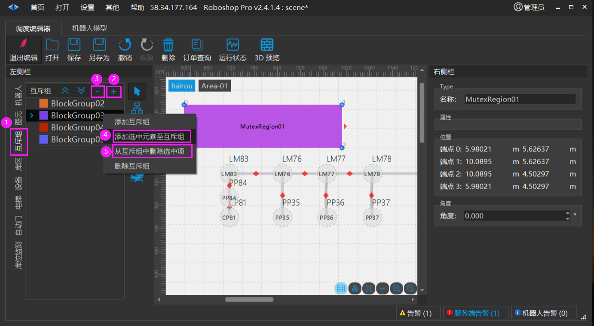

1. 点击【互斥组】标签

2. **+ ** ：添加互斥组

3.  **- ** ：删除选中互斥组

4.  **添加选中元素至互斥组 ** ：先框选场景中图元，再鼠标右击添加到指定的互斥组中

5. **从互斥组中删除选中项 ** ：从互斥组中删除鼠标框选的图元

## 添加标签

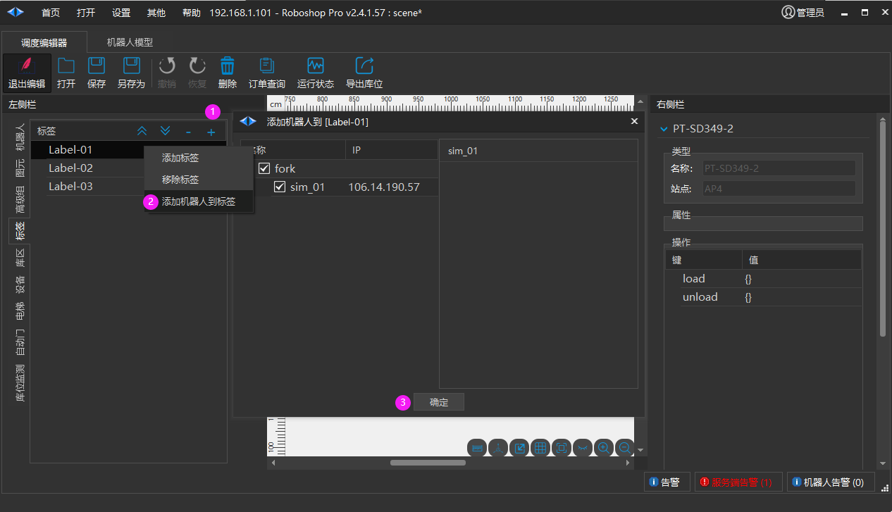

1. 添加一个标签

2. 选中标签，添加机器人到标签

3. 勾选机器人，确定添加到标签

## 添加库区

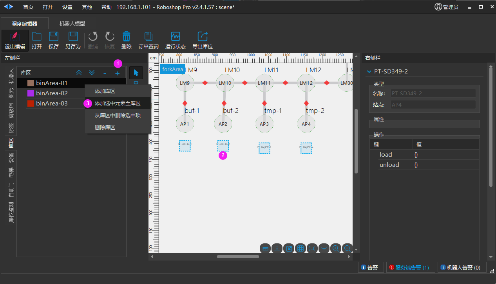

1. 添加一个库区

2. 选中场景中的库位

3. 选中库区，添加选中的库位到库区

## 添加终端设备

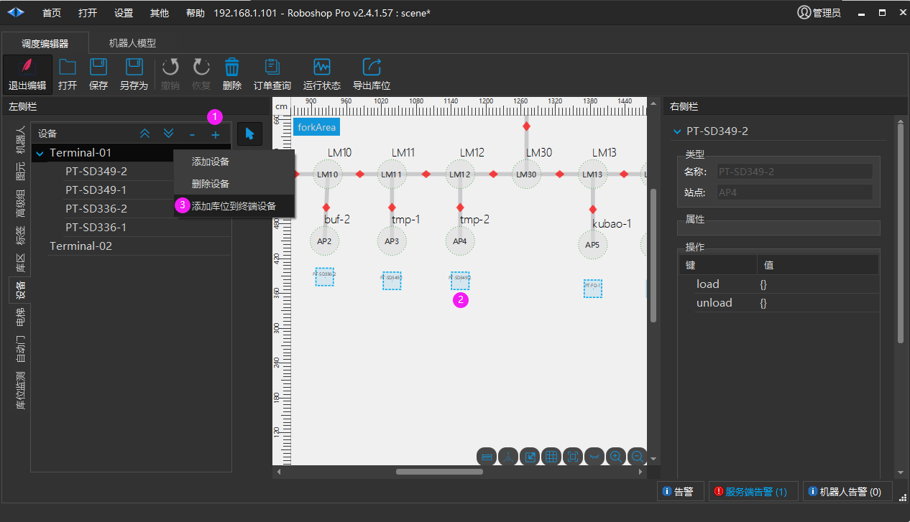

1. 添加一个终端设备

2. 选中场景中的库位

3. 添加库位到终端设备

## 添加电梯

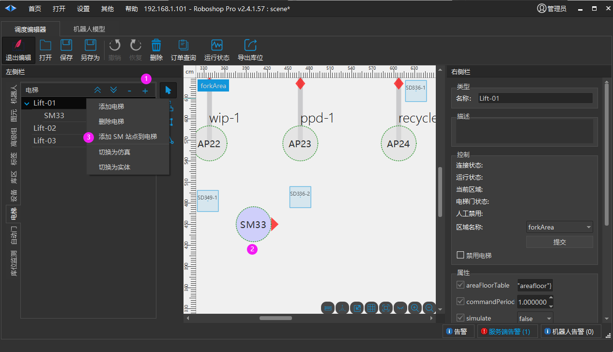

1. 添加一部电梯

2. 选中场景中的 SM 站点

3. 添加 SM 站点到电梯

## 添加自动门

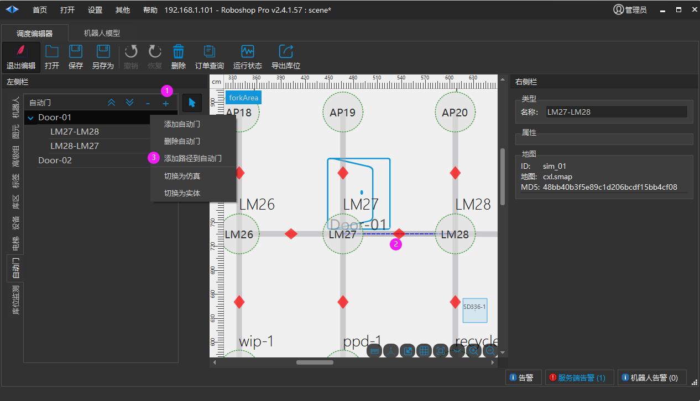

1. 添加一个自动门

2. 选中场景中路径

3. 添加路径到自动门

## 添加区域背景图片

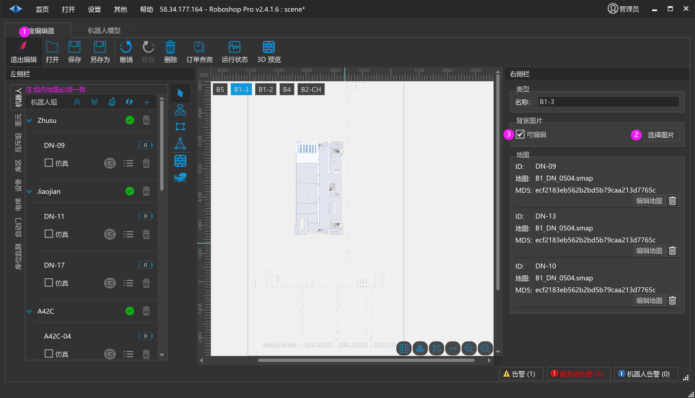

1. 先【启动编辑】选择需要添加背景图的区域

2. 选择图片】因为图片的区域较大添加到场景中默认鼠标是无法选中的，这时需要勾选【可编辑】

3. 【可编辑】勾选后可以选中背景图片，使用鼠标移动，拉伸等操作，透明度对.png图片无效，它本身就是全透明的

[添加地图背景图片](https://seer-group.feishu.cn/wiki/FmPpwtzbkif6aCkF17vc4zRxnqf)

# 场景和异常处理

## 推送场景

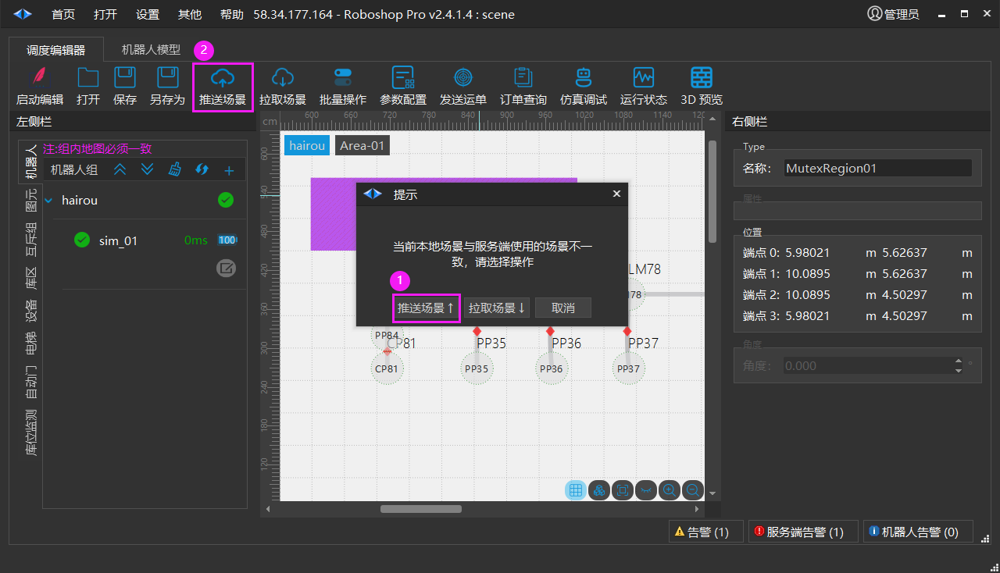

**推送场景 ** ：编辑完成后，把当前编辑的所有场景文件上传到服务器

1. 点击 **【退出编辑】 ** 时，根据提示点击【 **推送场景 ** 】按钮推送场景

2. 自己手动点击菜单中的【 **推送场景 ** 】按钮推送场景

## 异常处理

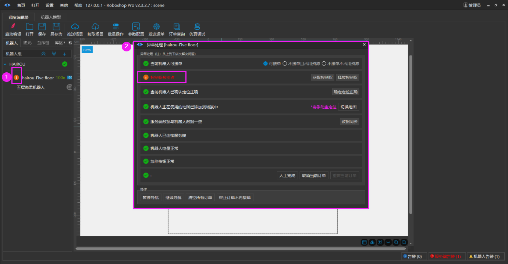

1. 机器人状态显示，当出现非绿色图标表示该机器人无法被正常调度

2. 点击状态图标会列出该机器人异常详情及解决方法

# 机器人操作

## 机器人组和机器人排序

> 💡 
> Roboshop 2.4.1.25+

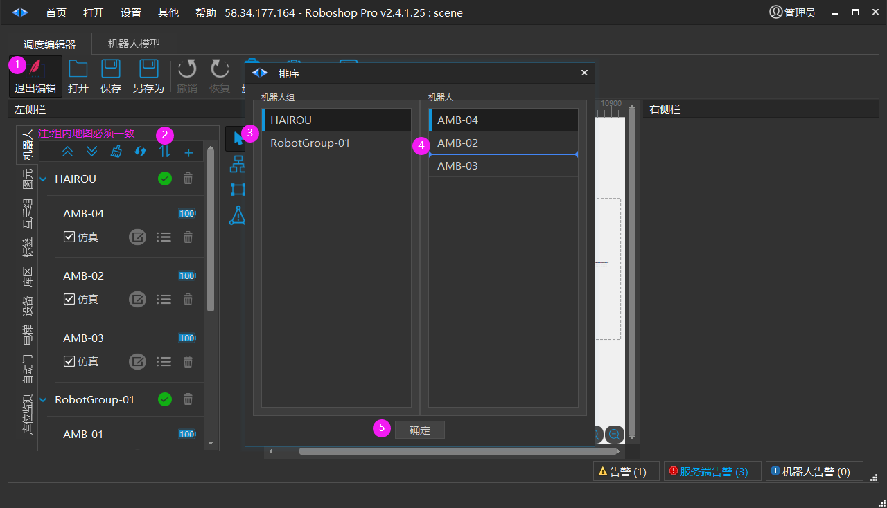

1. 启用编辑

2. 排序

3. 鼠标选中拖拽可对机器人组进行排序

4. 鼠标选中拖拽可对机器人进行排序

5. 【确定】确认排序生效

## 机器人组内数据同步

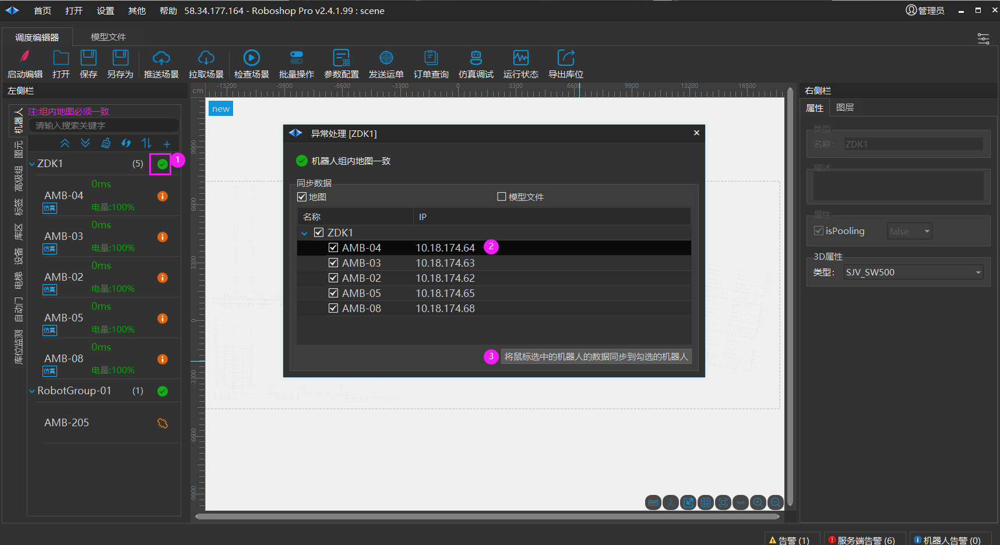

1. 鼠标点击按钮弹出对话框

2. 选中您想拷贝数据的机器人

3. 将鼠标选中的机器人数据拷贝并替换到其他勾选的机器人中

## 机器人重命名

> 💡 
> Roboshop 2.4.1.25+

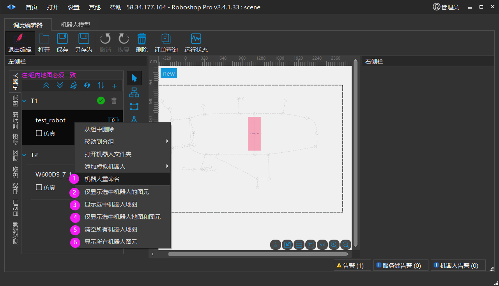

1. 机器人重命名：仅修改场景文件中的机器人名称， 控制器中的机器人名称需要单独设置，首页->机器人->参数配置(勾选显示更多->网络->RobotName)

2. 仅显示选中机器人的图元: 仅显示当前机器人加载到场景中地图的站点、路径、库位

3. 显示选中机器人地图：显示当前机器人加载到场景中地图的普通点

4. 仅显示选中机器人地图和图元：仅显示当前机器人加载到场景中地图的站点、路径、库位、普通点

5. 清空所有机器人地图：删除之前显示的所有机器人地图的普通点

6. 显示所有机器人图元: 显示所有被隐藏的图元

## 编辑机器人 IP

> 💡 
> Roboshop 2.4.1.99+

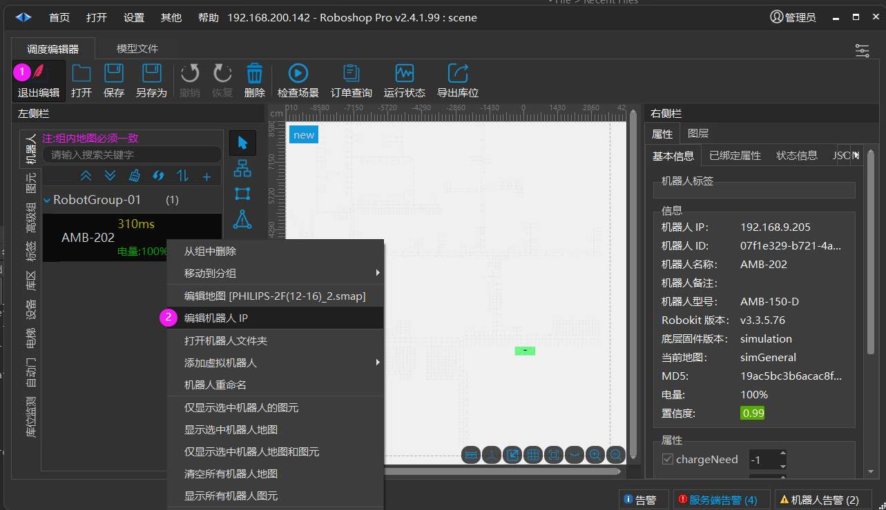

1. 启用编辑

2. 编辑机器人 IP

## 手动替换场景中的地图文件和模型文件

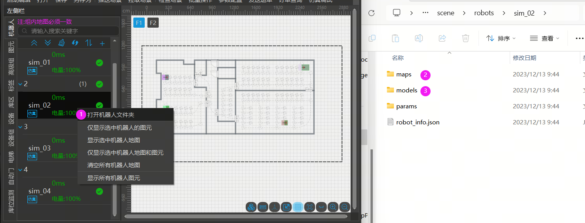

1. 打开机器人文件夹

2. 地图文件夹，把地图黏贴进去

3. 模型文件夹，把 robot.model 黏贴进去

4. 推送场景

## 导出库位信息

> 💡 
> Roboshop 2.4.1.26+

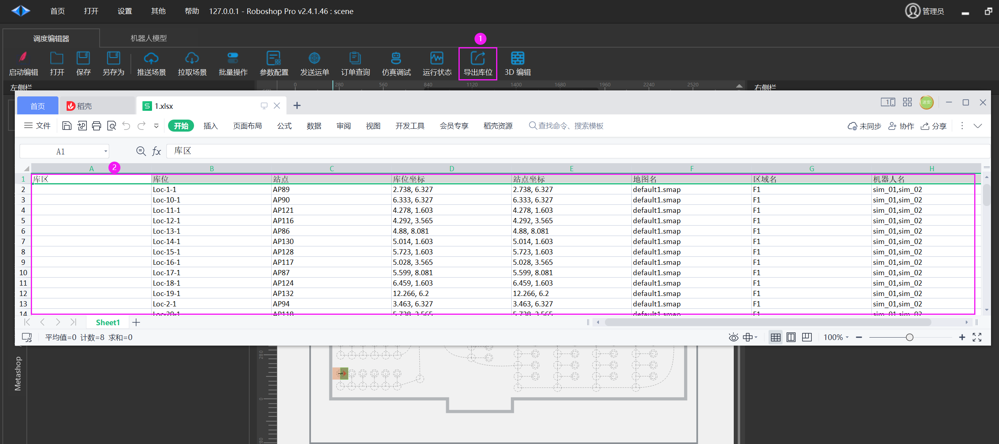

1. 【导出库位】：导出场景中所有库位信息，保存到表格。

2. 表格内信息为：库区、库位名、站点名、库位坐标、站点坐标、所在地图名、所在区域名、机器人名

## 显示地图普通点

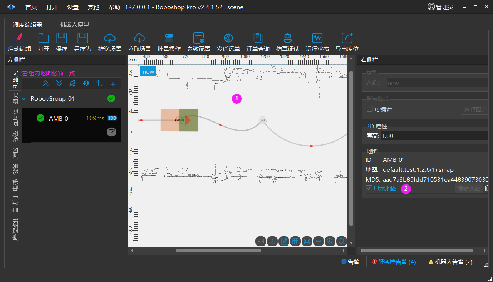

1. 鼠标点击空白

2. 勾选显示地图

## 机器人重定位

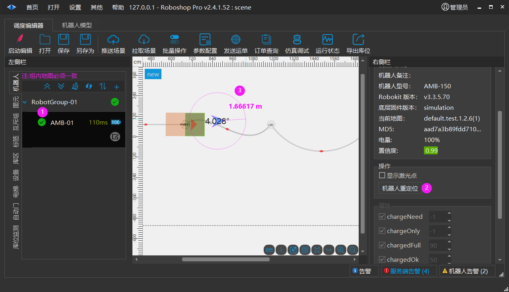

1. 解决机器人异常并选中机器人

2. 点击机器人重定位按钮

3. 鼠标移动到机器人需要重定位的位置，可以勾选显示激光点和 [显示地图普通点 ](https://ocn3rbr2m923.feishu.cn/docx/Ap8mdY5exo32VRx3NwkcQtG6nMc)方便查看机器人精确位置

## 选择机器人到达站点

> 💡 
> Roboshop 2.4.1.168+

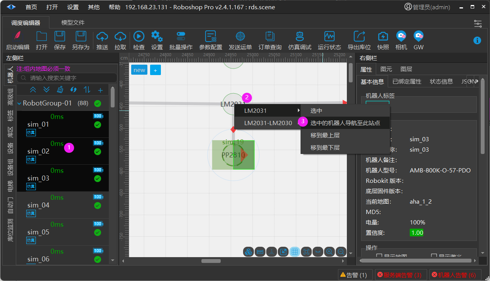

1. 鼠标选择机器人(支持多选)

2. 选择机器人要去的站点

3. 发送机器人到达该站点的指令

## 发送运单

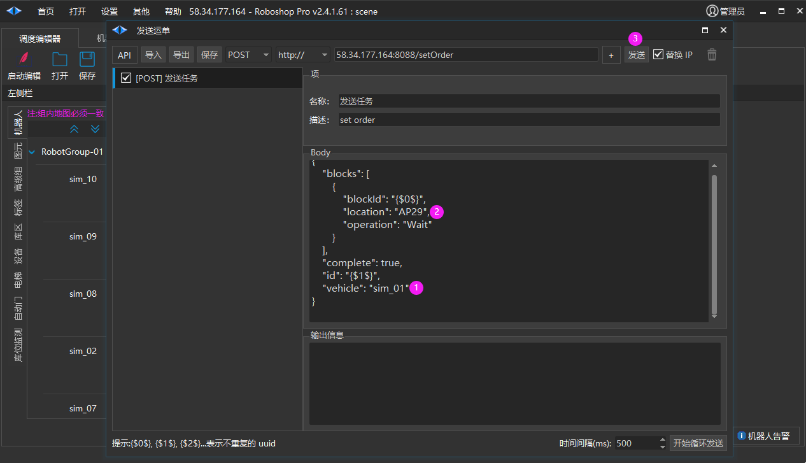

1. 机器人 sim_01

2. 目标点 AP29

3. 发送：控制机器人移动到目标点

## 站点批量绑定机器人

> 💡 
> Roboshop 2.4.1.104+

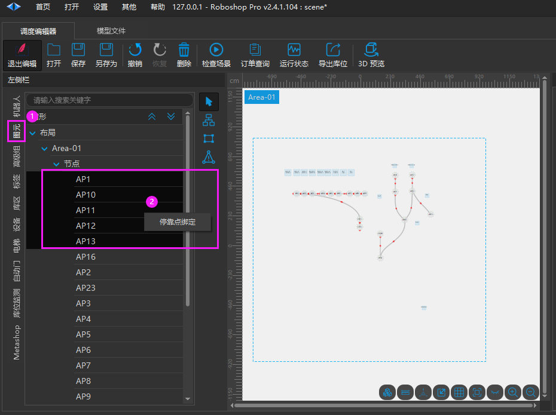

1. 进入【编辑模式】，左编辑框选择【图元】列表

2. 选中多个站点，右键弹出菜单【停靠点绑定】，点击弹出窗口

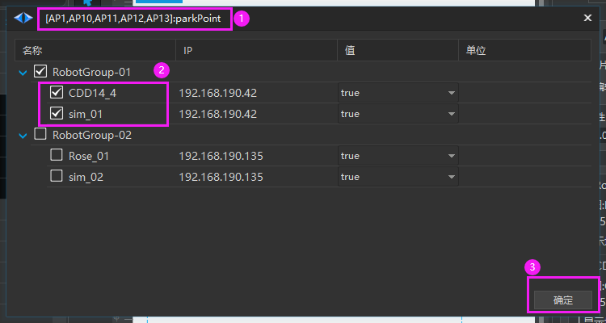

1. 标题为所选站点名称列表，修改的属性为parkPoint

2. 选择需要绑定的机器人

3. 点击确定完成设置

## 编辑地图

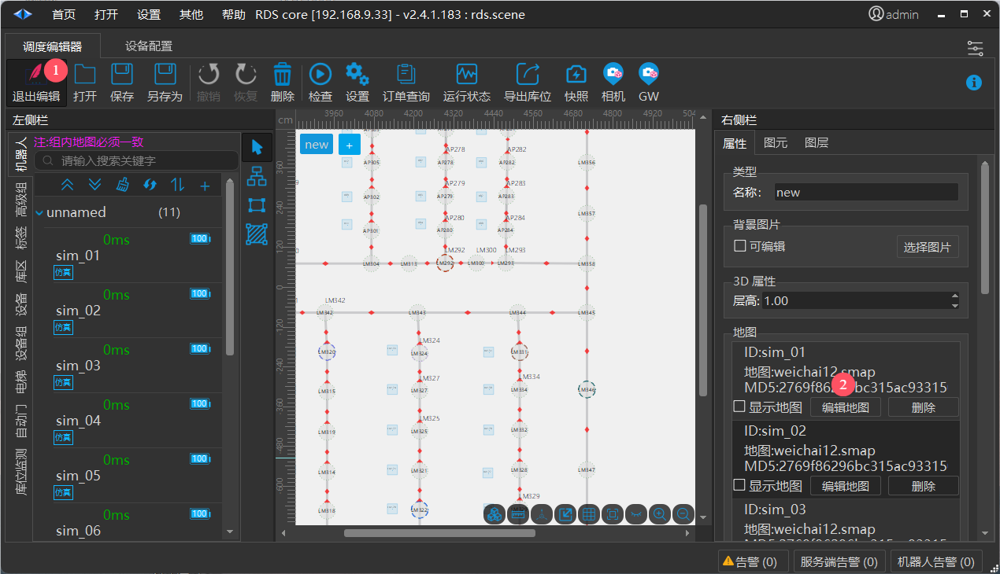

1. 【启用编辑】

2. 鼠标选中场景，【编辑地图】