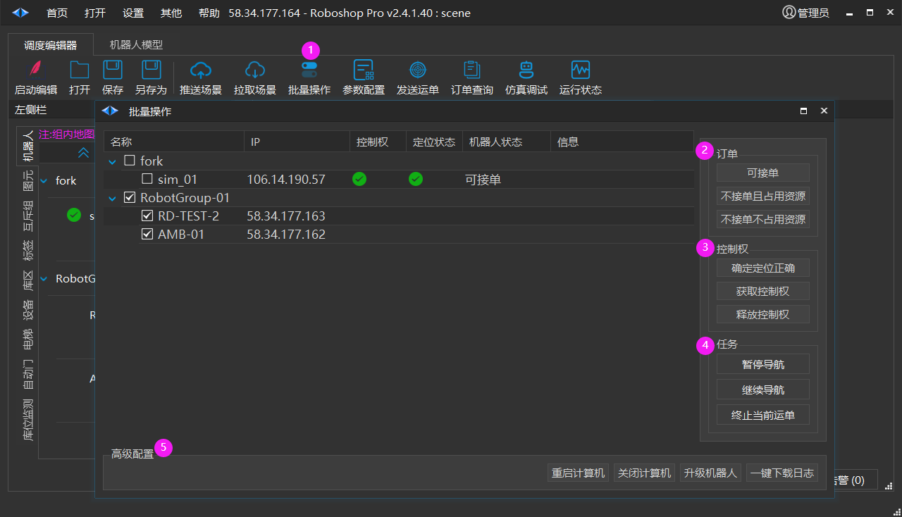

# 批量操作
| Roboshop | Robod |
| --- | --- |
| 2.4.1.40+ | 3.5.10+ |

> 💡 
> 注: Robokit 3.3.5.58 **以下** 版本安装 Robod 3.5.10+ 需要【**禁用 AP 漫游** 】

1. 批量操作: 鼠标点击会弹出批量操作对话框

2. 订单
    - 可接单
    
    - 不接单且占用资源
    
    - 不接单不占用资源

3. 控制权
    - 确定定位正确
    
    - 获取控制权
    
    - 释放控制权

4. 任务
    - 暂停导航
    
    - 继续导航
    
    - 终止当前运单

5. 高级配置
    - 重启计算机: 重启勾选的控制器操作系统
    
    - 关闭计算机: 关闭勾选的控制器操作系统
    
    - 升级机器人: 对勾选的控制器中的软件进行升级
    
    - 一键下载日志: 下载勾选的控制器日志