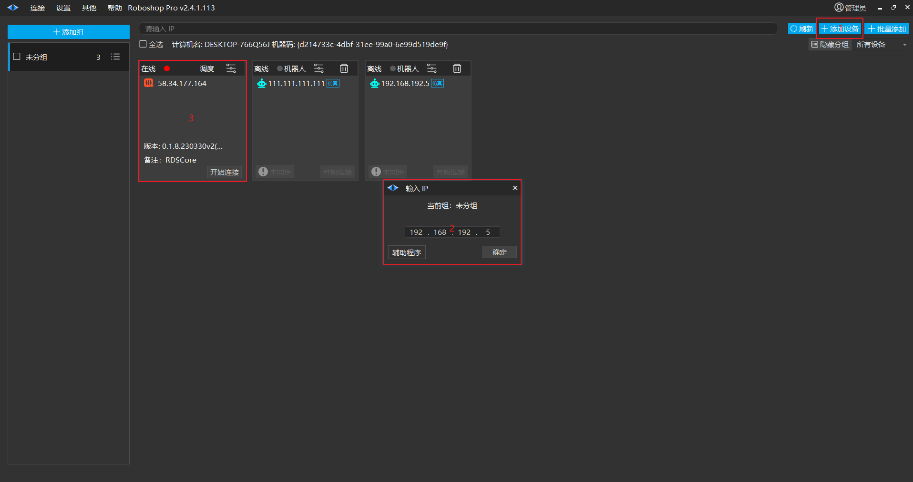
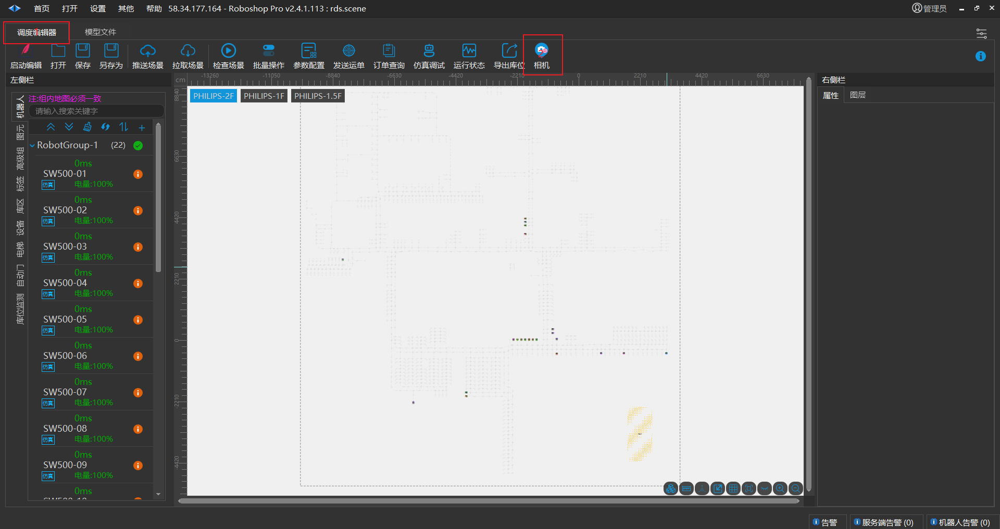
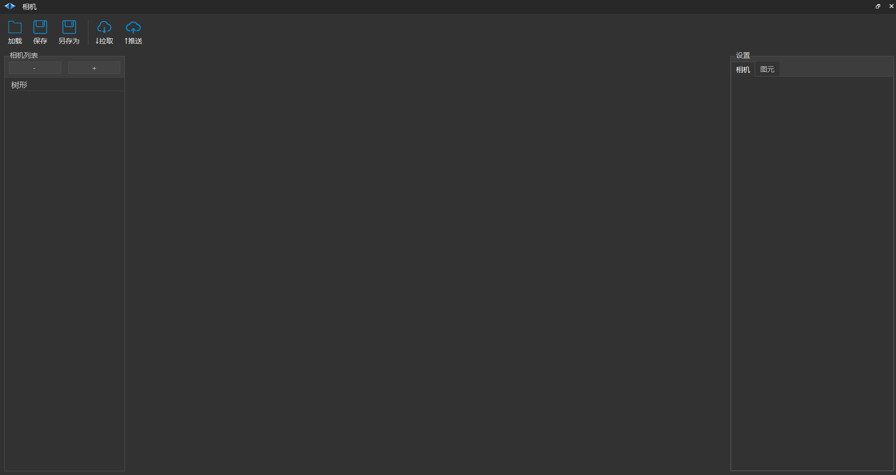
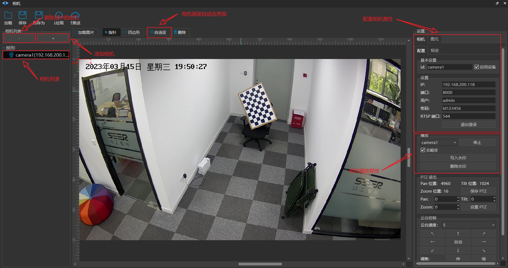
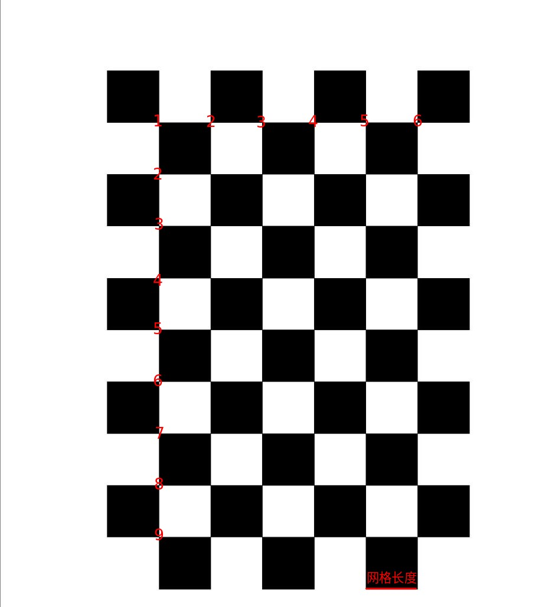
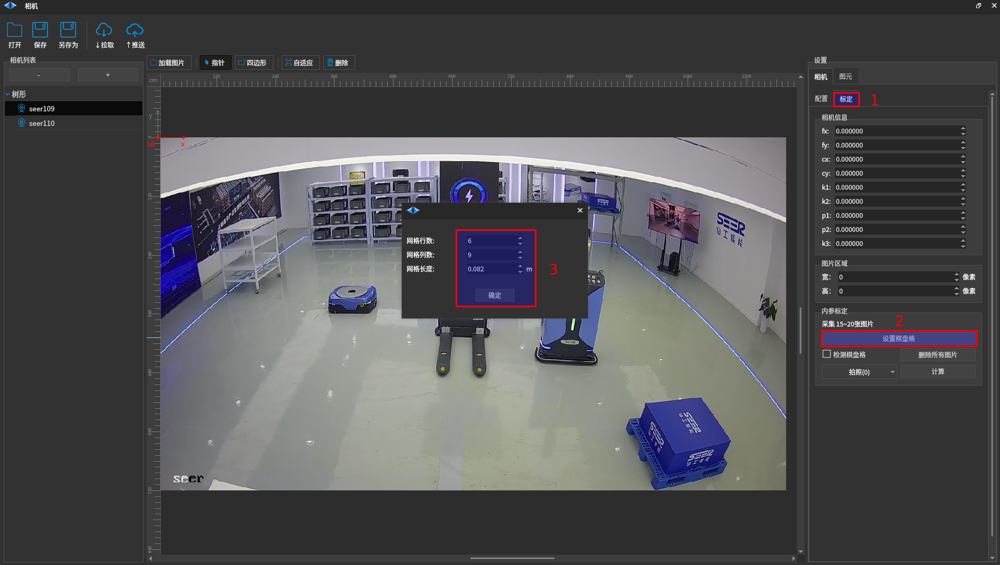
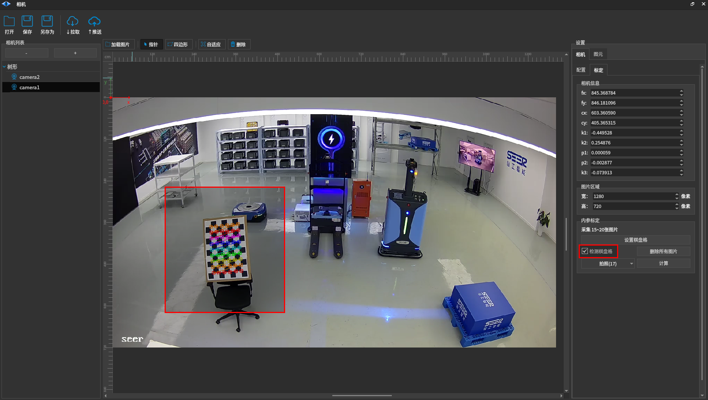
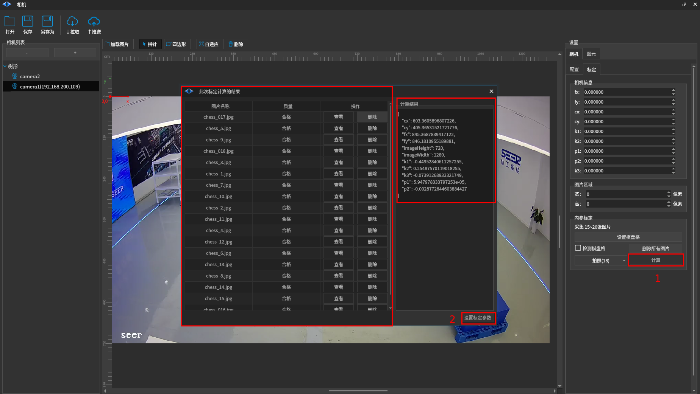
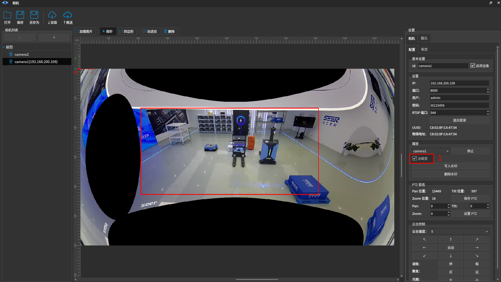

# 机器视觉库位管理功能（原 RoboView）
# 1 进入相机界面

- 打开Roboshop界面，点击 **添加设备 ** ，如图1；

- 在弹出来的界面 **输入调度的IP ** ，目前仅支持调度；

- 点击调度 **开始连接 ** ，进入 **调度编辑器 ** ；

- 点击界面上方的 **相机 ** 进入相机界面，如图2、图3；

图 1

图2

图 3

# 2 编辑相机

## 2.1 添加删除相机与设置相机属性

- 点击 **相机列表 ** 下方的 **+ ** 来添加相机，会自动在 **树形 ** 下添加一个相机；

- 鼠标左键选中要编辑的相机会在界面右端出现该相机的属性配置界面；

- 依次输入 **相机IP，端口（8000），用户名，密码，RTSP端口（544） ** ，然后点击 **登录 ** 按钮；

- 在 **播放界面 ** 点击 **播放 ** 来播放视频；

- 点击界面上方的 **自适应 ** 使得相机画面自适应界面大小，如图4；

- 重复上面操作添加更多相机；

- **id ** 可以更改为任何想要的名称，点击 **写入水印 ** 即可将id更改的字符写入画面， **删除水印 ** 即可去除画面中的水印

- 选中 **树形 ** 下面的相机，点击 **相机列表 ** 下的 **- ** 来删除相机；

图 4

# 3 相机标定

- 进入相机 **标定 ** 界面；

- 点击设置棋盘格设置棋盘格尺寸；

- 根据真实棋盘格的参数依次填写 **网格行数 ** 、 **网格列数 ** 、 **网格长度 ** ，如图5、图6；

- 勾选 **检测棋盘格 ** 能够预检测画面中有没有可用于标定的图像，若有点击 **拍照 ** ，如图7；

- 移动棋盘格的位置依次拍摄15～20张图片；

- 点击 **计算 ** 会评判每张图片的拍摄质量（对于不合格的图片可进行删除）， **点击设置标定参数 ** ，如图8；

- 在 **相机配置 ** 界面勾选 **去畸变 ** 即可实时显示畸变矫正后的视频，中间红色框为畸变矫正后的区域，如图9；

图 5

图 6

图7

图8

图9

# 3 推送配置信息

- 配置好相关信息后点击 **保存 ** 、 **推送 ** 即可；

- 点击 **拉取 ** 即可拉取本地保存的相机数据；

- 点击 **打开 ** 即可导入在家标定好的相机数据的json文件；