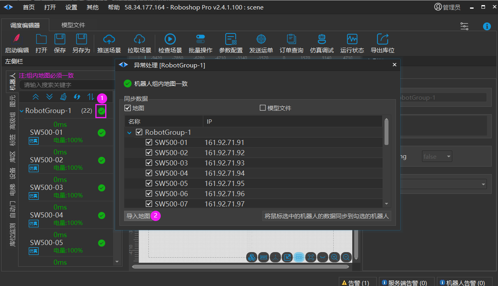
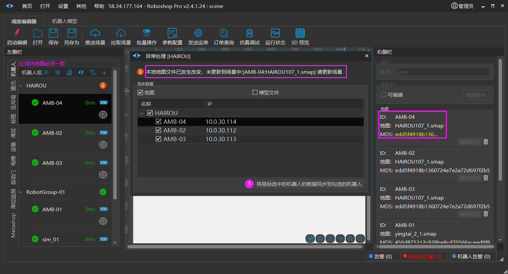
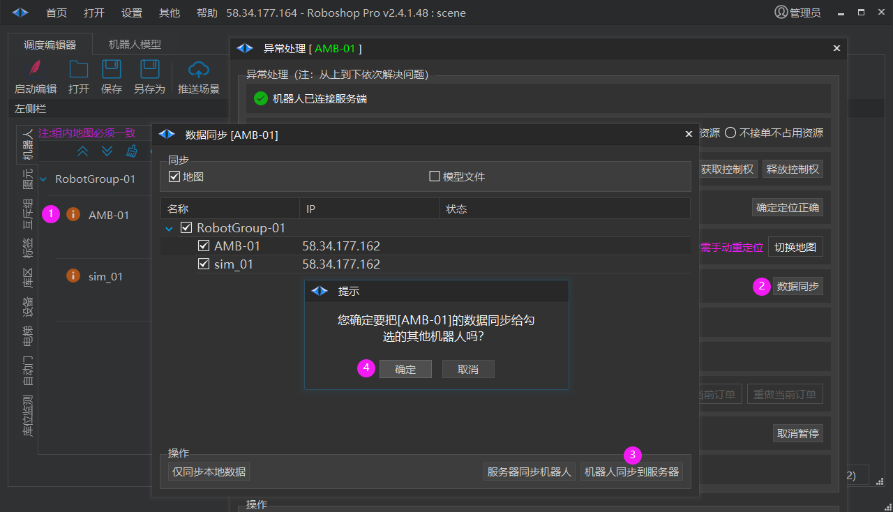
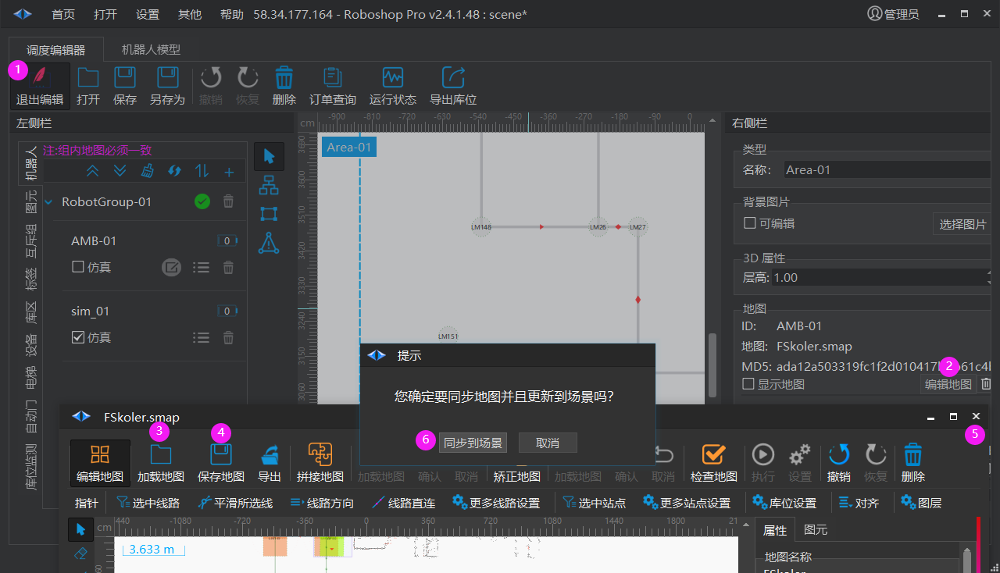
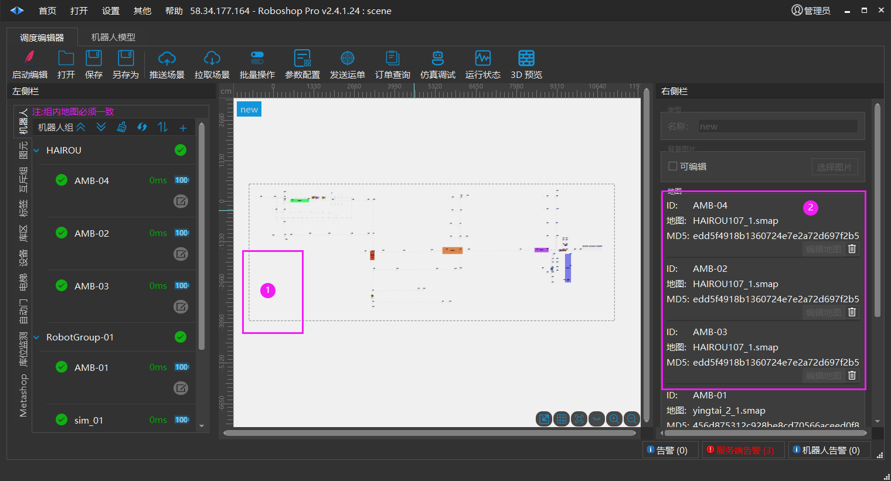

# 解决地图不一致问题
> 💡 
> Roboshop 2.4.1.24+

数据同步的概念：

1. 调度服务器上场景数据 (包含地图)

2. Roboshop 中编辑的场景数据 （包含地图）

3. 机器人中的地图数据

我们实施部署完需要把 a,b,c 的数据同步一致

我们常用的方法是把 c 的数据，通过 b, 传给 a

## 把地图并同步给其他机器人

**【批量操作->获取控制权】需要获取机器人控制权**

### 方法一

把多张地图文件拷贝并同名覆盖到组内所有机器人 ( **需要控制权 ** )

1. 打开机器人组异常处理界面

2. 导入地图: 支持多选，会把选择的地图拷贝到机器人组内其他机器人文件夹中

### 方法二

把场景中其中一台机器人的地图同步给其他机器人 ( **需要控制权 ** )

1. 【将鼠标选中的机器人的数据同步到勾选的机器人】鼠标选中的机器人文件夹中的所有地图拷贝覆盖到其他机器人文件夹，并且更新到场景文件中, 点击后【保存】后黄色图标才会变成绿色 (只有保存时才会重新检查数据差异化)

2. 推送场景

### 方法三

当该机器人控制器内部地图改变后，这里会提示数据不一致，可以把该机器人的地图复制给其他机器人，并且通过调度服务器传输给机器人替换其他机器人内部的地图 ( **需要控制权 ** )

1. 点击弹出异常处理

2. 数据同步

3. 把机器人地图数据同步到调度服务器

4. 确定把当前 【AMB-01】这个机器人地图同步给 sim_01，该操作会把 AMB-01 的地图复制给 sim_01 同名替换, 通过调度服务器传输给 sim_01 机器人

### 方法四

在调度编辑器中修改地图并同步给服务器及机器人 ( **需要控制权 ** )

1. 启用编辑

2. 编辑地图

3. 加载地图或者手动修改地图

4. 保存地图

5. 退出窗口，如果地图被修改，则弹出对话框

6. 同步到场景：把修改后的地图自动拷贝给同组内其他机器人

**保存场景，退出编辑后推送场景可以通过调度服务器同步给机器人**

## 查看区域中所有地图

1. 鼠标点击选中区域

2. 属性窗口会列出所有加入该机器人的地图名称和地图文件的 MD5, 如果有同组的机器人的地图文件MD5不同，则表示该组的地图未同步