# 部署调度服务器
## Windows

Robod-core 4.4.4+ 版本默认管理员权限启动

1. 如果使用 **Mariadb **  **数据库 ** 安装 **Base_RDSInstaller_4.x.x.exe ** ，如果使用 **其他数据库 ** 安装 **robod_RobodInstaller_4.x.x.exe**

2. 选择安装包后，把安装包拷贝到服务器中默认安装 **C:\RDS **  **非必要不要更改目录**

3. 安装完毕后 **鼠标双击桌面 RDS 快捷方式 ** 运行

4. [升级 core 和 rds](https://ocn3rbr2m923.feishu.cn/docx/QxvkdhFAroE0Vdx1DQsc1Yy1noI#doxcn2zBdaKD1xdScpXp6XeSu3e)

### 使用任务计划开机启动RDS

Roboshop ->【高级配置】 ->【设置】 **勾上 ** 【禁止开机自启动】

1.

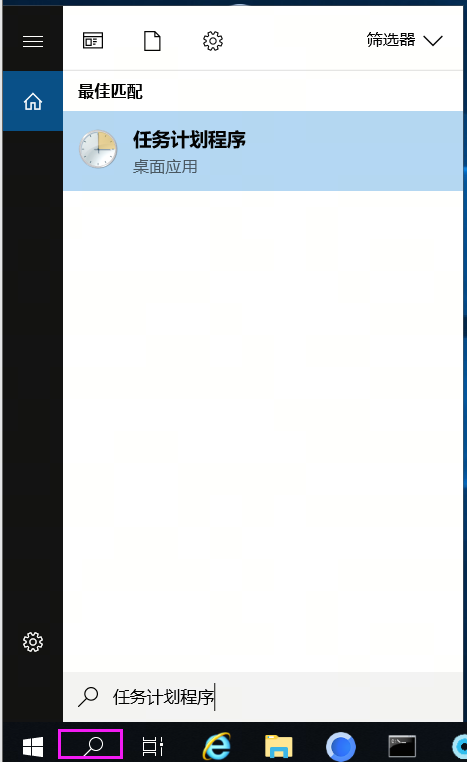

2.

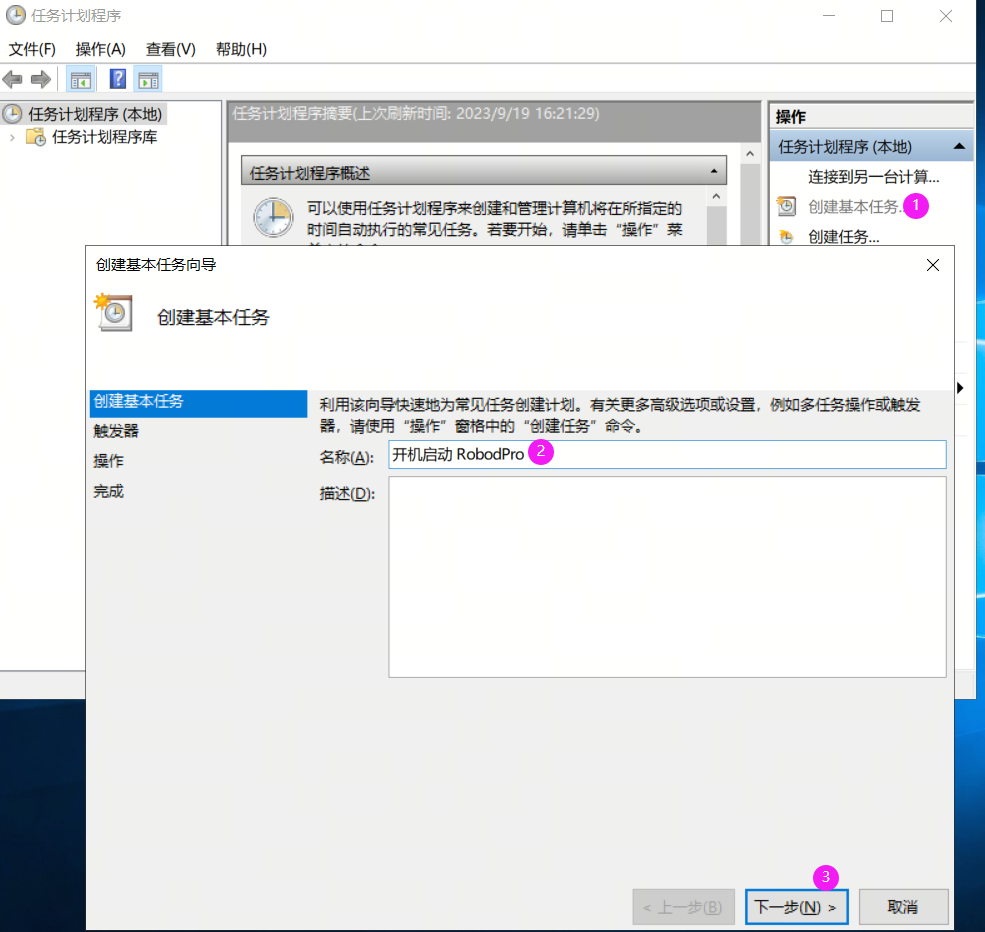

3.

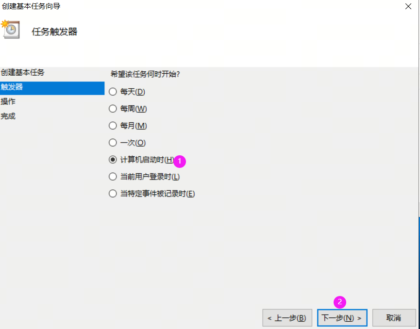

4.

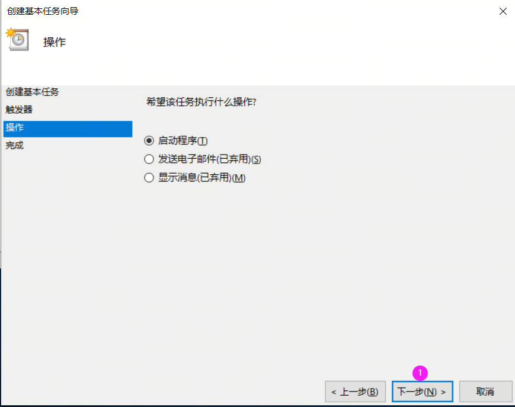

5.

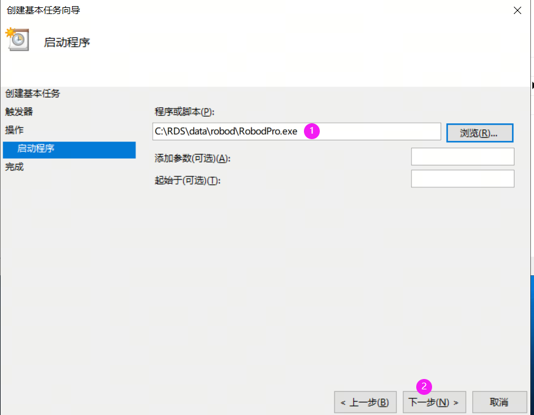

6.

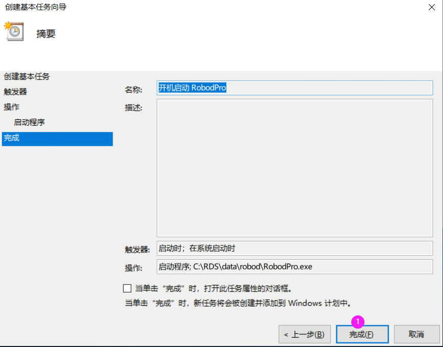

7.

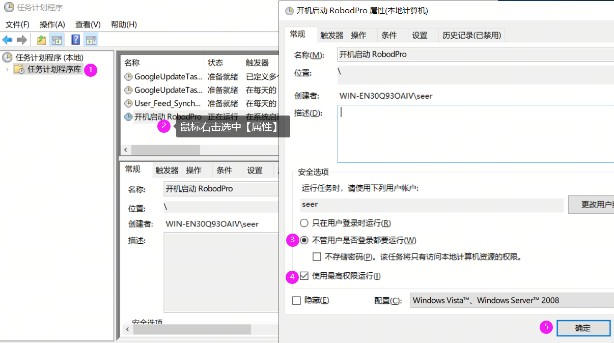

8. 重启后在资源管理中查看 RobodPro 是否启动

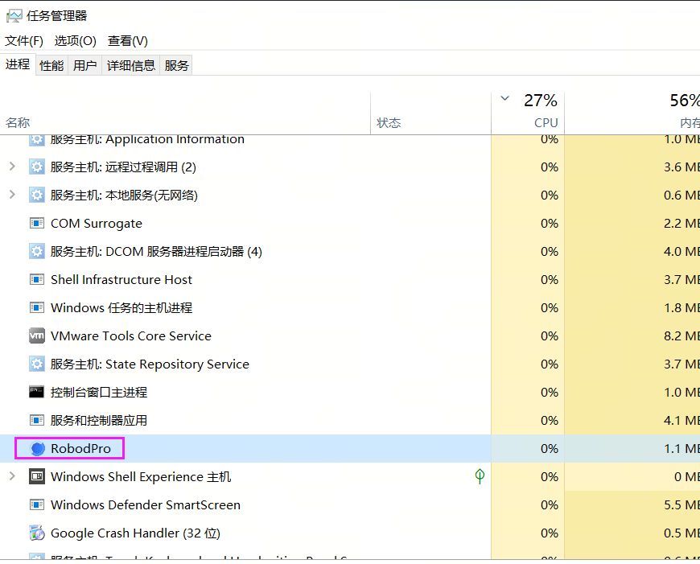

### 使用任务计划登录启动RDS

Roboshop ->【高级配置】 ->【设置】 **勾上 ** 【禁止开机自启动】

使用任务计划开机启动 RDS

第 3 步骤选择【当前用户登录时】

第 7 步骤勾选【只在用户登录时运行】

开机重启后桌面会【显示终端窗口】

### 使用服务启动RDS

> 💡 
> 此下载操作需在我司相关人员协同下进行。

针对部分用户需要注销服务器账号情况，这时需要使用配置服务来启动 RDS

1. 工具下载地址 [https://seer-group.coding.net/api/user/seer-group/project/products/artifacts/repositories/9977006/packages/4337316/versions/13843530/file/download?fileName=WinSystemServer.zip](https://seer-group.coding.net/api/user/seer-group/project/products/artifacts/repositories/9977006/packages/4337316/versions/13843530/file/download?fileName=WinSystemServer.zip)

2. 解压到 RDS/data/WinSystemServer下管理员权限运行 RDS/data/WinSystemServer/autoStart.bat

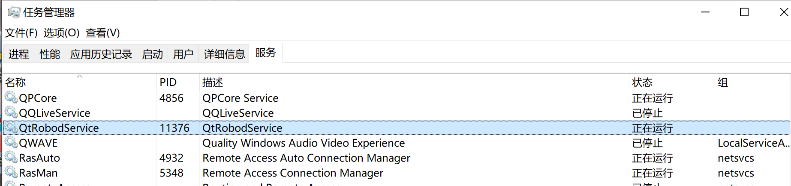

3. 打开服务设置 QtRobodService 属性为自动（任务管理器->服务）- 如果已经为自动则不需要修改

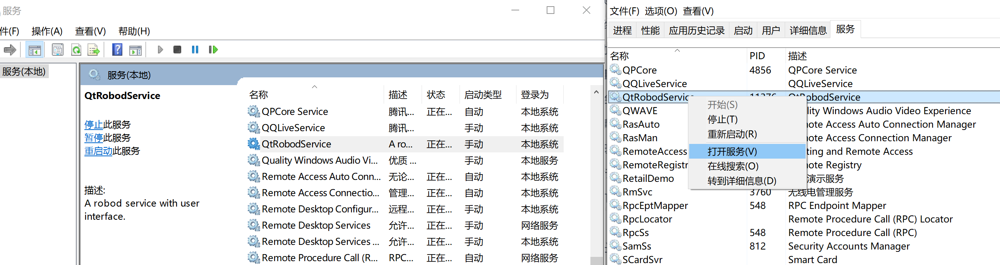

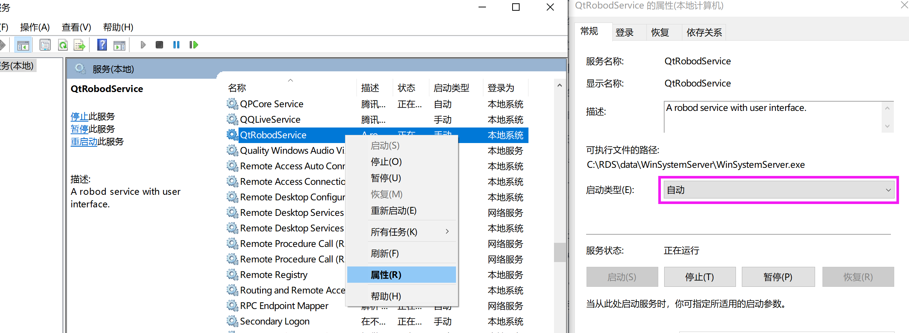

4. 以上步骤做完后重启系统，如果在【任务管理器】未搜索到 RobodPro.exe，请 **手动修改 startUp.bat ** 
把路径改成 RobodPro.exe 所在的 **绝对路径，注意用"/" ** 改完后，再重启系统

> @echo off
> 
> start C:/RDS/data/robod/RobodPro.exe
> 
> exit

5. Roboshop ->【高级配置】 ->【设置】 **勾上 ** 【禁止开机自启动】 (因为 Robod 默认会注册开机自启动，这里的 QtRobodService 也会开机自启动，所以需要关闭)

[LPouwQXrSifh45k6tscc9thknQg]

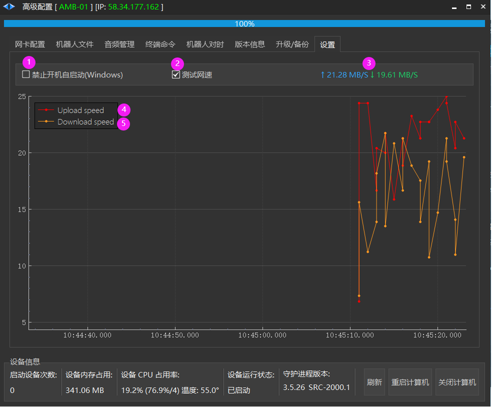

## Ubuntu

1. 下载解压 linux-base-rdscore-robod-4.x.x-x86.zip 内部是个 .deb 文件.

2. 把 linux-base-rdscore-robod-4.x.x-x86.deb 拷贝到服务器.

并执行安装命令 sudo dpkg -i linux-base-rdscore-robod-4.x.x-x86.deb

3. [升级 core 和 rds](https://ocn3rbr2m923.feishu.cn/docx/QxvkdhFAroE0Vdx1DQsc1Yy1noI#doxcn2zBdaKD1xdScpXp6XeSu3e)

## 升级 core 和 rds

点击**添加设备** ，点击**辅助程序** ，升级 core 和 rds 安装包

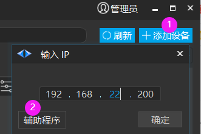

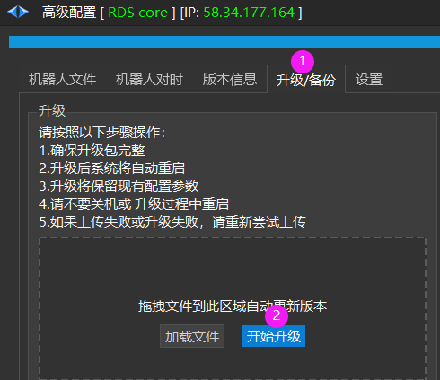