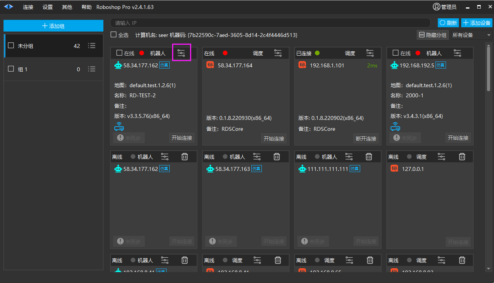
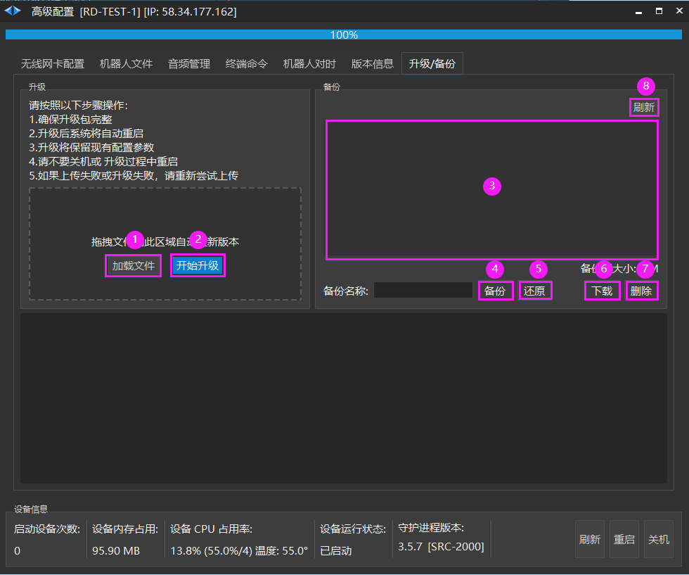
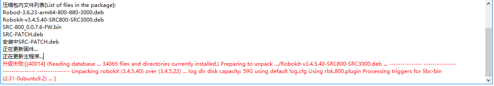

# 升级/备份
## 升级

1. 加载文件: 选择升级包进行升级，可以直接用鼠标拖拽文件到虚线框区域

2. 开始升级: 开始更新版本。

> 💡 
> 注：升级前需要加载升级的包与当前 IP 设备是否匹配

## 备份(暂不推荐使用，会占用内存)

3. 机器人备份文件列表。

4. 输入备份文件名称进行备份。

5. 选择备份文件还原文件。

6. 选择备份文件下载到本地。

7. 选择备份文件进行删除。

8. 刷新机器人备份文件列表。

## SRC-800升级失败处理

1. 导出资源文件 （备份之前的地图、模型文件、脚本等）

2. 远程进控制器删除 /usr/local/SeerRobotics/rbk 文件夹

3. 升级整包