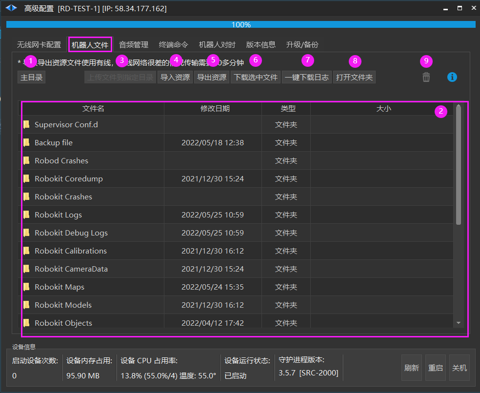
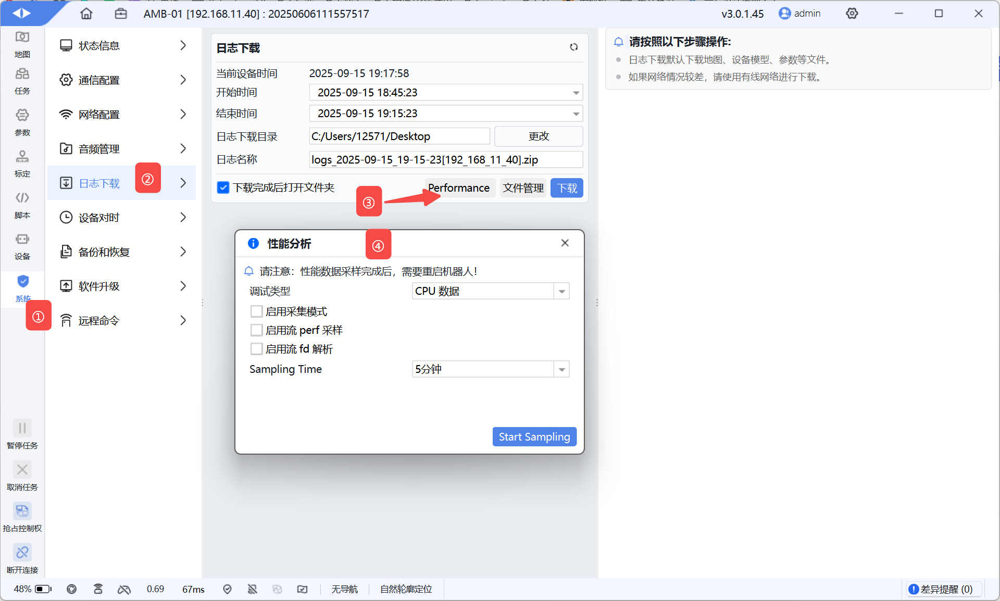
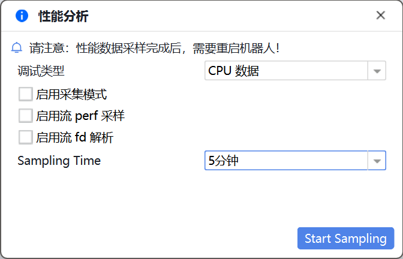
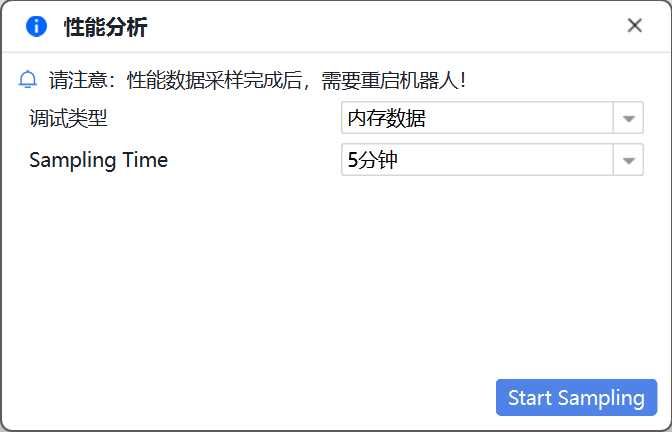
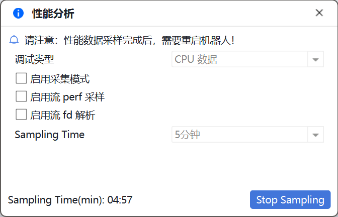
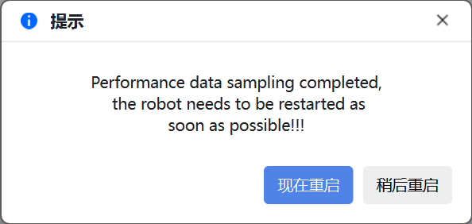
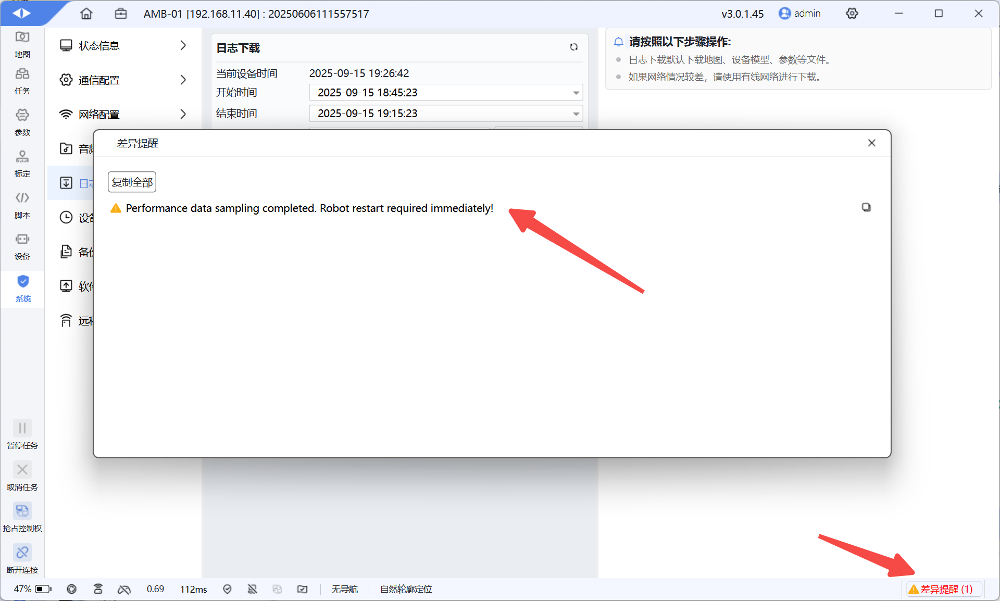
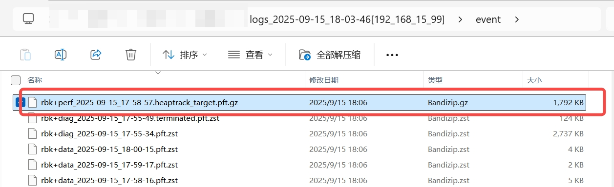

# 机器人文件
## 机器人文件

1. 加载机器人的所有文件夹。

2. 机器人文件夹显示列表。
    - Backup file
        - ActionHistory.txt 升级历史记录
        
        - lservrc_bk 备份协议文件
    
    - Robokit Logs
        - robokit_yyyy-MM-dd_hh_mm_ss.zzz.log 机器人日志文件
    
    - Robokit Maps
        - xxx.smap 机器人中的地图
    
    - Robokit Objects
        - tag、shelf 等识别文件
    
    - Robokit Sounds
        - xxx.wav 机器人内置音频文件
    
    - Robokit Models
        - robot.model 机器人当前使用的模型文件
        
        - robot.cp 机器人当前的标定文件
        
        - bak
            - yyyyMMddhhmmss.robot.model 备份的机器人模型文件
    
    - System log
        - syslog 系统日志
        
        - kern.log kern 日志

3. 打开指定的机器人文件夹，【上传到指定目录】按钮则可使用。选择本地文件上传到该文件夹。

4. 选择本地文件并确认资源文件类型，导入机器人。

5. 导出机器人资源文件。

6. 选择单个或多个机器人文件下载至本地文件夹。

7. 选择目标时间段的日志下载至本地。

8. 打开本地文件夹。

9. 删除选择的单个或多个机器人文件。

#### 性能调试

1. 进入【高级配置-机器人文件】；

2. 点击【性能调试】；

3. 弹窗中根据需要选择调试类型：
    1. CPU数据
        1. 弹窗中根据需要选择调试参数；
        
        2. 弹窗中设置记录时间；
        
        
    
    3. 内存数据（heaptrack）
        1. 弹窗中设置记录时间。
        
        

2. 弹窗中点击【开始采样】按钮开始进行数据采样，过程中弹窗会显示剩余时间；

3. 结束记录：
    1. 倒计时完成自动结束；
    
    2. 点击【停止采样】按钮提前结束；

3. 重启，记录完成后必须进行重启，但允许用户做一些必要的操作后再选择重启：
    
    
    4. 【立即重启】：弹窗中点击此按钮，将结束当前任务并立即重启；
    
    5. 【稍后重启】：弹窗中点击此按钮，将关闭弹窗，并在右下角提醒需要尽快重启。
    
    

6. 重启完成后重新连接机器人；

7. 按照已有功能下载日志。

补充：

日志下载后，内存性能调试数据存放位置如下：

