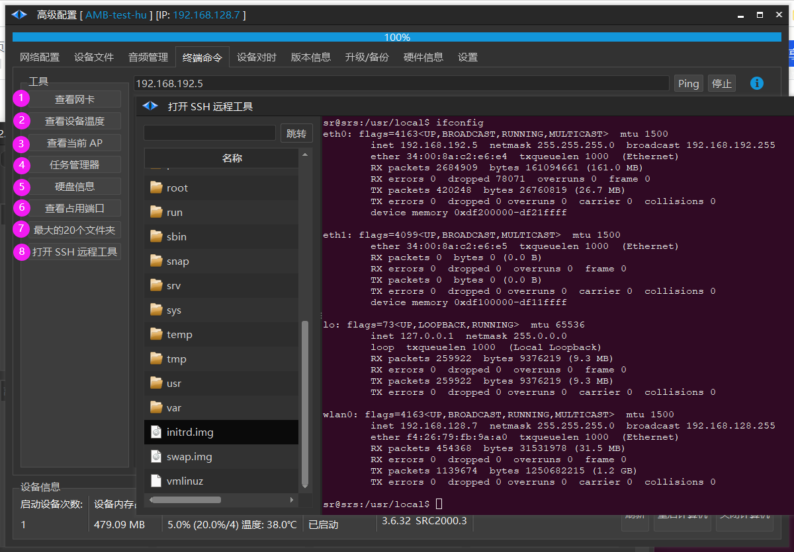
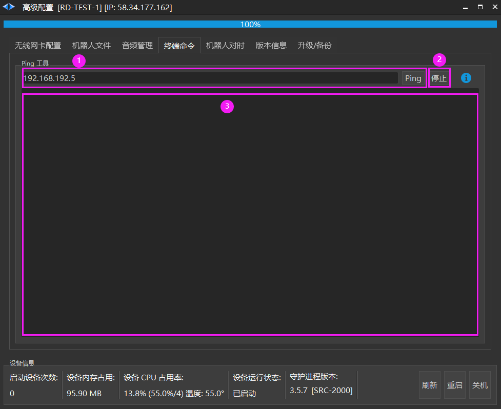
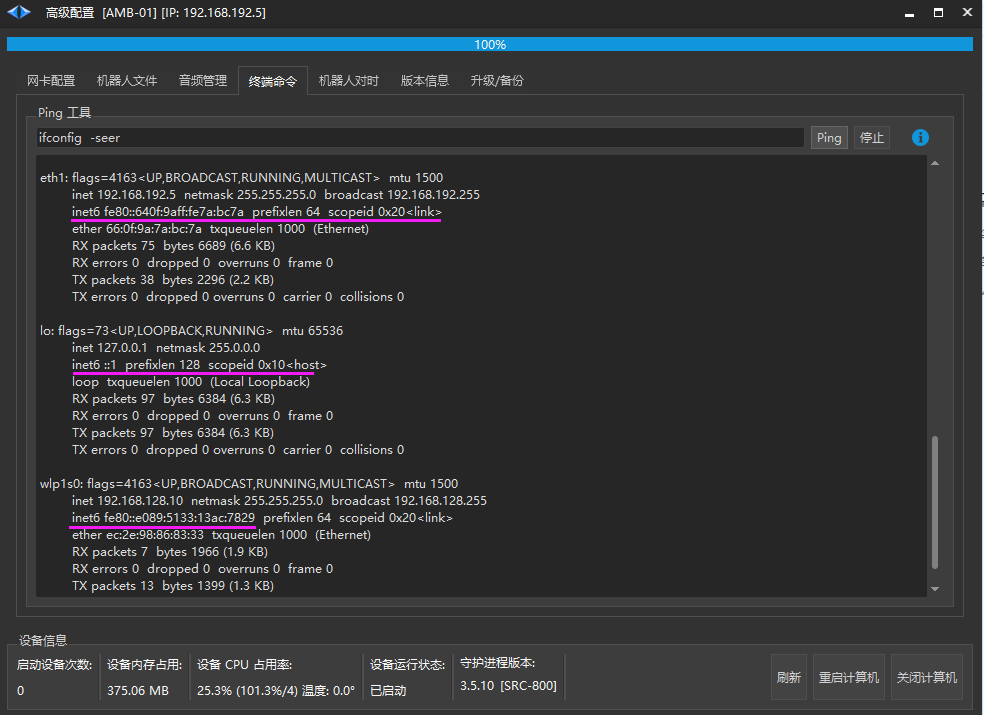
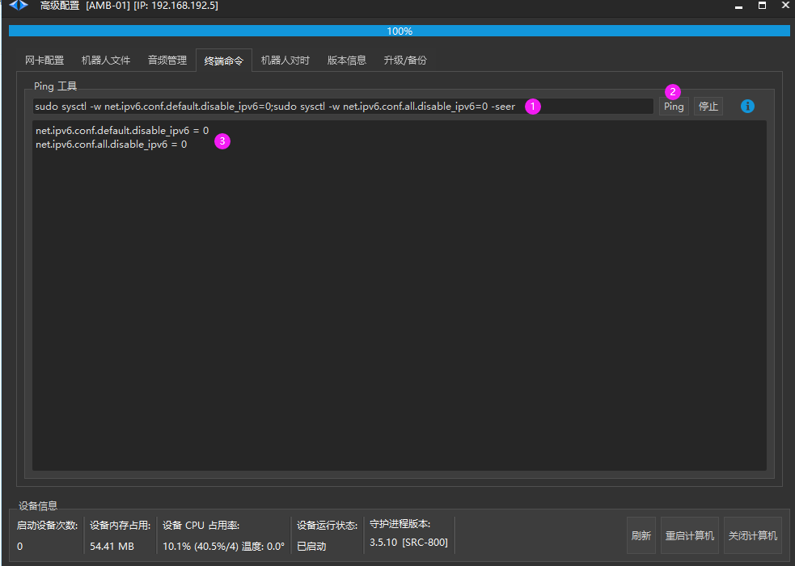
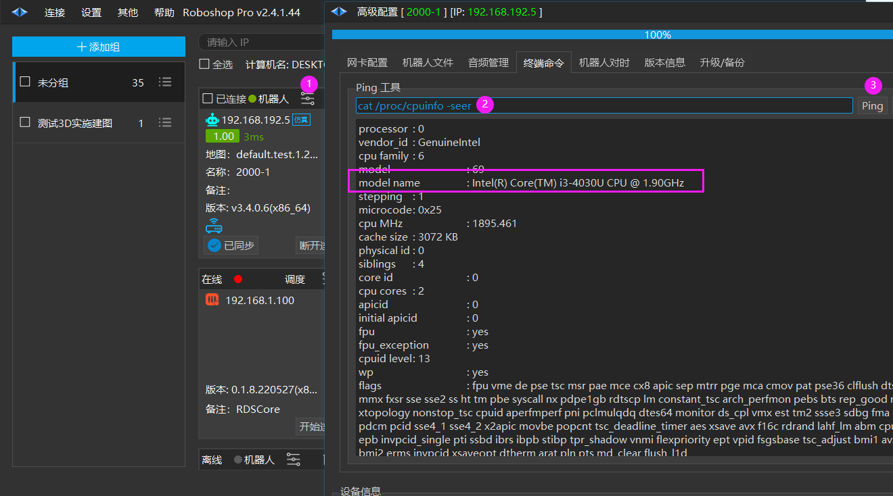

# 终端命令
> 💡 
> Roboshop 2.4.1.170+ 和 Robod 3.6.32



1. 查看网卡

2. 查看设备温度

3. 查看当前 AP :

```json
//已连上 MAC 地址为 26:5a:4c:34:0a:27 的 AP 设备， 使用的无线网卡为 wlan0
Connected to 26:5a:4c:34:0a:27 (on wlan0)
        SSID: SEER-CONTROLLER //当前连接的 ssid
        freq: 5220      //5G (小于5000的为 2.4G)
        RX: 47958957 bytes (447695 packets) //RX：接收字节数 (已接收的包数量)
        TX: 1250742937 bytes (1140356 packets) //TX：发送的字节数 (已发送的包数量)
        signal: -49 dBm   //当前信号强度
        tx bitrate: 200.0 MBit/s VHT-MCS 9 40MHz short GI VHT-NSS 1 //发送速率

        bss flags:        short-slot-time
        dtim period:        3
        beacon int:        100
```

4. 任务管理器

5. 硬盘信息

6. 查看占用端口

7. 最大 20 个文件夹

8. 打开 ssh 远程工具



1. 填写机器人IP后点击【ping】按钮进行数据包交换。

2. 停止 ping。

3. 响应消息列表。

### 查看 IPv6 是否启用



如果有 inet6 表示 IPv6 已启用

### 使用命令行启用/禁用 IPv6 (重启后无效)



1. 输入命令
    - **启用 IPv6** 
        ** ** `sudo sysctl -w net.ipv6.conf.default.disable_ipv6=0;sudo sysctl -w net.ipv6.conf.all.disable_ipv6=0 -seer`
    
    - **禁用 IPv6**
    
    `sudo sysctl -w net.ipv6.conf.default.disable_ipv6=1;sudo sysctl -w net.ipv6.conf.all.disable_ipv6=1 -seer`

2. 点击 Ping 按钮执行

3. 返回 0 表示已启用， 返回 1 表示已禁用

### 查看网卡命令

`ifconfig -seer`

### 查看 CPU 型号



1. 打开高级配置

2. 输入 `cat /proc/cpuinfo -seer`

3. 点击 【Ping】或者按下回车键

框的部分就是 CPU 型号