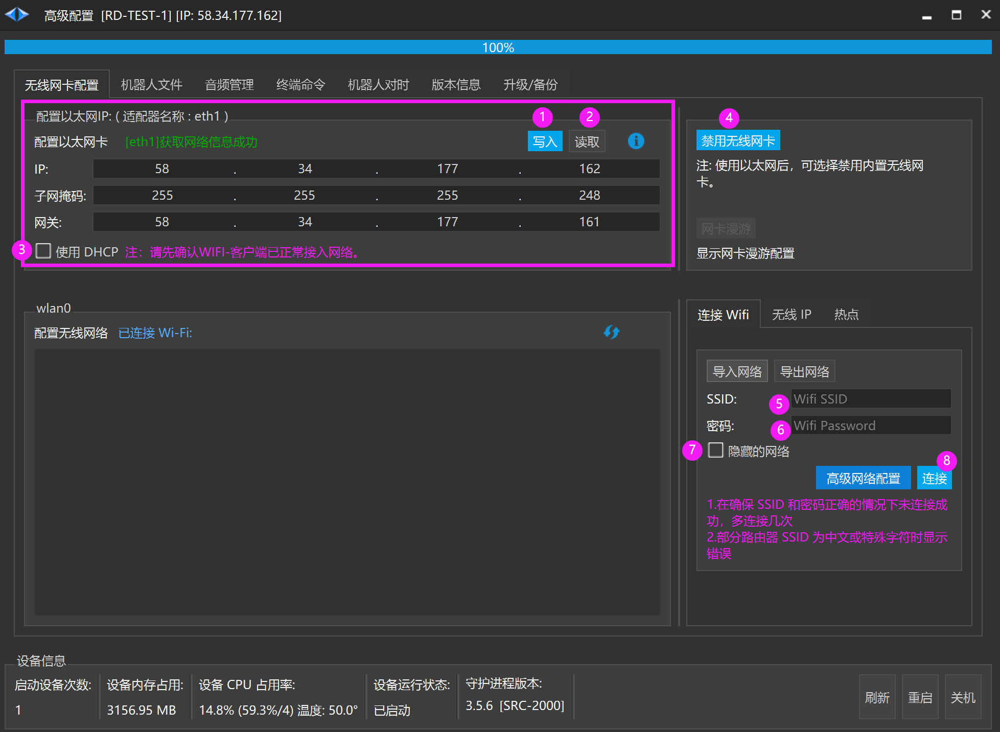
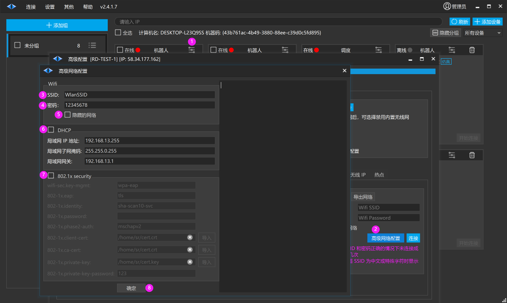
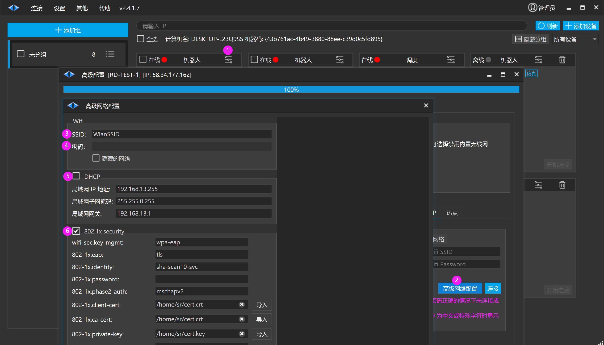
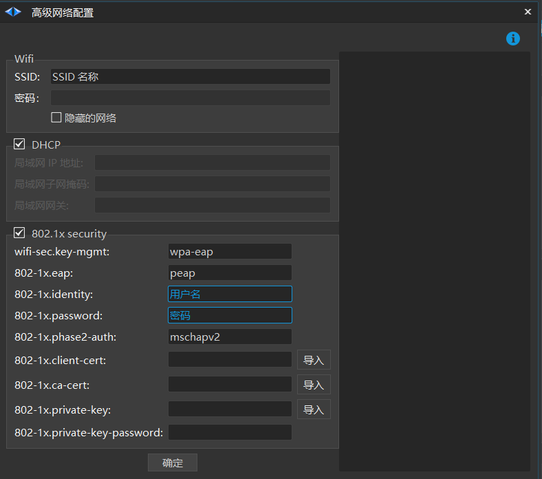

# 网卡配置

## 配置以太网固定 IP

1. 【写入】eth1 网卡固定 IP， 当该网口接入外部网络设备时设置生效

2. 【读取】eth1 网卡当前的 IP

3. 【使用 DHCP 】是否使用 DHCP 动态分配 IP

## 禁用无线网卡

4. 【禁用无线卡】使用第三方网络设备时建议禁止设备自带的无线网卡

## 无线网卡接入 Wi-Fi （方法一）

5. SSID

6. 密码

7. 隐藏的网络

8. 连接

## 无线网卡接入 Wi-Fi （方法二）

1. 打开高级配置

2. 打开高级网络配置

3. 输入 SSID

4. 输入密码 (使用 802.1x 认证不需要输入密码)

5. 是否为隐藏的网络

6. 是否使用静态 IP 接入网络

7. 使用 802.1x 认证入网
    - 需要提供相关的入网证书

8. 确定

## 无线网卡接入 Wi-Fi （802.1x 认证入网）

1. 打开高级配置

2. 打开高级网络配置

3. 输入 SSID

4. 输入密码 (使用 802.1x 认证不需要输入密码)

- 隐藏的网络 (如果是隐藏的网络则勾选)

5. 是否使用静态 IP 接入网络

6. 使用 802.1x 认证入网

### 证书入网

- 需要提供相关的入网证书 （请与客户 IT 咨询相关入网证书）

| 入网证书 | 说明 | 咨询 |
| --- | --- | --- |
| wifi-sec.key-mgmt | wpa-eap | 企业 |
| 802-1x.eap | 认证 (peap,tls,leap,pwd,fast) | 咨询用户 IT 人员  |
| 802-1x.identity | 用户名 |   |
|  | 802-1x.password |   |
| 密码 |  |   |
| 802-1x.phase2-auth | 内部认证(mschapv2,md5,gtc) |   |
|  | 802-1x.client-cert |   |
| 证书 |  |   |
| 802-1x.ca-cert | ca 证书 |   |

### 账号密码入网

输入 SSID 名称、用户名、密码，点击【确定】即可入网 ( 静态 IP 需要取消勾选 DHCP 进行配置 )

**上述参数咨询用户 IT 人员**