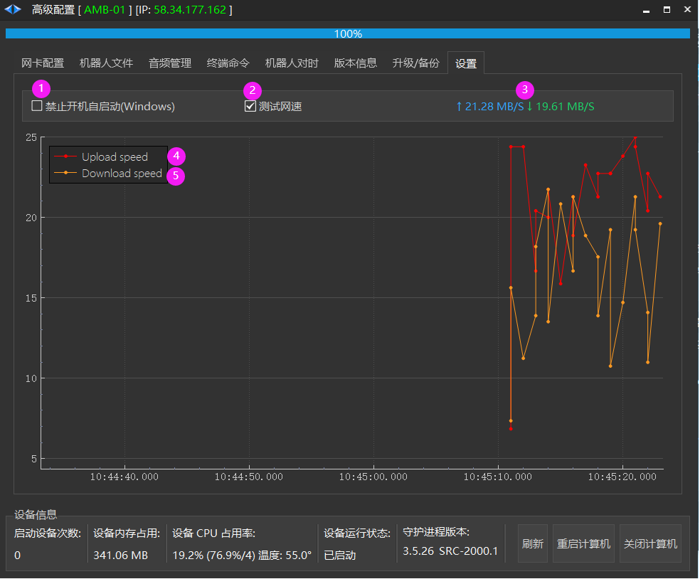

# 设置
| \ | Roboshop | Robod |
| --- | --- | --- |
| **配套版本** | 2.4.1.48+ | 3.5.26+ (机器人) 4.3.7+ (调度) |

## 禁止开机器自启

1. 禁止开机自启动 (Windows) : 对于调度服务器来说安装后会开机自启动

## 测试网速

2. 测试网速：测试 Roboshop 与 机器人或者调度之间的网速

3. 显示上传、下载网速

4. 上传网速 M/S

5. 下载网速 M/S

## 如何测试局域网内2台计算机网速

[测试局域网网速](https://seer-group.feishu.cn/wiki/DDFnwZXVdiPMhFkWlJvcxfz1nIg)