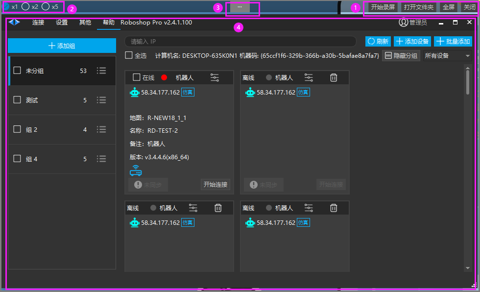

# MP4录屏
# MP4录屏

> 💡 
> **Roboshop v2.4.1.99+**

用于使用软件过程中出现问题或遇到不明白如何使用等情况时，将操作步骤以 MP4 的形式记录下来，寻求帮助时使用。该功能可以跨平台（Windows+Linux）使用。

点击【其他】>【录屏(mp4)】即可打开该功能，其界面如下图所示：

1. 进行操作区域：
    1. 【开始录屏】：选择需要创建保存的路径，开始录屏
    
    2. 【打开文件夹】：打开保存视频文件的路径
    
    3. 【全屏】：全屏录屏，该模式下顶部会自动隐藏
    
    4. 【关闭】：关闭窗口

2. 【倍数选择】选择几倍速录制。

3. 双击该区域可以进入全屏模式，录屏时该区域显示红色

4. 【录屏区域】在该区域内的操作会被录制下来