# 二维码工具
1. 点击【其他】>【二维码工具】。

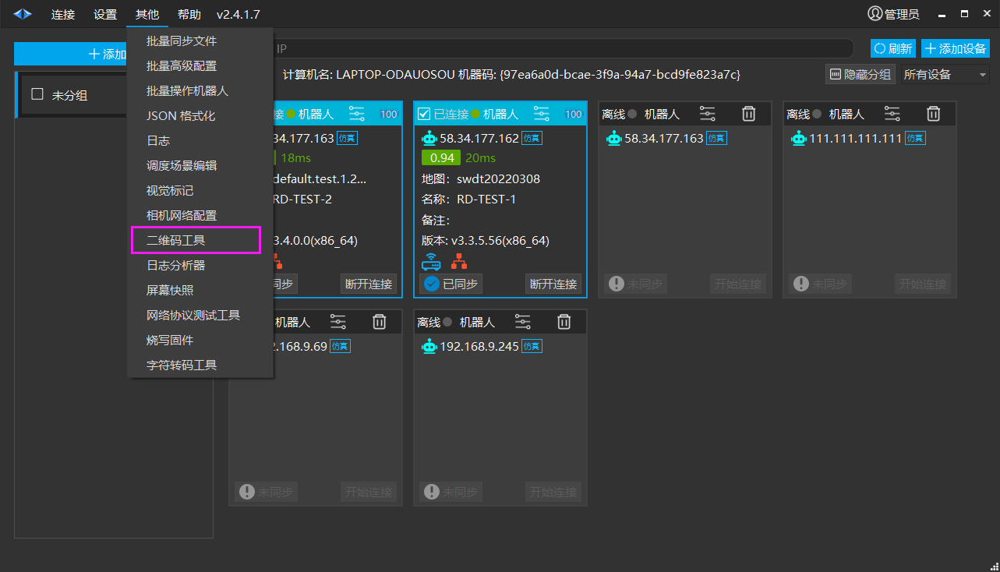

2. 二维码工具界面如图所示。

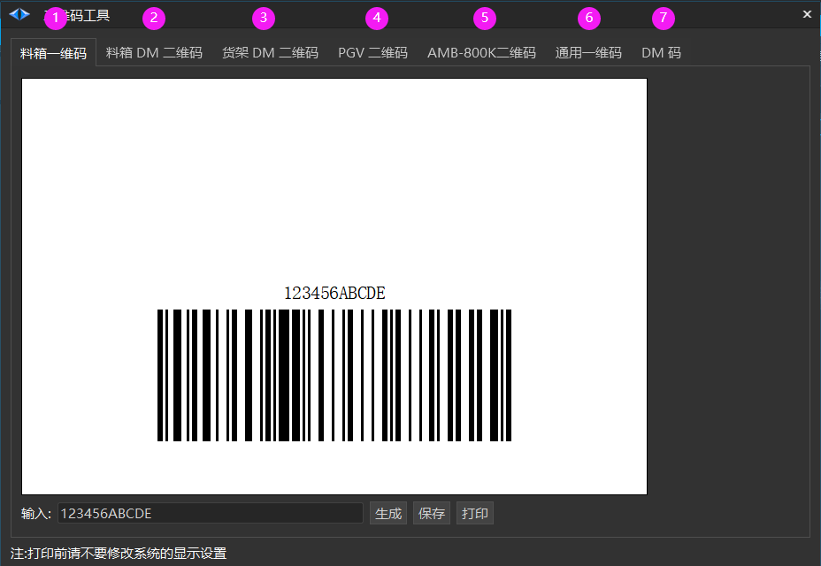

## 料箱一维码

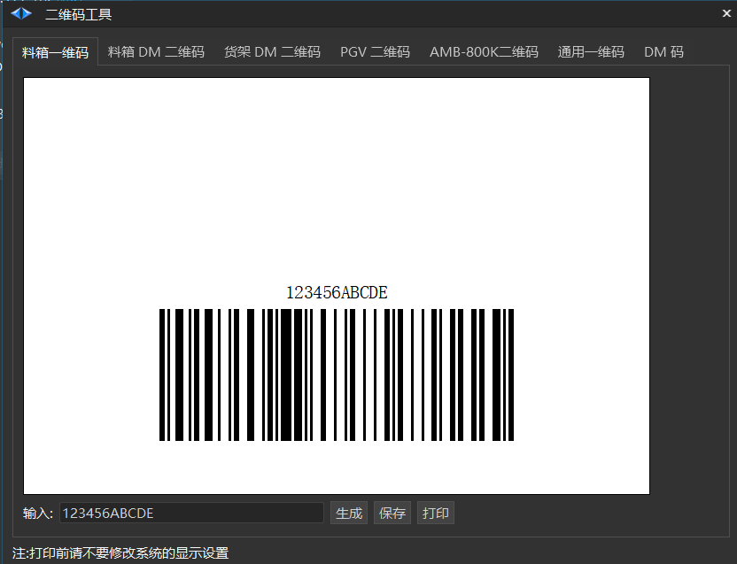

【输入】可以根据需求输入所需要的编号，一维码也随之改变。

【生成】可生成 pdf 文件。

【保存】可保存为pdf或jpg文件。

【打印】可连接普通打印机，无需更改设置。

## 料箱DM二维码

仅有图示这一个码。

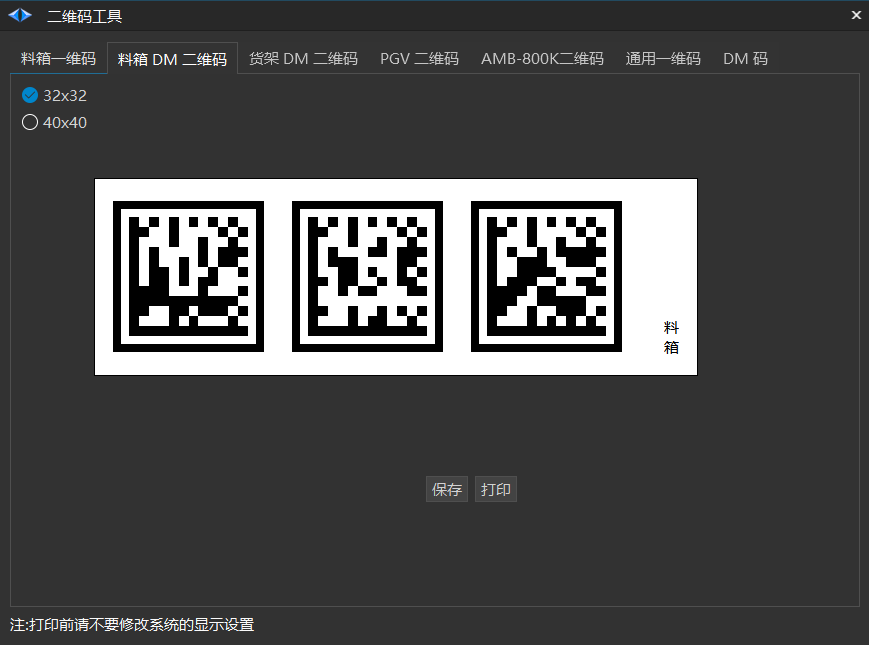

【32x32/40x40】单个二维码大小，单位mm。

【保存】可保存为pdf或jpg文件。

【打印】可连接普通打印机，无需更改设置。

## 货架DM二维码

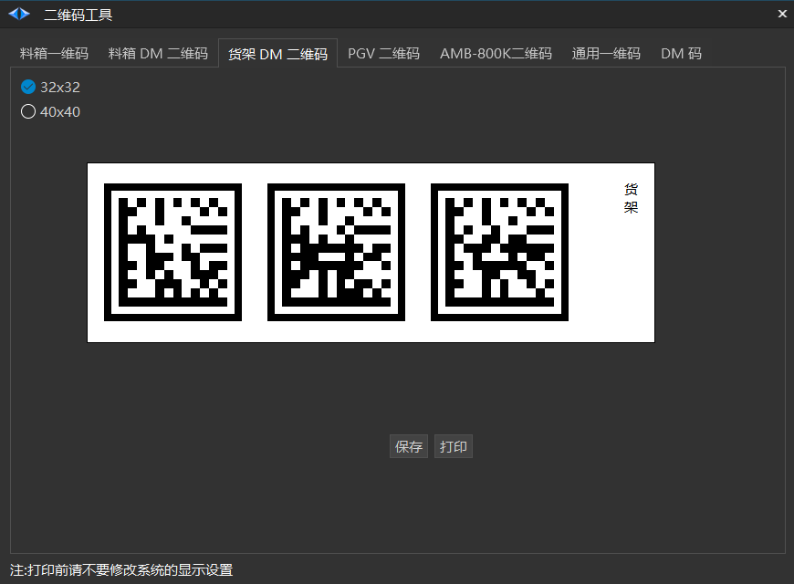

【32x32/40x40】单个二维码大小，单位mm。

【保存】可保存为pdf或jpg文件。

【打印】可连接普通打印机，无需更改设置。

## PGV二维码

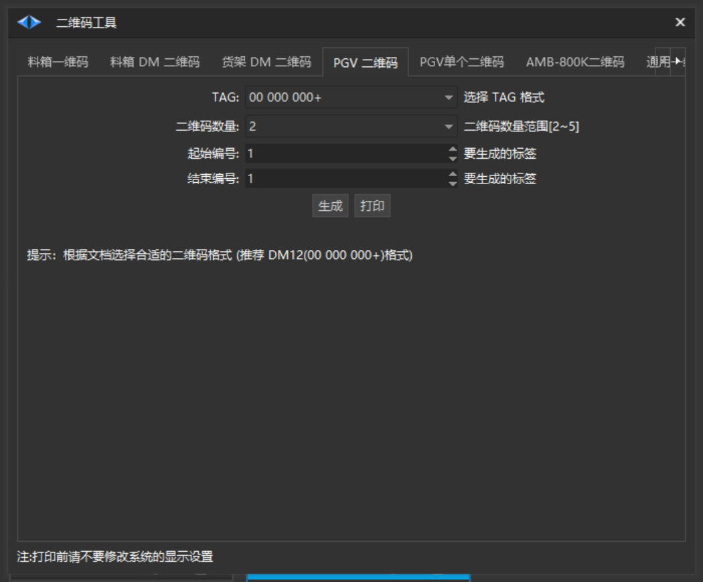

【TAG格式】推荐 00.000.000+ (DM12) , 具体请根据文档选择合适的二维码格式。

【二维码数量】可选择2x2/3x3/4x4的二维码。

【起始编号 / 结束编号】根据实际需求。

【生成】可生成 pdf 文件。

【打印】请参阅《SEER通用技术文档——PGV二维码要求》。

## PGV单个二维码

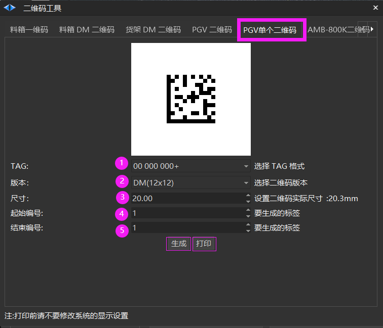

【选择TAG格式】 "00 000 000+"表示8位编码，如编号"1" 则为"00 000 001"。

【版本】 选择二维码版本，支持12*12、14*14等。

【尺寸】 设置二维码实际尺寸，范围在20~30mm。

【起始编号 / 结束编号】根据实际需求。

【生成】可生成 pdf 文件。

【打印】进入打印页面。

## AMB-800K二维码

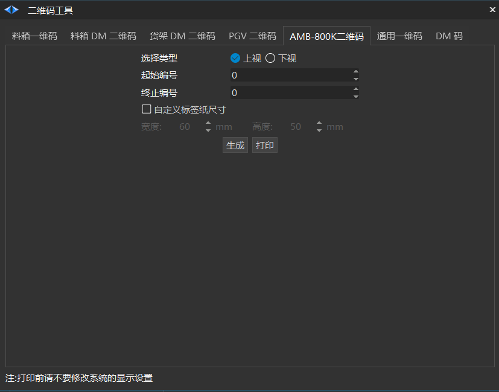

【选择类型】将机器人推至二维码下/上。

【起始编号 / 结束编号】根据实际需求。

【自定义标签纸尺寸】勾选后选择理想的标签纸宽度和高度。

【生成】可生成 pdf 文件。

【打印】

## 通用一维码

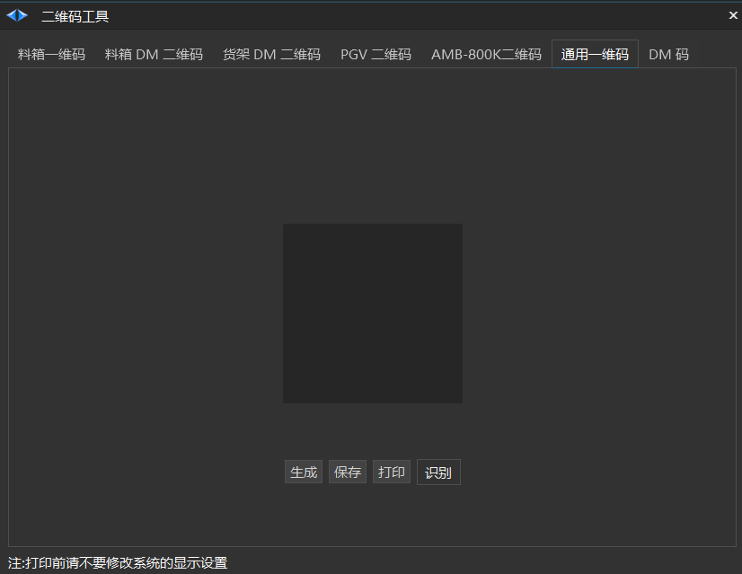

【生成】根据输入的信息生成一维码。

【保存】保存生成的文件。

【打印】可连接普通打印机，无需更改设置。

【识别】识别一维码。

## DM码

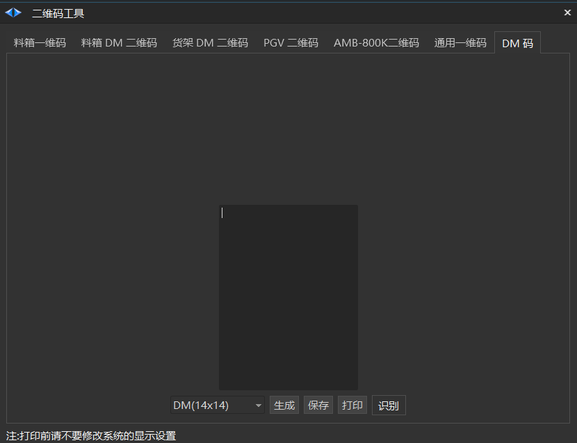

【生成】根据输入的信息生成二维码。

【保存】保存pdf文件。

【打印】可连接普通打印机，无需更改设置。

【识别】识别二维码。

## AprilTag二维码

> 💡 
> Roboshop v2.4.1.60+

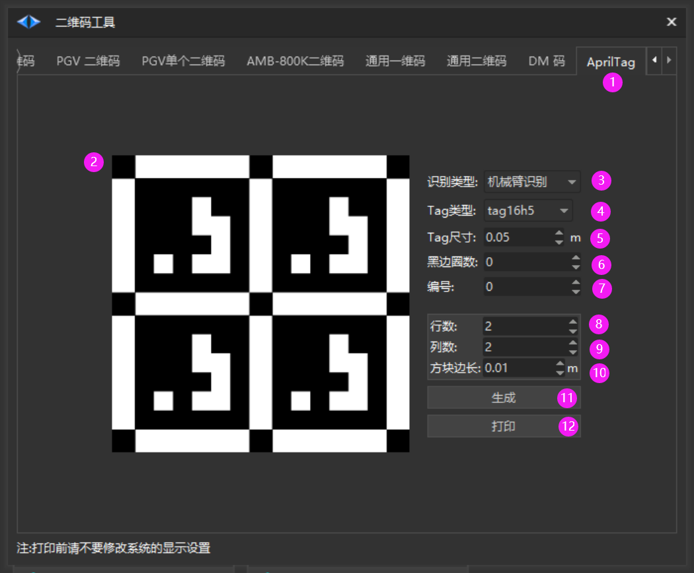

【识别类型】：选择应用场景 笼料识别 或 机械臂识别，生成的二维码样式有不同，详见 [tag 文件说明](https://seer-group.feishu.cn/wiki/GHRewvJjQi4WockPmNfcWGx4nGg)

【Tag类型】：选择 AprilTag 的类型

【Tag尺寸】：设置实际标签大小

【黑边圈数】：最外层的黑边的圈数

【编号】：设置Tag内容

【行数】：设置行数 （仅机械臂识别需要设置）

【列数】：设置列数（仅机械臂识别需要设置）

【方块边长】：设置间隔方块边长 （仅机械臂识别需要设置）

【生成】在左边预览二维码

【打印】打印到pdf

## SSERAGE

> 💡 
> Roboshop v2.4.1.75+

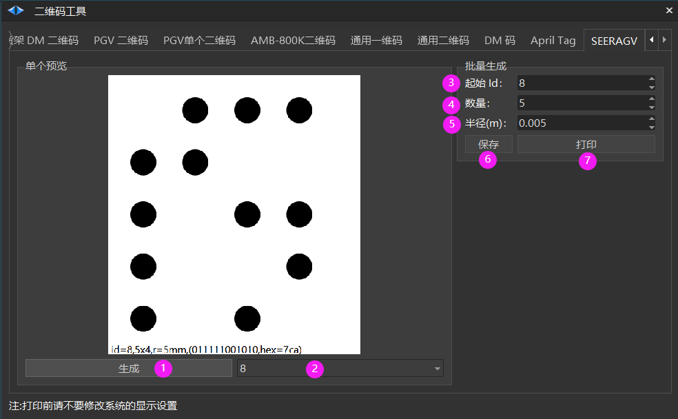

① 生成自定义码

② 选择id 编号

③ 起始 id 编号

④ 数量，比如起始 id标号为 8，数量为5， 则会保存或打印 id 为 8，9，10，11，12 码

⑤ 码中圆圈的半径，单位: m

⑥ 保存设置的自定义码

⑦ 打印自定义码，请在真实打印机下打印，否则不同打印机预览的布局不同。