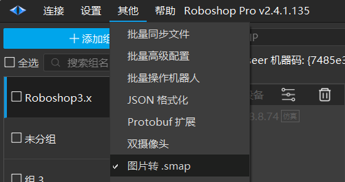
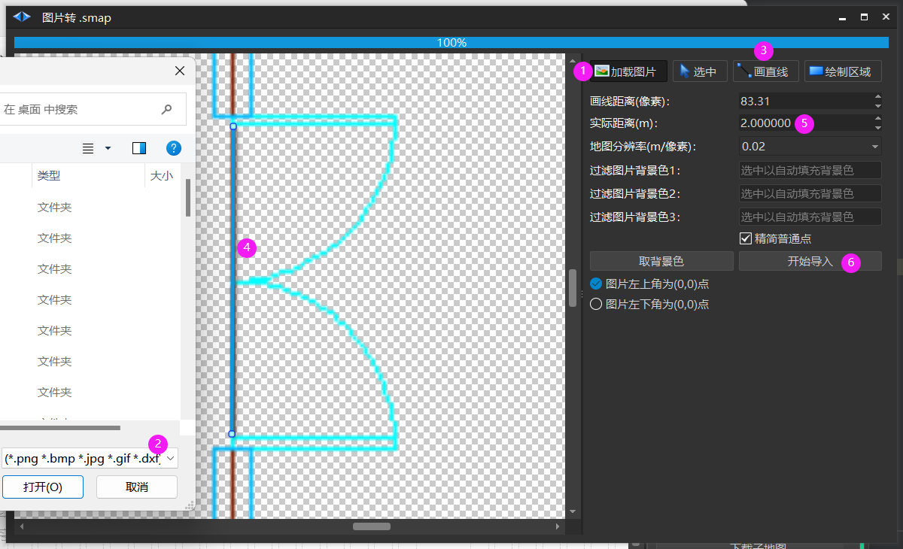
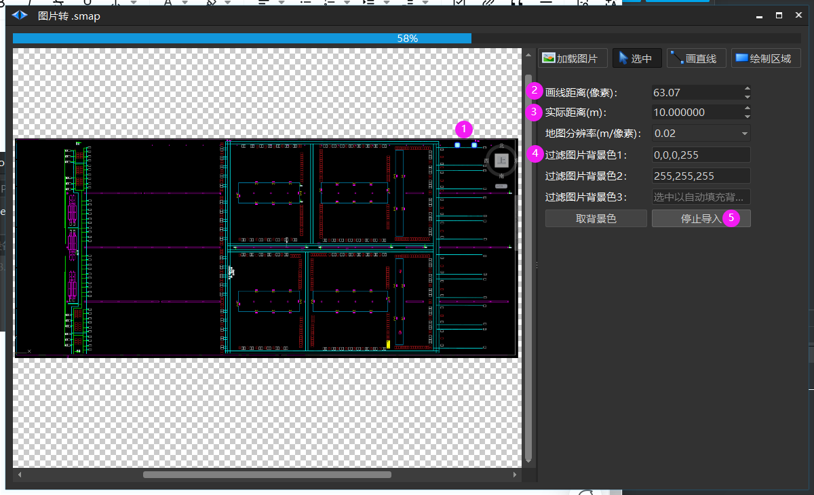

# 图片转 SMAP
> 💡 
> **Roboshop 2.4.1.136+ 支持**

## .dxf 转 .smap

1. 加载图片: 弹出选中文件对话框

2. 选中一个*.png *.bmp *.jpg *gif *.dxf 文件

3. 画直线：可以在图片中画一个线段

4. 在.dxf 中找出到一处与真实环境对应的长度，然后标记出来

5. 填写真实的距离(m), 例如: 这个门在图片中是83.31像素， 经过现实测量，对应真实世界它是 2 m

6. 开始导入: 自动把 .dxf 转化为 .smap 的普通点

## 截图 CAD 图片转 .smap

注意用**黑色背景**

1. 画直线: 在图片中画一段直线

2. 画线距离: 上图的画直线会自动填充

3. 实际距离(m): 图片中画的直线在真实世界中是多少米

4. 过滤图片背景色， 比如过滤黑色和白色，剩下的颜色作为普通点

5. 停止导入

##