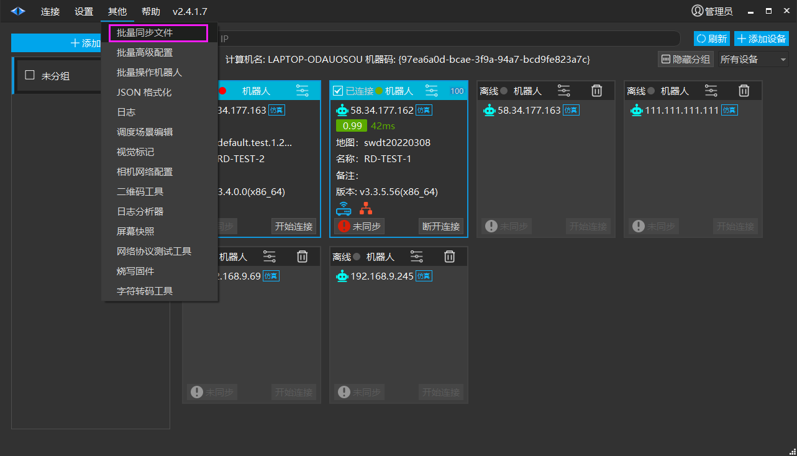
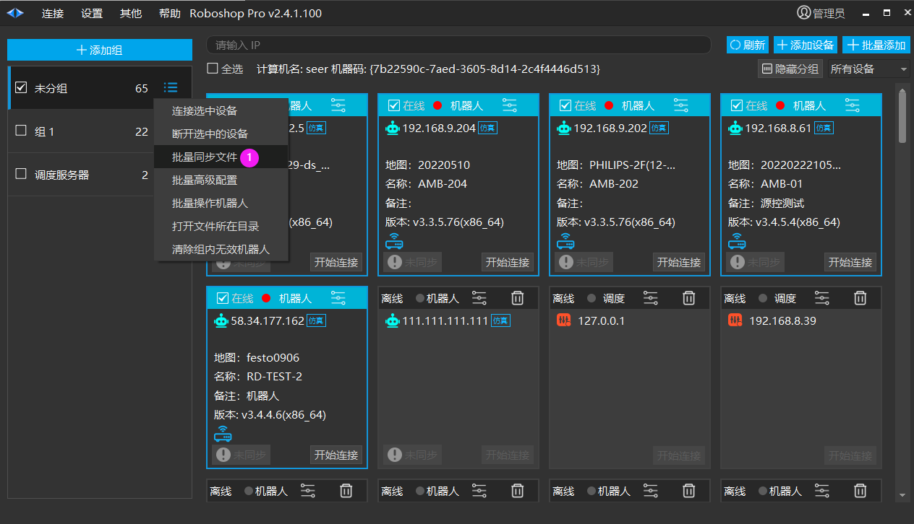
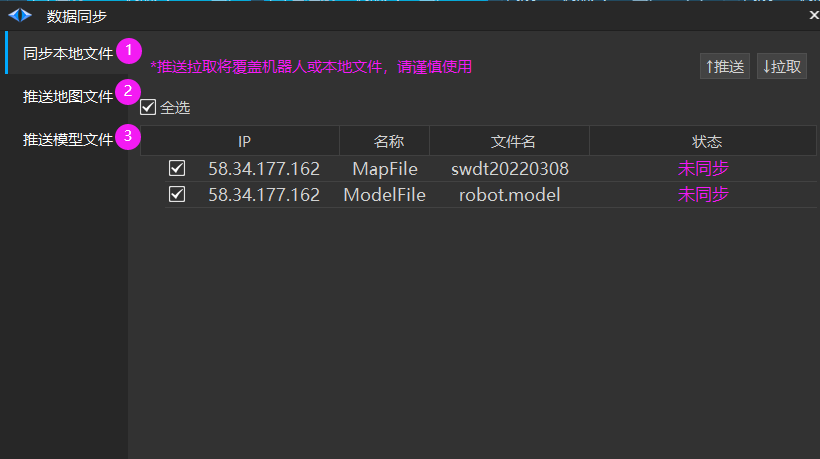
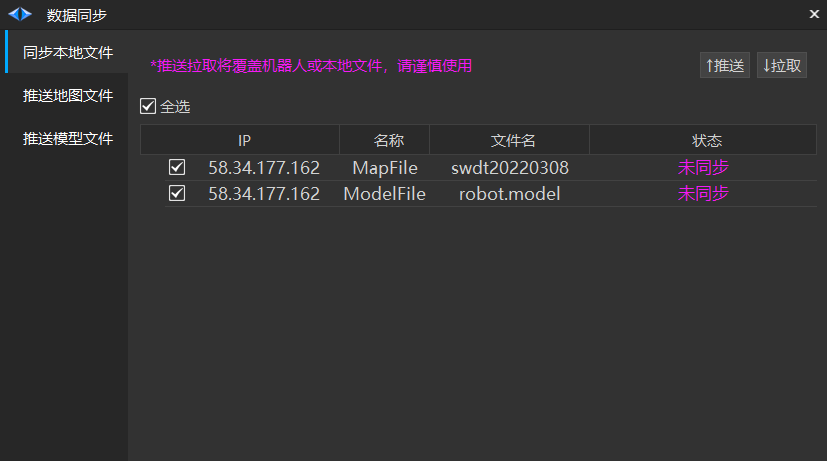
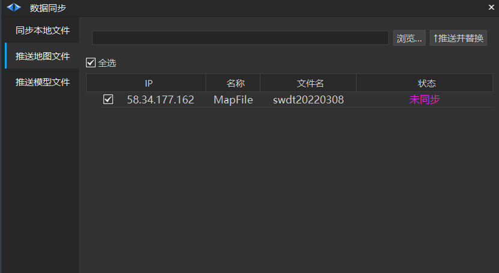
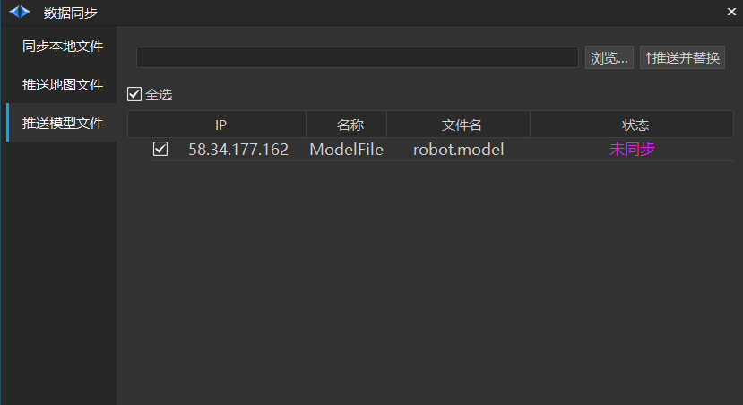

# 批量同步文件
## 批量同步文件

1. 首页勾选1个或多个机器人标签，点击【其他】>【批量同步文件】。

> 💡 
> Roboshop 2.4.1.40+ 首页已改成如下布局，功能没有变化

2. 数据同步界面如图所示。

① 【同步本地文件】通过状态栏确认机器人地图、模型与本地地图、模型是否同步。点击【推送】可将本地地图、模型同步到机器人。点击【拉取】可将机器人正在使用的地图、模型同步到本地。

②【推送地图文件】点击【浏览】选取所需的地图文件，【推送并替换】当前地图。

③【推送模型文件】点击【浏览】选取所需的模型文件，【推送并替换】当前模型。

