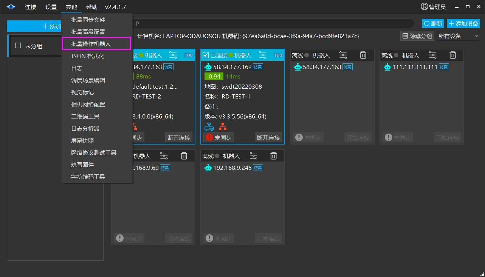
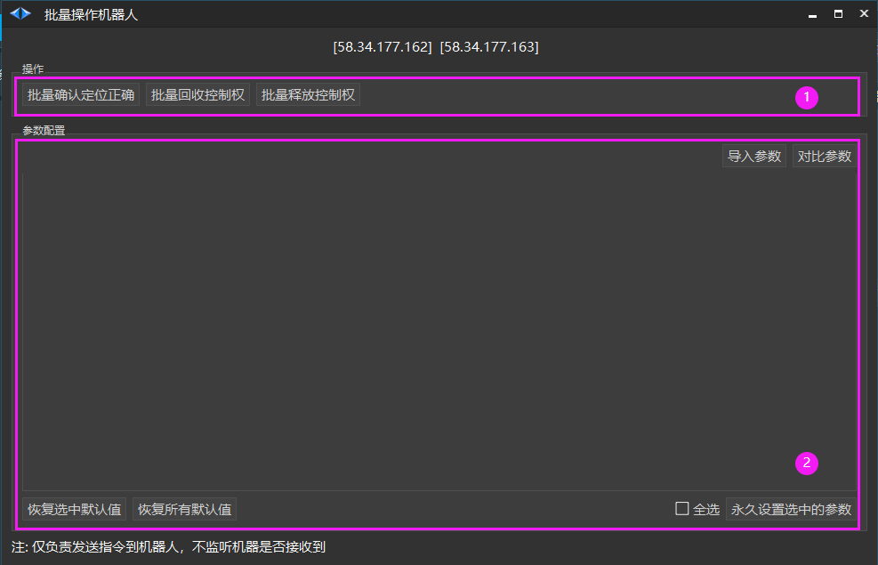
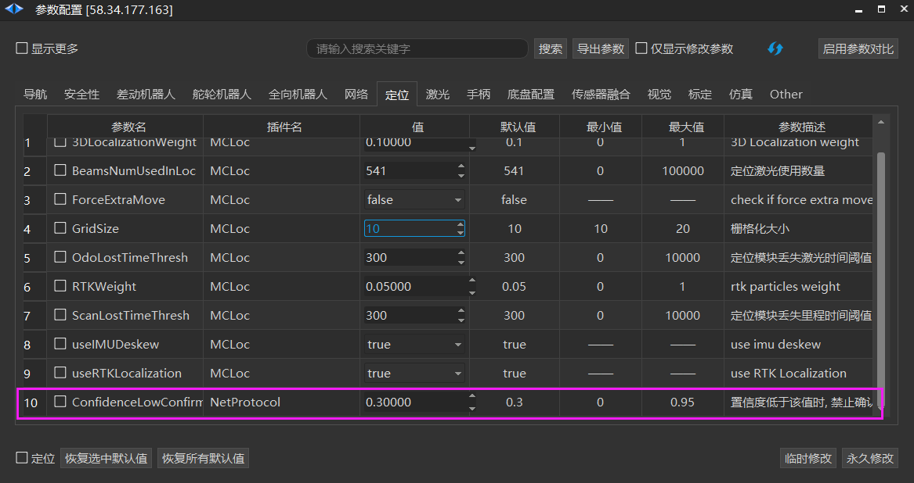
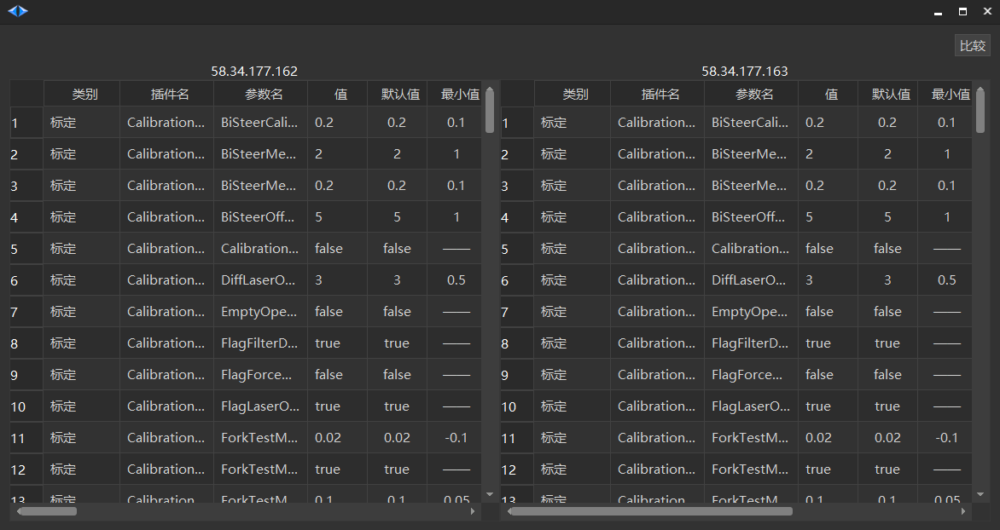
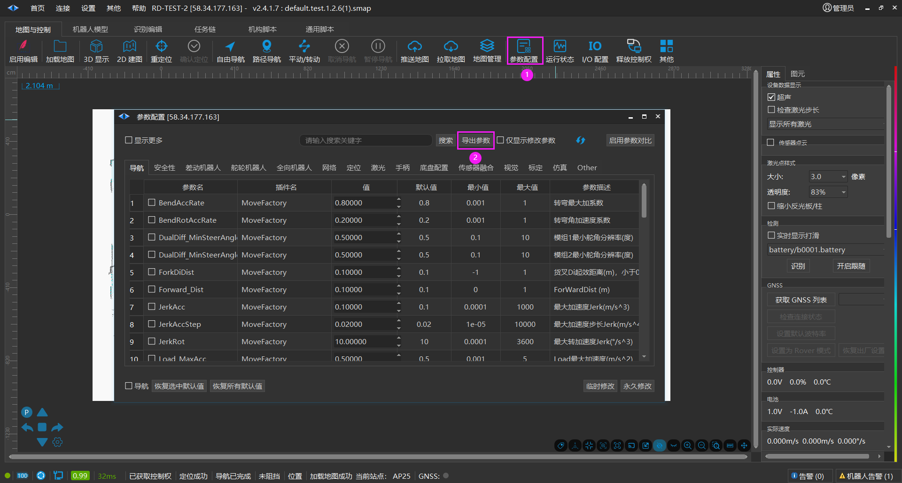
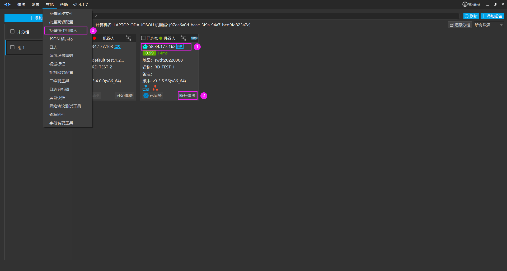
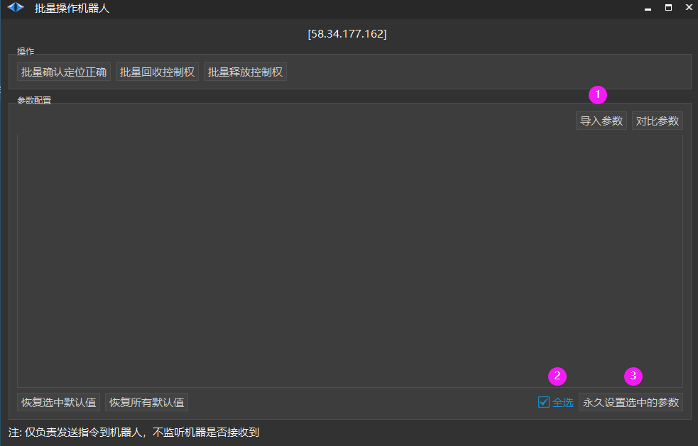
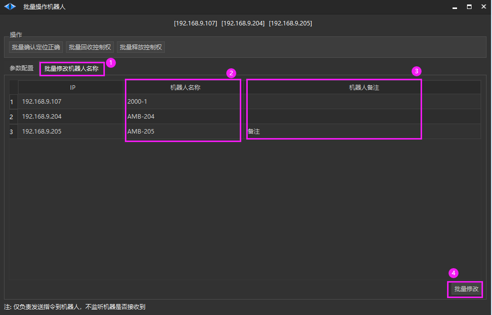

# 批量操作机器人
##

1. 首页勾选1个或多个机器人标签，点击【其他】>【批量操作机器人】。

2. 批量操作机器人界面如图所示。

1. 操作

【批量确认机器人位置正确】（ **说明：在执行度低于0.3的时候会确认定位失败，主要跟参数配置中该值有关。）**

【批量回收控制权 】

【批量释放控制权 】

1. 参数配置

【导入参数】选择参数文件导入

【对比参数】对比选中机器人参数

【恢复选中默认值 】

【恢复所有默认值 】

【永久设置选中的参数 】

## 如何批量导入机器人参数

1. 导出机器人参数

2. 选中需要导入的机器人，进行导入

需要导入多个机器人，这里勾选多个机器人，并且需要连接机器人 (程序会自动过滤机器人中不存在的参数)

3. 导入机器人参数

## 批量修改机器人名称和备注

> 💡 
> Roboshop v2.4.1.101+

