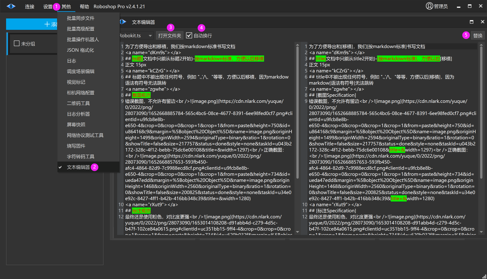

# 文本编辑器
> 💡 
> ** Roboshop v2.4.1.21+ **

| 图标序号 | 说明 |
| --- | --- |
| ① | 其他 |
| ② | 文本编辑器 |
| ③ | 打开文件夹 打开 .ts 所在的文件目录，可以手动修改文件内容，重启打开 [其他->文本编辑器] 内容生效 |
| ④ | 自动换行 文本会自适应宽度显示，不会显示水平滚动条 |
| ⑤ | 替换 把 .ts 对应字符替换当前内容 |