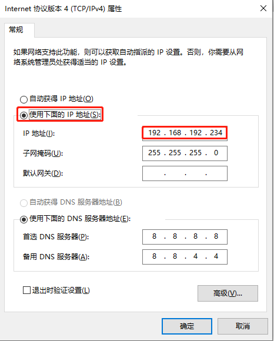
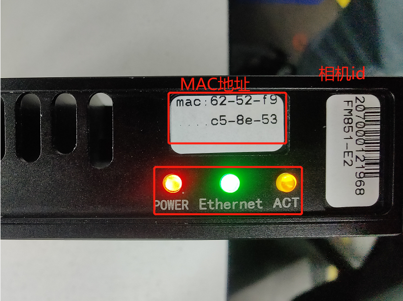
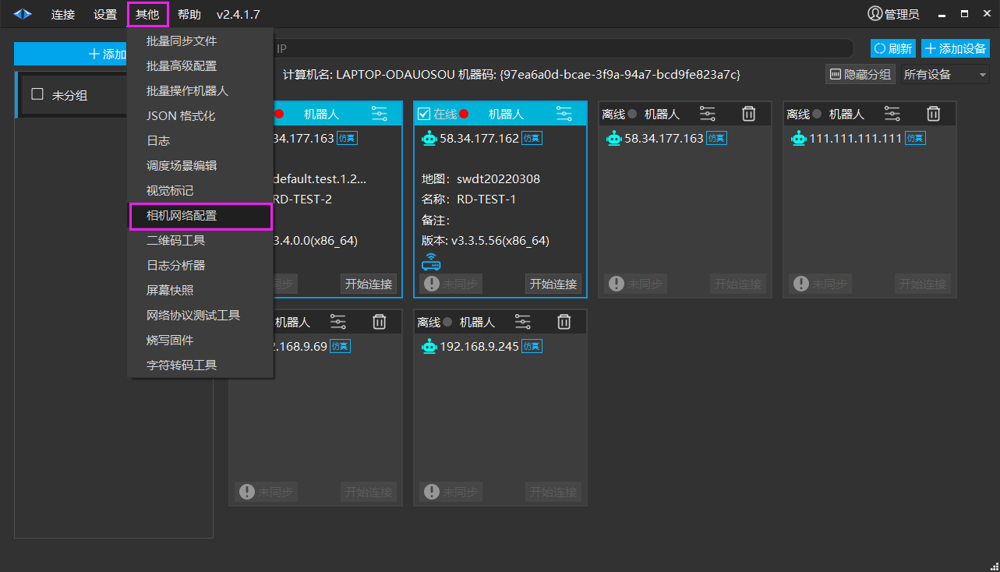
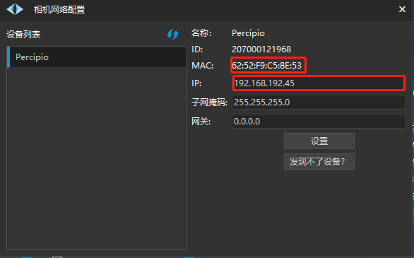
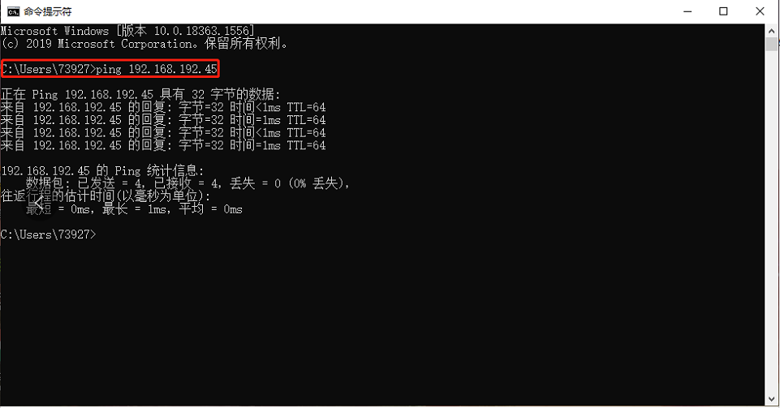
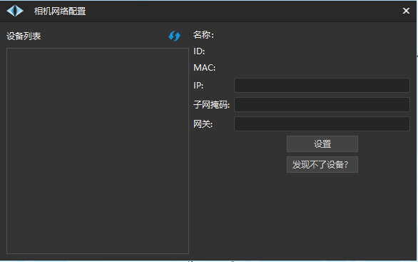

# 相机网络配置
## 图漾相机的配置方法

1. 首先将图漾相机接上电源，使用网线连接该相机，网线另一端连接至电脑的网口。

2. 打开电脑以太网的设置，选择Internet协议，勾选使用下面的ip地址：`192.168. ``**192 ** ``.XX`( **注：网段必须为192网段 ** )。

3. 如果相机上的指示灯都常亮的话则没有问题。

4. 打开roboshop，在首页点击【其他】，选择【相机网络配置】。

5. 打开【相机网络配置】会出现如下界面。

此时的ip为相机的默认ip，可在cmd窗口输入`ping +ip地址`，能ping通的话就说明是没有问题的，也可参考上面的MAC地址并与相机上的MAC地址做对比。

如果需要，可以自行更改ip地址，并点击【设置】即可，设置完毕后，依然可以在 cmd 窗口 ping 通设置后的 ip地址。

**注：如果没有连接相机的话会出现如下界面：**

