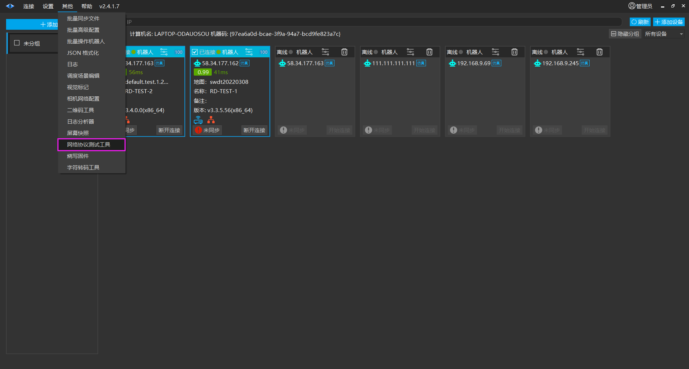
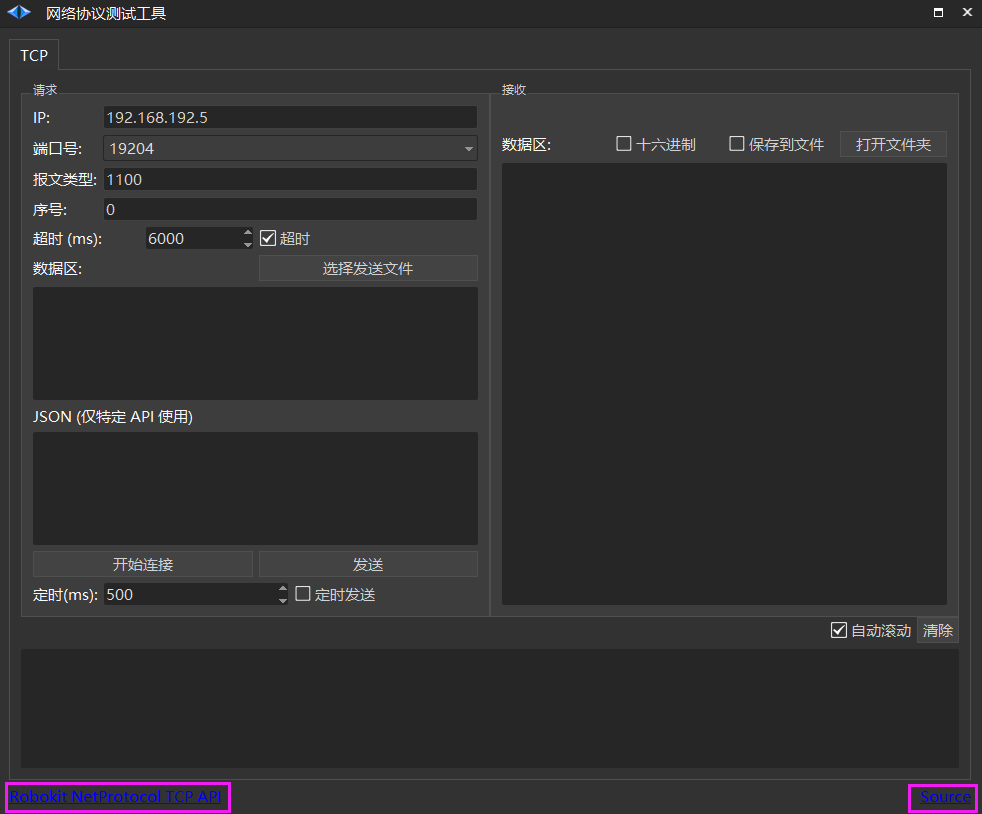
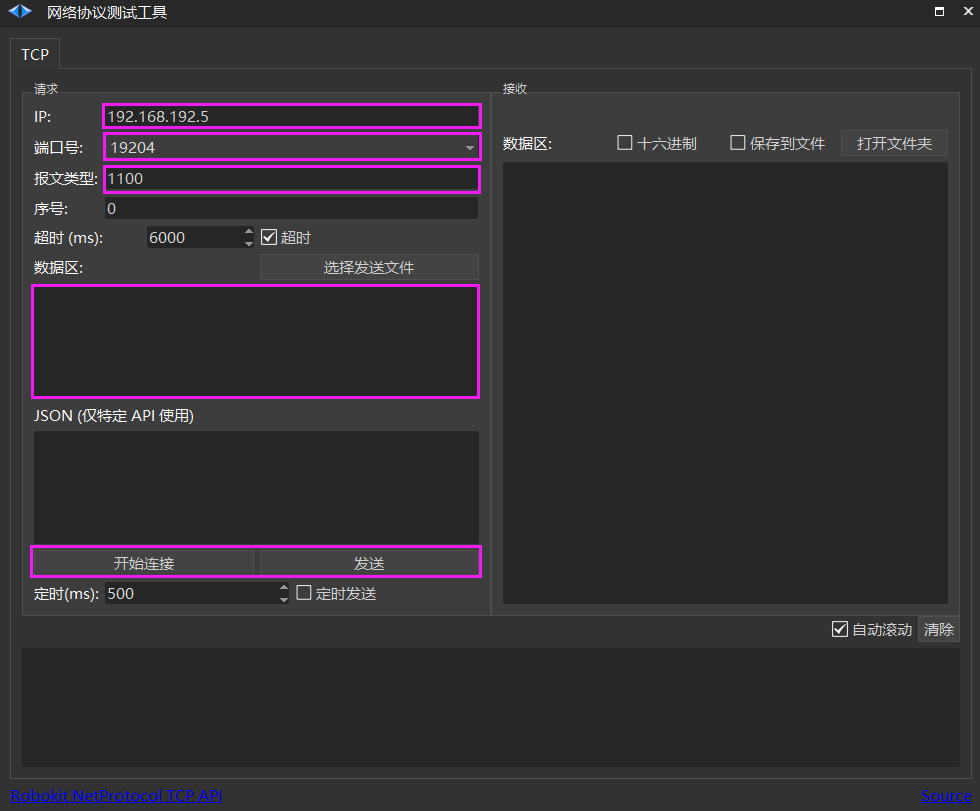
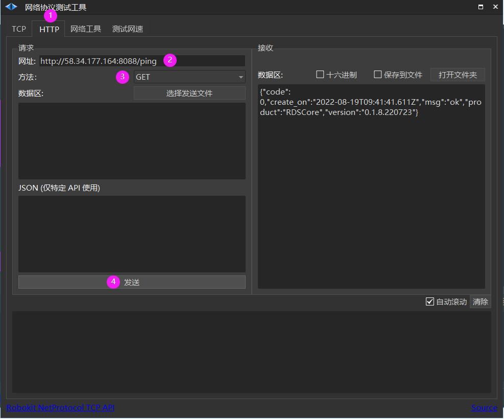
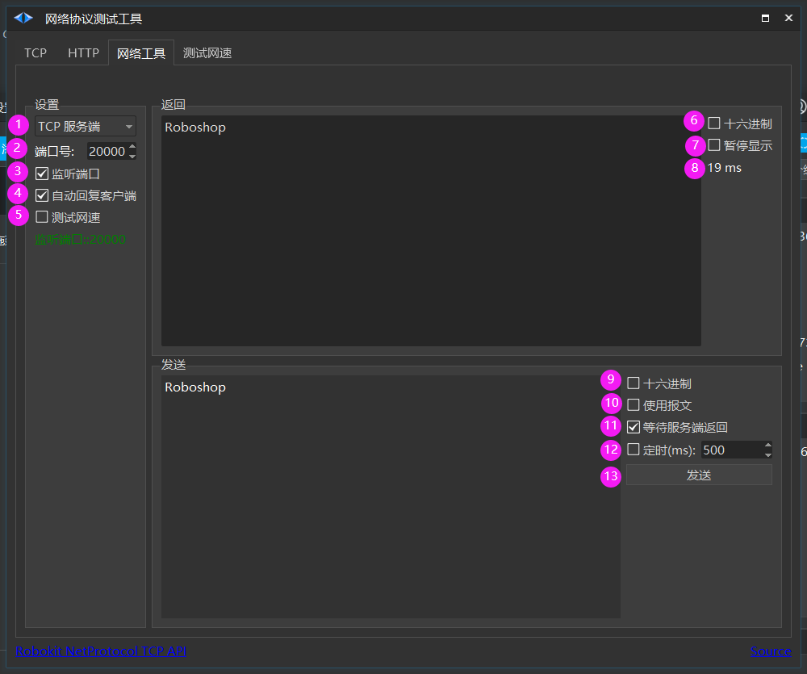
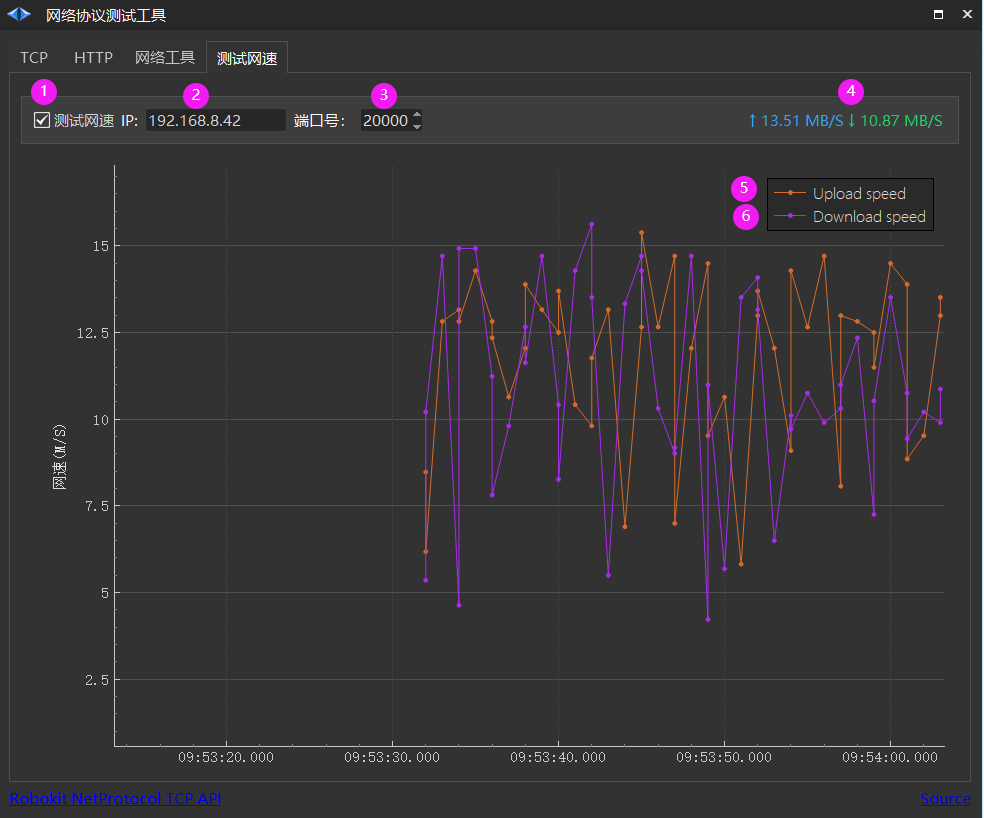
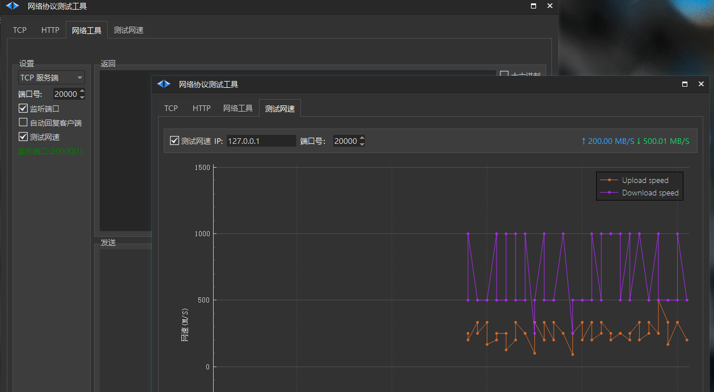
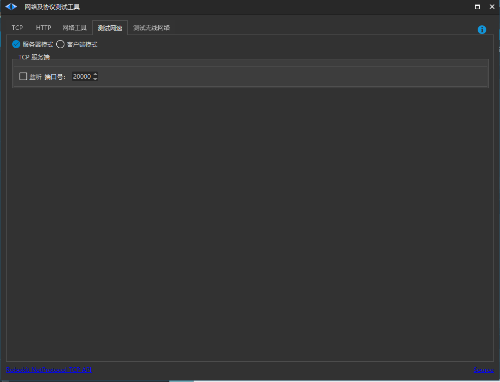
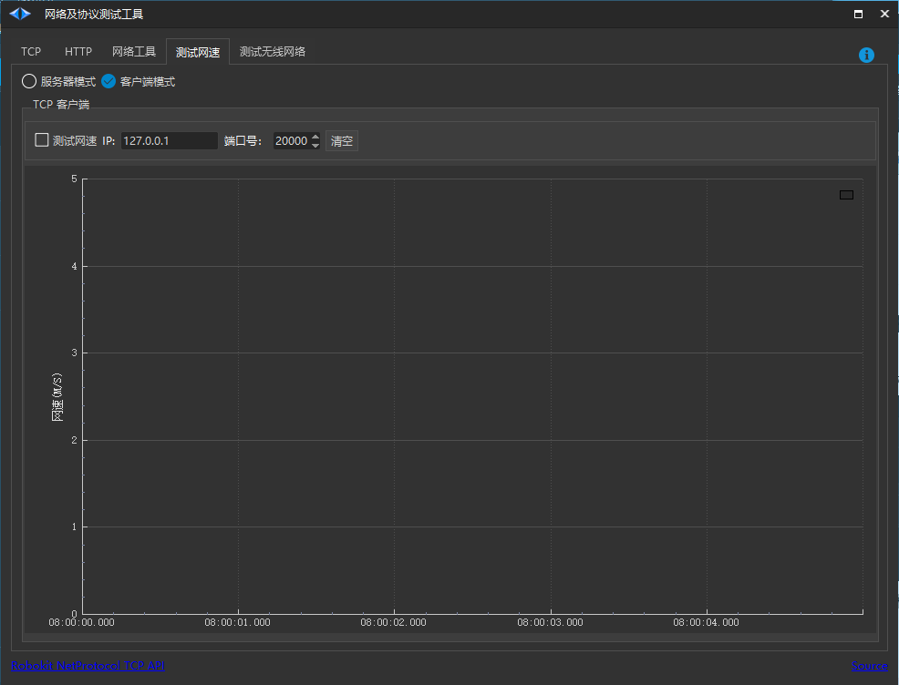
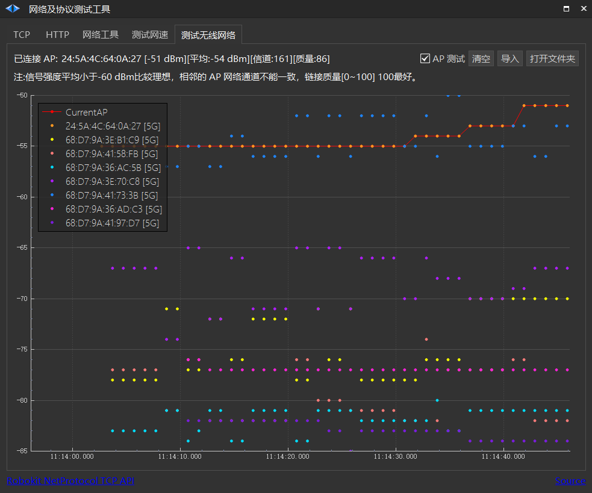

# 网络及协议测试工具
## 测试机器人 TCP 协议

1. 点击【其他】>【网络协议测试工具】。

2. 网络协议测试工具如图所示。点击左下角可进入API协议详述界面，点击右下角source,会有详细的介绍。

3. 输入需要测试的机器人【IP】。

4. 输入需要测试项目【端口号】（参考API协议）。

5. 输入需要测试项目【报文类型】（参考API协议）。

6. 输入需要测试项目【数据区】（如有，参考API协议）。

7. 点击【开始连接】>【发送】。

## 测试 HTTP

① HTTP 协议

② 输入 URL

③ GET/POST

④ 发送

## TCP/UDP 通用测试工具

| 图标序号 | 说明 |
| --- | --- |
| ① | TCP 服务端 TCP 客户端 UDP 服务端 UDP 客户端 |
| ② | 端口号 |
| ③ | 监听端口: 开启端口，仅服务端需要监听端口 |
| ④ | **自动回复客户端 ** 客户端发送什么数据，服务端回复什么数据 |
| ⑤ | **测试网速 ** 作为服务端专门用于测试 2个 Roboshop 之间的网速情况  |
| 接收 |   |
|  | ⑥ |
| 十六进制显示 | ⑦ |
| 暂停显示 当返回数据太大时会消耗 GUI 性能，可以关闭显示 | ⑧ |
| 一次发送到接收的时间差 | 发送 |
|  | ⑨ |
| 十六进制显示 | ⑩ |
| 使用报文 55 5A 0000 00000000 00000000 00000000 | ⑪ |
| 等待服务端返回: TCP 服务端必须勾选【 **自动回复客户端 ** 】 | ⑫ |
| 定时发送(ms) | ⑬ |

## 测试网速

| 图标序号 | 说明 |
| --- | --- |
| ① | 测试网速 |
| ② | 服务端 IP |
| ③ | 服务端端口号 |
| ④ | 上传、下载网速 |
| ⑤ | 上传网速曲线 |
| ⑥ | 下载网速曲线 |

## 测试 计算机 与 机器人 之间的网速

[测试网速](https://seer-group.feishu.cn/wiki/LPouwQXrSifh45k6tscc9thknQg#part-AW0XdQuDqo8jkVxrkB3caG2wn8d)

## 测试 局域网 2台计算机 之间的网速

1. 把 Roboshop 2.4.1.48+ 分别安装到 **A ** 和 **B ** 计算机

2. **A ** 计算机 **[其他->网络协议测试工具->网络工具] ** **选** 择 **TCP 服务端， ** ✔监听端口，✔测试网速

3. **B ** 计算机 **[其他->网络协议测试工具->测试网速] ** 输入 **A ** 的**IP** 和**端口号** ，✔测试网速

## 测试 局域网 2台计算机 之间的网速

> 💡 
> Roboshop v2.4.1.101+

1. 把 Roboshop 2.4.1.101+ 分别安装到 **A ** 和 **B ** 计算机

2. **A ** 计算机 **[其他->网络协议测试工具->测试网速] ： ** 选择【服务器模式】，点击【监听】开启服务端

3. **B ** 计算机 **[其他->网络协议测试工具->测试网速] ： ** 选择【客户端模式】
    1. 点击【测试网速】进行网速测试
    
    2. 点击【清空】清空测速曲线

## 测试无线网络

> 💡 
> Roboshop 2.4.1.99+

鼠标勾选 【AP 测试】 按钮开始测试当前无线网卡连接 AP 信息及可漫游的 AP 信号强度