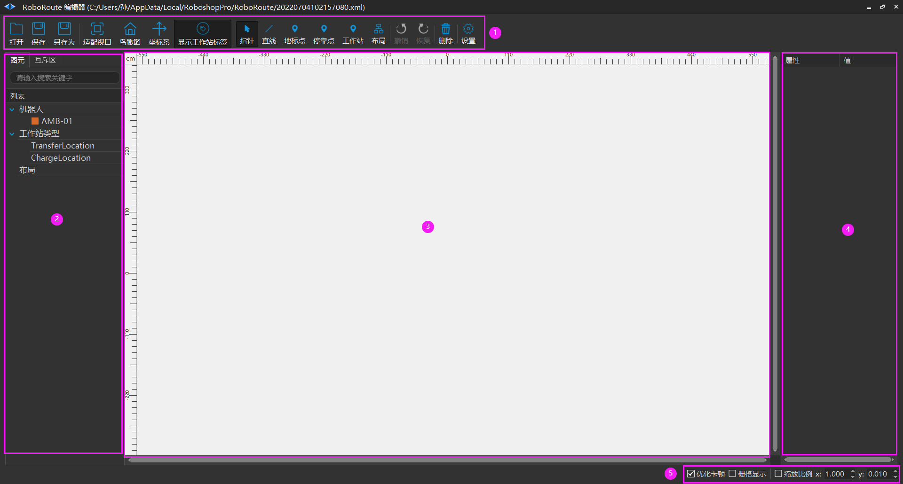
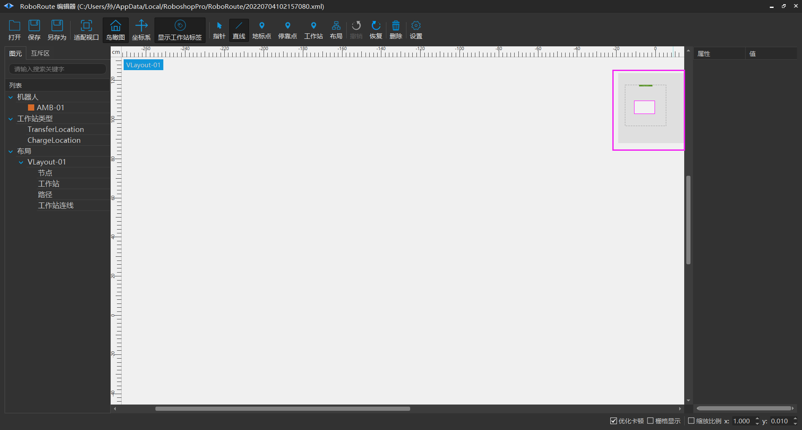
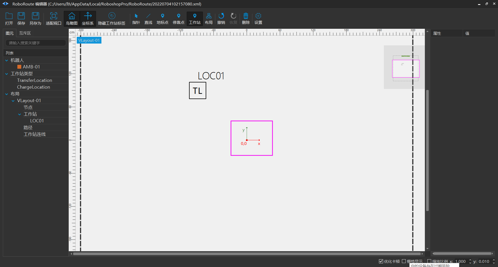
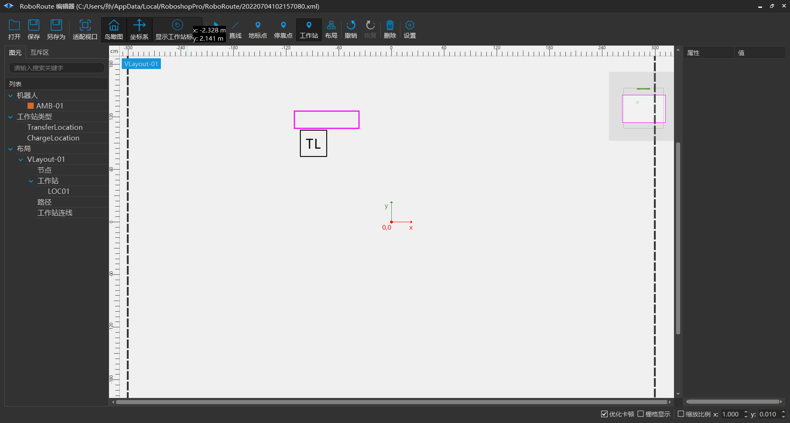

# 调度场景编辑
## 调度场景编辑

1. **状态栏**

- 【打开】场景地图。

- 【保存】场景地图。

- 【另存为】将场景地图另存为。

- 【适配窗口】将场景显示区域中心与地图坐标原点匹配。

- 【鸟瞰图】右侧添加小窗口，拖动小窗口上的显示框总览整个地图。

- 【坐标系】添加坐标系在地图原点。

- 【隐藏工作站标签】

- 【指针】可多个选择地图上的元素。

- 【直线】连接两个及以上元素。

- 【地标点】在地图上添加地标点元素。

- 【停靠点】在地图上添加停靠点元素。

- 【工作站】在地图上添加工作站元素。

- 【布局】在地图上添加布局，添加布局后才可以添加直线、地标点、停靠点、工作站等元素。

- 【撤销】撤销当前步骤。

- 【恢复】恢复当前步骤。

- 【删除】删除选择的元素。

- 【设置】重命名工作站。

2. **列表**

显示场景内图元列表。

3. **场景**

显示调度编辑地图。

4. **属性**

显示图元属性。