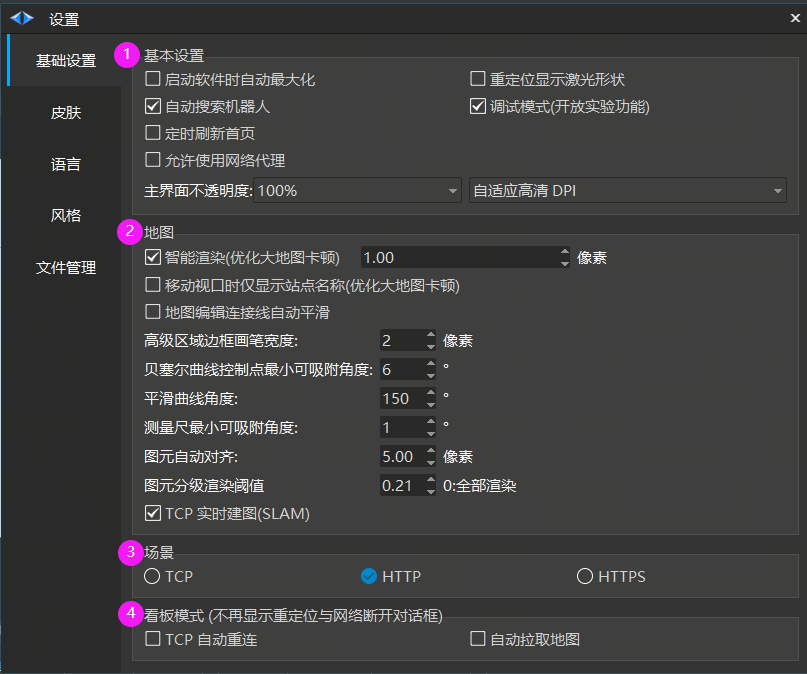

# 基础设置
## 基础设置

### 基本设置

1. 启动软件时自动最大化

2. 自动搜索机器人

3. 定时刷新首页

4. 允许使用网络代理

5. 重定位显示激光形状

6. 调试模式(开放实验功能)：会打开应用程序实验性质的功能

7. 主界面不透明度：可以通过该设置让界面变的透明

8. 自适应高清 DPI

### 地图

1. 智能渲染 (优化大地图卡顿) : 数值越大地图中显示的普通点越少
    1. 移动视口时进显示站点名称 （优化大地图卡顿）：开启后鼠标移动地图时会简化图元的渲染，增加流畅度

2. 地图编辑连接线自动平滑

3. 贝塞尔曲线控制点最小可吸附角度

4. 平滑曲线角度

5. 测量尺最小吸附角度

6. 图元自动对齐

7. 图元分级渲染阈值：0~1.0 之间，一般默认值 0.21， 0表示全部渲染

8. TCP 实时建图(SLAM), 默认实时建图使用的 UDP，在无线网络很差的情况丢包比较严重，此时建议使用 tcp 实时建图或者使用【扫描 Rawmap】方式 注:需要 Robokit 3.4.5.22+ 版本

### 调度场景

1. TCP 使用 TCP/IP 下载场景文件

2. HTTP 使用 http 下载场景文件

3. HTTPS 使用 https 下载场景文件

### 看板模式

1. TCP 自动重连

2. 自动拉取地图