# 网络分析方法
## 分析现场网络

### 基础知识

2.4G ： 信号频率低，传播过程中衰减较小，覆盖范围相对更大，室内环境中抗干扰能力弱，优点就是穿透能力强，传播的距离更远。

5G ： 信号频率较高，传播衰减大，覆盖范围相对较小，抗干扰能力强 ，能提供更大的带宽，吞吐率高，扩展性强，输出稳定，能支持大数据传播。

### 使用 ping 命令行分析

准备连接到同一网络的 2 台电脑笔记本(至少一台是笔记本)，使用笔记本 ping 另一台计算机。

终端命令输入:

#### win系统

打开 cmd 终端（搜索中输入 cmd->鼠标点击命令提示符）输入如下指令

> ping 192.192.x.x -t

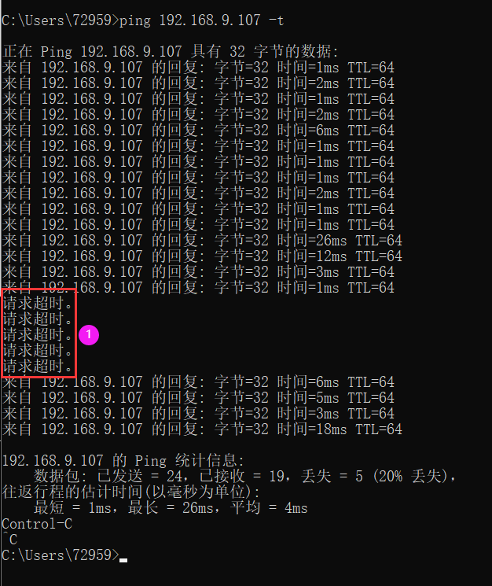

请求超时：表示目标设备未响应

#### linux系统

> ping 192.192.x.x

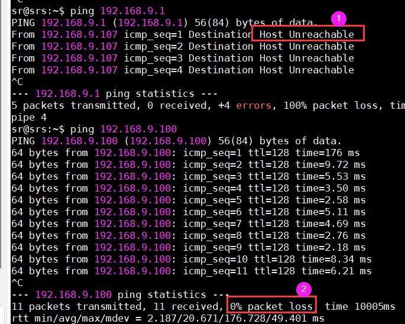

1. 目标设备不存在

2. 丢包率:0%表示未丢包， Linux 和 window 不同， 只有 ctrl+c 停止后才能看到网络情况 ，中间网络超时不会提示请求超时字样

#### 总结

如果 2 台笔记本之间 ping 10分钟出现请求或者丢包率大于0，则表示网络环境不理想。

time=6.21ms或 时间=13ms：表示回复用时， 一般稳定低于60ms都比较理想，如果波动峰值在 500ms+网络环境很糟糕。

### 使用 Roboshop2.4.1.99+ 分析现场网络

【其他】->【网络及协议测试工具】->【测试无线网络】

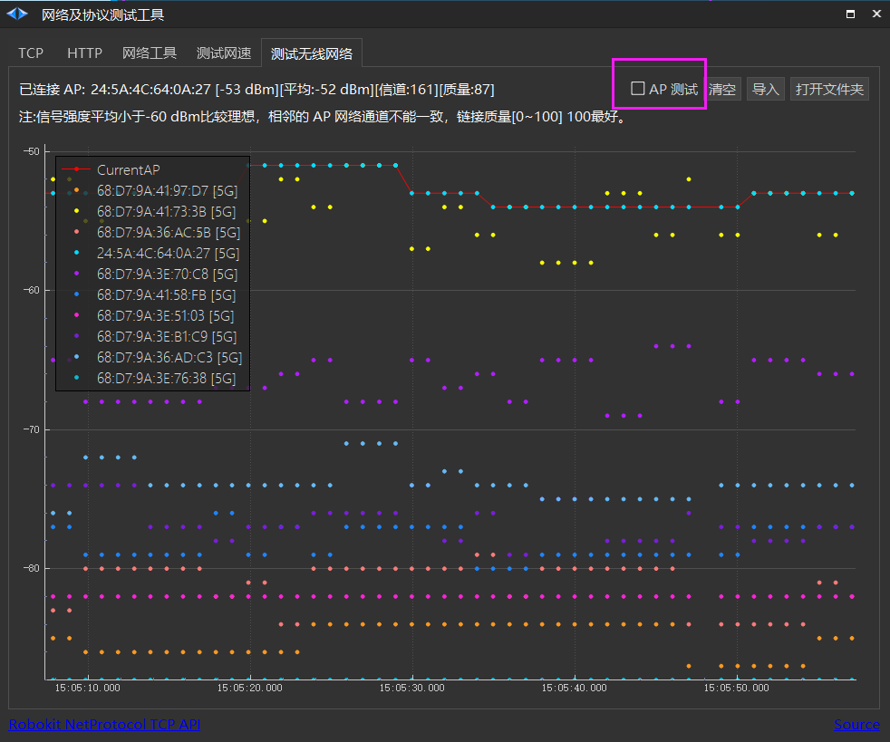

## 分析机器人自带无线网卡网络

1. 检查网卡漫游参数配置截图中的值 (一般不需要修改)。

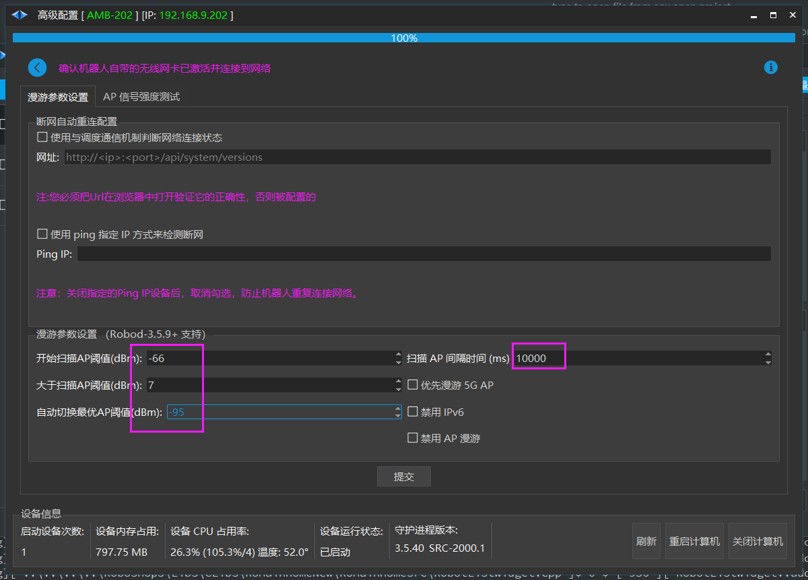

2. 如果使用了 core 调度服务器 ,修改 core 调度服务器中的参数配置是否为 500ms，修改后重启 core 生效。

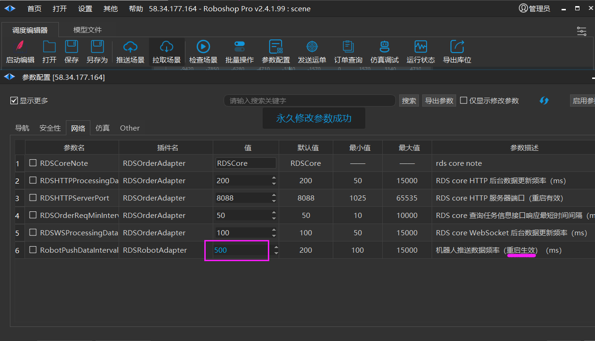

3. 【首页】->【高级配置】->【网卡配置】->【网卡漫游】->【AP 信号强度测试】

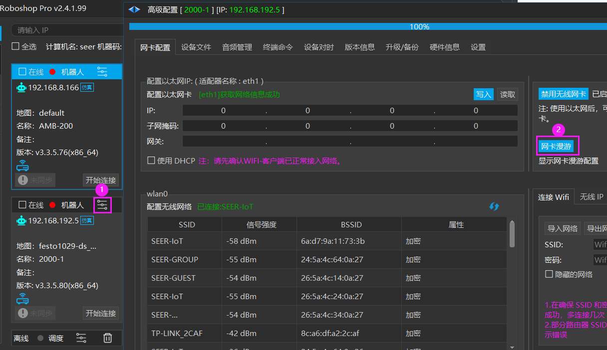

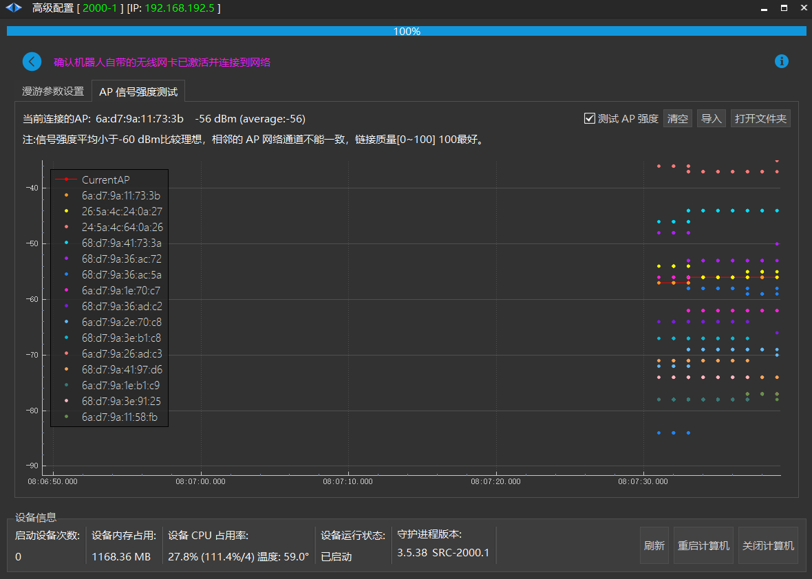

如果使用 AP 漫游测试发现信号强度普遍在 -65 dBm左右

1. 天线未外漏

2. 拆除外壳直接把天线拧到控制器上测试信号强度到达 -55 dBm 左右

上述情况建议直接加第三方网络客户端

## 分析机器人第三方客户端网络

### 使用笔记本自带无线网卡测试线程网络

【其他】->【网络及协议测试工具】->【测试无线网络】

推荐把笔记本放在机器人上，开启机器人AP测试和笔记本AP测试，并让机器人进行一段路径导航，导航结束后对比机器人AP测试结果与笔记本测试结果是否一致， 如果平均相差 15dBm 左右则检查机器人自带无线网卡。如果接近则需要 IT 进行网络测试和信道的排查。

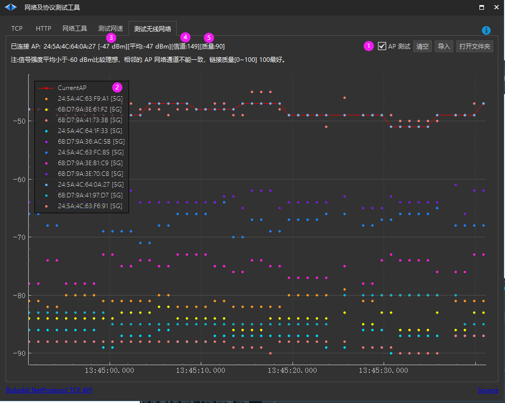

### ~~测试机器人上传和下载速度~~

~~【首页】->【高级配置】->【设置】~~

~~辅助使用 ping 观察时间延迟是否过高~~

~~点击【测试网速】，查看上传和下载速率是否能达到 1MB/s(需要观察看机器人具体表现是否真的掉线)~~

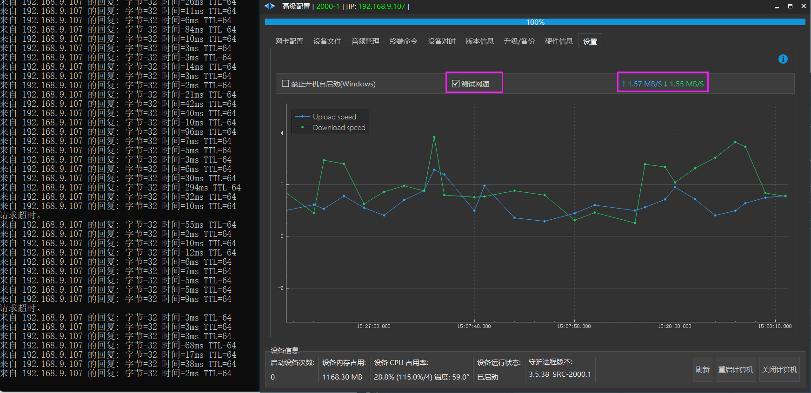

## 案例总结

### 案例一(现场网络问题)

**现象** : rds 经常显示机器人掉线(大概5分钟左右就会掉一次很快又会连上)

**分析** : 使用 Roboshop 连上这台车延迟开始在 60ms, 5分钟左右一到立马断开(延迟超过6000ms)

通过 Roboshop 所在笔记本 ping 机器人10分钟没有发现超时现象

通过 Roboshop 所在笔记本 ping 服务器core的 IP ，5分钟发现超时现象

**处理过程** ：判断是 core 所在服务器与局域网之间连接不稳定，建议用户检查服务器到主路由器之间的线路是否存在异常。

**最终解决** ：用户更换了 core 所在服务器连接的交换机 LAN 网口后通信正常，最终诊断交换机的 LAN 网口有问题。

### 案例二(现场网络问题)

**现象** : 机器人经常到达某个位置附近掉线

**分析** : 取 Robod 日志发现机器人多次掉线连接的 AP 的 MAC 都是同一个

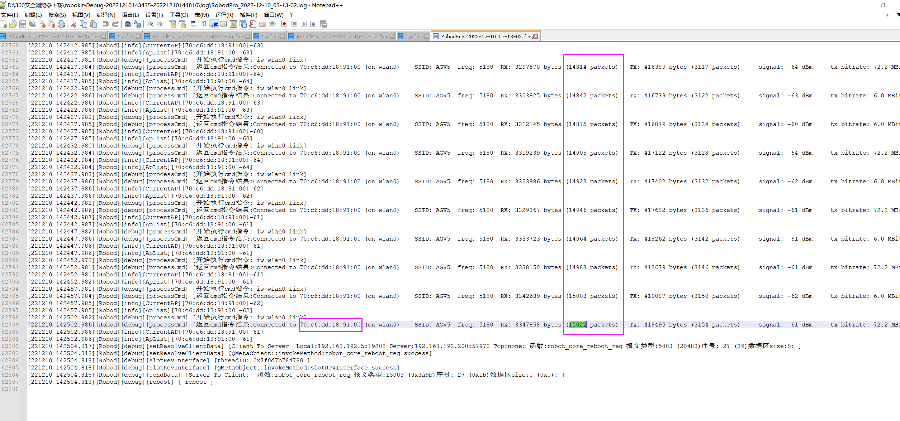

**处理过程** ：判断是用户这台 AP 有问题，可能是设置有问题 (比如网络信道)，也可能是附近有大功率干扰

**最终解决** ：用户修改了这台 AP 的网络信道解决

### 案例三(自带无线网卡问题)

**现象** ：测试发现机器人 AP 信号很差，平均在 -65 dBm

**分析** ：天线到控制器之间异常，可能是天线松动，馈线过长，馈线损坏，无线网卡脱钩

**处理过程** ：直接拆开外壳把天线拧在控制器上，测试 AP 漫游强度，发现没有任何变化

**最终解决** ：发现是控制器中无线网卡脱钩虚接，更换控制器或者增加第三方无线客户端

### 案例四(SRC-3000+Moxa)

**现象** ：SRC-3000+Moxa 后网络传输断断续续

**分析** ：可能是之前使用的自带无线网卡连过现场网络并且设置的固定 IP ，导致 IP 冲突 (搜索 Moxa 日志是否存在 IP conflict 字段)

**最终解决** ：升级 Robod 3.5.38+ 版本，使用 Roboshop 【高级配置->禁用无线网卡】 然后重启机器人。

### 案例五(tplink/客户网络未开放19301端口)

**现象** : 笔记本 Roboshop 能连上机器人(使用 tplink 连的 wifi)， Core 能 ping 通机器人但无法连接

**原因1** ：客户现场网络对小车19301端口和core之间的权限未开放

**分析方法1** ：可以使用roboshop上的网络及协议测试工具进行19301端口连接性的测试，配置截图如下；点击开始连接后如果能连接上，则不是此问题

**解决方法** ：联系客户协助解决

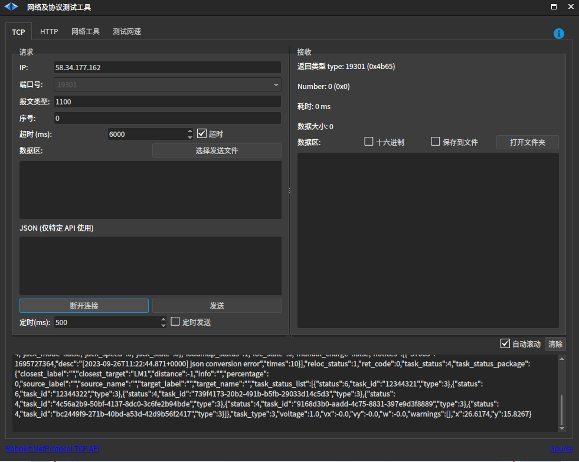

**原因2** ：tplink配置中未开放19301的端口映射

**分析方法2** : 远程查看 tplink 5G 网络中正常有数据收发，排除 tplink 未连上网络

**最终解决** : 突然发现端口转发中没有配置 19301 ， 新增后正常

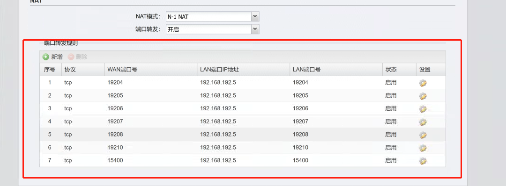

### 案例六(自带无线网卡)

**现象** : 笔记本 Roboshop 能连上机器人和 Core , 但 Core 与 机器人之间无法 ping 通

**处理过程及解决** : 远程查看 2台 地牛都有 tplink, 因为现场是 wpa-eap 就使用了自带无线网卡，最初 2 台入网都会提示 Error: Connection activation failed: IP configuration could not be reserved (no available address, timeout, etc.)

疑似现场网络动态分配 IP 时间太长导致连接超时 (命令请求网络连接会在 20s 左右超时)，与现场 IT 沟通后请求绑定静态 IP， 最终全部入网， 但其中一台无法 ping 通 Core, 经过排除是这台车之前配置的 tplink 也入网导致的，通过把以太网 IP 全部设置为 0.0.0.0 后与 Core 正常通信。

### 案例七(tplink不通)

天线公母头要配套，并不是拧上就能用的

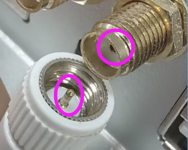

**现象** ：配置 tplink route 模式后重启后无法联网

**处理过程** ：查看 tplink 后台发现信号强度特别弱(-78 dBm)， tplink 附近的笔记本信号强度都比它强，就询问它的天线是否有问题，经沟通是使用原来moxa的天线导致，更换原装 tplink 天线后信号强度 -50 dBm。问题还是没解决，又使用 tplink 的 client 模式，配置后提示无法动态获取 IP ， 但笔记本是动态分配的 IP。

### 案例八(tplink添加不了机器人)

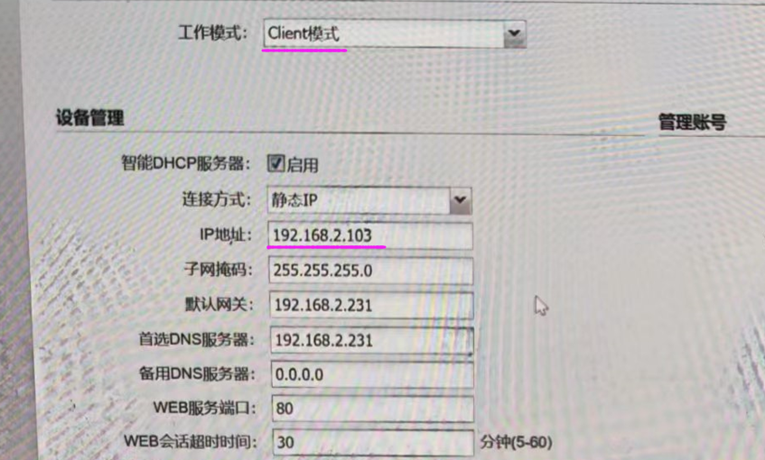

**现象** :添加机器人失败

**处理过程** ：远程控制器使用 nmcli c show 查看 eth1 正在被使用，说明 控制器与 tplink 是连上的，又查看 tplink 后台查看它使用 Client 模式，静态 IP 设置为 192.168.2.103。

打开 Roboshop->高级配置 发现以太网设置了静态 IP 也为 192.168.2.103，这与 tplink 的 静态IP 冲突了，把 tplink 中的 静态 IP 改成其他静态 IP 或者 动态 IP 解决问题。

### **案例九(tplink client 模式添加不了机器人)**

**现象** ：现场 5 台 tplink client 模式的 机器人，在关机后第二天开机随机有2~3台无法入网， tplink 配置的静态 IP 能用笔记本 ping 通，但无法连接机器人， 使用 Roboshop 高级配置[以太网]写入之前的静态 IP就能正常上网。

**处理过程** : 远程控制器使用 nmcli c show 查看 eth1 正在被使用，说明 控制器与 tplink 是连上的，又查看 tplink 后台查看它使用 Client 模式，尝试把静态 IP 改成动态 IP 问题依然存在，最后求援 tplink 技术支持，给出的解决方式是关闭客户现场使用的 AP 中继里的 AP-AC 功能（组播广播转单播导致无线 ARP 报文无法广播到 CPE 终端）

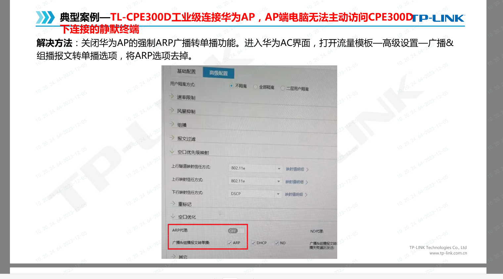

### **案例十(tplink client 模式添加不了机器人)**

**现象** ：tplink client 模式( tplink 和 控制器分别使用静态 IP 入网)， 笔记本可以 ping 通控制器， 控制器如果不ping 一次笔记本则无法通信， ping一次后就正常了。

**处理过程** : 检查网关，远程控制器输入指令查看 nmcli c show ，与 tplink 网口是否正常通信

**解决** : 发现互相互联网内其他设备占用了控制器的静态 IP，导致 IP 冲突

### 案例十一(ping 断断续续超时)

**现象** ：

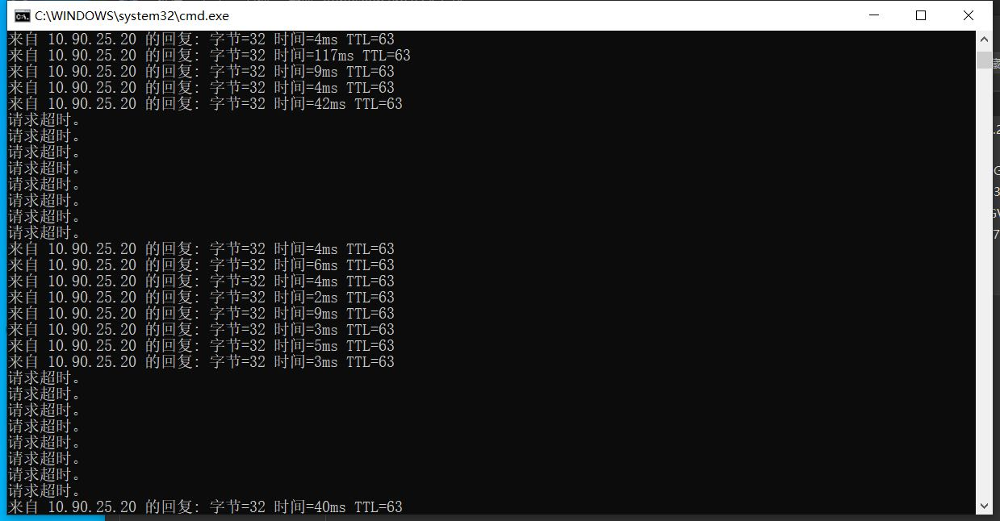

**解决** :客户路由器后台中记录的控制器 IP 地址和 MAC 地址不对，重新绑定正确的 IP 和 MAC 地址

### 案例十二(tplink client模式配置后 ping 不通)

**现象** ：

tplink-client模式配置后 ping 不通,发现是**勾选了智能DHCP服务器导致**

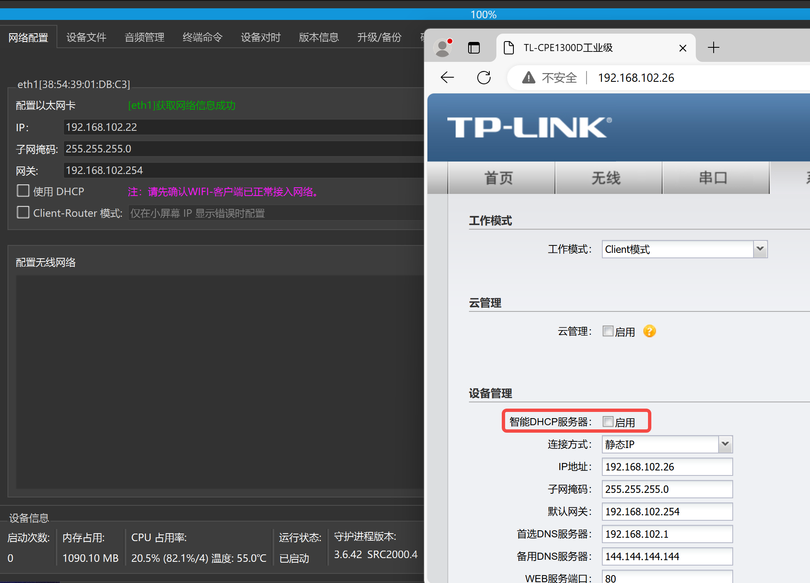