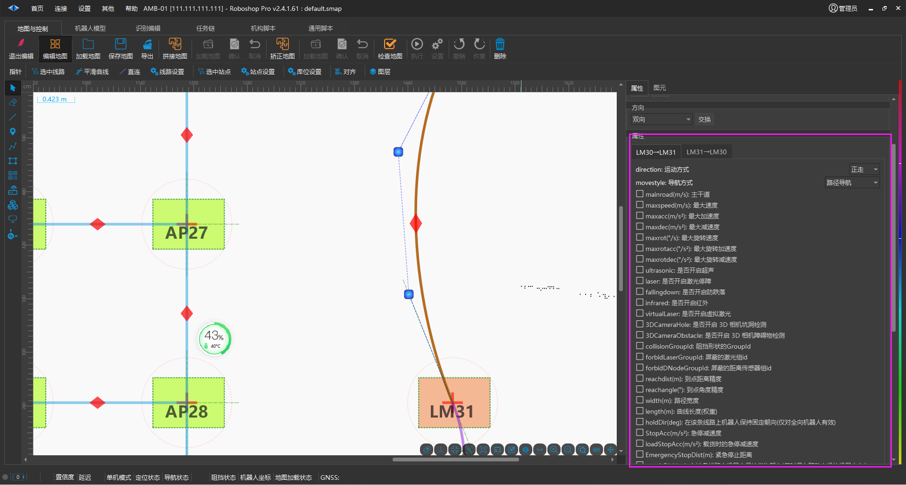

# 附录 A - 属性说明
## 贝塞尔曲线属性说明

贝塞尔曲线有如下属性（如果未在属性前打勾则不设置该属性）：

1. direction（运动方向），设置机器人是正走还是倒走。

2. movestyle（运动引导方式），设置机器人的运动引导方式。

3. maxspeed（最大速度 m/s），机器人沿该曲线运动的最大速度。

4. maxacc（最大加速度 m/s²)，机器人沿该曲线运动的最大加速度。

5. maxdec（最大减速度   m/s²），机器人沿该曲线运动的最大减速度。

6. maxrot（最大旋转速度   °/s），机器人沿该曲线运动的最大旋转速度。

7. maxrotacc（最大旋转加速度    °/s²），机器人沿该曲线运动的最大旋转加速度。

8. maxrotdec（最大旋转减速度    °/s²），机器人沿该曲线运动的最大旋转减速度。

9. ultrasonic（是否开启超声），用于开启超声功能使用。

10. laser（是否开启激光停障）

11. fallingdown（是否开启防跌落）

12. infrared（是否开启红外）

13. virtuallaser（是否开启虚拟激光）

14. 3DCameraHole（是否开启3D相机坑洞检测）

15. 3DCameraObstacle（是否开启3D相机障碍物检测）

16. collisionGroupld（阻挡形状的Groupld）

17. reachdist (到点距离精度 m)，一般情况下请勿修改。

18. reachangle（到点角度精度 °），一般情况下请勿修改。

19. width（路径宽度 m），用于启用绕行功能，一般情况下请勿修改。

20. length（曲线长度（权重）m），用于调整最短路径搜索算法的结果，一般情况下请勿修改。

21. holdDir（在该条线路上机器人保持朝向运动，仅对全向机器人有效），一般情况下请勿修改。

22. loadHoldDir（在该条线路上机器人载货状态下保持朝向运动，仅对全向机器人有效），一般情况下请勿修改。

23. unLoadHoldDir（在该条线路上机器人非载货状态下保持朝向运动，仅对全向机器人有效），一般情况下请勿修改。
    1. **三个参数都配置了：** `**holdDir** `**不会失效，而是 “优先级最低”**
    
    此时系统会按 “载货状态” 自动选择生效参数：
    
    - 全向车载货时：优先使用`loadHoldDir`（覆盖`holdDir`）
    
    - 全向车空载时：优先使用`unLoadHoldDir`（覆盖`holdDir`）
    
    - `holdDir`仅作为 “兜底”—— 若`loadHoldDir`/`unLoadHoldDir`配置异常，才会启用`holdDir`
    
    2. **配置了** `**holdDir** `**和** `**loadHoldDir** `**：** `**holdDir** `**是 “空载时的定向参数”**
    
    此时的生效逻辑：
    
    - 载货时：用`loadHoldDir`
    
    - 空载时：用`holdDir`（因为`unLoadHoldDir`未配置，默认使用`holdDir`）
    
    3. **只配置了** `**holdDir** `**：所有状态（载货 / 空载）都按** `**holdDir** `**执行**
    
    此时`holdDir`是 “全局定向参数”，无论全向车是否载货，都会在该线路保持`holdDir`设定的朝向。

4. obsStopDist（遇到障碍物时的停障距离 m），一般情况下请勿修改。

23. obsDecDist（遇到障碍物前时的提前减速距离m），一般情况下请勿修改。

24. obsExpansion（机器人碰撞预测时的膨胀宽度m），一般情况下请勿修改。

25. decObsExpansion（机器人减速碰撞预测时的膨胀宽度m）

26. broken（路线检修，不可同行）

27. parkRequired（到达目标时是否需要停车）

28. loadMaxSpeed（有货物最大速度m/s）

29. loadMaxAcc（有货物最大加速度m/s²）

30. loadMaxDec（有货物最大减速度m/s²）

31. loadMaxRot（有货物最大旋转速度°/s）

32. loadMaxRotAcc（有货物最大旋转加速度°/s²）

33. loadMaxRotDec（有货物最大旋转减速度°/s²）

34. loadObsStopDist（有货物遇到障碍物时的停障距离 m），一般情况下请勿修改。

35. loadObsDecDist（有货物遇到障碍物前时的提前减速距离m），一般情况下请勿修改。

36. goAngle（起步角度精度）

37. loadObsExpansion（有货物机器人碰撞预测时的膨胀宽度m），一般情况下请勿修改。

38. loadDecObsExpansion（有货物机器人减速碰撞预测时的膨胀宽度m）

39. collisionPointThreshold（碰撞检测激光点阈值）

40. targetObsDist（终点处障碍外检测延伸的额外距离）

41. goodCollision（是否开启货物碰撞检测）
注：movestyle 一般只使用路径导航、红外引导（自主充电）和磁条引导（需要磁导航配件），详情请咨询我司。

**一般高级属性区属性说明**

一般高级属性区有如下附加属性（如果未在属性前打勾则不设置该属性）：

1. forbidden（是否禁行），设置为 true 后，自由导航将无法进入该区域（该属性仅对自由导航有效）。

2. maxspeed（最大速度 m/s），机器人在该区域范围内运动时的最大速度。

3. maxacc（最大加速度    m/s²），机器人在该区域范围内运动时的最大加速度。

4. maxdec（最大减速度    m/s²），机器人在该区域范围内运动时的最大减速度。

5. maxrot（最大旋转速度    °/s），机器人在该区域范围内运动时的最大旋转速度。

6. maxrotacc（最大旋转加速度   °/s²），机器人在该区域范围内运动时的最大旋转加速度。

7. maxrotdec（最大旋转减速度   °/s²），机器人在该区域范围内运动时的最大旋转减速度。

8. ultrasonic（超声），机器人在该区域范围内运动时是否开启超声（如果没有设置，若机器人有该传感器则默 认开启）。

9. fallingdown（防跌落传感器），机器人在该区域范围内运动时是否开启防跌落传器（如果没有设置，若机器 人有该传感器则默认开启）。

10. infrared（红外传感器），机器人在该区域范围内运动时是否开启红外传感器（如果没有设置，若机器人有 该传感器则默认开启）。

11. laser（是否开启激光避障）

12. virtualLaser（是否开启虚拟激光）

13. 3DCameraHole（是否开启3D相机坑洞检测）

14. 3DCameraObstacle（是否开启3D相机障碍物检测）

15. collisionGroupld（阻挡形状的Groupld）

16. openSound（是否开启机器人的音频）

17. weight（权重），目前无效。

18. obsStopDist（遇到障碍物时的停障距离 m），一般情况下请勿修改。

19. obsDecDist（遇到障碍物前时的提前减速距离    m），一般情况下请勿修改。

20. obsExpansion（机器人碰撞预测时的膨胀宽度    m），一般情况下请勿修改。

21. loadMaxSpeed（有货物最大速度m/s），一般情况下请勿修改。

22. loadMaxAcc（有货物最大加速度m/s²），一般情况下请勿修改。

23. loadMaxDec（有货物最大减速度m/s²），一般情况下请勿修改。

24. loadMaxRot（有货物最大旋转速度°/s），一般情况下请勿修改。

25. loadMaxRotAcc（有货物最大旋转加速度°/s²），一般情况下请勿修改。

26. loadMaxRotDec（有货物最大旋转减速度°/s²），一般情况下请勿修改。

27. loadObsStopDist（有货物遇到障碍物时的停障距离 m），一般情况下请勿修改。

28. loadObsDecDist（有货物遇到障碍物前时的提前减速距离），一般情况下请勿修改。

29. loadObsExpansion（有货物机器人碰撞预测时的膨胀宽度m），一般情况下请勿修改。

30. loadDecObsExpansion（有货物机器人减速碰撞预测时的膨胀宽度m），一般情况下请勿修改。

31. collisionPointThreshold（碰撞检测激光点阈值），一般情况下请勿修改。

32. stopConfidence（停止置信度阈值），一般情况下请勿修改。

**属性的优先级**

对于 maxspeed，maxacc，maxrot，maxrotacc 这 4 个属性，同时存在于贝塞尔曲线和一般高级属性区中， 而且在机器人参数配置中，也可以配置这 4 个参数。因此需要规定属性的优先级。

- 机器人参数配置中设置的是全局参数，如果机器人所沿曲线没有设置这些属性而且机器人也没有进入设置了这些属性的区域，那么机器人将使用全局的参数。

- 如果机器人只沿着设置了这些属性的曲线运动，而没有进入设置了这些属性的区域，机器人将采用曲线上设置的属性，全局参数将被忽略。

- 如果机器人只进入设置了这些属性的区域，而没有沿着设置了这些属性曲线的运动，机器人将采用区域中设置的属性，全局参数将被忽略。

- 如果机器人既沿着设置了这些属性的曲线运动，又进入了设置了这些属性的区域，机器人将采用更严格的属性，全局属性仍被忽略。如，曲线上设置maxspeed 为 0.4 m/s，区域中设置 maxspeed 为 0.1 m/s，所谓的更严格即更小， 0.1 < 0.4，所以机器人将采用 0.1 m/s。其他 3 个参数同理。这 4 个属性是相互独立的。

对于 obsStopDist，obsDecDist，obsExpansion这 3 个属性，同时存在于贝塞尔曲线和一般高级属性区中， 而且在机器人参数配置中，也可以配置这 3 个参数。因此需要规定属性的优先级。

- 机器人参数配置中设置的是全局参数，如果机器人所沿曲线没有设置这些属性而且机器人也没有进入设置了这些属性的区域，那么机器人将使   用全局的参数。

- 如果机器人只沿着设置了这些属性的曲线运动，而没有进入设置了这些属性的区域，机器人将采   用曲线上设置的属性，全局参数将被忽略。

- 如果机器人只进入设置了这些属性的区域，而没有沿着设置了这些属   性曲线的运动，机器人将采用区域中设置的属性，全局参数将被忽略。

- 如果机器人既沿着设置了这些属性的曲线   运动，又进入了设置了这些属性的区域，机器人将采用更安全的属性，全局属性仍被忽略。如，曲线上设置obsStopDist 为 0.4m ，区域中设置 obsStopDist 为 1.0m，所谓的更安全即更大， 0.5 < 1.0，所以机器人将采用 obsStopDist = 1.0m。其他 2 个参数同理。这 3 个属性是相互独立的。