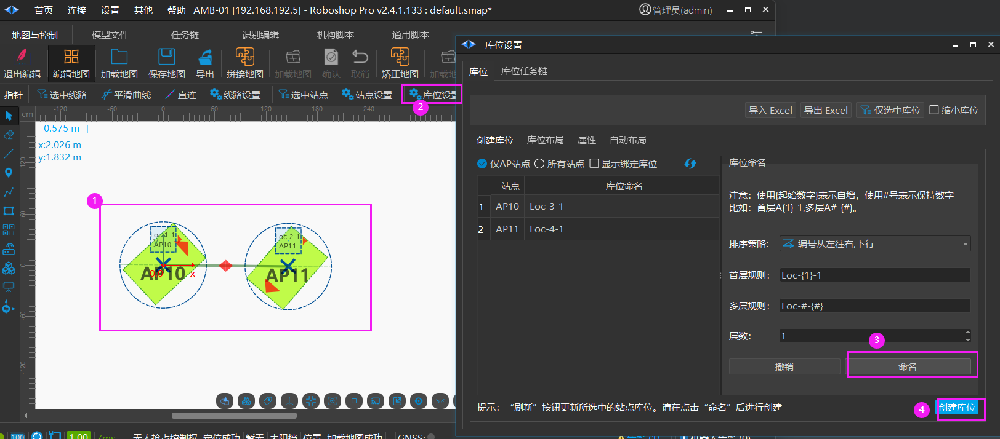
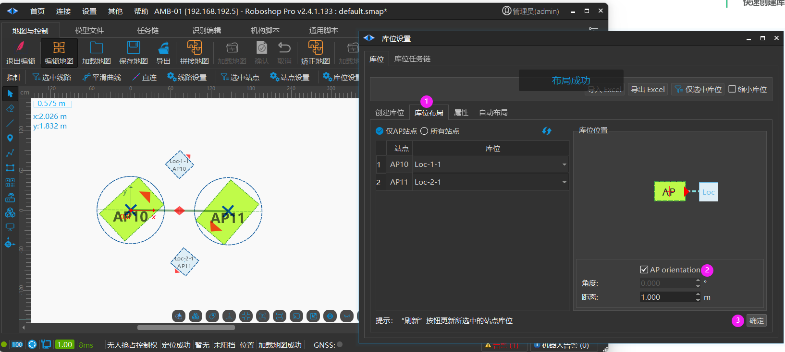
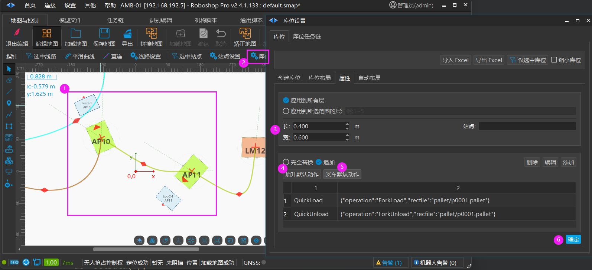
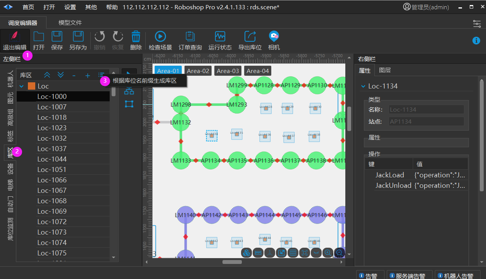
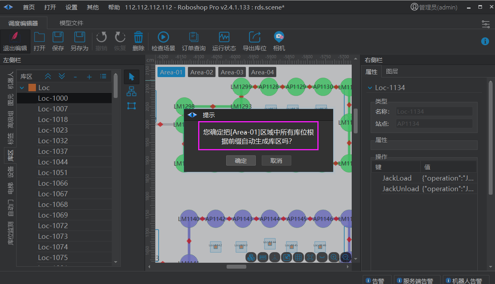

# 叉车快速实施
> 💡 
> Roboshop 2.4.1.133+ 以上版本支持

## 快速创建库位

### 批量创建库位

1. 鼠标框选 AP 点

2. 鼠标点击库位设置

3. 鼠标点击命名，默认会按规则生成库位名称.
    1. 生成规则: Loc-{1}-1 表示 Loc-固定字段，{1}表示从1开始自增。

4. 创建库位:自动在站点的 90 °方向 0.3米距离新增 AP 点

### 批量调整库位位置

1. 库位布局

2. 库位距离保持 AP 方向

3. 确定调整

### 批量创建动作

1. 鼠标框选库位

2. 鼠标点击库位设置

3. 设置库位的长(箭头所在的边定义为长)和宽

4. 顶升默认动作

5. 叉车默认动作

6. 确定修改所有鼠标框选的库位（Ctrl+Z 或者界面上的撤销可以还原）

### 根据库位名前缀生成库区

例如: Loc-1-1 则会生成一个 Loc 命名的库区并把所有 Loc-开头的库位添加到这个库区

1. 启用编辑

2. 库区

3. 鼠标点击菜单->根据库位名前缀生成库区 (仅筛选当前区域中的库位自动生成库区)