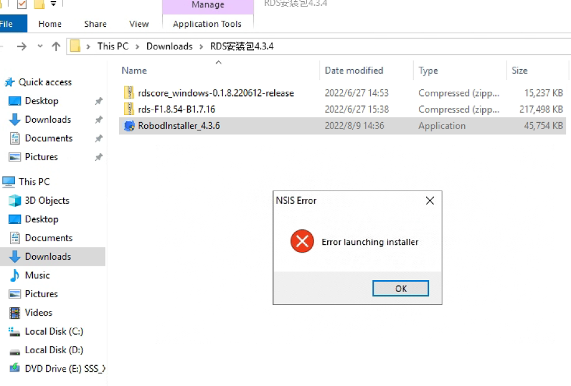

# 实施部署注意事项
## 调度英文操作系统部署

**解决方式** 

把 RobodInstaller_4.3.6 文件拷贝到全英文路径

## 5G 实施部署

1. Roboshop 取日志文件和升级机器人时需要插网线，添加192.168.192.5 机器人进行 （最好把笔记本的无线关闭进行）

2. 高级配置中禁用无线网卡

3. 使用 Roboshop 删除机器人中不需要的地图，需要备份地图请添加192.168.192.5 机器人进行下载备份地图。

4. Roboshop 调度编辑器[机器人->扫帚图标(清除冗余所有地图)]

5. 实施告一段落后关闭 Roboshop

**尽可能减少无线操作，节约流量。**