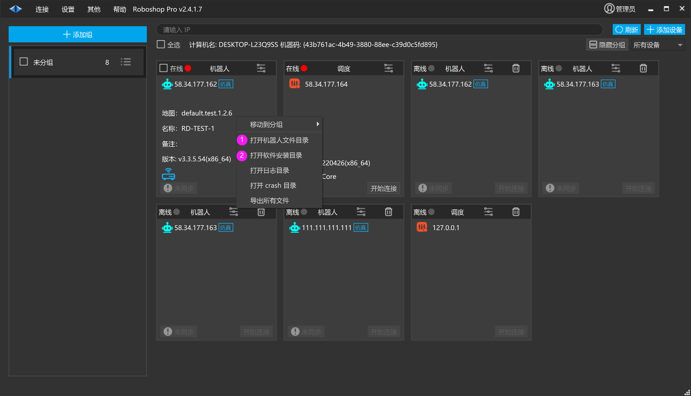

# 数据迁移到新的计算机

① 打开 Roboshop 资源文件在 window 系统目录的存放路径

例如:C:\Users\用户\AppData\Local\RoboshopPro

RoboshopPro 文件夹则为整个资源文件

② 打开 Roboshop 在 window 系统安装目录

分别把 ①② 文件夹压缩拷贝到新的计算机

1. 在新的计算机上解压 ② 并运行 RoboshopPro.exe 应用程序

2. 【打开机器人文件目录】替换 C:\Users\用户\AppData\Local\RoboshopPro 中的 RoboshopPro 文件夹

3. 重启 RoboshopPro.exe 即可