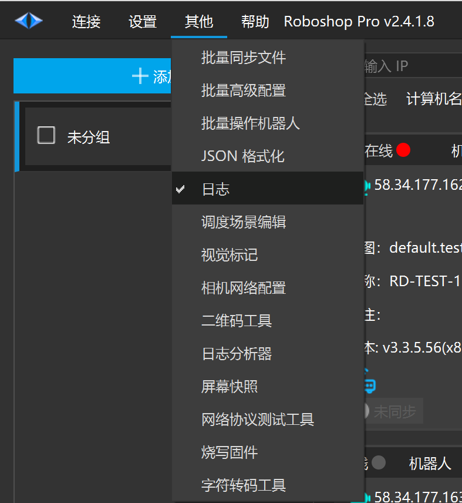
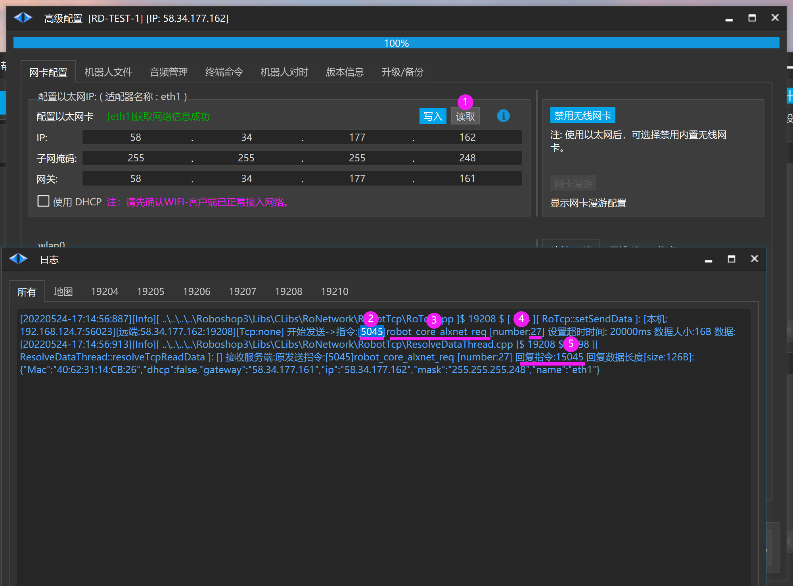

# 查看 Roboshop 使用的 API

1. 以高级配置【读取】eth1 网卡信息为例，当鼠标点击【读取】按钮后，日志会输出如上图所示

2. 远端
    1. IP: 58.34.177.162
    
    2. 端口号:19208
    
    3. 指令:5045

4. [robot_core_alxnet_req]

5. 序号：27

6. 回复指令：15045 返回数据长度[size:126B]:[数据{...}]