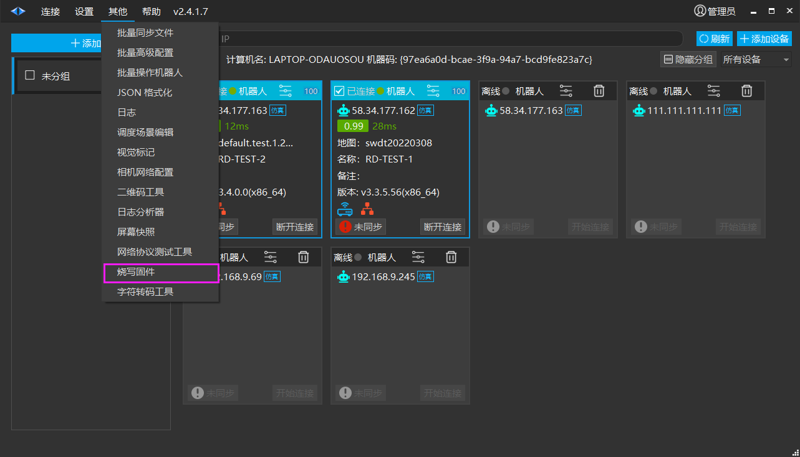
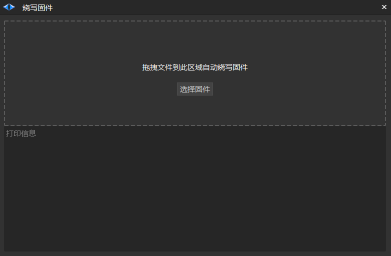
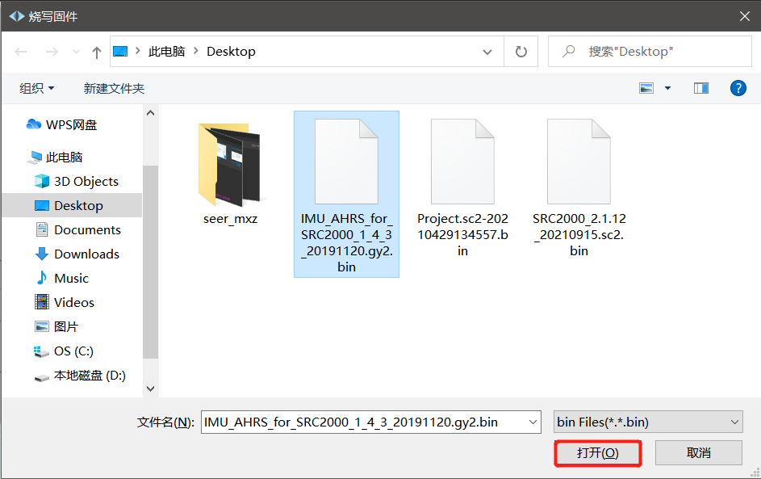
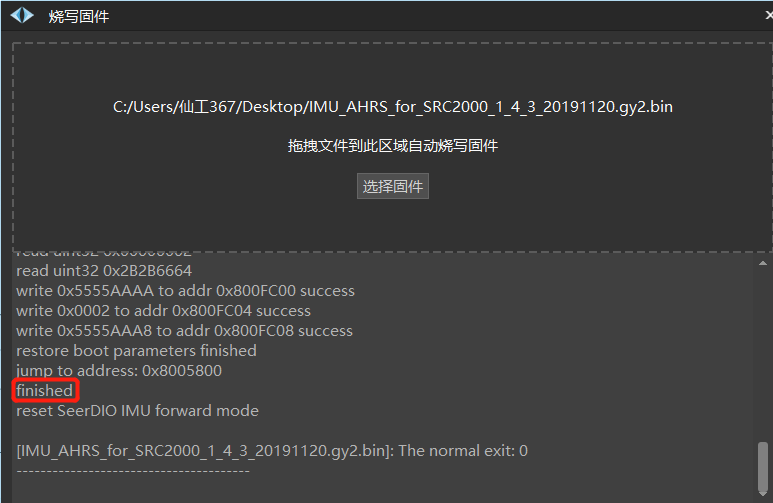

# 烧写固件
用于更新底层固件版本。

## 烧写固件步骤

**注意：烧写固件时需要使用网线连接需要升级固件的机器人**

1. 点击【其他】，选择【烧写固件】。

2. 弹出以下界面。

3. 点击【选择固件】，选择需要固件，点击打开。

4. 直到出现【finished】，烧写完成。

## 注意事项

- 烧写固件完毕后将自动重启固件，期间机器人可能发出报警，稍等报警会自动消除。

- 烧写固件的整个过程中请保证计算机与机器人网线稳定连接。

- 请确保机器人有足够的电量（大于 20%）后再进行烧写固件的操作。

- 烧写固件的整个过程中请勿对机器人进行断电、关机、重启操作。