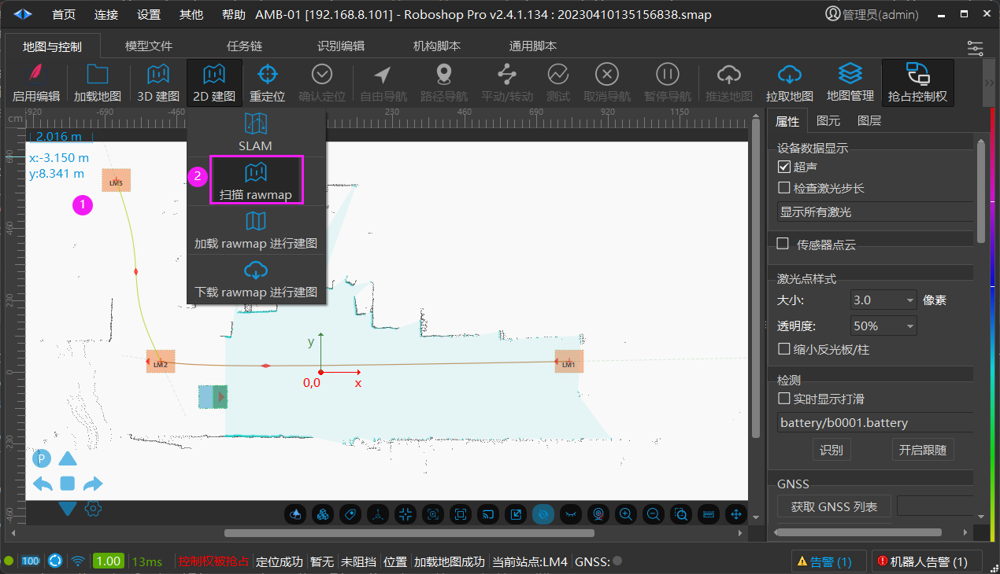
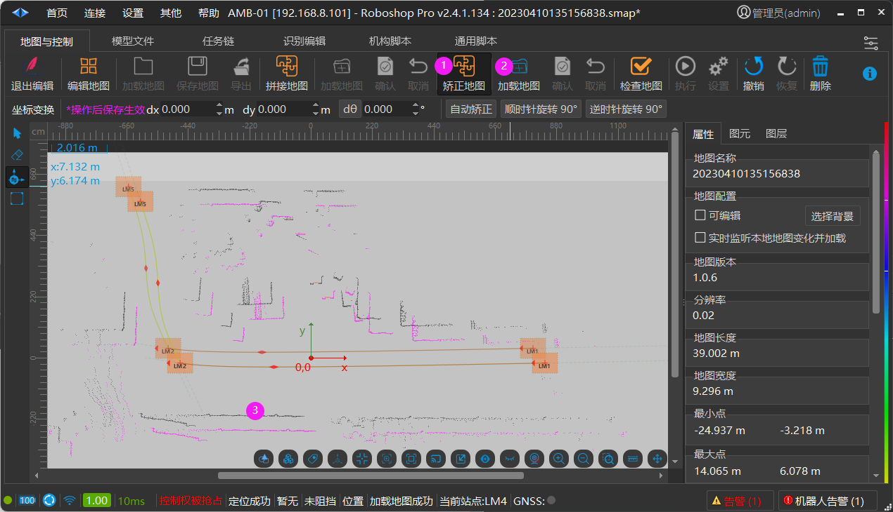
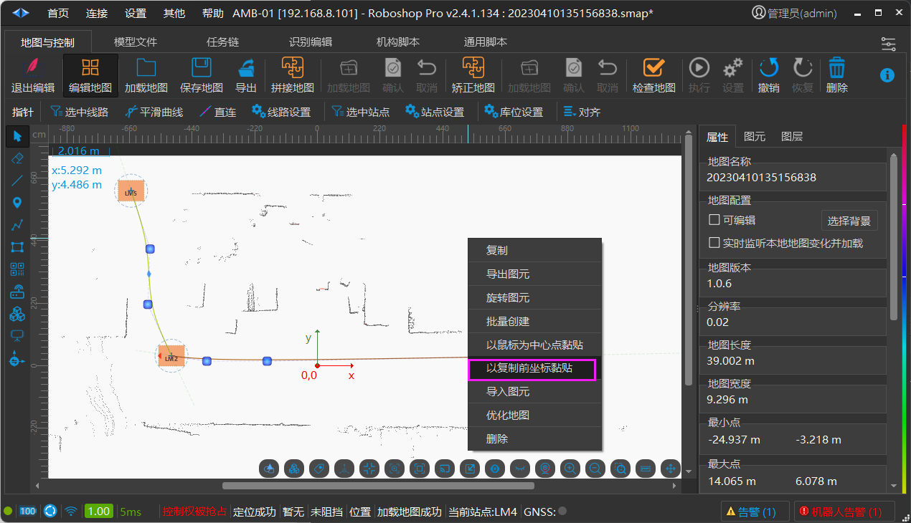

# 重新扫图合并站点线路
> 💡 
> **Roboshop 2.4.1.100+ **

## 背景

当现场地图不理想地图上又添加了很多站点和线路，需要重新扫图把站点和线路黏贴到新地图上

### 重新扫图

1. 把当前地图另存为，利用地图中的站点创建机器人路径导航的任务链

2. 点击【扫描 rawmap】此时机器人处于离线扫图状态(机器人不依赖网络)

此时执行路径导航任务链，机器人就能边行走边扫图了，扫完的 **新地图 ** 保存并打开。

### 矫正地图

1. 启用编辑->矫正地图

2. 【加载地图】加载之前保存的 **旧地图 ** ，鼠标左键控制地图移动，Ctrl+鼠标左键控制地图旋转，让加载的旧地图与底层的新地图普通点尽量重合，鼠标点击【确认】会按新地图的坐标保存旧地图，此时再打开一个 Roboshop 打开这张调整后的旧地图，把站点和路径(Ctrl+A 全选) 复制， 在新地图上以复制前坐标黏贴，如下图:

