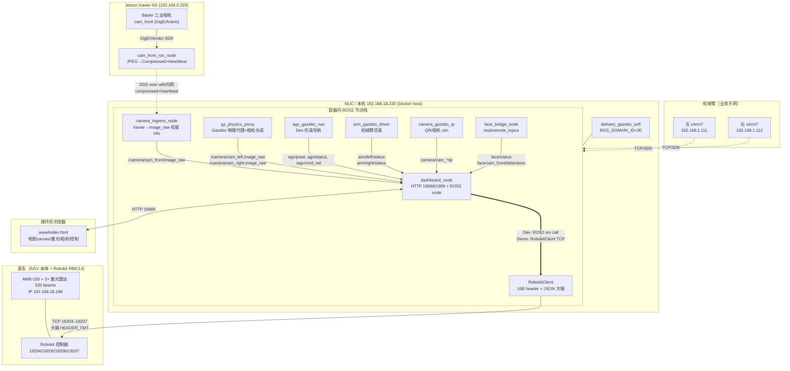
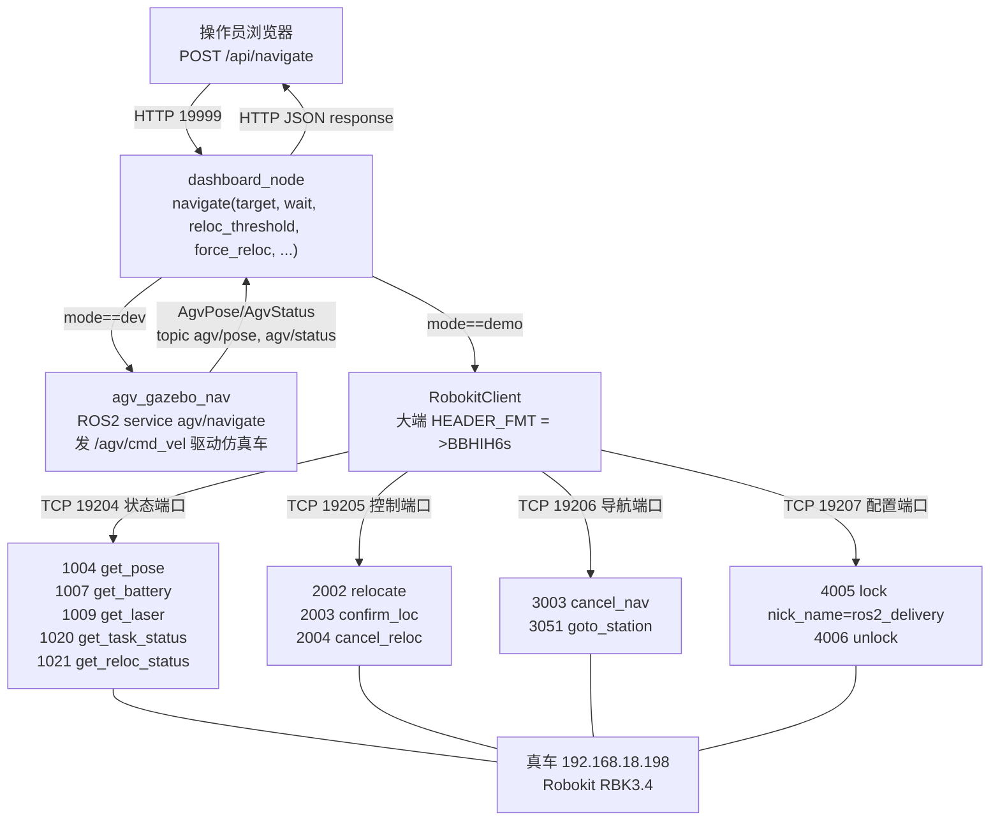
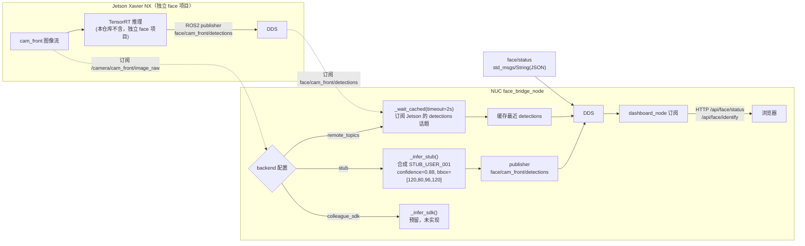
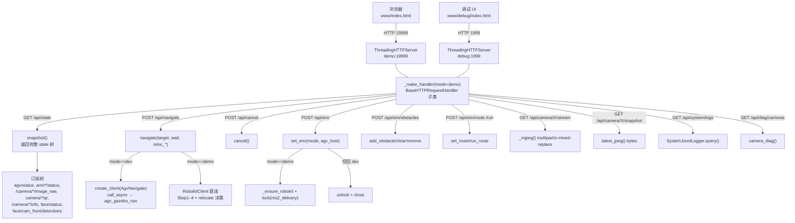
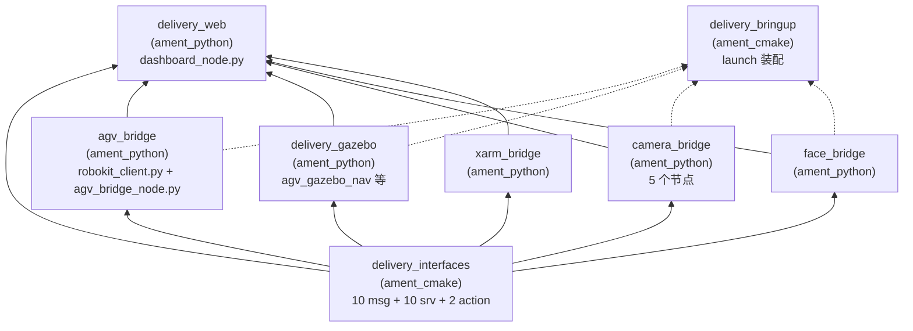

# AGV 送货机器人 v0.2.0 — 本周完成节点 + 详细技术实现

> **用途**：本文件为 PPT 素材文档，供作者据此撰写 PPT。所有内容均已对齐 v0.2.1 实测代码与 `20260807_TRAE接手交接书.md` §1–§8 + `reports/20260807_171708_TRAE接手开场_v0.2.1.md` §11–§12。
> **生成时间**：2026-08-07（Asia/Shanghai）
> **项目根**：`/home/ubuntu/Pengfei.Hao/AGV_Delivery_v0.2.0_20260807_0921/`
> **当前版本**：`v0.2.1`（freeze 标签 `v0.2.0`）
> **门禁状态**：受控联调/彩排，**未宣称 Demo 就绪**（G3/G4/G5/G6/G7 待真车闭环）

---

## 第 1 章 项目总览

### 1.1 AGV 送货机器人 v0.2.0 是什么

AGV 送货机器人 v0.2.0 是面向工业场景的**自主移动 + 双臂取放**的送货解决方案，本仓库为 ROS2 Humble 实现，对外提供：

- **Dashboard Web 控制台**（Demo `:19999` / Debug `:1999`）：操作员可视化发车、看地图/激光/相机/机械臂/人脸
- **Robokit TCP 客户端**：直连仙工 SEER Robokit 控制器，按 Robokit 二进制协议（16B header + JSON body）打 4 个 TCP 端口
- **Gazebo 仿真闭环**：Dev 模式下不依赖真车，用 `agv_gazebo_nav` + `gz_physics_proxy` 跑通整套 ROS2 接口
- **工业相机 ROS2 契约**：Xavier → NUC `camera_ingress` → Dashboard 的 `compressed + heartbeat` 看门狗链路
- **机械臂 / 人脸 / QR 桥接**：xArm7、Face Bridge（stub/remote_topics/colleague_sdk）、AprilTag/QR 检测

v0.2.0 的关键定位（必背）：

| 模式 | 含义 | 控车主体 |
|------|------|----------|
| **Dev** | Gazebo / `agv_gazebo_nav` + smap | `agv_gazebo_nav` 发 `/agv/cmd_vel` |
| **Demo** | **Dashboard → `RobokitClient` TCP** → 真车 `192.168.18.198` | `dashboard_node` 直连（soft boot 不起 `agv_bridge_node`） |
| **Roboshop** | 仙工 GUI 配车/诊断 | 联调前必须释放 `4005` 锁 |
| **Mock** | `robokit_mock_server` 在 `127.0.0.1` | 仅证明客户端协议自洽，**不证明真车 OK** |

### 1.2 系统组成

```
┌─────────────────────────────────────────────────────────────────┐
│                    AGV 送货机器人 v0.2.0 系统                    │
├──────────────┬──────────────────────────────────────────────────┤
│  AGV 本体    │ 仙工 AMB-150 + Robokit RBK3.4 控制器             │
│              │ 4 端口 TCP：19204(状态)/19205(控制)/19206(导航)/  │
│              │ 19207(配置)；2 个激光雷达 520 beams              │
├──────────────┼──────────────────────────────────────────────────┤
│  Robokit     │ 车端固件 RBK3.4（ver=1），运行任务状态机/路径规划│
│  控制器      │ 文档 API 1004/1007/1009/1020/1021/2002/2003/2004/│
│              │ 3003/3051/4005/4006                              │
├──────────────┼──────────────────────────────────────────────────┤
│  工业相机    │ cam_left(相机1, QR)/cam_front(相机2, 人脸+QR)/    │
│              │ cam_right(相机3, 货物+第三视角)                  │
├──────────────┼──────────────────────────────────────────────────┤
│  Jetson      │ Xavier NX，跑 cam_front_ros_node：Basler+Aravis  │
│  (192.168.   │ → JPEG → ROS2 compressed+heartbeat → DDS → wifi  │
│   0.225)     │ legacy：HTTP :8080 MJPEG                         │
├──────────────┼──────────────────────────────────────────────────┤
│  机械臂      │ 左右 xArm7（192.168.1.111 / 192.168.1.112）      │
│              │ arm/left/status + arm/right/status + 序列服务    │
├──────────────┼──────────────────────────────────────────────────┤
│  Dashboard   │ dashboard_node：HTTP server + ROS2 node 合体     │
│  (NUC)       │ Dev→Gazebo 服务调用；Demo→RobokitClient TCP     │
└──────────────┴──────────────────────────────────────────────────┘
```

### 1.3 网络拓扑

- **本机 NUC**：`192.168.18.230`（公司内网 wlp0s20f3，与真车同网段）
- **真车 AGV**：`192.168.18.198`（同网段直连）
- **Jetson Xavier**：`192.168.0.225`（业务子网，与 AGV 网段隔离）
- **xArm7 双臂**：`192.168.1.111` / `192.168.1.112`（业务子网）
- **本机内网 IP（家宽/随身 WiFi）**：`192.168.0.173`（跨网段，连不到真车）
- **TCP 端口（真车）**：`19204 loc_status / 19205 query / 19206 nav / 19207 config`
- **DDS 域**：`ROS_DOMAIN_ID=30`（约定全局，相机/AGV/face 同域）
- **容器**：`delivery_gazebo_soft`（image: `delivery-ros2:humble-gazebo-v02`，`network_mode: host`）

### 1.4 系统架构（Mermaid）



---

## 第 2 章 本周完成节点清单

> **本周（2026-08-07）TRAE 接手后的完成事项**，按交付物分类。每项均带验证方式 + 关键文件路径。

| # | 交付物 | 状态 | 验证方式 | 关键文件路径 |
|---|--------|------|----------|--------------|
| 1 | **Docker 复跑** | ✅ PASS | 容器 `delivery_gazebo_soft` Up 6h；`smoke_v02.sh` 6/6 PASS；源码与 `.run/workspace_v02` 树同步 OK | [`docker/docker-compose.yml`](file:///home/ubuntu/Pengfei.Hao/AGV_Delivery_v0.2.0_20260807_0921/workspace_v02/docker/docker-compose.yml) · [`docker/boot_gazebo_lite.sh`](file:///home/ubuntu/Pengfei.Hao/AGV_Delivery_v0.2.0_20260807_0921/workspace_v02/docker/boot_gazebo_lite.sh) |
| 2 | **真车网络联通** | ✅ PASS | 本机切到 `192.168.18.230` 同网段；`ping` 0% 丢包；`nc -vz 192.168.18.198 19204–19207` 全 succeeded | 报告 `reports/20260807_171708_TRAE接手开场_v0.2.1.md` §11.1 |
| 3 | **真车只读 API 验证** | ✅ PASS 4/4 | 直连真车仅打只读 API：1004/1007/1009/1020 全 PASS；未抢锁/未导航/未让车动 | 同上 §12.4 |
| 4 | **Robokit 字节序 bug 修复** | ✅ DONE | `HEADER_FMT` 由小端 `<` 改为大端 `>`；修复后真车 1004/1007/1009/1020 全通；Mock 回归无破 | [`robokit_client.py#L58`](file:///home/ubuntu/Pengfei.Hao/AGV_Delivery_v0.2.0_20260807_0921/workspace_v02/ros2_ws/src/agv_bridge/agv_bridge/robokit_client.py#L58) · [`robokit_mock_server.py#L24`](file:///home/ubuntu/Pengfei.Hao/AGV_Delivery_v0.2.0_20260807_0921/workspace_v02/ros2_ws/src/agv_bridge/agv_bridge/robokit_mock_server.py#L24) |
| 5 | **relocate 决策逻辑补齐** | ✅ DONE | 新增 `get_reloc_status/relocate/confirm_loc/cancel_reloc/wait_reloc_done`；Dashboard `navigate()` 加 PRE-CHECK + Step1–4；Mock 7 Case + 1 Bonus 全 PASS | [`robokit_client.py#L277-L520`](file:///home/ubuntu/Pengfei.Hao/AGV_Delivery_v0.2.0_20260807_0921/workspace_v02/ros2_ws/src/agv_bridge/agv_bridge/robokit_client.py#L277) · [`dashboard_node.py#L1222-L1428`](file:///home/ubuntu/Pengfei.Hao/AGV_Delivery_v0.2.0_20260807_0921/workspace_v02/ros2_ws/src/delivery_web/delivery_web/dashboard_node.py#L1222) · [`scripts/smoke_test_relocate_decision.py`](file:///home/ubuntu/Pengfei.Hao/AGV_Delivery_v0.2.0_20260807_0921/workspace_v02/scripts/smoke_test_relocate_decision.py) |
| 6 | **source_id 真车坑修复** | ✅ DONE | 默认不传 `source_id`（仅 `{"id":"<target>"}`）；符合 2026-07-28 同事真车实测；Case 7 验证 payload 不含 source_id | [`robokit_client.py#L220-L252`](file:///home/ubuntu/Pengfei.Hao/AGV_Delivery_v0.2.0_20260807_0921/workspace_v02/ros2_ws/src/agv_bridge/agv_bridge/robokit_client.py#L220) · [`dashboard_node.py#L1381-L1394`](file:///home/ubuntu/Pengfei.Hao/AGV_Delivery_v0.2.0_20260807_0921/workspace_v02/ros2_ws/src/delivery_web/delivery_web/dashboard_node.py#L1381) |
| 7 | **Mock 测试覆盖** | ✅ PASS | `smoke_test_relocate_decision.py` 7 Case + 1 Bonus = 8 用例全 PASS；`smoke_robokit_mock.sh` `ALL_ROBOKIT_MOCK_SMOKE_PASSED` | [`scripts/smoke_robokit_mock.sh`](file:///home/ubuntu/Pengfei.Hao/AGV_Delivery_v0.2.0_20260807_0921/workspace_v02/scripts/smoke_robokit_mock.sh) · [`scripts/smoke_test_relocate_decision.py#L171-L321`](file:///home/ubuntu/Pengfei.Hao/AGV_Delivery_v0.2.0_20260807_0921/workspace_v02/scripts/smoke_test_relocate_decision.py#L171) |
| 8 | **相机增量包打包交付** | ✅ DONE | tarball 43 文件，SHA256 = `6c1c5480d2cfb405df54918c2fe98f3091b7a1ef4760d3b4e4f1e885c5726542`；包含 `delivery_interfaces/{msg,srv,action}` + `camera_bridge/` 完整目录 | `/home/ubuntu/Pengfei.Hao/note/团队交接/20260807_182819_delivery_interfaces_camera_bridge.tar.gz` |
| 9 | **交接书 §1-§8 完整文档化** | ✅ DONE | 9 章 + 8.1–8.9 节，覆盖报告模板、API 矩阵、Mock vs 真车、relocate 决策树、风险边界 | [`note/20260807_TRAE接手交接书.md`](file:///home/ubuntu/Pengfei.Hao/note/20260807_TRAE接手交接书.md) |
| 10 | **Web HTTP API 验证（Dev）** | ✅ PASS 22/22 | `/api/health` `/api/version` `/api/env` GET+POST（含非法 mode 拒绝）`/api/state` `/api/debug` `/api/diag/cameras` `/api/system/logs` `/api/face/*` `/api/sim/*` `/api/navigate` `/api/cancel` `/api/arm_sequence` `/api/detect_qr` 全 PASS | 报告 §3 |
| 11 | **T0.5 唯一控车方确认** | ✅ DONE | `boot_gazebo_lite.sh` 进程清单无 `agv_bridge_node`，Demo 唯一打真车方为 `dashboard_node` | [`boot_gazebo_lite.sh`](file:///home/ubuntu/Pengfei.Hao/AGV_Delivery_v0.2.0_20260807_0921/workspace_v02/docker/boot_gazebo_lite.sh) |

### 真车实测快照（2026-08-07 17:34，仅只读 API）

| 字段 | 真车实测值 | 备注 |
|------|------------|------|
| 固件版本 | RBK3.4（ver=1） | ver=2 被车端拒绝 |
| `current_station` | `LM7` | **真车站点 ≠ Mock 假设 LM1/LM2** |
| `confidence` | 0.808 | 0.5 < 0.85 阈值以下，relocate 会被触发 |
| `battery_level` | 0.561 / 56.1% | 中等电量 |
| `voltage` | 52.31 V | — |
| `charging` | False | — |
| `task_status` | 0 (NONE) | 车空闲 |
| `lasers` | 2 个激光器，520 beams | 首角 -130°（度） |
| 位姿 `x/y/angle` | -0.213 / -0.867 / -2.615 rad | — |

---

## 第 3 章 详细技术实现链路（核心）

> 用户原话：「工业相机→以太网→Jetson→opencv→TensorRT→wifi→节点→ros2→dds→蹬蹬蹬地的，非常详细的，文件架构，数据格式等等的」
> 以下每条链路均带 Mermaid 流程图 + 数据格式表 + 关键代码引用。

### 3.1 工业相机链路（重点）

#### 3.1.1 链路全图（Mermaid）

```mermaid
flowchart LR
    A["Basler 工业相机<br/>(GigE Vision / Aravis SDK)"] -->|以太网 GigE| B["Jetson Xavier NX<br/>192.168.0.225<br/>cam_front_ros_node"]
    B -->|"app.capture.gige_capture.GigeCapture<br/>(Aravis/Basler SDK)"| C["图像采集<br/>cap.read() → frame"]
    C -->|opencv cv2.imencode<br/>JPEG quality=70| D["JPEG bytes<br/>(可选 resize 640×480)"]
    D -->|CompressedImage.msg<br/>qos_profile_sensor_data| E["/camera/cam_front/image_raw/compressed<br/>(BEST_EFFORT)"]
    B -->|CameraHeartbeat.msg<br/>RELIABLE keep1| F["/camera/cam_front/heartbeat<br/>seq/uptime/fps/link_ok/error"]
    B -->|String(JSON) RELIABLE| G["/camera/cam_front/status<br/>transport=xavier_ros2"]
    B -.->|CameraInfoLite RELIABLE<br/>(非权威，可选)| H["/camera/cam_front/driver_info"]

    E -->|DDS FastRTPS<br/>ROS_DOMAIN_ID=30| I["NUC: camera_ingress_node"]
    F -->|DDS| I
    G -->|DDS| I
    I -->|PIL/cv2.imdecode<br/>JPEG→rgb8| J["/camera/cam_front/image_raw<br/>sensor_msgs/Image rgb8"]
    I -->|看门狗<br/>hb_timeout=1.5s| K["/camera/cam_front/info<br/>(权威！transport=xavier_ros2 / xavier_ros2_waiting)"]

    J -->|订阅| L["dashboard_node"]
    K -->|订阅| L
    L -->|JPEG/PNG 转码| M["浏览器 /api/camera/cam_front/snapshot<br/>+ /api/camera/cam_front/stream (MJPEG)"]

    subgraph Legacy["Legacy 链路（不推荐，已被 ROS2 替代）"]
        B2["xavier_cam_front_bridge"] -->|HTTP GET :8080/stream<br/>multipart MJPEG| L2["JPEG markers FF D8 / FF D9<br/>→ Image rgb8"]
    end
```

#### 3.1.2 数据格式表

**Xavier 端发布（`cam_front_ros_node`）：**

| ROS2 话题 | msg 类型 | QoS | 关键字段 | 频率 |
|-----------|----------|-----|----------|------|
| `/camera/cam_front/image_raw/compressed` | `sensor_msgs/CompressedImage` | `qos_profile_sensor_data`（BEST_EFFORT, KEEP_LAST depth=5/10） | `header.stamp/frame_id` `format="jpeg"` `data=JPEG bytes` | `target_fps` 默认 10 Hz |
| `/camera/cam_front/heartbeat` | `delivery_interfaces/CameraHeartbeat` | RELIABLE, KEEP_LAST, depth=1, VOLATILE | `seq/uptime_sec/fps_actual/frames_total/frames_dropped/link_ok/device_id/error_code/error_msg` | `heartbeat_hz` 默认 2 Hz |
| `/camera/cam_front/status` | `std_msgs/String`（JSON） | RELIABLE, KEEP_LAST, depth=1 | `{"ok","camera_name","transport":"xavier_ros2"/"xavier_ros2_waiting","peer":"xavier","domain_id":30,"width","height","fps","link_ok","last_error","seq","device_id","frames_total","frames_dropped"}` | `status_hz` 默认 1 Hz |
| `/camera/cam_front/driver_info` | `delivery_interfaces/CameraInfoLite` | RELIABLE, depth=1（**非权威**，可选） | `width/height/fps/connected/transport="xavier_ros2"` | 同 heartbeat |

**NUC 端发布（`camera_ingress_node` 权威）：**

| ROS2 话题 | msg 类型 | QoS | 关键字段 |
|-----------|----------|-----|----------|
| `/camera/cam_front/image_raw` | `sensor_msgs/Image` | depth=5 | `encoding="rgb8"` `step=w*3` `data=RGB bytes`（PIL/cv2 解码后） |
| `/camera/cam_front/info` | `delivery_interfaces/CameraInfoLite` | depth=10 | **看门狗强制覆盖 connected**：`hb_age>1.5s` 或帧龄过大 → `connected=false`、`transport="xavier_ros2_waiting"` |

#### 3.1.3 节点职责对照

| 节点 | 文件 | 职责 |
|------|------|------|
| `cam_front_ros_node` | [`cam_front_ros_node.py`](file:///home/ubuntu/Pengfei.Hao/AGV_Delivery_v0.2.0_20260807_0921/workspace_v02/ros2_ws/src/camera_bridge/camera_bridge/cam_front_ros_node.py) | Xavier 端骨架；尝试 `from app.capture.gige_capture import GigeCapture`（Aravis/Basler SDK），打开失败保持 `link_ok=false`；JPEG 编码 `cv2.imencode(".jpg", frame, [IMWRITE_JPEG_QUALITY, 70])` |
| `camera_ingress_node` | [`camera_ingress_node.py`](file:///home/ubuntu/Pengfei.Hao/AGV_Delivery_v0.2.0_20260807_0921/workspace_v02/ros2_ws/src/camera_bridge/camera_bridge/camera_ingress_node.py) | NUC 端权威 ingress；订阅 compressed+heartbeat+status，解码 JPEG→rgb8 Image；看门狗每 0.5s 检查 `hb_age ≤ 1.5s` 决定 `connected`；订阅 status JSON 取 `fps` |
| `camera_sim_node` | [`camera_sim_node.py`](file:///home/ubuntu/Pengfei.Hao/AGV_Delivery_v0.2.0_20260807_0921/workspace_v02/ros2_ws/src/camera_bridge/camera_bridge/camera_sim_node.py) | 仿真相机，发布 `mono8` 灰度图 + `QrDetectionArray`（注入 `STATION_LM2` AprilTag）；用于 Dev 接口验收 |
| `camera_bridge_node` | [`camera_bridge_node.py`](file:///home/ubuntu/Pengfei.Hao/AGV_Delivery_v0.2.0_20260807_0921/workspace_v02/ros2_ws/src/camera_bridge/camera_bridge/camera_bridge_node.py) | 真实工业相机桥骨架（GigE/Aravis hook）；当前 `backend=stub`，打印 `real GigE capture not wired yet`；提供 `camera/capture` + `camera/detect_qr` 服务占位 |
| `xavier_cam_front_bridge` | [`xavier_cam_front_bridge.py`](file:///home/ubuntu/Pengfei.Hao/AGV_Delivery_v0.2.0_20260807_0921/workspace_v02/ros2_ws/src/camera_bridge/camera_bridge/xavier_cam_front_bridge.py) | **Legacy** MJPEG→ROS2 bridge；拉 `http://192.168.0.225:8080/stream` multipart；按 `FF D8 … FF D9` 标记切 JPEG；解码→`Image rgb8` → `/camera/cam_front/image_raw` + `CameraInfoLite` (`transport="xavier_mjpeg"`) |

#### 3.1.4 关键环节逐项确认（用户原话逐条对照）

| 用户疑问 | 代码确认结论 |
|----------|--------------|
| 工业相机怎么连 | [`cam_front_ros_node.py#L117-L135`](file:///home/ubuntu/Pengfei.Hao/AGV_Delivery_v0.2.0_20260807_0921/workspace_v02/ros2_ws/src/camera_bridge/camera_bridge/cam_front_ros_node.py#L117) 走 **GigE Vision / Aravis/Basler SDK**（`from app.capture.gige_capture import GigeCapture`，`buffer_count=20, timeout_ms=800`）；非 cv2.VideoCapture 也非 RTSP。Legacy 路径 `xavier_cam_front_bridge` 走 HTTP MJPEG |
| Jetson 上跑什么节点 | `cam_front_ros_node`（Xavier 上 ROS2 Humble Docker 内）+ 可选 `xavier_cam_front_bridge`（legacy） |
| opencv 在哪里用 | [`cam_front_ros_node.py#L136-L153`](file:///home/ubuntu/Pengfei.Hao/AGV_Delivery_v0.2.0_20260807_0921/workspace_v02/ros2_ws/src/camera_bridge/camera_bridge/cam_front_ros_node.py#L136)：`cv2.cvtColor`（GRAY→BGR）、`cv2.resize`、`cv2.imencode(".jpg", ...)` 编码；ingress 侧 `cv2.imdecode` 解码；**未用 cv_bridge**，是裸 cv2 + PIL |
| TensorRT 在哪里用 | **当前仓库代码未发现 TensorRT 推理调用**。`grep trt/TensorRT/engine` 在 `camera_bridge/` 下无命中。Face Detection 在本仓库为 `face_bridge_node` 的 `stub`/`remote_topics`/`colleague_sdk` 三态，TensorRT 应在 Jetson 端 face 项目（独立仓库），通过 `/face/cam_front/detections` 话题接入，本仓库不包含 |
| wifi/网络传输 | ROS2 DDS（FastRTPS 默认），`ROS_DOMAIN_ID=30`，`ROS_LOCALHOST_ONLY=0`；Jetson 与 NUC 通过 wifi/内网跨主机 DDS 通信；`boot_gazebo_lite.sh` 显式 `export ROS_LOCALHOST_ONLY=0` |
| 节点职责 | 见 3.1.3 节点职责对照表 |
| 最终发布到哪些 ROS2 话题 | `/camera/cam_front/image_raw/compressed` + `/camera/cam_front/heartbeat` + `/camera/cam_front/status` + `/camera/cam_front/driver_info`（Xavier 侧）；`/camera/cam_front/image_raw` + `/camera/cam_front/info`（NUC ingress 侧，**info 为权威**） |
| 数据格式 | `sensor_msgs/CompressedImage`（Xavier 出口）→ `sensor_msgs/Image rgb8`（NUC 解码后）；状态走 `CameraHeartbeat` + `CameraInfoLite` + `String(JSON)` |

#### 3.1.5 看门狗机制（`camera_ingress_node`）

[`camera_ingress_node.py#L172-L193`](file:///home/ubuntu/Pengfei.Hao/AGV_Delivery_v0.2.0_20260807_0921/workspace_v02/ros2_ws/src/camera_bridge/camera_bridge/camera_ingress_node.py#L172)：

```python
hb_age = (now - self._last_hb_wall) if self._last_hb_wall else 1e9
alive = hb_age <= self._timeout              # 1.5s
connected = alive and self._link_ok and (now - self._last_frame_wall) < max(3.0, self._timeout * 3)
info.transport = "xavier_ros2" if connected else "xavier_ros2_waiting"
```

- 心跳超 1.5s 没来 → `alive=False`，强制 `connected=false`
- 帧龄超 max(3s, 4.5s) → `connected=false`
- Dev 模式下 `/api/diag/cameras` 诚实显示 `cam_front: {connected:false, transport:"xavier_ros2_waiting"}`，**未假冒在线**

---

### 3.2 AGV 控制链路

#### 3.2.1 链路全图（Mermaid）



#### 3.2.2 Robokit 协议格式（16B Header + JSON Body，大端）

[`robokit_client.py#L58`](file:///home/ubuntu/Pengfei.Hao/AGV_Delivery_v0.2.0_20260807_0921/workspace_v02/ros2_ws/src/agv_bridge/agv_bridge/robokit_client.py#L58)：

```python
HEADER_FMT = ">BBHIH6s"  # sync, ver, number, length, type, reserved (BIG-ENDIAN per Robokit protocol spec)
HEADER_SIZE = 16
```

| 字段 | 偏移 | 类型 | 字节数 | 说明 |
|------|------|------|--------|------|
| sync | 0 | B (uint8) | 1 | 固定 `0x5A` |
| ver | 1 | B (uint8) | 1 | 协议版本，真车 `RBK3.4 = ver=1` |
| number | 2 | H (uint16) | 2 | 序列号 `_next_seq()`，0–65535 循环 |
| length | 4 | I (uint32) | 4 | JSON body 字节数（**大端**，本次 bug 修复点） |
| type | 8 | H (uint16) | 2 | API 类型：1004/1007/1009/1020/1021/2002/2003/2004/3003/3051/4005/4006 |
| reserved | 10 | 6s (char[6]) | 6 | 保留 `\x00*6` |

**头部示例**（2002 relocate，seq=1, length=28）：

```
5A 01 00 01 00 00 00 1C 07 D2 00 00 00 00 00 00
│  │  └─┬─┘ └──────┬──────┘ └─┬─┘ └──────┬──────┘
sync ver  seq=1     length=28   type=2002   reserved
```

#### 3.2.3 打包/解包代码（[`robokit_client.py#L145-L181`](file:///home/ubuntu/Pengfei.Hao/AGV_Delivery_v0.2.0_20260807_0921/workspace_v02/ros2_ws/src/agv_bridge/agv_bridge/robokit_client.py#L145)）

```python
def _request_once(self, port, api_type, body):
    seq = self._next_seq()
    header = struct.pack(HEADER_FMT, 0x5A, self.protocol_version, seq,
                         len(body), api_type, b"\x00" * 6)
    sock = self._ensure_sock(port)
    sock.sendall(header + body)
    hdr = self._recv_exact(sock, HEADER_SIZE)
    sync, ver, number, length, rtype, _reserved = struct.unpack(HEADER_FMT, hdr)
    if sync != 0x5A:
        raise RobokitError(f"bad sync byte: {sync:#x}")
    data = self._recv_exact(sock, length) if length else b""
    obj = json.loads(data.decode("utf-8")) if data else {}
    ret = obj.get("ret_code", 0)
    if ret not in (0, None):
        raise RobokitError(obj.get("err_msg", f"ret_code={ret}"), ret_code=int(ret), raw=obj)
```

- **多端口连接池**：`self._socks: Dict[int, socket.socket]`，每个端口一条长连接
- **失败重连**：`_drop_sock(port)` 关闭后下次重建；`request(retries=1)` 默认重试 1 次
- **线程安全**：`self._lock = threading.Lock()` 保护 socket 字典

#### 3.2.4 API 列表（v0.2.1 完整覆盖）

| API | 端口 | 客户端方法 | 请求 body | 返回字段（关键字段） |
|-----|------|------------|-----------|----------------------|
| **1004** | 19204 | `get_pose()` | 无 | `x, y, angle(rad), confidence, current_station, last_station, loc_method` |
| **1007** | 19204 | `get_battery()` | 无 | `battery_level(0–1), charging(bool), voltage` |
| **1009** | 19204 | `get_laser(return_beams3d=False)` | `{"return_beams3D": false}` | `lasers[].install_info{x,y,yaw}, lasers[].beams[].angle(度), .dist, .valid` |
| **1020** | 19204 | `get_task_status(simple=False)` | `{"simple": true/false}` | `task_status(0/2/4/5/6), task_type, target_id, finished_path[], unfinished_path[]` |
| **1021** | 19204 | `get_reloc_status()` | 无 | `reloc_status(0 INIT/1 SUCCESS/2 RELOCING/3 COMPLETED_need_confirm)` |
| **2002** | 19205 | `relocate(x,y,angle,length,is_auto,home)` | `{x,y,angle,length}` 等 | `ret_code==0` 触发后车端可能微动 |
| **2003** | 19205 | `confirm_loc(allow_benign_error=True)` | 无 | `ret_code==0`；新固件 3.4.6.18+ 无需调用，benign 容忍 60001/60003/unknown api |
| **2004** | 19205 | `cancel_reloc()` | 无 | 仅 `reloc_status==2` 时有效，否则空操作；取消后 status→3 |
| **3003** | 19206 | `cancel_nav()` | 无 | 取消 3051 导航任务 |
| **3051** | 19206 | `goto_station(target_id, source_id=None, ...)` | `{"id":"<target>"}`（**默认不传 source_id**） | `ret_code==0`；目标站必须真实存在于车端 smap |
| **4005** | 19207 | `lock(nick_name="ros2_delivery")` | `{"nick_name":"ros2_delivery"}` | 抢控制权 |
| **4006** | 19207 | `unlock()` | 无 | 释放控制权 |

#### 3.2.5 `agv_bridge_node` 发布的 ROS2 话题（真车 bridge，soft boot 不起）

[`agv_bridge_node.py#L121-L155`](file:///home/ubuntu/Pengfei.Hao/AGV_Delivery_v0.2.0_20260807_0921/workspace_v02/ros2_ws/src/agv_bridge/agv_bridge/agv_bridge_node.py#L121)：

| 话题 | msg 类型 | 频率 | 关键字段 |
|------|----------|------|----------|
| `agv/pose` | `delivery_interfaces/AgvPose` | `status_hz` 默认 5 Hz | `x, y, angle(rad), confidence, current_station, last_station` |
| `agv/status` | `delivery_interfaces/AgvStatus` | 5 Hz | `task_status, task_type, target_id, finished_path[], unfinished_path[], blocked, emergency, soft_emc, battery_level, charging, current_map, vehicle_id, x, y, angle, confidence, current_station, mode="real"` |
| `agv/navigate` | service `AgvNavigate` | — | `target_id/source_id/task_id/angle/method/max_speed/wait_until_done/timeout_sec` → `success/final_status/message/task_id` |
| `agv/cancel` | service `AgvCancel` | — | → `success/message` |
| `agv/lock` | service `AgvLock` | — | `lock(bool)/nick_name` → `success/message` |

**注意**：`boot_gazebo_lite.sh` 进程清单不含 `agv_bridge_node`，Demo 模式下唯一打真车方为 `dashboard_node` 通过 `RobokitClient` 直连，避免双开抢锁。

---

### 3.3 激光点云链路

#### 3.3.1 链路全图（Mermaid）

```mermaid
flowchart LR
    subgraph DemoMode["Demo 模式（真车）"]
        RK1["RobokitClient.get_laser()<br/>1009 API port 19204"]
        RK2["RobokitClient.get_pose()<br/>1004 API port 19204"]
        RK1 -->|raw: lasers[].beams[].angle(度)<br/>lasers[].install_info.{x,y,yaw(rad)}| CONV["_laser_points_from_robokit()<br/>dashboard_node.py#L989"]
        RK2 -->|loc: x,y,angle(rad)| CONV
        CONV -->|beam_deg→math.radians<br/>+ install_info.yaw<br/>机器人系→map 系旋转| PTS["List[{x,y}]<br/>max 720 点"]
        PTS -->|/api/state.laser.points| UI["前端 canvas 渲染"]
    end

    subgraph DevMode["Dev 模式（仿真）"]
        SMAP["agv_downloaded/*.smap<br/>点云 + curves"]
        OBS["/api/sim/obstacles<br/>模拟障碍"]
        SIML["sim_laser_from_map()<br/>smap_sim.py<br/>100 beams, max_d=8.0m"]
        SMAP --> SIML
        OBS --> SIML
        SIML -->|ray-cast| PTS2["List[{x,y}]"]
        PTS2 --> UI
    end
```

#### 3.3.2 真车激光数据格式（`1009` API）

[`dashboard_node.py#L989-L1031`](file:///home/ubuntu/Pengfei.Hao/AGV_Delivery_v0.2.0_20260807_0921/workspace_v02/ros2_ws/src/delivery_web/delivery_web/dashboard_node.py#L989)：

```python
for laser in lasers:                   # 真车返回 2 个激光器
    inst = laser.get("install_info") or {}   # 安装位姿
    ix, iy, iyaw = inst["x"], inst["y"], inst["yaw"]    # iyaw 是弧度
    for b in laser.get("beams") or []:        # 真车共 520 beams
        if b.get("valid") is False: continue
        dist = float(b.get("dist", 0.0))
        if dist <= 0.05 or dist > 80.0: continue
        beam_deg = float(b.get("angle", 0.0))    # ★ beam.angle 是度！
        ang = math.radians(beam_deg) + iyaw      # 安装偏航叠加
        # 机器人系 → 地图系旋转
        lx = ix + dist * math.cos(ang)
        ly = iy + dist * math.sin(ang)
        mx = ax + lx * math.cos(ayaw) - ly * math.sin(ayaw)
        my = ay + lx * math.sin(ayaw) + ly * math.cos(ayaw)
        pts.append({"x": mx, "y": my})
```

**关键事实**：

- Robokit 1009 的 `beams[].angle` 单位是**度**（文档示例 -90 ~ 90；真车首角 -130°），Dashboard 必须用 `math.radians()` 转
- `install_info.yaw` 单位是**弧度**（与 pose 一致），不转换
- 单帧最多 520 beams，Dashboard 抽样到 `laser_max_points=720` 上限（实际取少）
- `dist <= 0.05m` 或 `> 80m` 视为无效，跳过

#### 3.3.3 Dev 仿真激光（`sim_laser_from_map`）

[`dashboard_node.py#L1033-L1051`](file:///home/ubuntu/Pengfei.Hao/AGV_Delivery_v0.2.0_20260807_0921/workspace_v02/ros2_ws/src/delivery_web/delivery_web/dashboard_node.py#L1033)：

```python
def _laser_sim_stub(self):
    cloud = list(self._map_cloud or ...)
    obstacles = list(self._state.get("obstacles") or [])
    ax, ay, ayaw = agv.x, agv.y, agv.angle
    if cloud or obstacles:
        return sim_laser_from_map(ax, ay, ayaw, cloud, obstacles, beams=100, max_d=8.0)
    # fallback ring（无 smap cloud 时）
    for i in range(72):
        a = ayaw + (i / 72.0) * 2 * math.pi
        d = 1.2 + 0.3 * math.sin(i * 0.4 + time.time())
        pts.append({"x": ax + d * math.cos(a), "y": ay + d * math.sin(a)})
```

- Dev 模式从 `agv_downloaded/*.smap` 点云 + `/api/sim/obstacles` 障碍做 100 beams ray-cast
- `sim_laser_from_map()` 在 [`smap_sim.py`](file:///home/ubuntu/Pengfei.Hao/AGV_Delivery_v0.2.0_20260807_0921/workspace_v02/ros2_ws/src/delivery_web/delivery_web/smap_sim.py) 实现
- 无 smap 时退化为 72 段抖动环（防止 UI 完全空）

#### 3.3.4 前端渲染（`www/index.html`）

[`index.html#L104`](file:///home/ubuntu/Pengfei.Hao/AGV_Delivery_v0.2.0_20260807_0921/workspace_v02/ros2_ws/src/delivery_web/www/index.html#L104)：

- `<canvas id="mapMini">` 小地图、`<canvas id="map">` 大地图（点击放障碍物）
- `drawOn(canvas)` 统一绘制函数；`map` 画 `state.map.cloud`（点云）+ `state.laser.points`（实时激光，红点）+ `state.obstacles`（障碍矩形）
- `poll()` 每 1s `fetch('/api/state')` 拉快照渲染
- 激光点数据格式：`[{x:float, y:float}, ...]`，前端 `ctx.arc(x, y, 1.5, 0, 2π)` 画点

---

### 3.4 机械臂链路

#### 3.4.1 链路全图（Mermaid）

```mermaid
flowchart TB
    subgraph RealArm["真车双臂（业务子网 192.168.1.x）"]
        LArm["左 xArm7<br/>192.168.1.111"]
        RArm["右 xArm7<br/>192.168.1.112"]
    end
    subgraph SimArm["Dev 仿真"]
        GZARM["arm_gazebo_driver<br/>delivery_gazebo 包"]
    end
    subgraph RealBridge["真车桥（按需启动，soft boot 不起）"]
        XARM["xarm_bridge_node<br/>xarm-python-sdk"]
        XARM -->|"XArmAPI(ip, is_radian=True)<br/>motion_enable / set_mode(0) / set_state(0)"| LArm
        XARM -->|同上| RArm
    end
    XARM -->|topic arm/left/status<br/>topic arm/right/status| DASH["dashboard_node"]
    GZARM -->|topic arm/left/status<br/>topic arm/right/status| DASH
    UI["浏览器"] -->|POST /api/arm_sequence<br/>{arm_name, sequence_name}| DASH
    DASH -->|service arm/execute_sequence| XARM
    DASH -->|service arm/execute_sequence| GZARM
```

#### 3.4.2 数据格式（`ArmStatus` msg）

[`delivery_interfaces/msg/ArmStatus.msg`](file:///home/ubuntu/Pengfei.Hao/AGV_Delivery_v0.2.0_20260807_0921/workspace_v02/ros2_ws/src/delivery_interfaces/msg/ArmStatus.msg)：

```
std_msgs/Header header
string arm_name            # "left" / "right"
bool connected             # SDK 是否连上
bool is_moving
bool error
uint8 mode
string mode_name           # "real" / "offline" / "sim"
float64[7] joint_positions # 7 轴关节角（弧度）
geometry_msgs/Pose tcp_pose # 末端位姿
string current_sequence
string error_msg
```

#### 3.4.3 服务接口

| 服务 | srv 类型 | 请求字段 | 返回字段 |
|------|----------|----------|----------|
| `arm/execute_sequence` | [`ArmExecuteSequence.srv`](file:///home/ubuntu/Pengfei.Hao/AGV_Delivery_v0.2.0_20260807_0921/workspace_v02/ros2_ws/src/delivery_interfaces/srv/ArmExecuteSequence.srv) | `arm_name, sequence_name, waypoints_json[], wait` | `success, message, steps_done` |
| `arm/move_joints` | `ArmMoveJoints.srv` | `arm_name, joint_positions[], speed, wait` | `success, message` |
| `arm/move_pose` | `ArmMovePose.srv` | `arm_name, pose, speed, wait` | `success, message` |
| `arm/execute_sequence` action | [`ExecuteArmSequence.action`](file:///home/ubuntu/Pengfei.Hao/AGV_Delivery_v0.2.0_20260807_0921/workspace_v02/ros2_ws/src/delivery_interfaces/action/ExecuteArmSequence.action) | `arm_name, sequence_name, waypoints_json[]` | Goal: 同；Result: `success/message/steps_done`；Feedback: `current_step/total_steps/step_name/joint_positions[7]` |

#### 3.4.4 关键代码

- 真车桥 [`xarm_bridge_node.py#L29-L69`](file:///home/ubuntu/Pengfei.Hao/AGV_Delivery_v0.2.0_20260807_0921/workspace_v02/ros2_ws/src/xarm_bridge/xarm_bridge/xarm_bridge_node.py#L29)：`from xarm.wrapper import XArmAPI`，未装 SDK 时 `HAS_SDK=False`，节点保持 offline
- 控制流程（[`L74-L102`](file:///home/ubuntu/Pengfei.Hao/AGV_Delivery_v0.2.0_20260807_0921/workspace_v02/ros2_ws/src/xarm_bridge/xarm_bridge/xarm_bridge_node.py#L74)）：`api.set_servo_angle(angle=..., speed=0.35, wait=...)`；Pose 模式转 `[x_mm, y_mm, z_mm, roll, pitch, yaw]`，xyz 米→毫米
- 序列执行（[`L104-L138`](file:///home/ubuntu/Pengfei.Hao/AGV_Delivery_v0.2.0_20260807_0921/workspace_v02/ros2_ws/src/xarm_bridge/xarm_bridge/xarm_bridge_node.py#L104)）：优先 `api.run_gcode_file(sequence_name)`，失败回退到 `waypoints_json[]` 逐步 `set_servo_angle`

---

### 3.5 Face Detection 链路

#### 3.5.1 链路全图（Mermaid）



#### 3.5.2 数据格式（`FaceDetection` / `FaceDetectionArray`）

[`FaceDetection.msg`](file:///home/ubuntu/Pengfei.Hao/AGV_Delivery_v0.2.0_20260807_0921/workspace_v02/ros2_ws/src/delivery_interfaces/msg/FaceDetection.msg)：

```
std_msgs/Header header
string camera_name
string person_id            # 空表示陌生人/未识别
string person_name
float32 confidence
float32[] bbox_xywh         # 像素 [x, y, w, h]
float32[] landmarks_2d      # 可选 landmarks [x0,y0,x1,y1,...]
bool liveness_ok            # 活体检测通过
string track_id
```

[`FaceDetectionArray.msg`](file:///home/ubuntu/Pengfei.Hao/AGV_Delivery_v0.2.0_20260807_0921/workspace_v02/ros2_ws/src/delivery_interfaces/msg/FaceDetectionArray.msg)：

```
std_msgs/Header header
string camera_name
FaceDetection[] detections
uint32 face_count
```

#### 3.5.3 节点职责（[`face_bridge_node.py#L36-L131`](file:///home/ubuntu/Pengfei.Hao/AGV_Delivery_v0.2.0_20260807_0921/workspace_v02/ros2_ws/src/face_bridge/face_bridge/face_bridge_node.py#L36)）

| 配置 | 行为 |
|------|------|
| `backend=stub`（当前默认） | 不连 Jetson；合成 `STUB_USER_001/StubPerson`，`confidence=0.88`，`bbox=[120,80,96,120]`；自身当 publisher 发布 `face/<cam>/detections` |
| `backend=remote_topics` | Jetson owns `/face/<cam>/detections`，本节点订阅 + 缓存 + 日志，不重复发布；服务调用从缓存读（`_wait_cached(timeout=2s)`） |
| `backend=colleague_sdk` | 预留，`_infer_sdk()` 返回空 + `last_error="colleague_sdk_not_wired"` |

#### 3.5.4 服务接口

| 服务 | srv 类型 | 请求 | 返回 |
|------|----------|------|------|
| `face/detect_face` | [`DetectFace.srv`](file:///home/ubuntu/Pengfei.Hao/AGV_Delivery_v0.2.0_20260807_0921/workspace_v02/ros2_ws/src/delivery_interfaces/srv/DetectFace.srv) | `camera_name, encoding, width, height, data[], require_liveness, min_confidence` | `success, message, FaceDetection[] detections` |
| `face/identify_face` | [`IdentifyFace.srv`](file:///home/ubuntu/Pengfei.Hao/AGV_Delivery_v0.2.0_20260807_0921/workspace_v02/ros2_ws/src/delivery_interfaces/srv/IdentifyFace.srv) | `camera_name, encoding, width, height, data[], min_confidence` | `success, message, person_id, person_name, confidence, FaceDetection detection` |

**stub vs 真实推理**：当前 Dev 全程 stub，`/api/face/status` 诚实返回 `backend:"stub"`，未假冒在线；真车 Demo 需切 `FACE_BACKEND=remote_topics` 并确保 Jetson 端 TensorRT face 项目跑起来。

---

### 3.6 Dashboard HTTP → ROS2 链路

#### 3.6.1 链路全图（Mermaid）



#### 3.6.2 HTTP server + ROS2 node 合体实现

[`dashboard_node.py#L279-L491`](file:///home/ubuntu/Pengfei.Hao/AGV_Delivery_v0.2.0_20260807_0921/workspace_v02/ros2_ws/src/delivery_web/delivery_web/dashboard_node.py#L279)：

- `DashboardNode(Node)` 继承 `rclpy.Node`，`__init__` 同时起：
  - 所有 ROS2 订阅/发布/客户端
  - 两个 `ThreadingHTTPServer`（demo 19999 + debug 1999），各自 daemon thread `serve_forever`
  - `MultiThreadedExecutor(num_threads=8)` 主循环
- HTTP Handler 内部闭包 `node = self` 直接调 `node.navigate()` / `node.snapshot()` 等方法
- `_make_handler(mode)` 工厂返回 `Handler` 子类，demo / debug 共享同一套 API，仅 `index.html` 路径不同

#### 3.6.3 Dev vs Demo 的请求转换对照

| HTTP 请求 | Dev 模式（Gazebo） | Demo 模式（真车） |
|-----------|--------------------|-------------------|
| `POST /api/env {"mode":"demo"}` | — | `RobokitClient(host)` + `lock("ros2_delivery")` |
| `POST /api/env {"mode":"dev"}` | 默认 | `unlock()` + `close()` |
| `POST /api/navigate` | `create_client(AgvNavigate).call_async` → `agv_gazebo_nav` 发 `/agv/cmd_vel` 驱动仿真车 | `RobokitClient` 直连真车：Step1 `1004` → Step2 决策 → Step3 `2002/2003/1021` → Step4 `3051` + `wait_nav_done` 轮询 `1020` |
| `POST /api/cancel` | `AgvCancel.call_async` → `agv_gazebo_nav` 停车 | `RobokitClient.cancel_nav()` = `3003` API |
| `GET /api/state` 中的 `agv` | 来自 `agv_gazebo_nav` 发布的 `agv/status` | `_laser_tick` 周期 `1004/1020/1007` 主动拉真车数据填充 |
| `GET /api/state` 中的 `laser` | `sim_laser_from_map()` 从 smap cloud ray-cast | `_laser_points_from_robokit()` 真车 `1009` beams 转地图系 |

#### 3.6.4 关键代码引用

- HTTP handler 工厂：[`dashboard_node.py#L1625-L1944`](file:///home/ubuntu/Pengfei.Hao/AGV_Delivery_v0.2.0_20260807_0921/workspace_v02/ros2_ws/src/delivery_web/delivery_web/dashboard_node.py#L1625)
- `_ensure_robokit`：[`dashboard_node.py#L917-L935`](file:///home/ubuntu/Pengfei.Hao/AGV_Delivery_v0.2.0_20260807_0921/workspace_v02/ros2_ws/src/delivery_web/delivery_web/dashboard_node.py#L917)
- `set_env`：[`dashboard_node.py#L937-L987`](file:///home/ubuntu/Pengfei.Hao/AGV_Delivery_v0.2.0_20260807_0921/workspace_v02/ros2_ws/src/delivery_web/delivery_web/dashboard_node.py#L937)
- `navigate`（含 relocate 决策）：[`dashboard_node.py#L1222-L1428`](file:///home/ubuntu/Pengfei.Hao/AGV_Delivery_v0.2.0_20260807_0921/workspace_v02/ros2_ws/src/delivery_web/delivery_web/dashboard_node.py#L1222)
- `_laser_tick`：[`dashboard_node.py#L1053-L1132`](file:///home/ubuntu/Pengfei.Hao/AGV_Delivery_v0.2.0_20260807_0921/workspace_v02/ros2_ws/src/delivery_web/delivery_web/dashboard_node.py#L1053)

---

## 第 4 章 文件架构图

### 4.1 整体目录结构（`workspace_v02/ros2_ws/src/`）

```
ros2_ws/src/
├── agv_bridge/                        # ament_python — Robokit TCP 客户端 + AGV bridge
│   ├── agv_bridge/
│   │   ├── __init__.py
│   │   ├── robokit_client.py          # ★ 16B header 大端协议 + 12 个 API + relocate 2002/2003/2004/1021
│   │   ├── robokit_mock_server.py     # API_MOCK_CTRL=50000 注入式 mock，端口 19204–19207
│   │   ├── agv_bridge_node.py         # ROS2 node：Robokit → agv/pose, agv/status（soft boot 不起）
│   │   ├── agv_demo_nav.py            # 命令行 demo 导航脚本
│   │   └── agv_sim_node.py            # 另一套仿真（可选）
│   ├── config/stations_from_smap.json
│   ├── package.xml / setup.py / setup.cfg
│   └── resource/agv_bridge
│
├── camera_bridge/                     # ament_python — 工业相机 ROS2 契约
│   ├── camera_bridge/
│   │   ├── __init__.py
│   │   ├── cam_front_ros_node.py      # ★ Xavier 端骨架：GigeCapture + JPEG 编码 + compressed+heartbeat
│   │   ├── camera_ingress_node.py     # ★ NUC 端权威 ingress：compressed→image_raw + 看门狗 info
│   │   ├── camera_sim_node.py         # 仿真相机 + AprilTag QR 注入
│   │   ├── camera_bridge_node.py      # 真实 GigE 桥骨架（backend=stub，hook 点）
│   │   └── xavier_cam_front_bridge.py # Legacy MJPEG→ROS2 bridge
│   └── package.xml / setup.py / setup.cfg / resource/
│
├── delivery_bringup/                  # ament_cmake — launch 装配
│   ├── config/devices.yaml, interfaces.md
│   ├── launch/real_all.launch.py, sim_all.launch.py
│   └── package.xml / setup.py
│
├── delivery_gazebo/                   # ament_python — Gazebo 仿真
│   ├── delivery_gazebo/
│   │   ├── agv_gazebo_nav.py          # ★ Dev 仿真导航：/agv/cmd_vel + agv/pose + agv/status
│   │   ├── arm_gazebo_driver.py       # 仿真机械臂
│   │   ├── camera_gazebo_qr.py        # 仿真相机 + QR
│   │   ├── gz_physics_proxy.py        # Gazebo 物理代理（soft 模式替代 gzserver）
│   │   └── gen_world_stations.py      # 世界/站点生成
│   ├── launch/gazebo_soft.launch.py
│   ├── urdf/amb150_agv.urdf.xacro
│   └── worlds/delivery_yard.world
│
├── delivery_interfaces/               # ament_cmake — 自定义消息/服务/动作
│   ├── msg/   10 个：AgvPose AgvStatus ArmStatus ArmJointState
│   │              CameraHeartbeat CameraInfoLite
│   │              FaceDetection FaceDetectionArray QrDetection QrDetectionArray
│   ├── srv/   10 个：AgvCancel AgvLock AgvNavigate
│   │              ArmExecuteSequence ArmMoveJoints ArmMovePose
│   │              CameraCapture DetectFace DetectQr IdentifyFace
│   ├── action/ 2 个：ExecuteArmSequence NavigateToStation
│   └── CMakeLists.txt / package.xml
│
├── delivery_web/                      # ament_python — Dashboard HTTP + ROS2 node
│   ├── delivery_web/
│   │   ├── dashboard_node.py          # ★ HTTP 19999/1999 + ROS2 node 合体 + relocate 决策
│   │   ├── smap_sim.py                # smap 加载 + sim_laser_from_map + 障碍 ray-cast
│   │   └── system_logger.py           # SystemJsonlLogger JSONL 日志 + env.json
│   ├── www/index.html                 # 前端：地图 canvas / 激光 / 相机 / 控制
│   ├── www/debug/index.html           # 调试 UI：param tree / watch / 日志
│   └── package.xml / setup.py
│
├── face_bridge/                       # ament_python — 人脸识别桥
│   ├── face_bridge/
│   │   ├── face_bridge_node.py        # ★ stub/remote_topics/colleague_sdk 三态
│   │   ├── face_logger.py             # FaceJsonlLogger 单独分文件
│   │   └── jetson_fake_face_pub.py    # Jetson 端假数据发布（调试用）
│   ├── config/face_bridge.yaml
│   └── launch/face_bridge.launch.py
│
└── xarm_bridge/                       # ament_python — xArm7 真车桥
    ├── xarm_bridge/
    │   ├── xarm_bridge_node.py        # ★ XArmAPI SDK + arm/*/status + 序列服务
    │   └── xarm_sim_node.py           # 仿真机械臂
    └── package.xml / setup.py
```

### 4.2 包类型与依赖关系（Mermaid）



### 4.3 容器与启动脚本

- **Docker compose**：[`workspace_v02/docker/docker-compose.yml`](file:///home/ubuntu/Pengfei.Hao/AGV_Delivery_v0.2.0_20260807_0921/workspace_v02/docker/docker-compose.yml)
  - 三 profile：`sim-soft`（lite + physics proxy）/ `sim-soft-full`（Gazebo Classic gzserver）/ `sim-gpu`（NVIDIA RTX）
  - 当前在跑：`delivery_gazebo_soft` (image `delivery-ros2:humble-gazebo-v02`，`network_mode: host`)
  - 挂载：`../ros2_ws/src:/opt/delivery_ws/src:rw`、`../../agv_downloaded:/data/agv_downloaded:ro`、`../../docker_data/volumes/logs_v02:/var/log/delivery`
- **启动脚本**：[`workspace_v02/docker/boot_gazebo_lite.sh`](file:///home/ubuntu/Pengfei.Hao/AGV_Delivery_v0.2.0_20260807_0921/workspace_v02/docker/boot_gazebo_lite.sh)
  - 进程清单：`gz_physics_proxy` / `agv_gazebo_nav` / `arm_gazebo_driver` / `camera_gazebo_qr` / `dashboard_node` / `face_bridge_node` / `camera_ingress_node`（CAM_FRONT_SOURCE=ros2 时）
  - **关键**：不含 `agv_bridge_node`，确保 Demo 唯一控车方

---

## 第 5 章 数据格式表（ROS2 话题矩阵）

### 5.1 AGV 类话题

| 话题名 | msg 类型 | 关键字段 | 频率 | 发布者 | 订阅者 |
|--------|----------|----------|------|--------|--------|
| `agv/pose` | `delivery_interfaces/AgvPose` | `header, x, y, angle(rad), confidence, current_station, last_station` | 5–10 Hz | Dev: `agv_gazebo_nav` / `agv_bridge_node` | `dashboard_node` |
| `agv/status` | `delivery_interfaces/AgvStatus` | `header, task_status(0/2/4/5/6), task_type, target_id, finished_path[], unfinished_path[], blocked, emergency, soft_emc, battery_level, charging, current_map, vehicle_id, x, y, angle, confidence, current_station, mode` | 5–10 Hz | Dev: `agv_gazebo_nav` / Demo: `dashboard_node._laser_tick` 周期填充 | `dashboard_node` |
| `agv/navigate` | service `AgvNavigate` | Req: `target_id, source_id, task_id, angle, method, max_speed, wait_until_done, timeout_sec` / Resp: `success, final_status, message, task_id` | 按需 | Dev: `agv_gazebo_nav` / `agv_bridge_node` | `dashboard_node` |
| `agv/cancel` | service `AgvCancel` | Resp: `success, message` | 按需 | 同上 | `dashboard_node` |
| `agv/lock` | service `AgvLock` | Req: `lock(bool), nick_name` / Resp: `success, message` | 按需 | 同上 | `dashboard_node` |
| `/agv/cmd_vel` | `geometry_msgs/Twist` | `linear.x, angular.z` | 20 Hz | Dev: `agv_gazebo_nav` | Gazebo 仿真车 |
| `/agv/odom` | `nav_msgs/Odometry` | `pose.pose.position.x/y, pose.pose.orientation, twist.twist.linear.x, twist.twist.angular.z` | 20 Hz | Gazebo | `agv_gazebo_nav` |
| `/agv/laser` | （未独立发布，激光数据走 `/api/state.laser.points` HTTP） | — | 2 Hz | `dashboard_node._laser_tick` | 浏览器 |

### 5.2 相机类话题

| 话题名 | msg 类型 | 关键字段 | 频率 | 发布者 | 订阅者 |
|--------|----------|----------|------|--------|--------|
| `/camera/cam_front/image_raw/compressed` | `sensor_msgs/CompressedImage` | `header, format="jpeg", data=JPEG bytes` | 10 Hz | Xavier `cam_front_ros_node` | NUC `camera_ingress_node` |
| `/camera/cam_front/image_raw` | `sensor_msgs/Image` | `header, height, width, encoding="rgb8", step=w*3, data=RGB bytes` | 10 Hz | NUC `camera_ingress_node` | `dashboard_node` / `face_bridge_node` |
| `/camera/cam_front/heartbeat` | `delivery_interfaces/CameraHeartbeat` | `header, camera_name, seq, uptime_sec, fps_actual, frames_total, frames_dropped, link_ok, device_id, error_code, error_msg` | 2 Hz | Xavier `cam_front_ros_node` | NUC `camera_ingress_node` |
| `/camera/cam_front/status` | `std_msgs/String`（JSON） | `{ok, camera_name, transport:"xavier_ros2"/"xavier_ros2_waiting", peer, domain_id, width, height, fps, link_ok, last_error, seq, device_id, frames_total, frames_dropped}` | 1 Hz | Xavier `cam_front_ros_node` | NUC `camera_ingress_node` |
| `/camera/cam_front/info` | `delivery_interfaces/CameraInfoLite` | `header, camera_name, width, height, fps, connected, transport` | 2 Hz | **仅 NUC `camera_ingress_node` 权威发布** | `dashboard_node` |
| `/camera/cam_front/driver_info` | `delivery_interfaces/CameraInfoLite` | 同上（非权威） | 2 Hz | Xavier `cam_front_ros_node`（可选） | — |
| `/camera/cam_left/image_raw` | `sensor_msgs/Image` | Dev: `encoding="mono8"` / `rgb8` | 4–10 Hz | Dev: `gz_physics_proxy` / `camera_sim_node` | `dashboard_node` / `face_bridge_node` |
| `/camera/cam_right/image_raw` | `sensor_msgs/Image` | 同上 | 4–10 Hz | 同上 | 同上 |
| `camera/cam_*/qr` | `delivery_interfaces/QrDetectionArray` | `header, camera_name, QrDetection[] detections` | 10 Hz | Dev: `camera_sim_node` / `camera_gazebo_qr` | `dashboard_node` |
| `camera/capture` | service `CameraCapture` | Req: `camera_name` / Resp: `success, message, encoding, width, height, data[]` | 按需 | `camera_sim_node` / `cam_front_ros_node` | `dashboard_node` |
| `camera/detect_qr` | service `DetectQr` | Req: `camera_name, code_type` / Resp: `success, message, QrDetection[] detections` | 按需 | 同上 | `dashboard_node` |

### 5.3 机械臂 / 人脸类话题

| 话题名 | msg 类型 | 关键字段 | 频率 | 发布者 | 订阅者 |
|--------|----------|----------|------|--------|--------|
| `arm/left/status` | `delivery_interfaces/ArmStatus` | `header, arm_name="left", connected, is_moving, error, mode, mode_name, joint_positions[7], tcp_pose, current_sequence, error_msg` | 10 Hz | Dev: `arm_gazebo_driver` / 真车: `xarm_bridge_node` | `dashboard_node` |
| `arm/right/status` | `delivery_interfaces/ArmStatus` | 同上 `arm_name="right"` | 10 Hz | 同上 | `dashboard_node` |
| `arm/execute_sequence` | service `ArmExecuteSequence` | Req: `arm_name, sequence_name, waypoints_json[], wait` / Resp: `success, message, steps_done` | 按需 | 同上 | `dashboard_node` |
| `arm/move_joints` | service `ArmMoveJoints` | Req: `arm_name, joint_positions[7], speed, wait` / Resp: `success, message` | 按需 | `xarm_bridge_node` | — |
| `arm/move_pose` | service `ArmMovePose` | Req: `arm_name, pose, speed, wait` / Resp: `success, message` | 按需 | `xarm_bridge_node` | — |
| `face/status` | `std_msgs/String`（JSON） | `{ok, backend:"stub"/"remote_topics", peer, domain_id, camera, last_event, last_error, detections_hz, cameras_with_image[], last_det_age_sec, uptime_sec, log_path}` | 2 Hz | `face_bridge_node` | `dashboard_node` |
| `face/cam_front/detections` | `delivery_interfaces/FaceDetectionArray` | `header, camera_name, FaceDetection[] detections, face_count` | 2 Hz | stub: `face_bridge_node` / remote: Jetson face project | `dashboard_node` / `face_bridge_node`(订阅缓存) |
| `face/detect_face` | service `DetectFace` | Req: `camera_name, encoding, width, height, data[], require_liveness, min_confidence` / Resp: `success, message, FaceDetection[] detections` | 按需 | `face_bridge_node` | `dashboard_node` |
| `face/identify_face` | service `IdentifyFace` | Req: 同上 + `min_confidence` / Resp: `success, message, person_id, person_name, confidence, FaceDetection detection` | 按需 | `face_bridge_node` | `dashboard_node` |

### 5.4 自定义 msg/srv/action 完整清单

**10 个 msg**：`AgvPose, AgvStatus, ArmStatus, ArmJointState, CameraHeartbeat, CameraInfoLite, FaceDetection, FaceDetectionArray, QrDetection, QrDetectionArray`

**10 个 srv**：`AgvCancel, AgvLock, AgvNavigate, ArmExecuteSequence, ArmMoveJoints, ArmMovePose, CameraCapture, DetectFace, DetectQr, IdentifyFace`

**2 个 action**：`ExecuteArmSequence`（Feedback: `current_step/total_steps/step_name/joint_positions[7]`）、`NavigateToStation`（Feedback: `task_status/current_station/unfinished_path[]/x/y/angle`）

---

## 第 6 章 API 矩阵

### 6.1 Robokit TCP API（真车协议）

| API 编号 | 名称 | 端口 | 客户端方法 | 请求参数（JSON body） | 返回字段 | 真车验证状态 |
|---------|------|------|------------|----------------------|----------|--------------|
| **1004** | `robot_status_loc_req` 位姿 | 19204 | `get_pose()` | 无 | `x, y, angle(rad), confidence, current_station, last_station, loc_method` | ✅ PASS（真车站点 LM7，conf=0.808） |
| **1007** | `robot_status_battery_req` 电量 | 19204 | `get_battery()` | 无 | `battery_level(0–1), charging, voltage` | ✅ PASS（56.1%, 52.31V） |
| **1009** | `robot_status_laser_req` 激光 | 19204 | `get_laser(return_beams3d=False)` | `{"return_beams3D": false}` | `lasers[].install_info{x,y,yaw}, lasers[].beams[].angle(度), .dist, .valid` | ✅ PASS（2 激光器，520 beams，首角 -130°） |
| **1020** | `robot_status_task_req` 任务态 | 19204 | `get_task_status(simple=False)` | `{"simple": true/false}` | `task_status(0/2/4/5/6), task_type, target_id, finished_path[], unfinished_path[]` | ✅ PASS（task_status=0 空闲） |
| **1021** | `reloc_status_req` 重定位状态 | 19204 | `get_reloc_status()` | 无 | `reloc_status(0 INIT/1 SUCCESS/2 RELOCING/3 COMPLETED_need_confirm)` | ⏸ Mock PASS，真车未跑 |
| **2002** | `reloc_req` 触发重定位 | 19205 | `relocate(x,y,angle,length,is_auto,home)` | `{x, y, angle, length, isAuto, home}` 至少一项 | `ret_code==0`；触发后车端可能微动 | ⏸ Mock PASS，真车未跑 |
| **2003** | `confirm_loc_req` 确认定位 | 19205 | `confirm_loc(allow_benign_error=True)` | 无 | `ret_code==0`；新固件 3.4.6.18+ 无需，benign 吞 60001/60003 | ⏸ Mock PASS，真车未跑 |
| **2004** | `cancel_reloc_req` 取消重定位 | 19205 | `cancel_reloc()` | 无 | `ret_code==0`；仅 `reloc_status==2` 有效 | ⏸ Mock PASS，真车未跑 |
| **3003** | `cancel_nav_req` 取消导航 | 19206 | `cancel_nav()` | 无 | `ret_code==0` | ⏸ Mock PASS，真车未跑 |
| **3051** | `robot_task_gotarget_req` 路径导航 | 19206 | `goto_station(target_id, source_id=None, ...)` | `{"id":"<target>"}`（**默认不传 source_id**） | `ret_code==0` | ⏸ Mock PASS，真车未跑（待站点 ID 确认） |
| **4005** | `lock_req` 抢控制权 | 19207 | `lock(nick_name="ros2_delivery")` | `{"nick_name":"ros2_delivery"}` | `ret_code==0` | ⏸ Mock PASS，真车未跑 |
| **4006** | `unlock_req` 释放控制权 | 19207 | `unlock()` | 无 | `ret_code==0` | ⏸ Mock PASS，真车未跑 |

**真车已验证 4/12（1004/1007/1009/1020），其余 8 个未让车动故未真车验证；Mock 全部 PASS。**

### 6.2 Dashboard HTTP API

| endpoint | method | 参数 | 返回 | 用途 |
|----------|--------|------|------|------|
| `/api/health` | GET | — | `{ok, version:"0.2.1", listen_demo:"0.0.0.0:19999", listen_debug:"0.0.0.0:1999", agv_online, nodes_health, uptime_sec, ui, web_face_api, env, laser_ok, face}` | 进程活、关键字段；`agv_online:true` 仅指仿真在线 |
| `/api/version` | GET | — | `{version, project:"delivery-ros2", stack:"gazebo-v02", freeze:"v0.2.0", ports, ui, web_face_api, env}` | 版本号 |
| `/api/env` | GET | — | `{env:{mode, agv_host, use_sim_cameras, label}, success:true}` | 当前环境 |
| `/api/env` | POST | `{mode:"dev"/"demo"/"prod", agv_host?}` | `{success, message, env, robokit_ok?}` | 切环境；非法 mode 拒绝且不脏写；切 demo 自动 lock，切回 dev 自动 unlock |
| `/api/state` | GET | — | 完整 state 树（agv/arms/cameras/cameras_meta/face/laser/map/obstacles/route/stations/events/pose_history/telemetry/hz/camera_info/camera_streams） | 主轮询接口 |
| `/api/debug` | GET | — | 含 `param_tree` 扁平化 + `watch` + `subscriptions` + `state_tree` + `logs` | 调试页数据 |
| `/api/diag/cameras` | GET | — | `{env_mode, frames, camera_info, topic_hz, required_nodes_dev, required_topics, xavier_cam_front, colleague_todo, tips, system_log}` | 相机诊断 |
| `/api/camera/<name>/snapshot` | GET | — | JPEG/PNG bytes / 404 | 最新一帧 |
| `/api/camera/<name>/stream` | GET | — | `multipart/x-mixed-replace` MJPEG | 实时视频流 |
| `/api/navigate` | POST | `{target_id, wait=true, reloc_threshold=0.85, force_reloc=false, reloc_length=0.5, reloc_timeout=25.0, skip_reloc=false}` | `{success, final_status, message, task_id, mode, reloc:{...}}` | 导航；Demo 模式触发 relocate 决策 |
| `/api/cancel` | POST | `{}` | `{success, message, mode}` | 取消导航（Demo: `3003`，Dev: AgvCancel service） |
| `/api/arm_sequence` | POST | `{arm_name:"left"/"right", sequence_name:"pick"}` | `{success, message, steps_done}` | 触发机械臂序列 |
| `/api/detect_qr` | POST | `{camera_name:"cam_front"}` | `{success, message, detections:[{code_type, payload, x, y, z, yaw, confidence}]}` | QR/AprilTag 检测 |
| `/api/face/status` | GET | — | `face` 子树 | 人脸状态 |
| `/api/face/identify` | POST | `{camera_name:"cam_front", min_confidence:0.5}` | `{success, message, person_id, person_name, confidence, camera_name, detection}` | 人脸识别 |
| `/api/face/logs` | GET | `?limit=20&level=&event=` | `{logs, path}` | 人脸 JSONL 日志 |
| `/api/system/logs`（别名 `/api/logs`） | GET | `?limit=100&kind=&level=&event=&q=` | `{logs, events, path}` | 系统 JSONL 日志查询 |
| `/api/sim/maps` | GET | — | `{success, maps_dir, available, current}` | 列出可用 smap |
| `/api/sim/map` | POST | `{smap:"20260723112931750.smap"}` | `{success, message, map, meta}` | 切换 smap |
| `/api/sim/obstacles` | GET | — | `{success, obstacles:[]}` | 列障碍 |
| `/api/sim/obstacles` | POST | `{action:"add"/"clear"/"remove", x, y, w, h, id}` | `{success, obstacle, obstacles}` | 增/删/清障碍 |
| `/api/sim/route` | GET/POST | GET: — / POST: `{stations:[], run?, wait?}` | `{success, route}` 或 `{success, results:[...]}` | 设置/执行多站路线 |
| `/api/sim/route/run` | POST | `{wait:true}` | `{success, results:[...]}` | 跑当前路线 |
| `/api/watch` | POST | `{paths:[]}` 或 `{add:"path"}` | `{success, watch:[]}` | 调试页 watch list |

**验证状态（Dev 模式）**：22 个端点全 PASS。`/api/env` 非法 mode（"invalid_mode"）正确拒绝且 `env.json` 保持 dev（无脏写）。`/api/diag/cameras` 诚实显示 `cam_front: {connected:false, transport:"xavier_ros2_waiting"}`。

---

## 第 7 章 Mock vs 真车对比

| 维度 | Mock (`127.0.0.1`) | 真车 (`192.168.18.198`) | 差异说明 |
|------|-------------------|------------------------|----------|
| **网络** | 本机 TCP，无丢包 | 公司内网 `192.168.18.230` 同网段直连；ping 0% 丢包，rtt 4–121ms 波动 | 真车跨网段需切公司内网（随身 WiFi 不通） |
| **端口** | 19204–19207（mock 占用） | 19204–19207 全 succeeded | 端口一致 |
| **API 响应** | 即时返回，无延迟 | 1004/1007/1009/1020 正常返回；未测控制类 API | — |
| **字节序** | mock server 已同步改大端 `>BBHIH6s` | 真车协议规定大端（文档示例 `5A 01 00 01 00 00 00 1C 07 D2`） | **本次修复点**：原代码小端 `<`，带 body 请求 length 被车端读成 `0x02000000`=33554432 永久等待超时 |
| **source_id 行为** | mock 接受任意 `source_id` 值 | **真车拒绝任何 source_id**（含 `"SELF_POSITION"`），仅 `{"id":"<target>"}` 成功 | **2026-07-28 同事实测**，与官方文档"必填"冲突；代码已改默认不传 |
| **confidence** | mock 默认 0.95；可注入 `set_confidence=0.3` | 真车当前 0.808（>0.5 但 <0.85 阈值） | 真车 confidence 偏低，relocate 会被触发 |
| **current_station** | mock 假设 LM1/LM2 | 真车当前 `LM7` | **真车站点 ID ≠ Mock 假设**，导航前必须用 Roboshop 确认真实站点列表 |
| **固件版本** | mock 不区分 | 真车 RBK3.4 (`ver=1`)，拒绝 `ver=2` | 客户端 `protocol_version=1` |
| **激光 beams** | mock 默认 181 beams | 真车 520 beams，2 个激光器，首角 -130° | 真车数据更密 |
| **电量** | mock 默认 0.87 | 真车 56.1%，52.31V，未充电 | 真车中等电量，联调需关注 |
| **任务态** | mock 默认 `task_status=0` | 真车 `task_status=0`（空闲，无残留任务） | 一致 |
| **2003 confirm_loc** | mock 可注入 `old_fw_need_confirm=true` 模拟旧固件 | 真车固件小版本未知（1004 不返回），客户端保守地总是尝试调一次 + benign 容错 | 真车小版本待确认 |
| **抢锁** | mock `4005/4006` 不真正抢锁 | 真车抢锁后 Roboshop 无法控车，需先 `4006` 释放 | 真车抢锁需谨慎，避免与 Roboshop 长时间对打 |
| **Mock 注入字段** | `API_MOCK_CTRL=50000`：`set_confidence/old_fw_need_confirm/set_reloc_status/set_pose/inject_reloc_stages` | 真车 50000 会返回 `unknown api type 60001` | 注入常量仅用于 mock，不可对真车发 |

---

## 第 8 章 真车验证状态

### 8.1 已验证（G2 + G2+）

- **G2 真车网络**：本机 `192.168.18.230` 同网段；ping 0% 丢包；nc 19204–19207 全 succeeded
- **G2+ 协议层**：字节序 bug 修复后，真车只读 4/4 PASS（1004/1007/1009/1020）
- **真车实测快照**：固件 RBK3.4（ver=1）、`current_station=LM7`、`confidence=0.808`、电量 56.1%、`task_status=0`、520 beams 首角 -130°

### 8.2 未验证（未让车动）

| API | 状态 | 原因 |
|-----|------|------|
| 4005 / 4006 | 未验证 | 未抢锁/未释放，避免与 Roboshop 冲突 |
| 3051 / 3003 | 未验证 | 未确认真实站点 ID，未导航 |
| 2002 / 2003 / 2004 | 未验证 | 未触发重定位 |
| 1021 | 未验证 | 仅 Mock 验证 |

### 8.3 阻塞项

- **G3 Roboshop 基线**：未连真车读真实站点列表（LM7 是当前 station，但完整站点 ID 列表未知）
- **G4 Dashboard 真车闭环**：依赖 G3 完成后切 Demo 模式 + 抢锁 + 低风险站导航
- **G5 安全/失败可见**：依赖真车急停/blocked/通信中断测试
- **G6 冷启动/脏状态**：依赖真车断网恢复、重启 Dashboard 测试
- **G7 相机 ROS2 联合验收**：缺 Xavier + Basler 实链路；Dev 下 cam_front 诚实显示 `connected:false, transport:"xavier_ros2_waiting"`

### 8.4 风险（已修复，记录教训）

- **source_id 真车不接受**：官方文档说"必填"，真车实测拒绝任何值（含 `SELF_POSITION`），只有 `{"id":"<target>"}` 成功。代码已改为默认不传，仅显式参数才加。**教训**：文档与真车冲突时以真车为准
- **字节序 bug**：客户端原小端 `<`，协议规定大端 `>`。Mock 两端同小端自洽，真车不匹配 → 这是「Mock PASS ≠ 真车 OK」的活案例
- **relocate 决策 Mock 验证全 PASS，真车未跑**：决策逻辑（confidence<0.85 或 station="" 或 force_reloc 时触发）已 Mock 7 Case + 1 Bonus 全 PASS，真车未跑

### 8.5 未让车动的证据（本会话）

- 全程未执行 `POST /api/env {"mode":"demo"}`（仍 dev）
- `/api/navigate` 仅在 Dev（Gazebo）模式触发，移动的是仿真车 `GZ-AMB-150`
- Mock 冒烟打的是本机 `127.0.0.1` 的 `robokit_mock_server`
- 真车仅测 1004/1007/1009/1020 只读 API，**未调 4005/3051/3003/4006**
- `task_status=0` 证实车端无任务被触发

---

## 第 9 章 风险与待办

### 9.1 已修复风险（记录教训）

1. **source_id 文档与真车冲突**：
   - 现象：官方文档说 `source_id` 必填，真车拒绝任何值（含 `SELF_POSITION`）
   - 修复：[`robokit_client.py#L220-L252`](file:///home/ubuntu/Pengfei.Hao/AGV_Delivery_v0.2.0_20260807_0921/workspace_v02/ros2_ws/src/agv_bridge/agv_bridge/robokit_client.py#L220) 默认 `source_id=None`，仅显式参数才加；[`dashboard_node.py#L1381-L1394`](file:///home/ubuntu/Pengfei.Hao/AGV_Delivery_v0.2.0_20260807_0921/workspace_v02/ros2_ws/src/delivery_web/delivery_web/dashboard_node.py#L1381) `goto_station(target_id=target)` 不传 source_id
   - Case 7 验证：`smoke_test_relocate_decision.py#L277-L305` 抓包确认 payload 是 `{"id":"LM3"}` 不含 source_id
   - **教训**：官方文档"必填"字段与真车实测冲突时以真车为准；这是首例，后续若发现其它字段同样处理

2. **Robokit 字节序 bug**：
   - 现象：原 `HEADER_FMT = "<BBHIH6s"`（小端），带 body 请求 length 被车端读成 `0x02000000`=33554432 → 永久等待超时
   - 修复：[`robokit_client.py#L58`](file:///home/ubuntu/Pengfei.Hao/AGV_Delivery_v0.2.0_20260807_0921/workspace_v02/ros2_ws/src/agv_bridge/agv_bridge/robokit_client.py#L58) 改为 `">BBHIH6s"`；[`robokit_mock_server.py#L24`](file:///home/ubuntu/Pengfei.Hao/AGV_Delivery_v0.2.0_20260807_0921/workspace_v02/ros2_ws/src/agv_bridge/agv_bridge/robokit_mock_server.py#L24) 同步改
   - **教训**：Mock 两端同字节序自洽不暴露真车问题；带 body vs 无 body 的表现差异是诊断线索

### 9.2 进行中/待办

| 优先级 | 待办 | 状态 | 备注 |
|--------|------|------|------|
| **P0 / T0.3** | Roboshop 连真车读真实站点列表 → 释放控制权并退出 | ⏸ 待做 | G3 门禁；当前仅知 `current_station=LM7`，完整站点 ID 未知 |
| **P0 / T0.4** | Dashboard Demo 闭环：lock → navigate（自动 relocate 决策）→ 1020 轮询 → cancel → unlock | ⏸ 待做 | G4 门禁；依赖 T0.3 + 用户授权 |
| **P0 / T0.5** | 配置层硬禁用 `agv_bridge_node`（当前仅启动脚本软禁用） | ⏸ 增强 | 避免手动 ros2 run 与 Dashboard 双开抢锁 |
| **P0 / T0.6** | Roboshop 真车实测 3 种 source_id payload（不传 / `SELF_POSITION` / `<某站点>`） | ⏸ 待用户授权 | 形成书面结论，避免下次再踩 |
| **P1** | 安全门禁 G5：急停/blocked/通信中断可见性 | ⏸ 待真车 | 1006/1012 字段桥接未拉满 |
| **P1** | 冷启动/脏状态 G6：断网恢复、重启 Dashboard 不自动续跑旧任务、不展示过期「已到达」 | ⏸ 待真车 | `env.json` 为运行时模式真源，`devices.yaml` 不自动驱动 Python |
| **P1** | 相机 ROS2 联合验收 G7：Xavier + Basler 实链路 | ⏸ 待同事 | 当前 cam_front 诚实 `connected:false`；交接同事需按 docs/25 跑 `cam_front_ros_node` |
| **P2** | 日志系统升级到工业审计级：全 API access-log / trace_id 贯穿 / 急停 blocked 专门 event | ⏸ 增强 | 当前 MVP（SystemJsonlLogger 可用） |
| **P3** | T0.3-T0.6 门禁推进 + 报告归档 | ⏸ 待真车 | 报告写到 `reports/<YYYYMMDD_HHMMSS>_<操作>_v0.2.1.md` |

### 9.3 相机增量包交付

- **路径**：`/home/ubuntu/Pengfei.Hao/note/团队交接/20260807_182819_delivery_interfaces_camera_bridge.tar.gz`
- **文件数**：43 文件
- **SHA256**：`6c1c5480d2cfb405df54918c2fe98f3091b7a1ef4760d3b4e4f1e885c5726542`
- **内容**：
  - `delivery_interfaces/` 完整：10 msg + 10 srv + 2 action + `CMakeLists.txt` + `package.xml`
  - `camera_bridge/` 完整：5 个 .py 节点 + `package.xml` + `setup.py` + `setup.cfg` + `resource/`
- **用途**：交接相机同事按 docs/25 ROS2 工业契约实施 `cam_front_ros_node`

### 9.4 当前合法定位

- **当前合法目标**：带着回退方案做**受控现场联调**；门禁全过前**不安排不可中断正式 Demo**
- **禁止写进任何报告**：「百分百能调通」「Demo 就绪」「ping 通所以 API 通」「Mock PASS 所以真车 OK」「MJPEG 有图所以 ROS2 相机验收过」

---

## 附录 A：关键文件路径速查

| 用途 | 路径 |
|------|------|
| 项目根 | `/home/ubuntu/Pengfei.Hao/AGV_Delivery_v0.2.0_20260807_0921/` |
| 源码 | `workspace_v02/ros2_ws/src/` |
| 容器实际树 | `.run/workspace_v02/`（容器挂载） |
| 日志卷 | `.run/docker_data/volumes/logs_v02/` |
| Robokit 客户端 | `workspace_v02/ros2_ws/src/agv_bridge/agv_bridge/robokit_client.py` |
| Robokit Mock | `workspace_v02/ros2_ws/src/agv_bridge/agv_bridge/robokit_mock_server.py` |
| AGV bridge 节点 | `workspace_v02/ros2_ws/src/agv_bridge/agv_bridge/agv_bridge_node.py` |
| Dashboard 节点 | `workspace_v02/ros2_ws/src/delivery_web/delivery_web/dashboard_node.py` |
| 系统日志库 | `workspace_v02/ros2_ws/src/delivery_web/delivery_web/system_logger.py` |
| smap 仿真 | `workspace_v02/ros2_ws/src/delivery_web/delivery_web/smap_sim.py` |
| 前端 | `workspace_v02/ros2_ws/src/delivery_web/www/index.html` |
| 调试前端 | `workspace_v02/ros2_ws/src/delivery_web/www/debug/index.html` |
| Xavier cam_front | `workspace_v02/ros2_ws/src/camera_bridge/camera_bridge/cam_front_ros_node.py` |
| NUC ingress | `workspace_v02/ros2_ws/src/camera_bridge/camera_bridge/camera_ingress_node.py` |
| Legacy MJPEG 桥 | `workspace_v02/ros2_ws/src/camera_bridge/camera_bridge/xavier_cam_front_bridge.py` |
| Face bridge | `workspace_v02/ros2_ws/src/face_bridge/face_bridge/face_bridge_node.py` |
| xArm bridge | `workspace_v02/ros2_ws/src/xarm_bridge/xarm_bridge/xarm_bridge_node.py` |
| Gazebo nav | `workspace_v02/ros2_ws/src/delivery_gazebo/delivery_gazebo/agv_gazebo_nav.py` |
| Docker compose | `workspace_v02/docker/docker-compose.yml` |
| 启动脚本 | `workspace_v02/docker/boot_gazebo_lite.sh` |
| Mock 冒烟脚本 | `workspace_v02/scripts/smoke_robokit_mock.sh` |
| relocate 决策测试 | `workspace_v02/scripts/smoke_test_relocate_decision.py` |
| Dev 冒烟脚本 | `workspace_v02/scripts/smoke_v02.sh` |
| 地图资产 | `note/agv_downloaded` → 容器内 `/data/agv_downloaded` |
| 相机接口包 | `note/25_相机同事_ROS2真实接口包/` |
| 接手交接书 | `note/20260807_TRAE接手交接书.md` |
| API 验证报告 | `AGV_Delivery_v0.2.0_20260807_0921/reports/20260807_171708_TRAE接手开场_v0.2.1.md` |
| 相机增量包 | `note/团队交接/20260807_182819_delivery_interfaces_camera_bridge.tar.gz` |
| 本 PPT 素材 | `note/团队交接/20260807_PPT素材_本周进度报告.md` |

## 附录 B：relocate 决策测试用例（`smoke_test_relocate_decision.py`）

| Case | 场景 | 期望结果 |
|------|------|----------|
| Case 6（先跑回归） | 1004/1007/1009/1020/4005/4006/3051 全 API 旧路径 | 全 PASS |
| Case 1 | LOW conf 0.3 < threshold 0.85 | reloc triggered, pre=0.3, post≥0.94, final_status=1 |
| Case 2 | HIGH conf 0.95 ≥ 0.85 | reloc NOT triggered, decision="skip relocate" |
| Case 3 | HIGH 0.99 + force_reloc=true | 仍 triggered, final_status=1 |
| Case 4 | old_fw_need_confirm=true → 1021 返回 status=3 | 自动 2003 confirm, 提升为 status=1 |
| Case 5 | status=2 RELOCING → 2004 cancel | before=2, cancel ret=0, after=3 |
| Bonus | conf=0.99 但 station="" | 仍 triggered（no_current_station 触发） |
| Case 7 | goto_station(target_id="LM3") 默认调用 | payload=`{"id":"LM3"}`，**不含 source_id**（符合真车实测） |

**总计**：8 个用例全 PASS（Case 1–7 + 1 Bonus），`SUMMARY: FAILS = 0`。

## 附录 C：relocate 决策核心三条逻辑

```
should_reloc = force_reloc  OR  (confidence_pre < reloc_threshold)  OR  (current_station_pre == "")
```

| 触发条件 | 含义 | 典型场景 |
|----------|------|----------|
| `force_reloc=true` | 调用方显式强制 | 现场 SOP 要求每次导航前都重定位 |
| `confidence < 0.85` | 车端自报定位置信度低 | 车被搬过/断电重启后假定位 |
| `current_station == ""` | 车端找不到最近站点（>0.3m 偏离所有站点） | 车停在站点外/地图漂移 |

**默认阈值 0.85** 来自交接书 §3 现场经验 + 1004 文档示例 confidence=0.637 显然过低；可在 HTTP 调用时覆盖。

## 附录 D：navigate demo 完整流程（决策树）

```
HTTP POST /api/navigate {"target_id":"LM2","wait":true}
            │
            ▼
[Step 0] _ensure_robokit(host)
            │
            ▼
[Step 1] 1004 get_pose() → confidence_pre, current_station_pre, x/y/angle
            │
            ▼
[Step 2] 决策 should_reloc = force_reloc OR low_conf OR no_station
            │
            ├─ should_reloc == False ───────────────────────────────┐
            │   LOG: "Step3/relocate SKIPPED"                       │
            │                                                      │
            ▼                                                      │
[Step 3] 2002 relocate(x=pose_pre.x, y=pose_pre.y, angle, length=0.5)
            │  wait_reloc_done(timeout=25s, poll=0.4s, auto_confirm=True)
            │     循环 1021 get_reloc_status()
            │     ├─ status == 3 (旧固件) → 自动 2003 confirm_loc → 提升为 1
            │     └─ 超时 → 返回 (last_status, last_1021)，不 raise
            │  再读 1004 → confidence_post
            │  if confidence_post < threshold: LOG.warning "POST-RELOC LOW"
            │                                                      │
            ▼ ◄────────────────────────────────────────────────────┘
[Step 4] 3051 goto_station(target_id)  # 默认不传 source_id
            if wait=True:
                wait_nav_done(timeout=120s, poll=0.3s)
                轮询 1020 task_status:
                    2=RUNNING → 继续等
                    4=COMPLETED → success=True
                    5=FAILED / 6=CANCELED → success=False
                    saw_running && 0=NONE → success=True
            else:
                fire-and-forget，立即返回 success=True final_status=2

响应:
{
  "success": true,
  "final_status": 4,
  "message": "arrived",
  "mode": "demo",
  "reloc": {
    "confidence_pre": 0.3,
    "current_station_pre": "LM7",
    "threshold": 0.85,
    "force_reloc": false,
    "low_confidence": true,
    "no_current_station": false,
    "decision": "relocate",
    "reloc_triggered": true,
    "reloc_elapsed_s": 0.202,
    "reloc_final_status": 1,
    "confidence_post": 0.95,
    "confidence_delta": 0.65,
    "post_reloc_still_low": false
  }
}
```

**日志关键词速查（Dashboard 节点 stdout）**：

```
[navigate:demo] PRE-CHECK relocation decision START
[navigate:demo] Step1/pose-read OK
[navigate:demo] Step2/decision
[navigate:demo] Step3/relocate TRIGGERED    ← 走了 relocate
[navigate:demo] Step3/relocate SKIPPED      ← 跳过了
[navigate:demo] Step3b/relocate DONE
[navigate:demo] Step3c POST-RELOC LOW       ← relocate 后仍低，告警
[navigate:demo] Step4/3051 goto_station
[navigate:demo] DONE target=...
[RELOC] 2002 relocate START
[RELOC] 2002 relocate ACK
[RELOC] 1021 done — reloc_status=
[RELOC] wait_reloc_done DONE
[RELOC] 2003 confirm_loc                    ← 仅旧固件出现
```

---

**文档结束。** 共 9 章 + 4 附录，覆盖：项目总览、本周完成节点、6 大链路详细技术实现、文件架构、ROS2 话题矩阵、Robokit + HTTP 双 API 矩阵、Mock vs 真车对比、真车验证状态、风险待办。
